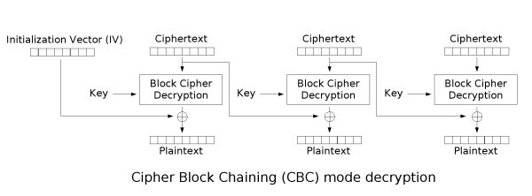

# Flip

Wrteup of a CTF from the TryHackMe Platform

## Reading and understanding the source code

TCP Server open on port 1337.

We can connect to this server using Netcat for example

```nc <IP> <port>```

First thing it does is ask us for a username and an password. If it contains the string "admin&password=sUp3rPaSs1" then if ends the connection with a message indicating it is "Not so easy"

If the username and password is different to this then it encrypts our username and password string with the format

```access_username<username>&password=<password>```. The encryption is done with AES CBC with 128bit key and blocks, and padding of also 128bits. We don't have access to the KEY nor the IV as they are generated randomly for each connection and and never shared with us.

Then it ask to input the ciphertext again and if it contains ```admin&password=sUp3rPaSs1``` when decrypted then we are presented with a flag.

It is very clear that we need to some how break the CBC cipher in order to be able to change the ciphertext to match a given plaintext.

# AES CBC

CBC stands for Cipher Block Chaining and it means that it will use the ciphertext of the previous block to ofuscate the contents and ciphertext of the current. This is better explained by the image.
### Encryption


### Decryption



This ofuscation can be very good for hiding patterns and repetions in the cipher that might've been detected other wise, but it also leaves CBC with some serious disadvantageus like performance and lack of parellism. The other issue this creates is the possibility to attack it using a "Bit Flipping Attack".


## Bit Flipping Attack

If we know only the plaintex and ciphertext, even without knowing the IV or KEY we alter blocks of the plaintext in decryption.


We will ruin one block of the decrypted plain text, but we can effectively change bits in the following block. 

The math behind this:


We have C1, D1 and P1 and we know the value of C1 and P1:

``` C1 XOR D1 = P1 ```

We can then Figure out D1 because

``` C1 XOR P1 = D1 ```

If we wanna change the result of P1 to P2, we can change the value if C1

Knowing D1 and the P2 we wanna inject then

``` C2 XOR D1 = P2 ```

We can get C2 with

``` D1 XOR P2 = C2```

## Breaking the given cipher

```f4c0b5dcc34f6e7f4c5dfa62e493a49aa96b7a0d4b20ade85b07647e23e961f8123c0f903051539a8ecbb6bebaf3cc8a```

3 blocks of 16 bytes or 128 bits. We have then 2 distinc blocks of plaintext and 1 of padding

What bytes do we wanna alter?

We want to change the "access_username=bdmin&password=sUp3rPaSs1" string into "access_username=admin&password=sUp3rPaSs1".

The "access_username=" is exactly 16 bytes or 128 bits, witch is 1 block of cipher text

The b in bdmin&passw is exactly the first byte of the cipher text
Let's change it then

b in hex is 0x62, a in hex is 0x61

```
b.encode().hex()
'62'

"a".encode().hex()
'61'

>>> hex(0x62 ^ 0xf4)
'0x96'

>>> hex(0x61 ^ 0x96)
'0xf7'
```

Then we get that the cipher text we want to input start with  ```0xf7```

```f7c0b5dcc34f6e7f4c5dfa62e493a49aa96b7a0d4b20ade85b07647e23e961f8123c0f903051539a8ecbb6bebaf3cc8a```


```
nc 10.10.197.235 1337
Welcome! Please login as the admin!
username: bdmin
bdmin's password: sUp3rPaSs1
Leaked ciphertext: 5995a908ad6ab13a55f8754bcd49ea6f1cf693c42ddf8691a0db5bd6536e97df8f192da84ef089c2a708ec84a37738b6
enter ciphertext: 5a95a908ad6ab13a55f8754bcd49ea6f1cf693c42ddf8691a0db5bd6536e97df8f192da84ef089c2a708ec84a37738b6
No way! You got it!
A nice flag for you: THM{xxxxxxxxxxxxxxxxxx}
```
